# 什么样的程序员简历一看就没戏？当代互联网HR最喜欢的简历套路有哪些？马士兵告诉你普通程序员写简历千万别太老实！ - P10：一坤年Java经验女生简历指导 - 马士兵小鱼 - BV1oP411Q73J

大家看這個同學吧。

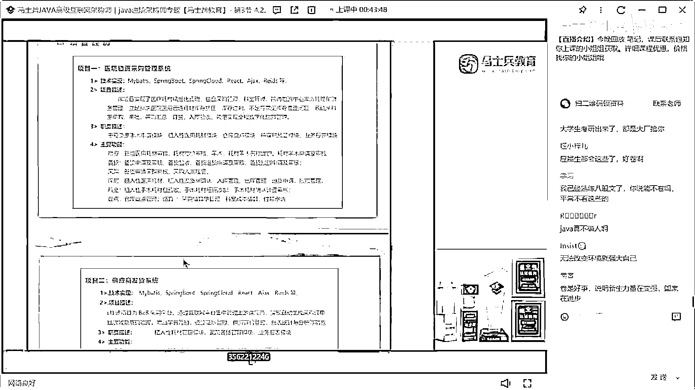

這位在嗎，這個這個這這這這應該是姑娘的簡歷，這小姑娘在嗎，在嗎，可不可以來，調好了，你簡歷問題第一個，把這個花蕾護刷的模板給幹掉，把這個花蕾護刷的模板給幹掉，好吧，這個花蕾護刷的模板沒必要沒必要。

第二個，簡歷裏面不要加這種表格，這種表格的可讀性非常差，你該對齊的對齊就行了，沒必要去加這個表格信息，表格完全沒必要，好吧，第二個主要技能，你幾年經驗啊，這是BR2020年6月份。

相當於兩年半的工作經驗，呃，經技能，精通前後段分離，SSM框架，JWT，Redis ES，就這幾個東西，你是怎麼你是怎麼關系到一塊的，他完全沒必要關系到一起，好吧，然後下面又寫了一個。

MyBatis MyBasicProcess，MySpringBot MySpringCloud，然後又把MySQL，Oracle寫一塊了，然後又把這些開發工具寫一塊了，然後下面又寫了前端技能。

又寫了Linux和Cell，又寫了MongoDB，然後又加了這些東西，還加了Python，就這個東西啊，就首先不管你這次工作經驗是多少，最起碼說你現在的這個簡歷裏面，看起來你的經歷應該是兩年半的時間。

那麼你這些技能，我還是那句話，你們要把對應的技術站的細節，好好去描述一下，該歸類的歸類，不該歸類就不歸類，而我現在建議是什麼，不要去歸類，每一個技術站都可以單獨拿出來寫，SSM可以寫，JWT可以寫。

Redis可以寫，ES可以寫，對不對，MySQL可以寫，那麼哪個技術不能拿出來單獨寫一下，你把它撐寬了，沒關係的，你整個EA四子全部都是技能，你不是很牛逼嗎。

懂這意思吧。

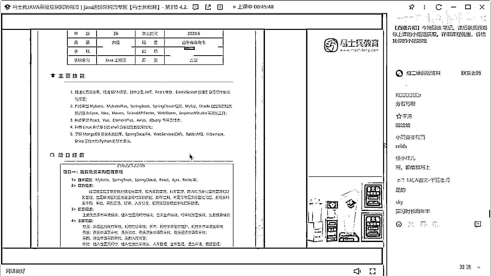

好吧，來再說一下，項目經歷，醫院物資採購管理系統。

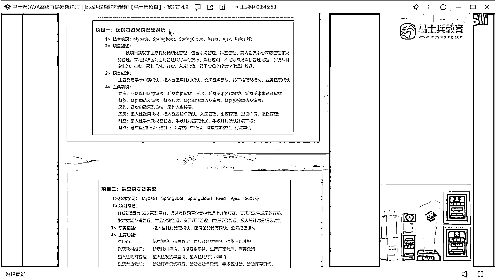

就是一個CRUD的項目，項目實現了什麼東西，然後呢，此時的描述，然後主要功能。

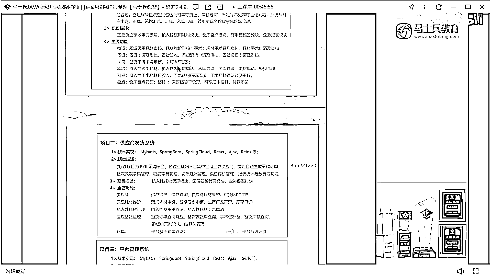

然後供應商發貨系統，就是這東西，然後平臺管理系統，就是這三個項目。

大家怎麼樣，說白了。

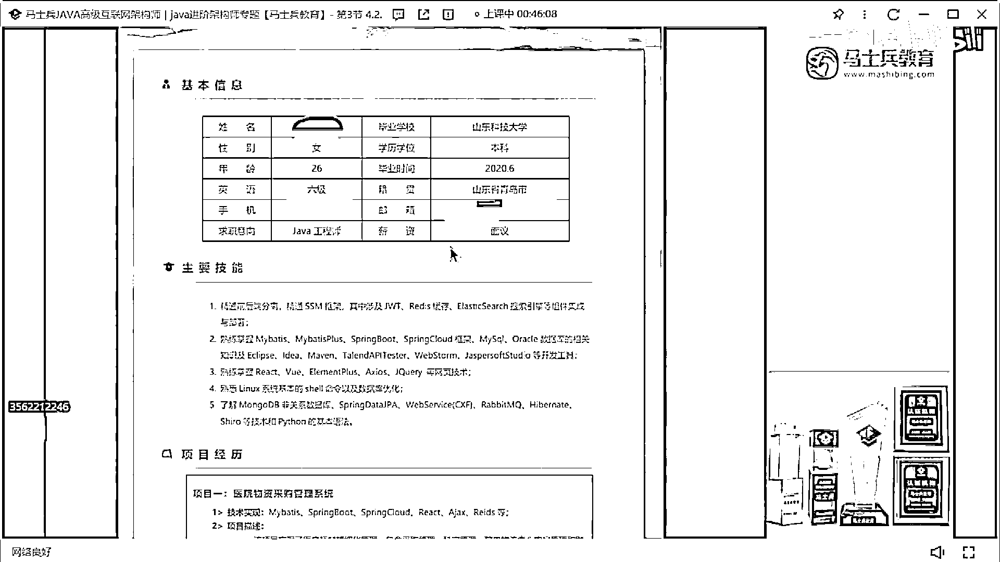

這就是一個基礎的開發工程師，就是做CRUD。

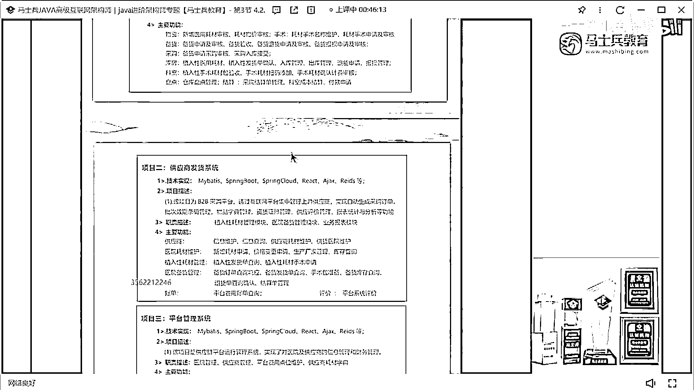

它就是單體項目，沒有什麼含金量，也沒有什麼格外的價值，好吧，榮譽證書不說了，這是他的所在的公司，實際上有半年的開發經驗。

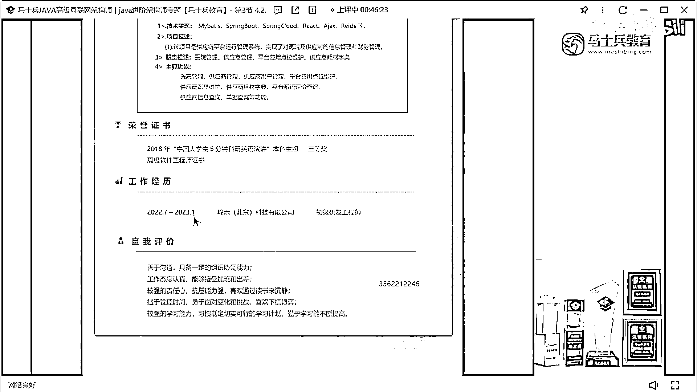

是在北京是吧，那咱們來預測一下你的薪水，大家覺得他這個簡歷先值多少錢，各位資深老師不用給我發簡歷了，我們收集到簡歷，我能改完就不錯了，今天晚上28份簡歷，我都覺得時間都改不完，所以不用再給我發個信了。

發信了我也不會再改了，好吧，OK，10K，目測，這小姐姐的薪水應該在8到10之間，不會超過12，能給到10K我覺得不錯了，絕對不會超過12，10億左右，我覺得10K左右差不多了。

但是我覺得應該是8到10之間，你們不要覺得北京就給的錢很多，真不是這樣，好吧。

所以要改什麼東西，第一個該寫的技能要寫的把它展示出來，第二個項目，如果你們15應該有。

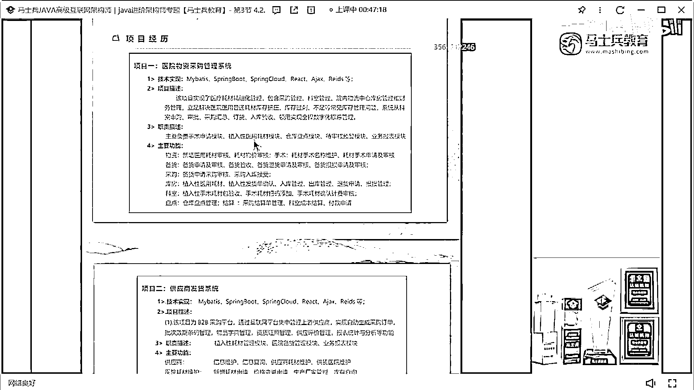

這個絕對給不了15，絕對給不了15，我說了技能這塊該怎麼寫怎麼寫，第二個，這個項目，如果你們公司裡面做的項目都是這樣的，就是後臺管理項目。

後臺管理的一個系統。

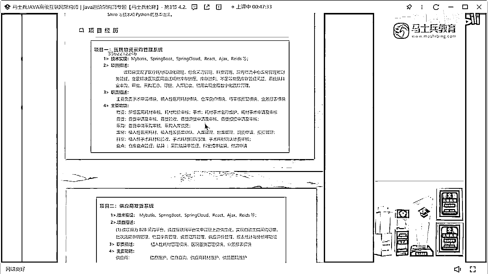

那麼注意你要著手去準備一些微幅的項目了。

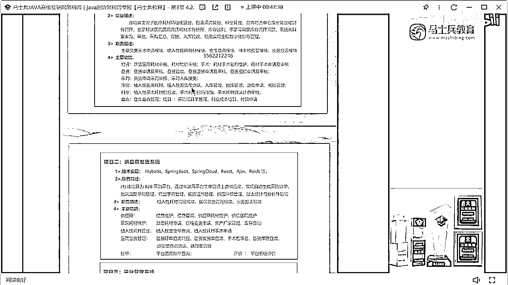

微幅項目現在是一個必備項目，小姐說了5。5K，小姐說5。5K好吧，就是如果你現在公司裡面的項目都是這樣的項目的話，你要想辦法去接觸或者說著手找一些其他的項目不進去了，最起碼說微幅相關的技術要展示出來。

你這個地方雖然寫到了微服務，比如這塊寫了SplineCloud，但這些項目說白了，它哪些地方可以用到SplineCloud。

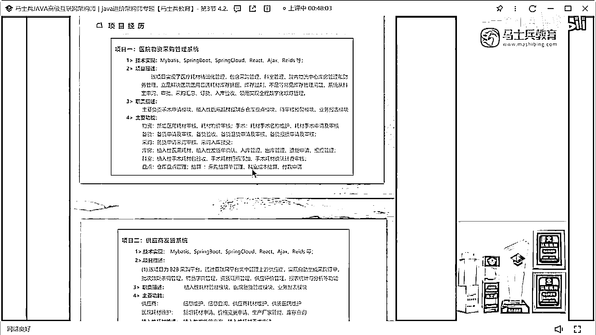

它其實根本不涉及到這種服務的拆分什麼之類的東西。

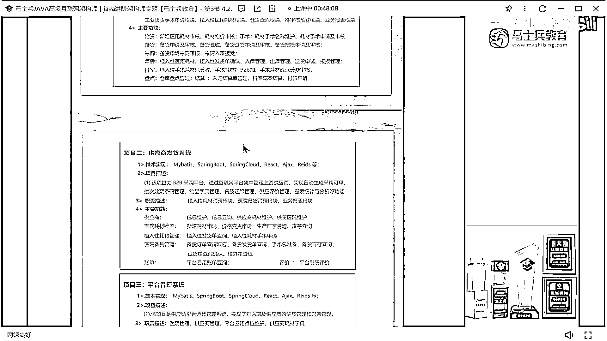

我覺得暫時涉及不到，暫時不到，所以我覺得你要第一想辦法找項目，第二把你的技術站要好好儲備一下，就是你現在對於自己的技術體系可能還不是很清楚，所以你的技能才會顯得這個樣子。

如果你對於自己的技術體系很自信的話，其實你的技術不應該顯得這樣，OK好吧。

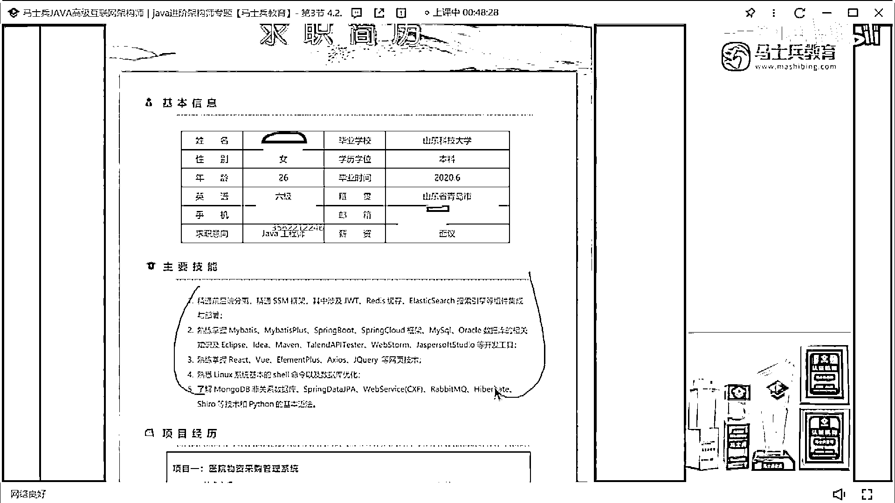

自我評價不說了吧。

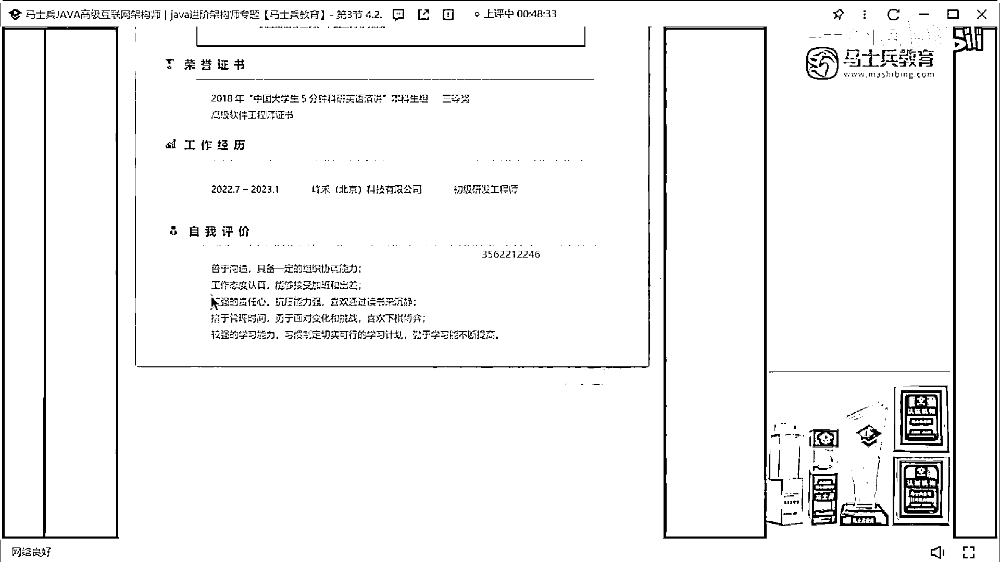

這個就就就很普通很普通東西好吧，拜拜！。