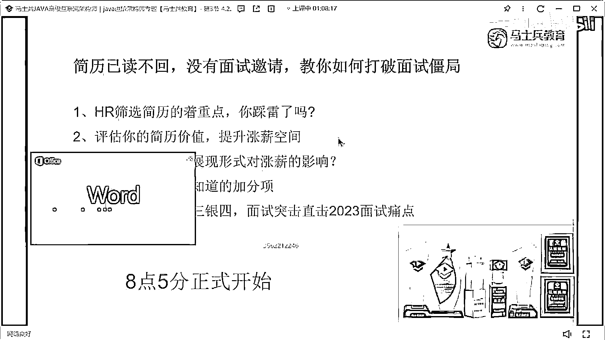
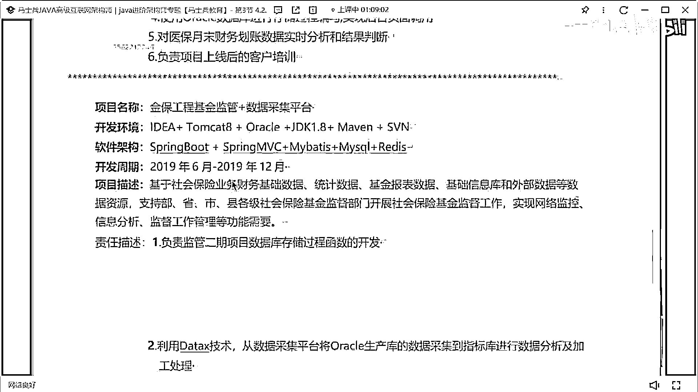
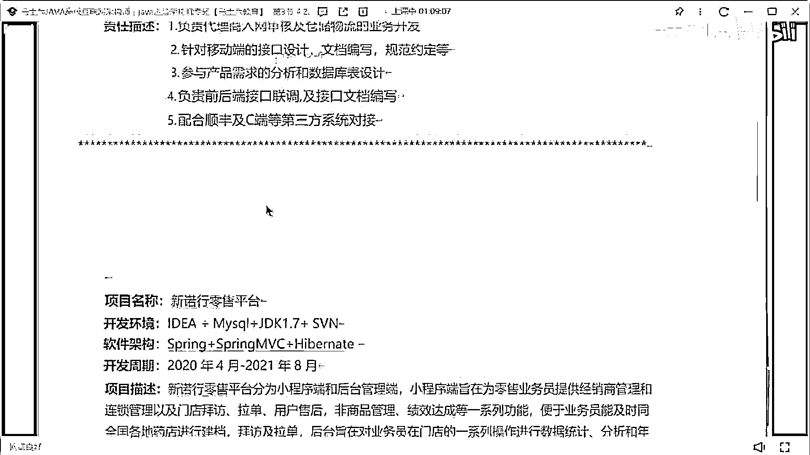
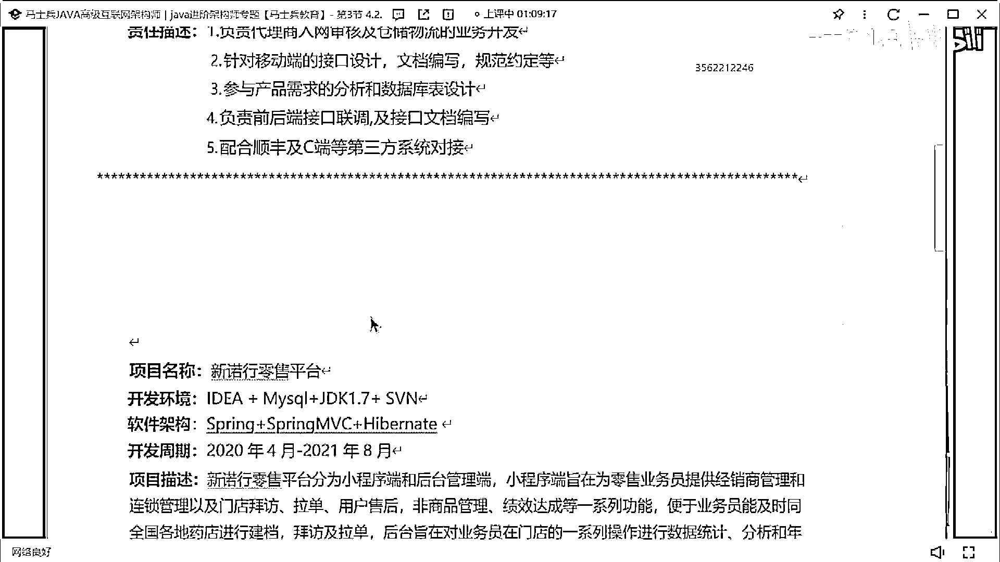
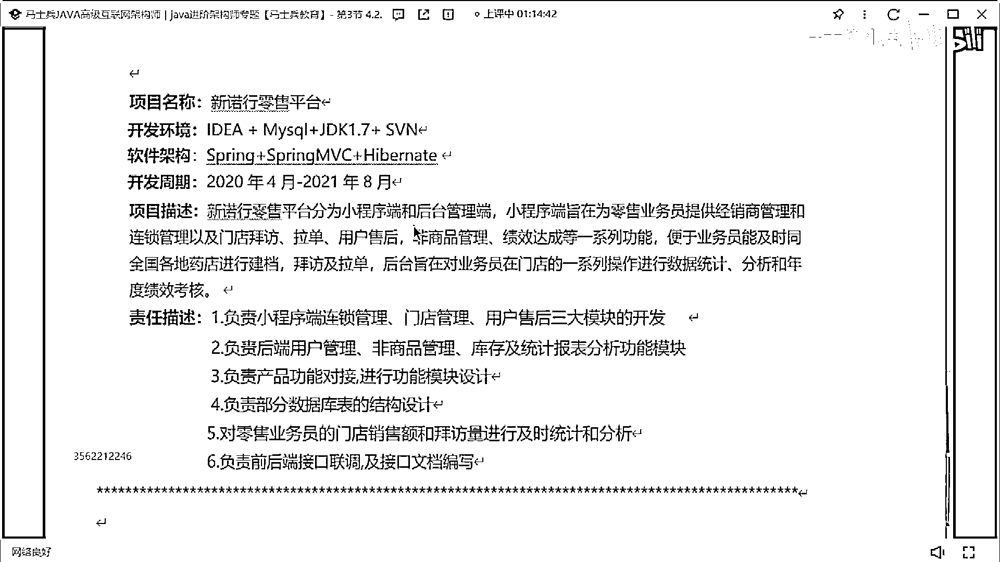
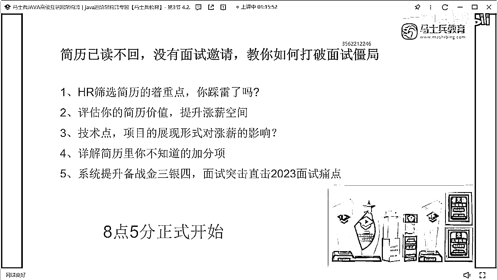
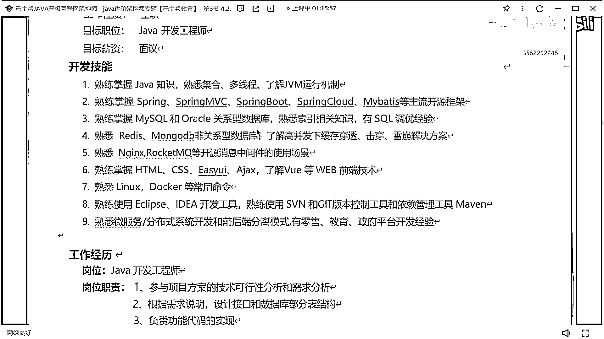
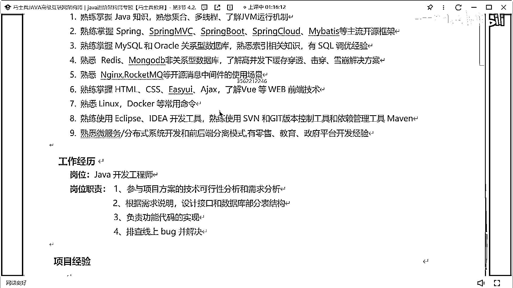
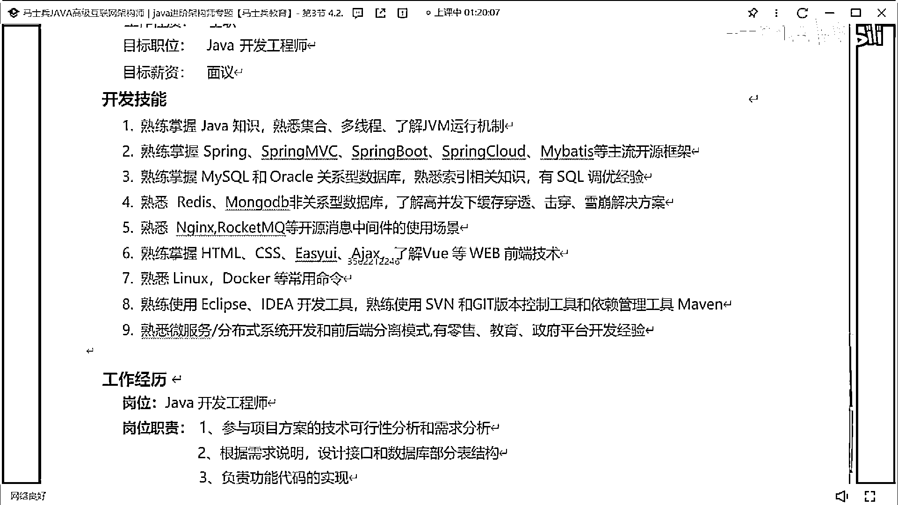
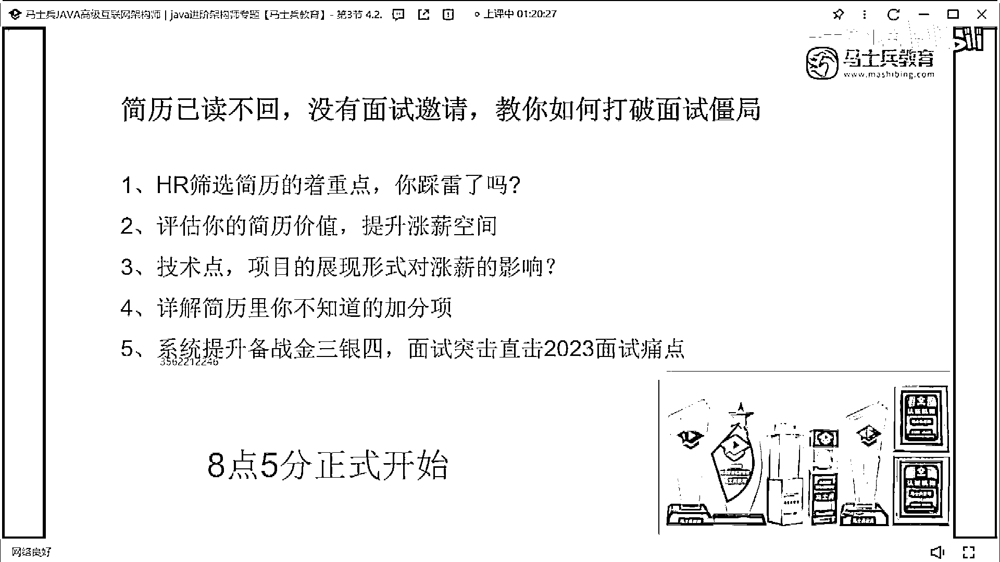

# 什么样的程序员简历一看就没戏？当代互联网HR最喜欢的简历套路有哪些？马士兵告诉你普通程序员写简历千万别太老实！ - P14：3年Java经验简历指导与建议 - 马士兵小鱼 - BV1oP411Q73J

三年。

Java，Spring，Mysql，Redis，MongoDB，RockMQ，前端，Docker，工具，这算是谁的呀，我爸爸，小小自卑，过分了啊，迈克，过分了啊，哈哈哈哈，辣我是吧，呃，技术，工作经历。

iCar，生态汽车，21年至今，新罗新罗新林树平台，保险项目。

来睡啊，这件大裙值多少钱啊，在哪个城市啊这是。

这在哪个城市啊，没写城市是吧，成都是吧，18。

对，在湖南长沙是吧，长沙这样简历中在长沙的话，大概就是10到12，不再多了，但是12不再多了，因为长沙的薪水不便偏低的，他就是10到10天左右，好吧，其实我说的是到12，11天是吧，所以就是呃。

如果你还想说拿到更高的薪水的话，你应该怎么办啊，我告诉你方案，给老师同学，第一个你的技术站要改，改的方式就是我刚刚说的，你要把你刚刚这些所有会的技术站，要单独去罗列清楚，像这里面。

你这边有几个东西是没必要写的，这东西没必要写，这块没必要写，好吧，这东西没必要写，其他的技术可以详细拿出来，做一个展示和罗列，有人一直好奇，老师，我技能我没，我老感觉我的技能，其实没啥写的。

我不知道我的技能写什么东西，就是你作为一个开发程序员，你不可能说你不知道你的技术写啥，这个这个，这是他本身就不现实，如果你的技能描述的话，你都不知道写啥，那你的技术储备就可想而知有多差，懂意思吗。

所以这块你要写写写什么内容，很简单，第一个，java可以单独拿出来描述吧，JVM单独拿出来描述没问题吧，并发编程拿出来描述没问题吧，SSM可以描述吧，CNNbot可以描述吧，微服务，孙博士，MQ。

Redis，Mysql，加上你们还会一些什么ES，mongodb，可以写了，对吧，加上你你可能还有些，比如说n这个字，相关的点，可能会matt相关的点，对吧什么Docker，什么K8S。

对不对是不是都可以把它展示，你光把这些技能做一个罗列，你想多少了，懂意思吗，不光这种，你的技能可以撑得很丰满，很丰满，A0葡萄说，现实中有几个能用到JVM优化，对啊，咱们在公司里面做就321工作。

工作中根本不会用到JVM，不会用到JVM优化，面试要问啊，怎么办，这跟什么一样，面试的时候喜欢问高命发，我问一下咱们听课同学，你们谁做过高命发，有几个人做过高命发，还有几个人做过。

那你觉得面试官不知道你没做过吗，难道你的面试官不是从这个时代过来的吗，他不是从小白一行行过度过来的吗，他为什么还要考虑这东西，他考核的点在什么地方，就JVM优化，Circle优化，他为什么要问。

他不知道你没做过，他知道，那为什么还要问这东西，他考验的是什么，第一刚刚同学说的，你的技术储备问题，除了你的技术储备问题之外，第二，是什么，他要考核你对应的解决问题的能力，而且很明显。

我们知道一件事是什么，只要你写到调度的工作，面试的时候必问，我在前期面试之前，我就不能去准备一下，这些JVM Circle调度的案例吗，我就不能跟我们的项目做一个整合吗，你能不能提前做准备，能准备吗。

就你连准备都懒得准备了，你活该面试吧，懂意思吗，所以面试要考试，他知道你没做过，但是当遇到你这样的场景需求的时候，你根据自己的技术储备，你能否给出合理的解决方案，他考核对方的能力，谁都知道在公司里面。

如果我只是做这种基础的代码开发，基础用12G的话，都和谁谁都能来做，你只要有工作经验，只要做过项目，基本都能来做，但是一旦遇到非常难的问题的时候，你的知识储备就很重要了，所以我要考你的知识储备，你懂吗。

说白了，你现在20K也好，25K也好，你在公司做426天工作，给个10K的小孩他不能做，他能做，为什么面试那么难，你凭什么值这么多钱，不是你代码写的多好，你的技术储备，你的价值，你解决问题的能力。

能否在面试中，给面试官展示出来，这是重点和核心，你们在面试中，你要表现的也是这方面的能力，听懂了吗，好吧，就这个这个这个技术这块描述啊，就说了，然后下面，项目，这项目就就就刚刚同学说的，项目啊。

其实太简单了，像你这有个生态生态汽车，对吧，生态汽车你们能不能说一下，你们订单物流，有多少，你现在设计订单物流了，订单有多少，物流有多少，对你的数据量展示一下吗，对不对，零售平台。

你们零售每天大概有多少订单，这都可以展示，OK，下面的一些心意关系。

就不说了，这个没啥可说的了，好吧，没啥可说的，别做评价，不说了啊，这个这个先发肯定是不行的，太简单了，太虚了，没有什么可问的，OK，他说实际上自言的话，虽然大部分都是CRUD，但是遇到各种问题。

还是需要这些知识来解决问题，就我说了嘛，他面试问的时候，问的是什么，他考核是什么，是你整体的这种知识的储备，你能否有这种解决问题的能力，懂吗，能接受加班，这个是吧，能接受加班和出差，没有瞧不起CRUD。

但是你要知道，CRUD跟CRUD还不一样，有的人做CRUD就纯CRUD，有人做CRUD就是有价值的CRUD，你们好好琢磨我琢磨我这句话，好吧，我不说了啊，你刚同学啊，刚那个那个辣子同学听好了。

就是我我刚说的，如果你想把你的薪水再提高一下，想拿到更高的，诶不是这个，想拿你更高的一个薪水的话，你要干嘛。

第一个把你的技术证，这块要做一个补充，把深度要储备起来，第二点。

想办法去接触一些架构设计的能力，把你的架构设计的能力，给展示出来，这才是你的薪水能获得比较高的一些，涨幅的空间所在，然后你在面试的时候。

回答问题的时候。

要怎么回答，要展示出你自己的技术体系性的东西在，大家一定要记住啊，你简历写好了，他只是说你获取到了面试机会，获取了面试机会并不代表说你就一定能通过面试，那么你写的这些东西。

每一句话写出来要给到面试官空间，同时面试官如果问了其中的点，你要想办法去展示你的优势所在，什么叫展示优势所在，我之前举过一个例子啊，举过一个例子，我知道这个看过了，我知道这个看过了，我给大家举一个例子。

我问问同学们，就是你们脑海里面去想一个，我问一个问题，你们去告诉我，你们如果面试中问到这个问题，你应该以什么样的，这个这个这个步骤去回答这个问题，我如果面试中问到说。

来同学你给我解释一下JVM的垃圾回收算法有哪些，这个问题你会怎么回答，就面试中问到一个东西，JVM垃圾回收算法，你会怎么说这东西，说思路好吧，不说不说细节，要记清楚，复制，就大部分同学可能说一下。

表记清楚复制表记整理，对吧，把这些算法一说结束了，告诉大家，你们如果面试的时候是以这样的方式去回答问题的话，肯定是不对的，怎么去回答这个问题，第一个点，先解释清楚，我们在进行垃圾回收的时候。

是如何进行垃圾回收的，第二分老年代新生代来解释，他们分别使用什么样的垃圾回收算法，而且解释清楚，每一种垃圾回收算法，它的实现机制是什么，然后除了这个东西之外，你只是前面只是什么。

只是你为了回答这个垃圾回收算法，这个问题应该做的正常的表述，把这个表述做完之后，你要告诉他你熟悉的这种垃圾回收器，他所对应的垃圾回收算法是哪些，第五点，你要说明清楚。

在你们的项目里面是如何选择垃圾回收器，以及你做过哪些参数的调整工作，能懂意思吗，这是一个比较完整的回答方式，而大部分同学的回答是什么样子呢，回答这东西，可能就问老师，不就是面试官问我什么，我答什么吗。

真的不是，如果只是面试官问你答是，为什么你答什么，你在单纯的背八股文，你没有自己的技术认知和自己的技术思考，有人会说老师，我说这么多面试话，如果打断我怎么办，打断就打断你呗，那怎么样，打断你不是坏事。

听到了吗，就是你要把他好不容易问到一个问题，这是你会的问题，好不容易遇到了，你要把你跟这个知识点相关联的，所有知识体系相关的细节，要尽可能多的去给面试官做一个展示和罗列，要不然的话，说白了。

你的技术水平是不达标的，能懂意思吗，来我刚刚说这东西能理解，才叫做扣1好不好，你们在回答任何一种问题的时候，任何一个类型的问题的时候，都应该尽可能去展示自己的扩展性，一定不要让自己再停留在那种。

问啥打啥一问一答，这种傻瓜式的面试，这种面试在当下这个阶段通过的概率是极低极低的，听懂吗，而一个面试里面，如果面试官经常说话，你说话很少，你的面试一定过不了，你们也不要担心说，老师我回答一个问题的时候。

面试官打断我，打断你是好事，他只要打断你了，说明他对这个问题已经不想问了。

他想问其他东西，这是个好事，你懂了吗，就是你不要说面试问个啥，你答个啥，然后面试官在你这个问题基础上再问个啥，你再答个啥，不要这样，你要自己去主动的去展示自己的技术体系，而不是等着别人去问。

懂吗。

好吧，我們明天見。