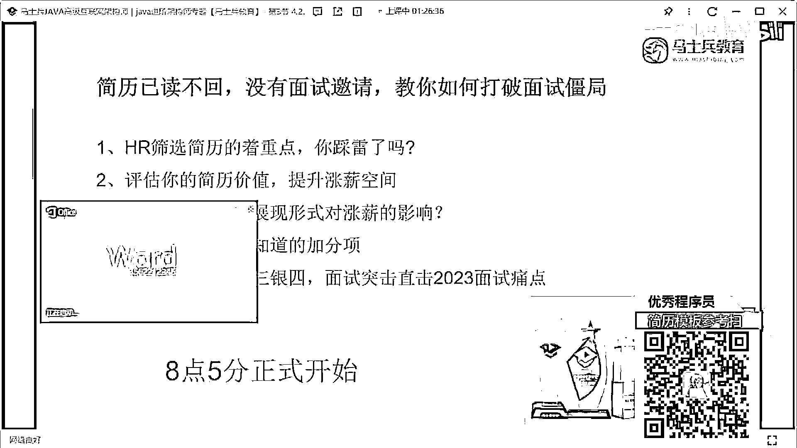
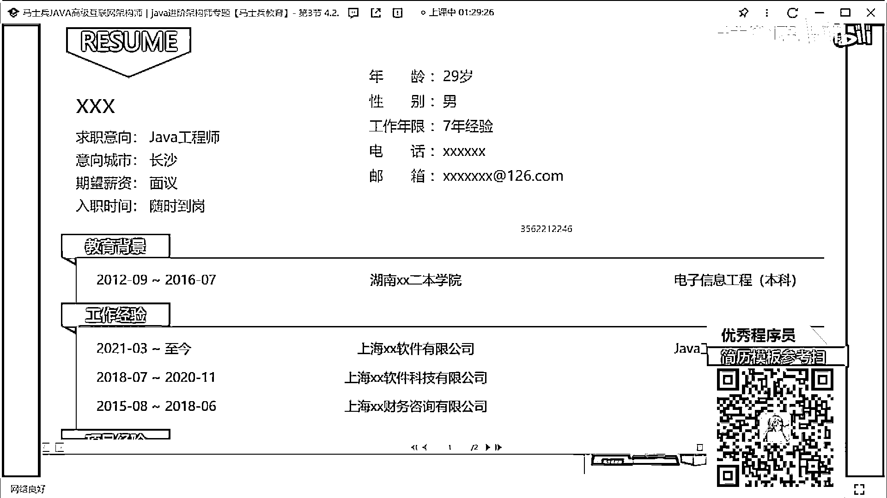
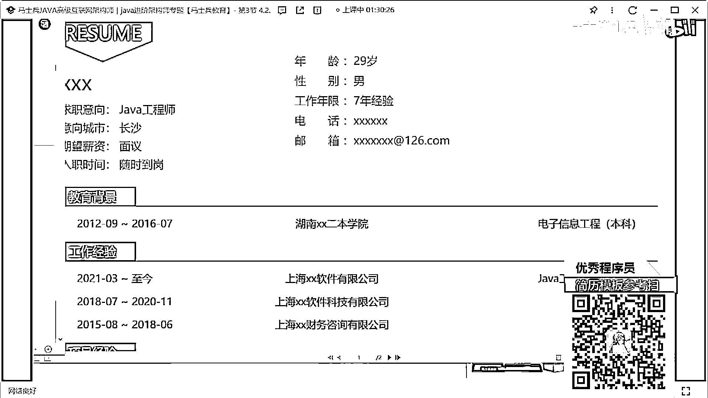
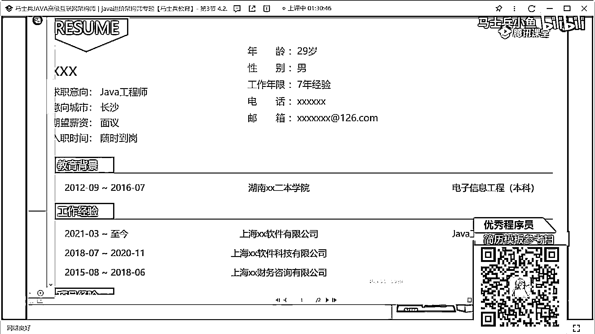
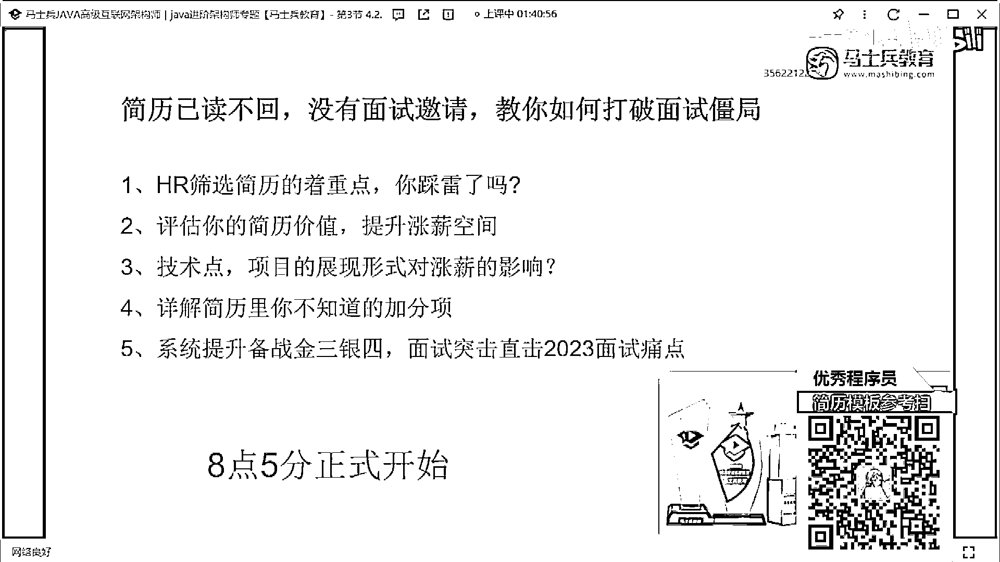

# 什么样的程序员简历一看就没戏？当代互联网HR最喜欢的简历套路有哪些？马士兵告诉你普通程序员写简历千万别太老实！ - P16：29岁7年Java经验简历指导与建议 - 马士兵小鱼 - BV1oP411Q73J

那個我看到評論區還有人說。

想改簡歷啊，這個咱們現在簡歷也改不過來了，所以這個沒辦法了好吧，看看時間吧，這個簡歷不能看了，不看了，來看這個同學的，大多數人壓工資降薪能漲期，這份滿意當然寫好的另說，我覺得大家就是，嗯怎麼說呢。

大家可能被最近的市場給打擊到了，所以很多人選擇去接受這種降薪，我覺得在你的，技術儲備沒問題，沒有問題的情況下沒必要去，降薪沒必要降薪，工作好找不好找，但是我覺得沒必要去降薪，你要有自己的技術的傲氣。

和自己技術的堅持所在，投了半月簡歷就一家面試，你要分析你投個半月，只有一家面試的問題在什麼地方，因為我們只有找到問題之後，才能解決問題，你們只是告訴我說，我半年半個月只有一家面試，你沒有發現問題。

為啥半個月就一家面試，對不對，來這個同學在嗎，都是一度不回，啊，你需不需要我給你展示幾個，最近找到工作同學的案例啊，你需要嗎，嗯，我真的覺得我我承認啊，現在面試的機會確實少，我承認這件事情。

這是客觀的市場情況，但是不代表沒有機會你懂嗎，不代表沒有機會，你看幾個好了，這同學知道這是這是這個，這個微信連線記錄，我給你看連線記錄，上週五去深圳現場面試，問了一個多小時問了什麼東西。

面完之後周末催著我趕上去，又有新工作了不至於失業，這是2023年3月7號吧，這同學2023年3月4號，平安租賃契約所，還有消基還有金融這個錢漲了10k，是跟我說的，你懂我意思嗎，不是沒有機會明白嗎。

是機會少是對的，但不代表說你一定一點機會都沒有，你說一點機會都沒有，這事情有點扯淡了，這件事你看，本科怎麼說研究生。

等我一下啊。

我給你看一下啊，然後打開簡歷了，我給你看一下他的，他沒寫學歷，他學歷應該是本科他沒寫，我看怎麼能打怎麼打個碼，看下，看，這是他的技能描述，這剛那個拿到三高款的同學技能描述，有多少人敢這麼寫，你們敢嗎。

我帶你看一下他項目怎麼寫的好吧，想像這個這個這個項目怎麼打碼。

打碼接觸就打碼，接上那個信息暴露了，他寫的項目。

他寫項目，不是你們哎，說好吧，就你們總覺得我在吹牛和怎麼樣的，誰說這個沒人要了，我說這個人拿了三個ok好吧，漲了10k，所以啊我希望大家正確的去看待市場，正確看待市場，好吧，你看清就把你看清。

剛剛我點開這個簡歷的時候，是微信聯繫記錄裡面點開的，這個學生拿了三個offer，我剛剛點開的是我剛剛點開是這個簡歷，好吧，他是拿了三個公司的offer，漲了漲了10k漲了10k的薪水，哇。

來我們接著改點點好吧，所以啊我希望大家，市場差市場，但是不代表一點機會都沒有，所以我希望所有小伙伴能夠，正確去看待這個東西，還是那句話，你現在沒有面試機會沒有面試邀請，大概率的問題。

其實就是出在你自己的簡歷上面，你要把你的簡歷好好去認識，好好去修改，找到你的問題所在，好不好別老抱怨這個抱怨那個，說白了他剛才說了他寫一堆精通，你敢寫嗎，我每次在講解能簡歷的時候，我讓大家寫精通。

很多人就上來懟我，老師我寫精通會被問到死的，是啊，你肯定會被問到死啊，你答不上來啊，你技術儲備不夠你可不答上來嗎，但是你從來沒有想過，你不敢寫精通，有多少人敢寫精通，你想過這事嗎，能懂意思嗎。

你跟別人同時去競拼一個崗位了，別人寫的精通你現在都不敢寫，是不是這個意思，阿白現在簡歷都不看，為啥別人不看簡歷，為什麼別人不看簡歷，你在boost裡面上來跟別人打招呼，打完招呼之後就拿。

就把那個默認話數據發，別人就要理你看你的簡歷，憑什麼呀，我問一下有多少人用boost直接面投簡歷，我問一下有多少人用boost直接面投簡歷，有多少人，你對吧，你上來在boost直接面上。

發一個默認話數給別人，給h2，h2就要點開你的簡歷挨個看一下，憑什麼呀，就我舉個例子，大廳上過來是個美女，你過來之後，你就給別人說美女加個微信啊，別人就一定要加你是嗎，你講不講道理了。

你在剛開始跟別人產生互動溝通的時候，你就沒有吸引到別人，別人就要看你的東西，憑啥，你講不講理，好吧，不說了好吧一說這個我就生氣，我每次給大家說這東西的時候，可能就一堆人出來就是，死抬槓抬死槓。

你好好描述一下自己你誇誇自己，你相親了，你把房本車鑰匙回來一扔，很明顯就，就那個啥了嗎，來看這個青年經驗29歲青年經驗。

交易背景二本，然後，經歷15年3年兩年，然後這是一年兩年，營銷中台，營銷系統，中台項目，這啥意思，退稅系統，這是我說的朋友們，講大專嘛，我不知道有沒有大專學歷的同學，就注意啊。

這個技能我再我再給我說一下，第一個這個技能特長，我說了不要做分類，做分類沒有意義，你就把你所有展示的技術要顯示出來，這裡面寫了JBM，寫了兵換兵程，這是啥，Linux系統，Springboard。

Spring Cloud，Mysql，Nginx，ES，Kubuka，Rocamq，Docker，沒了，就這個東西啊，我希望所有同學，還是那句話，把你的技能特長，把你的技術描述給我撐滿了好不好。

什麼叫撐滿了，能寫多少寫多少，能多寫就多寫，能多寫的地方不要去少寫，懂嗎，你少寫了沒意義，然後再說項目這塊，像你做這種營銷中台，你要的第一個項目背景，項目背景是好好寫寫。

你這個項目沒有之前是什麼樣的問題，有了這個項目之後，他解決了什麼問題，他裡面包含那些核心功能，做了什麼自定化，自定化的營銷，怎麼做到這種精確地位的，每天做到這種營銷的方案是多少，對吧。

最新的數據量是怎麼做的，你要好好寫下這東西，項目結構就沒必要寫了，像這種沒必要寫什麼，網格服務，營銷服務這不就是模塊嗎，沒必要寫，隨著描述好好寫一下，我說了趨勢結合，用什麼技術實現什麼功能。

遇到什麼問題怎麼解決的，把這東西好好描述一下，就是項目是可以聊的，有的聊，但是你的寫法看起來沒啥聊的，第二項目也是一也是一模一樣的，所以你的項目描述方式，是肯定要好好改一下的，你的數據量該凸顯要凸顯。

該凸顯凸顯，你們的中台服務怎麼搭建的，到底做的是業務中台，數據中台還是什麼中台，把這個中台好好介紹一下，好吧，別的沒啥，然後大家一定注意寫這個簡歷的時候，我注意希望提大家一件事。

第一個上來之後先寫個人情況，個人情況寫個情況之後第二個，緊跟著描述技術，描述完技術之後描述你的項目，描述完項目之後再說你的什麼工作經驗，好吧什麼教育背景，對吧什麼自我評價再寫這些東西，就是照目前來看。

你現在寫的這些項目和技能，不太支撐的你現在的青年經驗，青年經驗你在你的項目描述也好，還是在你的這種自我評價裡面也好，最好能加上一些架構設計的能力，如果沒有架構設計能力，把你對應的技術的原理和底層的實現。

也要好好進行一個描述，要不然真的不行，要不然真的不行，好吧，大專哭死，有多少大專學歷，大專學歷可以給大家投個1來，有多少是大專學歷，大專學歷，大專學歷這個事，對於你現在這個階段而言。

他已經成為一個定局了，你可以記住，你可以去學歷提升，但是現在來說，你的大專學歷已經是一個板上釘釘的事了，那對於已經是板上釘釘，並且沒辦法改變的事情，你有必要去糾結嗎，我也承認現在市場有很多公司。

看到你是大專，就沒有面試機會了，你想一件事，如果你是大專學歷的話，你能不能爭取到更多的面試機會，這我經常有朋友說，你們投完簡歷之後，面試完不理你們，你們就猜是不是我學歷有問題。

你猜完如果是你的學歷有問題，你做過哪些努力，你做過哪些努力，投完簡歷了，你覺得你的技能老鼠，項目老鼠都沒問題，但是面試官標籤，你覺得可能就是我的大專學歷的問題，你做過哪些爭取，你做過爭取嗎。

很多人都這樣，面試官不理你，你比面試官還高，他不理我，我還不理他，都這種心態，這哪行，機會是要靠自己去爭取的，什麼叫靠自己爭取，別人不理你對不對，你感覺是因為大專對不對，你能不能這樣，再給h2說一句話。

你說h2我看到你讀了我的消息，看我的簡歷，但是後續沒有我產生溝通，我覺得你可能是比較介意，我簡歷中的大專的學歷，其實從我工作以來，我已經意識到，我大專學歷的缺陷和短板了，所以我已經在進行這種。

專生本的這種提升，已經在考學歷了，當然我意識到我的大專學歷是劣勢之後，其實我這麼多年的工作經驗，一直支撐著我說，不停的提升我的技術和我的項目能力，所以雖然我的學歷比較差，但是我並不認為。

我的技術實力就比很多本科，甚至研究生要差，我希望你能給到我一個面試機會，我不會讓您失望，您可以讓面試官考核一下我，看我的技術屬於到底什麼樣子，我也希望您，不要因為學歷，去歧視我的經歷。

或者我對應的工作經驗，你們能不能加上這樣一句話，他不回你就不回你，你不回你沒什麼損失吧，萬一回來呢，我告訴大家，這東西很多同學去試了，他真的有人會回，而且回的人很多，HR就會說確實是因為您的學歷。

公司有這樣的要求，所以我沒辦法，那就HR說那行吧，我來約您面試一下，就這個就看公司要求了，如果人家公司就明確要求，我就不要大專，那沒辦法，我不要我不去了，明白嗎，那如果別人讓你去呢。

萬一有能博到一個機會呢，是不是道理，太卑微了，泡麵，泡麵是嗎，泡麵你就別這麼幹了，太卑微了，等你吃不上飯的時候，你就不覺得卑微了，等你連續三個月五個月六個月，找不到工作的時候，你就不覺得卑微了。

不說了好吧。

