# 什么样的程序员简历一看就没戏？当代互联网HR最喜欢的简历套路有哪些？马士兵告诉你普通程序员写简历千万别太老实！ - P17：西安4年Java简历指导与建议【附优秀模板】 - 马士兵小鱼 - BV1oP411Q73J

來下一個。

陳澤西同學在嗎，我說了收起你們的自尊心，收起你們的面子，明白嗎，把你們的不利心給我收起來，都啥時候了還在乎面子，你面子說難聽點一文不值，我不為吳冬敏而折腰，行別折千萬別折您千萬別折，別扯好吧，啥時候了。

我想明白好不好，來看這同學28歲四年工作經驗。

你看看這個，就這個編號都笑了，1236789101112234，1011，這都啥玩意，這什麼東西是都，哎，把這個分類，把這個分類給去掉好不好，這個編號12345順著順下來，明白嗎順下來，ok。

基本的知識寬度肯定是都有了。

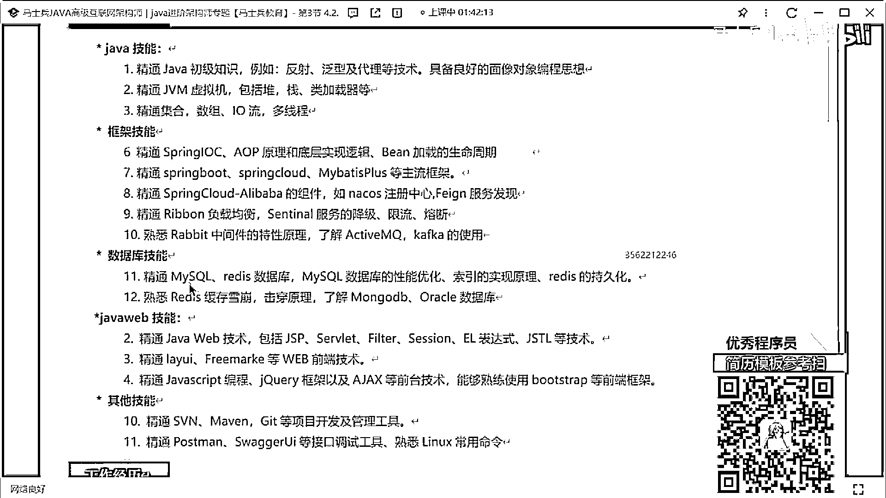

你看這個這個這個這個這個這個這個描述，第一個他做的是什麼電，用電信息的采集系統，對吧然後2。0的什麼建設工作，像你做了項目的升級，能不能把你做的這種項目的升級和改造，突出一下。

然後職責描述我說了12345，我能不能說清楚，啊能不能寫寫寫寫明白。

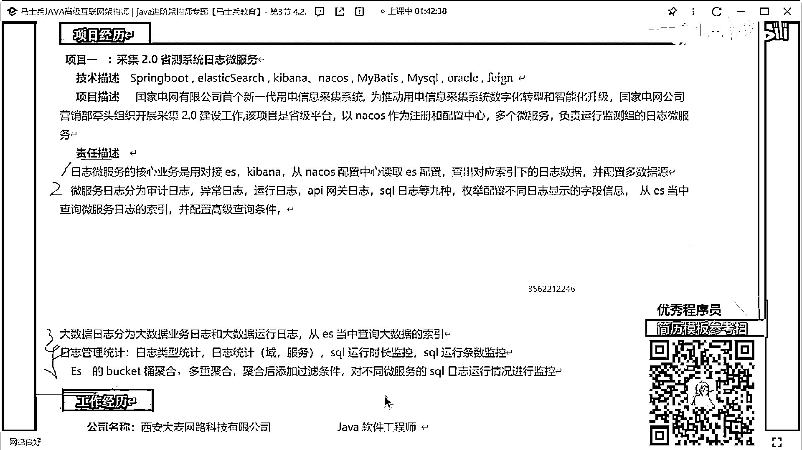

這咋寫，項目一，項目四，哎呀我問。

我問一下項目吧，智慧工作平臺，這個航天劇啊稍微調整一下好吧。

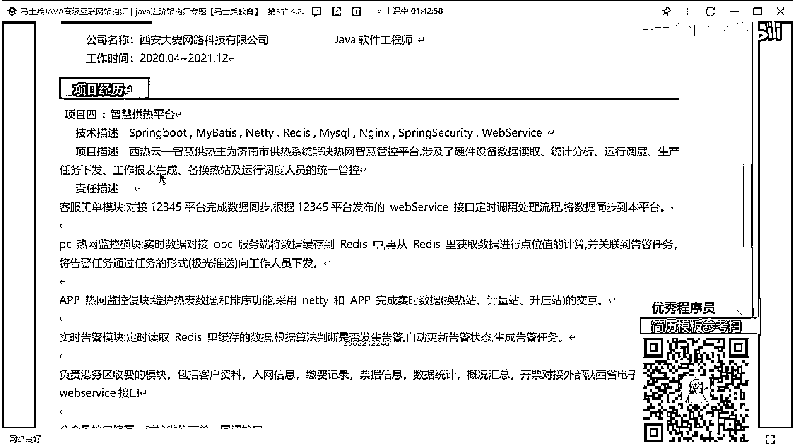

我還是那句話該加編號的地方加編號。

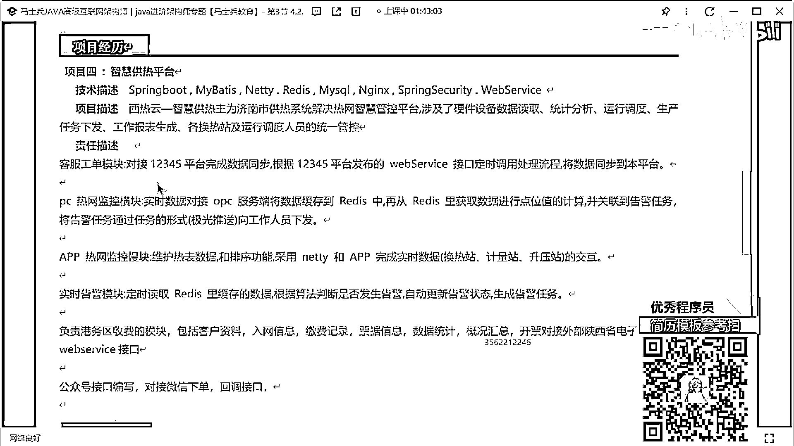

ok，這有兩個項目名稱，這也沒有編號了。

你這下面知道加編號，上面就不知道加編號，你這咋湊的這份簡歷啊，還有項目二項目三，還有項目二項目三，太亂了好吧太亂了太亂了。

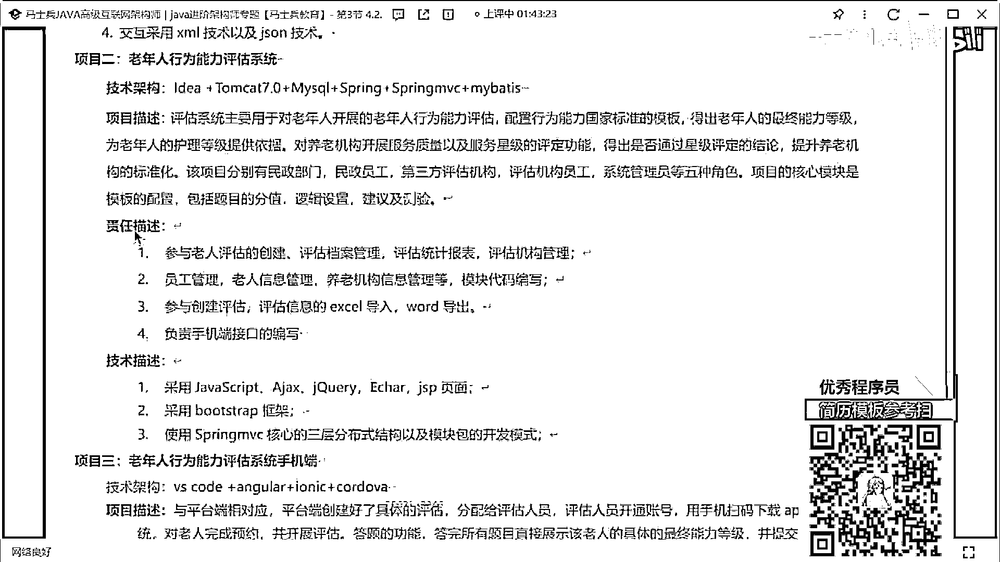

記住了項目描述好好去寫一下，我說了通過三四行的文字描述，解釋清楚這個項目是幹嘛的，好不好，然後呢這個項目它有什麼樣的價值，它解決了什麼樣的問題，有哪些核心的功能點。

它對應的數據量是什麼樣子的。

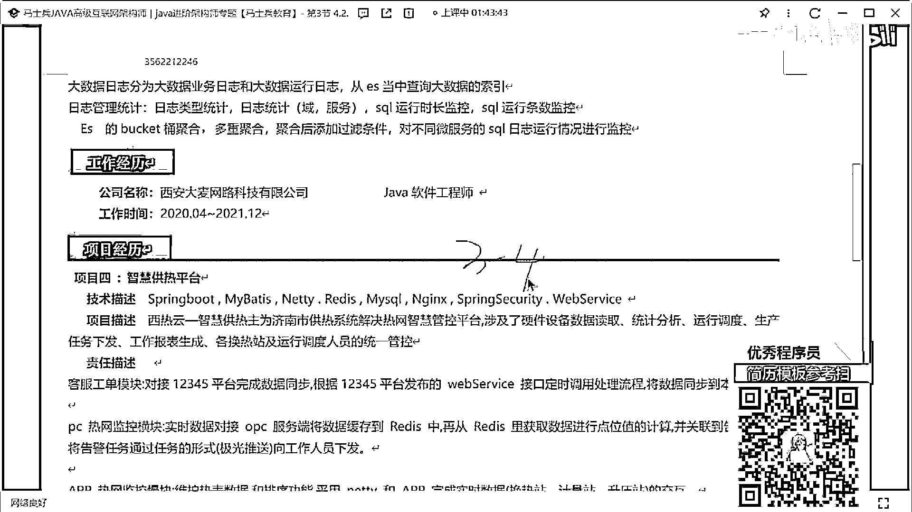

好好寫寫，行不行，職責描述該寫的寫。

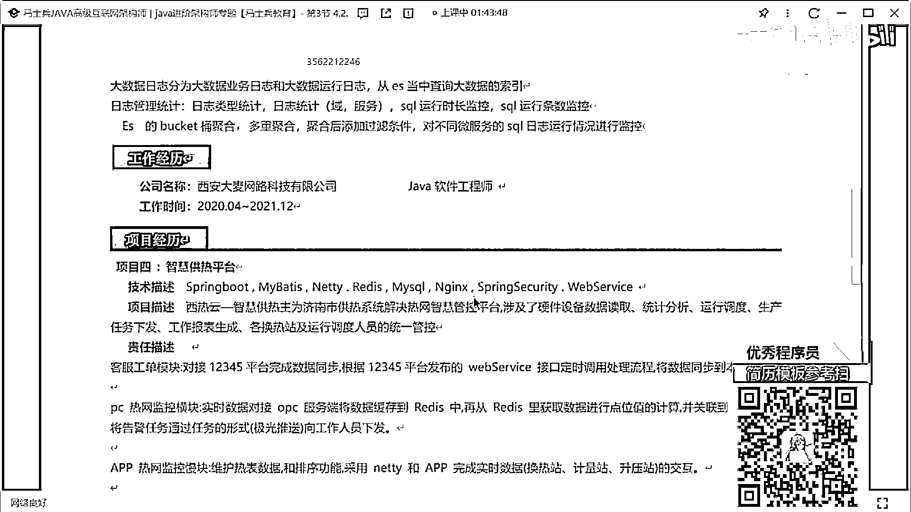

好吧，沒啥可說的自我評價不說了好吧，氣死我了，氣得我膏疼，講這麼多了啊，我們中間稍微休息一下。

我給大家看一個，這個東西，這是一個同學，寫的關於技術的描述，你們敢這麼寫嗎，敢了嗎，敢了嗎，啊，把技術能不能這樣寫一下，就我說的你可以羅列的技術有很多，你真的不會沒啥寫。

你先把你的技能站給我撐滿了再說行不行，嗯，好吧，這技術這一塊，項目這一塊怎麼寫，項目這怎麼寫啊，項目其實可以寫的很簡單，也可以寫的很復雜，項目這塊來寫的時候，我說了第一個叫項目描述，第二個叫技術架構。

第三個叫職責描述，我希望你把這三塊給我分清楚，展示清楚展示明白，就內容你可以寫的差一點，我說老師我不會描述，我們可以寫的差一點，這個沒關系，這個沒關系，但是，最起碼看起來條理清晰吧，對不對。

我給你看一個好吧，這個同學寫的項目，能這樣寫嗎，下面告訴你這是個SaaS平臺，提供這種私人定制的服務，下面告訴你技術站的一些，下面告訴我用，怎麼做的，很清楚很明瞭嗎。

對不對包括有同學可以寫一些。

你找一下，找一下，打個板吧。

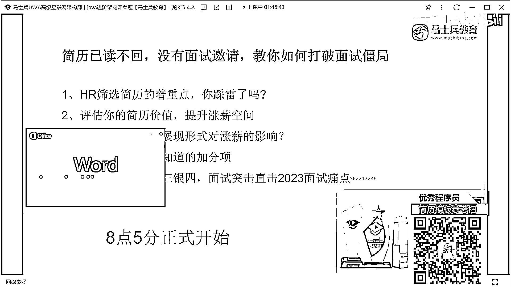

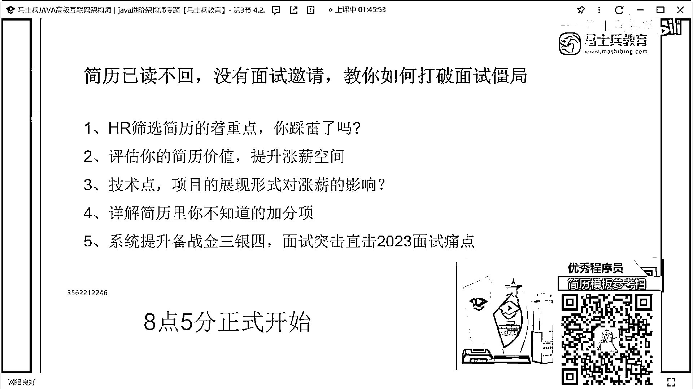

能這樣寫東西嗎。

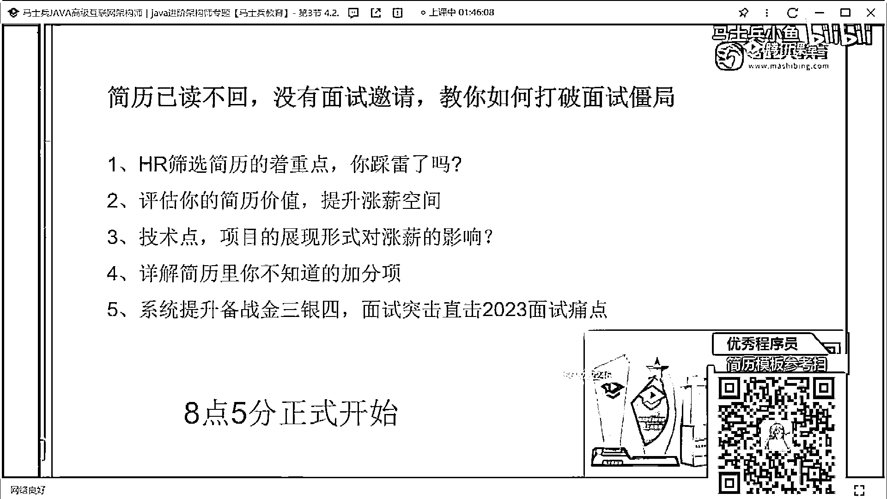

對吧日貨多少，多少實力數據量多少節點多少，知識一二三四五，技術站這麼多，好吧，有的寫的不是沒的寫，就看你想怎麼寫，你好好好好琢磨一下，也有同學問老師，我的項目到底寫幾個，我問你問題。

一個簡歷裡面寫多少項目，一個簡歷裡面寫多少項目，大家記住，不管你的經驗是多少多少年，項目的個數沒有明顯的限制，我能不能就寫一個項目，能不能，我寫一個項目嗎，可以所以就是你項目多了他不一定好。

但是你的項目寫出來，都讓別人看到之後就覺得，你太牛逼了，你要有這種感覺明白嗎，我來看一個項目好吧，這有一個同學寫的項目，他就寫了一個項目，別的沒寫，上面是技術描述，不說了好吧這個大家不敢寫。

我們看看職責描述怎麼寫的好吧。

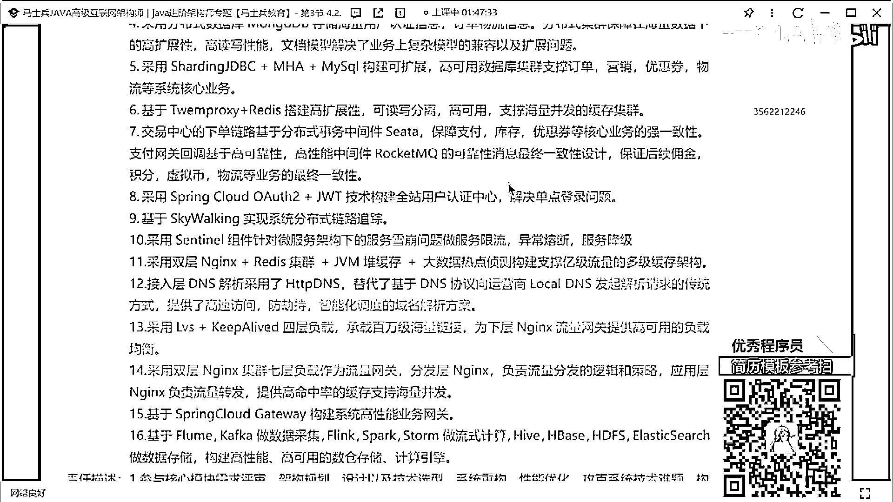

不看太大了，來這哥們寫的職責描述，我放這你沒有人敢寫嗎，核心文化需求評審，架構設計，架構規劃設計技術選行，系統重構系統優化，工科技術難題，構建什麼什麼系統的系統架構，參與什麼文化評審什麼之類的東西。

參與什麼整理方案的溝通，解決什麼系統架構難題，參與什麼重構，做了高頻發多級緩存架構設計和開發，高高頻發秒殺系統架構設計開發，網關集群中間線服務層數據庫，這兩全都調優，這些東西的調優方案。

高性能自研網關的架構設計和開發，分佈式實質數據同步中間線的設計，架構設計開發，歸路發布的方案設計和改造，他就寫了一個，這哥們不是我我記不清楚了，不是70萬元信用80萬元信用，誰規定一定要寫三個了。

誰規定一定要寫四個了，沒人這麼規定，就是你寫完的東西，第一要讓別人感興趣，第二，要展示出你的價值，我一直給大家說，我說簡歷裡面的每一個字，每一段話，他都是有意義的，而不是為了湊空間，不是為了湊字數。

我一直說我說簡歷要琢磨琢磨琢磨琢磨，琢磨，不是你從這抄一個，從那抄一個簡歷就完成了，你那個東西是對自己的不負責任，好吧，來。

接下來看吧。

