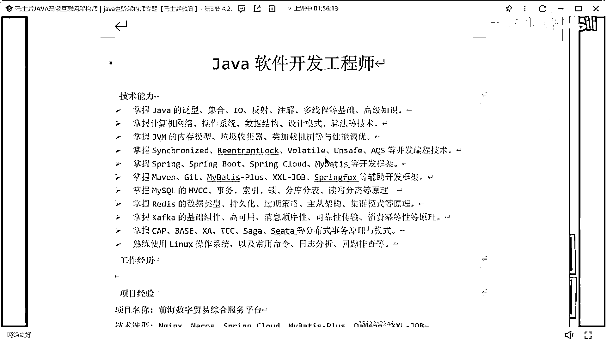
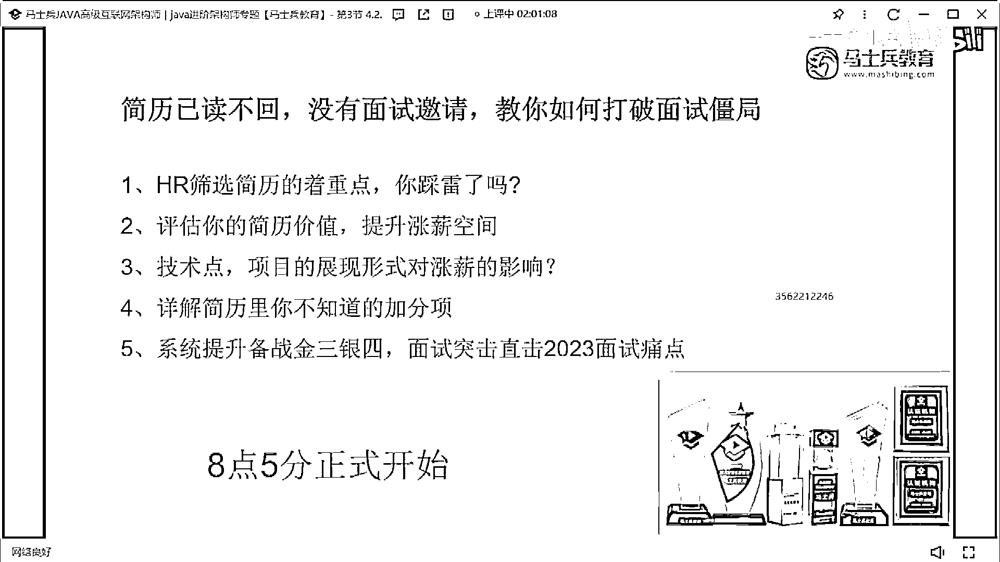

# 什么样的程序员简历一看就没戏？当代互联网HR最喜欢的简历套路有哪些？马士兵告诉你普通程序员写简历千万别太老实！ - P19：专科学历25k简历指导 - 马士兵小鱼 - BV1oP411Q73J

學歷好啊 我這知道。

不懂技術他得篩選吧，HR怎麼學簡歷的，你最起碼要對應匹配的技術戰吧，你的技術戰要匹配上吧，你技術戰不匹配上，你怎麼可能面試機會，而你的項目你這邊好好描述一下，我要看到你的項目的價值吧。

如果真的每天那個那個簡歷啊，如果真的每天幾十份，那真的是我的問題，我認知出現問題了，我對現在這個HR可能不太了解，我知道看學歷的很多，但不可能因為說你學歷好，所以別的東西我都不在乎了，不可能，哇。

來看這學生，這哥們誰的呀，這個技能寫的挺好啊，我覺得這個，我就是HR版我學歷不好，我學歷不好，林同學是吧，技術戰沒問題啊，大家看完這個，大家看完這個項目這個這個簡歷都怎麼感受啊。

大家看完這也沒有一種很舒服的感覺，就看完這點有沒有很舒服的感覺，但現在不管他內容在，內容寫的怎麼樣有沒有很舒服，很舒服吧，這就是我說的你內容寫的再差沒關係，但最起碼說你先把你個人應該。

展示東西展示清楚了，明白嗎，就這個東西我覺得是，真的很好，技術也好還是，下面這些項目描述也好，該對齊也好格式也好什麼東西，我覺得真的很好，這樣看起來整潔舒服，我有看下去的必要，我有看下去的這種慾望。

ok 我們再說他的描述，技術這塊我覺得寫的可以了，好吧然後項目這塊，這個綜合服務平臺還是那句話，你上面這只是寫了說，我們這幹了一件什麼事，但是你現在這個平臺裡面又包含了很多的，這裡面包含很多子平臺。

你的子平臺要不然你拆開，詳細去做一個子平臺的這種描述，要不然，你就把對應的一些，監管啦服務啦這些物流啦，這些對應的數據量，可以做一個最基礎的展示，好吧，責任描述寫的有點少，責任描述寫的有點少。

我說了責任描述敘事結合，你寫的都是實際的業務開發模塊，最好再把一些虛的東西給他加一下，寫個七八條，這樣更合適一點，ok，這個中國平安智慧城市，智慧城市說一下解決了什麼樣的一個問題，解決什麼樣一個問題。

然後他這個智慧城市達到了什麼樣的一個效果，然後你們每天做了什麼樣的數據監控，好吧這東西寫一下，而責任描述也是這樣寫的太少了，寫太少了好吧，小蜜蜂系統後面寫都一樣了，就大家記住。

你們在寫項目的時候千萬不要這樣寫，這個寫法是有問題的明白嗎，訂單發貨評價體系信用支付，金融特兌盈年支付三罵發貨，這種寫法是有問題的，你這個相當於是什麼，相當於是把你的模塊，只是單純的做了一個羅列。

這種羅列是沒有意義和價值的你懂嗎，這種羅列是沒有意義和價值的，好吧，把你的項目啊，這個這個林同學，把你的項目好好再改改，真的好好改改，把項目好好改改，我覺得你你肯定是不去面試機會的。

所以說面試能拿多少錢，如果在你的技術儲備都沒問題的情況，你現在多少錢，林你現在多少錢，在哪個城市寫的嗎，深圳是吧，15是吧，學歷有嗎，沒寫學歷啊，讓你查學歷啊，如果你的學歷是本科以上的話。

如果你是本科以上的學歷的專科，呃繼續提升你的學歷吧，然後呢專科，我覺得如果企業要你的話，你的薪水應該在20 25之間，肯定是沒問題的，如果你本科學歷面試機會會更多，應該是25 2525應該沒問題。

然後專科的話可能就20 20-25，就看你面試時候的發揮了，面試時候發揮了，好吧，當然啊一定記住啊，現在最現在你現在你的這個學歷有問題，你的技術就一定要儲備紮實好吧，一定要儲備紮實，因為這東西啊。

就是考核技術的時候就很重要了，雖然學歷有劣勢，但是我的技術一定要，凸顯的很牛，ok，現在這行情不敢要這麼高，你面試的好大膽要唄你怕啥，謝謝大家！

。

拜拜。