# 什么样的程序员简历一看就没戏？当代互联网HR最喜欢的简历套路有哪些？马士兵告诉你普通程序员写简历千万别太老实！ - P1：程序员海投简历HR已读不回如何破局？ - 马士兵小鱼 - BV1oP411Q73J

好大家听我说，虽然说投简历是一定技巧，比方说我给你举个例子，你是在早上八九点钟投，还是说是晚上投，是海投还是怎么样投，这些技巧呢我在我们VIP客户里都有教，但是呢这个不是最核心的一个点。

比方说我再教你一个小技巧，我给你讲讲，你说一份简历，有的人是这样的，就一份简历打天下，兄弟们，有没有人这样，我给你举个最简单的例子，有个哥们四十二岁了找到我，老师我下一步想去找什么样的工作。

我说你把简历给我发过来我看看，他简历大概是这样的，项目经验很丰富，然后技术占了一半，管理占了一半，我给他的建议非常的简单，就是你一定要打那个有针对性的账，如果你要找的目标是架构师，只写技术不写管理。

如果你的目标是带头人，team leader项目经理，多写管理少写技术，好这点大家能听懂吗，就是当你的目标是多种岗位，你都可以去cover的时候，分开写这都是小技巧，最牛逼的分开写的技术，我教大家叫做。

一岗位一简历，一对一，一岗位一简历。

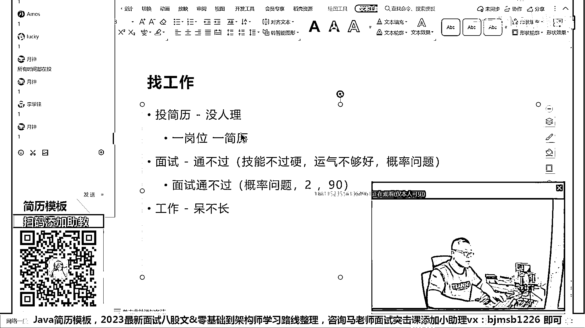

我这么说不知道大家能不能理解，这样我打开招聘网站吧。

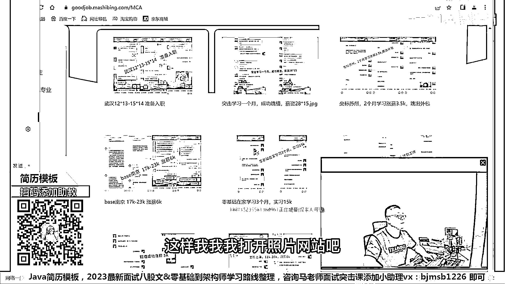

打开招聘网站，我们打开这个招聘北京站。

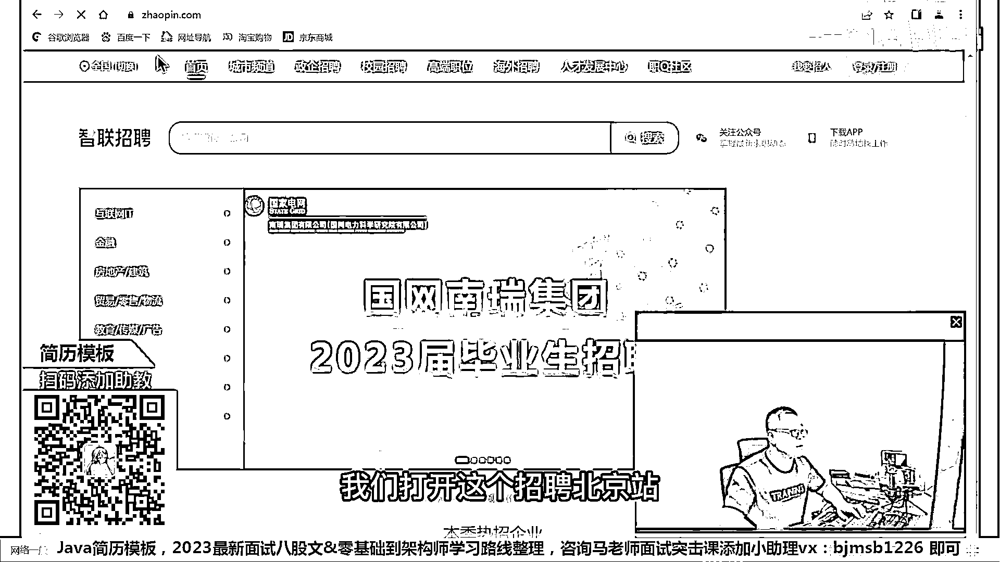

然后我们就随便搜一个。

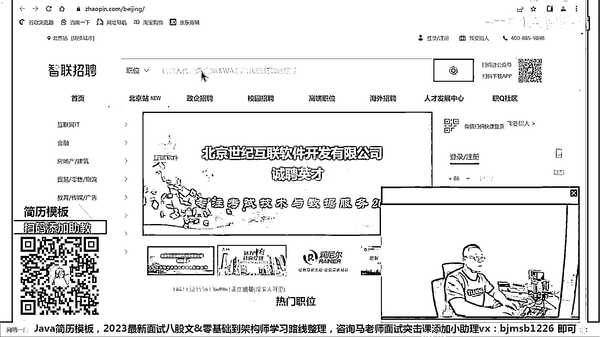

这样搜一个，我们打开这个随便打开就第一个，好听我说啊。

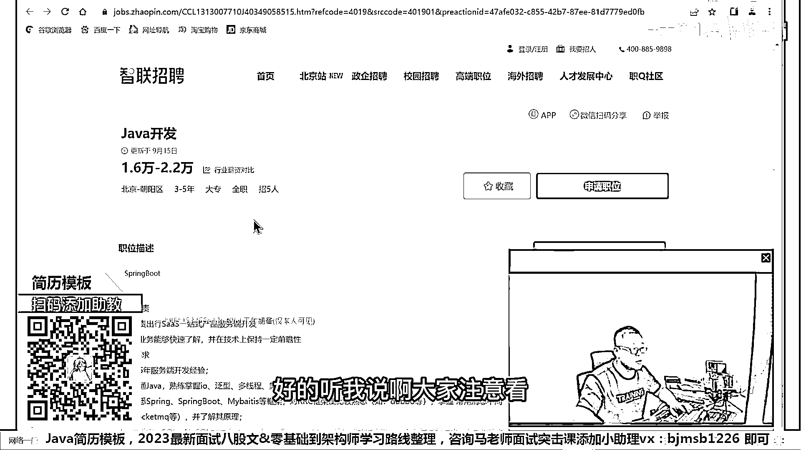

大家注意看，我不知道有多少同学，有人细致的去读过，人家这些招聘网站的需求的，因为这里面的有很多同学，他的习惯是我写了一份简历，这份简历上写着我会啥，那我叫什么我几岁了，我会啥，ABCD，然后呢。

看这简历，这边在招呢，发出去，爽，听我说，那种的成功率是最低的，成功率最高的是我下面讲的这种。

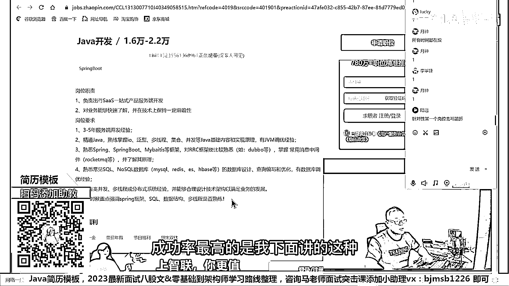

就是你看着这个了，对不对，你打开来看看人家要什么，岗位执政是要求SARS的，那首先第一点，你想你想一下，如果我的简历上体现出SARS来，是不是会更有优势，那这样大家能听懂吗，给个老师扣个音。

就是说你要看人家专门需求的是什么，你看人家看的是SARS的，对医药快速了解技术上保持一定的前瞻性，如果你能了解一些前瞻性的技术，会不会有优势，比如说云源生，大数据大量数据的处理，AI的入门等等。

你琢磨琢磨，会不会有优势，好，这就说3到5年，无所谓你投就是了，这个你可以忽略掉，你哪怕就只有赢了三年，我水平够了，我就可以投，你放心，还是有机会，好，你看看人家看中了，IO反星多线程并发的知识。

对不对，JVM的调优的经验，Spring Springboard MyBatis RPC，MySQL Redis EHBase等等，好，高频发多线程分布式系统，合理技术架构，这个有点强调架构的，对不对。

寻访的时候重点强调Spring SQL，数据结构多线程是个数量，看到了吗，人家都给你说得非常清楚，如果你当你看到你这份简历，这个东西的一个需求的时候，你的简历上该体现什么，心里有数了吗，有谱没有。

所以一个非常粗浅的道理叫做。

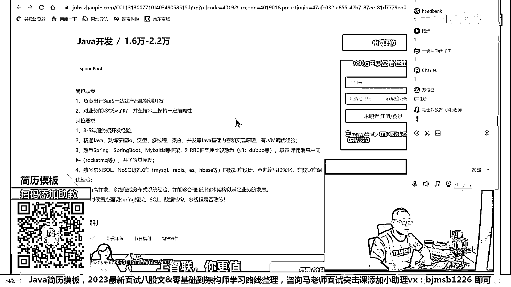

你的简历啊，这是最理想的，一杠为简历，当然有同学可能跟着抬杠，说老单我一杠为简历，肯定是太累了嘛，确实有点累，如果你一件事情想要效果好，然后还不累，你觉得这他本身就矛盾，本身你要干一件事情。

就得把它干细了，效果才会更好，当然这个确实有点累，那么至少你要干一件事情的，就是通过我刚才讲的这个，你要理解一点，就是你的简历体现什么，你简历体现的东西，是什么东西呢，对方的需求，这个很重要。

就是人家厂子要什么，就业单位要什么，而不是我会啥，你知道有同学，尤其是那个应届生同学们写简历，我会打乒乓球，我会UI，我会Photoshop写一堆，人家要求的是Java的后端，好我给你写C#。

写Python写一堆，你觉得有意义吗，同学们，我们面前一百个小姐姐，每个小姐姐都提出了自己的明确的需求，有小姐姐一米七五以上，有小姐姐一米八零以上，你非得给你简历上写，我身高一米五八。

我就问你有没有人会去找你面试，所以我们讲的第一条原则，叫做你写简历体现的东西，叫对方的需求，你这份简历是个广告，企业就是你的客户，你的客户想要什么，你要在广告里体现什么，而不是说我想说啥。

你们那个厂子必须听我的，这块能理解到位的，别老是口语，当然，我讲完这个东西，马上就会有人跟我抬高，我说我不会啊。

对吧。

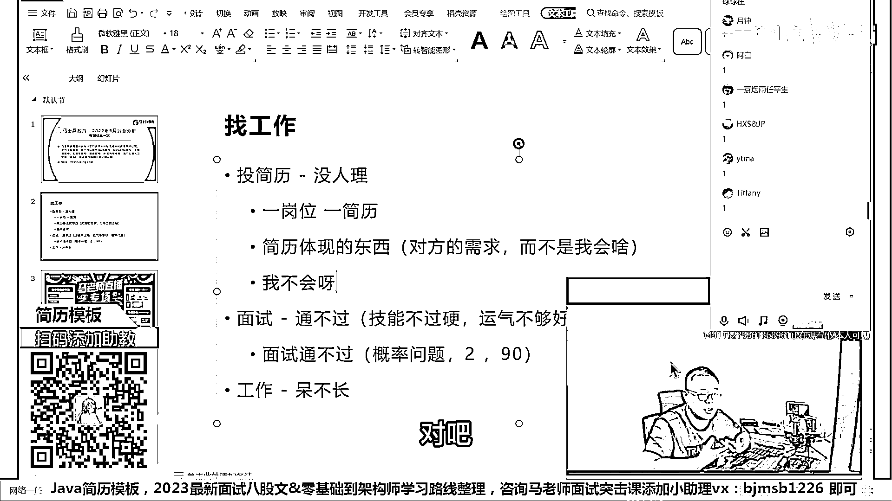

这一堆，我一个都不会，那我咋写啊，不会能不能学，就算我长期掌握不了，我短期能不能冲刺一下，比如说我现在我只会SSM，对不对，什么这个什么什么高病发啊，什么分布式啊，我啥都不会，但是我可不可以短期冲刺。

去葫芦吞枣大致了解一下，好这就回到概率问题了，只要你有一部分的冲刺，哪怕你冲刺两个小时，做一个粗浅的了解，你的概率会不会提升。

好好自己想一下这件事。

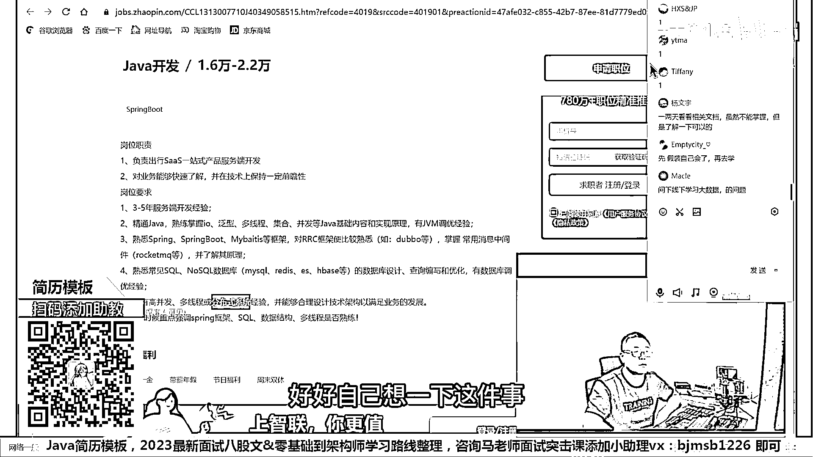

好接下来，再讲一个更粗浅的，兄弟们前面一百位小姐姐，要求一米七五以上，一米八零以上体重多少多少斤，你一米五八体重三百斤，但是你现在要的是一个什么东西啊，兄弟们，是不是一个相亲的机会啊。

嗯。

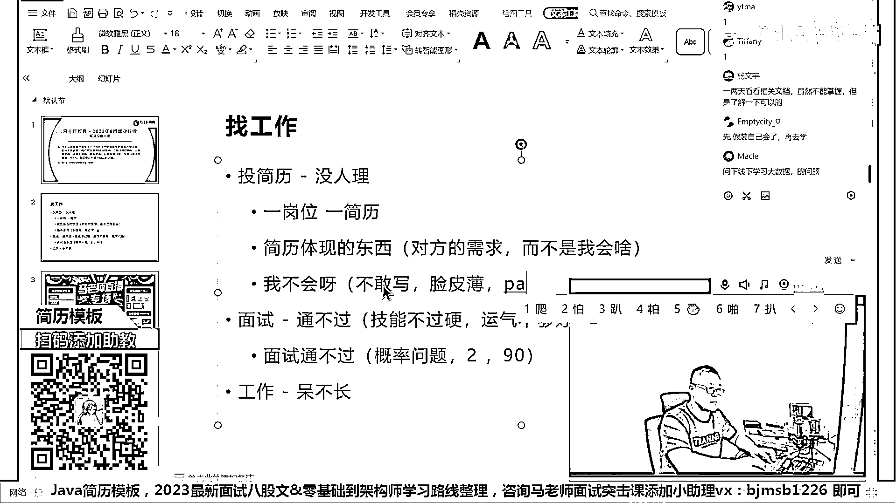

这是你们所担心的，前面一大堆漂亮的小姐姐。

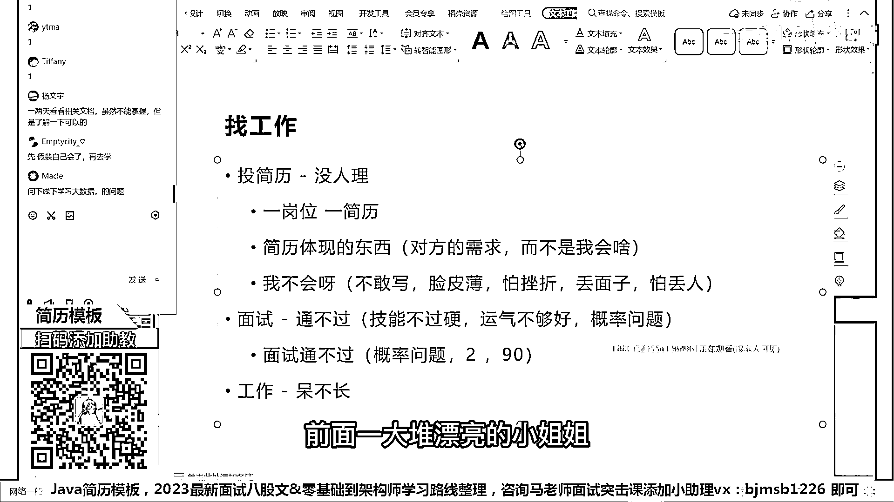

然后呢人家要求挺高，我一看我明显明显不行啊，这玩儿啥呀不行不行，我还是自己在家焦虑吧，躺着吧那个焦虑一下都多舒服呀，跟别人出去喝顿闷酒，整天在家里焦虑焦虑，你们的核心的思想不就是说。

脸皮特别薄怕挫折丢面子怕丢人，是不是这样的，好，我想问你你现在是一米五八，然后你在简历上啊，你在跟小姐姐的这个信上，讲我是一米七八可不可以，可以吗，那你写一米七八身高，这个身高一米七八。

然后体重八十公斤，小姐姐是不是会给你一个相亲的机会，面试的机会我们就有了，来这会儿能听明白老师扣1，就这块我要求你的你的第一步啊，简历这件事情解决的什么东西，叫面试机会，你就给我记住，只要你有面试机会。

你这个概率就一定比没有要强得多，而且他跟具体的这种相亲还不太一样，一米五八在实际当中，你不可能长成一米七八，但是即便这样，你只要见到小姐姐，你就非常你就有一定的概率啊，哪怕百分之一，你跟她好好讲。

好好沟通是吧，好好聊，你们有一定的概率会成功的，但是你见不着她永远成功不了，这能理解吧，但是我们实际上的技术呢，技术不是这么回事，技术你现在是一米五八，但是你通过一段时间的恶补，你完全可以补到一米七。

一米七二，一米七三，一米七四，在垫点三高鞋垫，你就是一米七八了，所以不会敢不敢写，解决这个问题先，我讲完这个，请大家呢，对自己说，不会的东西，我如果真的，你的前提是啊，你你投你的简历，没人理你。

那么你就要考虑到现在，你不会的东西也要往上写，这怎么还在这跟我这要不到面试机会呢，我现在不就教你怎么样才能要到面试机会吗，来这块能听听外号老师扣个一，就是你怎么样要到面试机会，还听不懂。

刚刚进来先慢慢听好吧，现在我们解决了就是要到面试机会的这个问题，这个东西，也适合什么东西，也适合那些想提升的提高新的，忽悠，你赢了啊，你以后一定不要忽悠啊，做一个乖乖的好孩子啊，嗯，在这儿那个我我我。

有看你忽悠这个词呢，我就有点感触比较深啊，有的人那个研究生的字数啊，或者是你去做任何的这种面试考研的面试，以及那个有一些大学的这种自主招生之后，他有一个面试环节，嗯，那你要尽力的表现你自己。

那个那个东西你认为是忽悠吗，所有的人你在，不管你在工作这种学习这种，你最终的还是要把你自己的东西给大家秀出来，那个都叫忽悠吗，你如果那些人认为那些都叫忽悠，那就算了啊，大家听我说。

现在呢我们解决了第一个问题，就是说我们怎么样去，拿到一个机会，这个东西，记住，记住，这个东西还有他非也也适合于所有的高端岗，而且高越是高端的岗，对这个的依赖度越高，嗯，那个有不少同学找到老师，说老师啊。

我现在已经是年薪50万，老师我想拿到年薪80万，那这时候该怎么办，我教他就很简单，你先给我写一份年薪80万的简历，先给我写出来，老师帮你判断值80万吗，然后照着这份简历，你什么地方有短板恶补。

恶补的差不多了，拿一定的概率去外面拼就行了，同学能行动吗，因为有很多人，他其实不敢去拼，他自己没有信心，最核心的是他怕丢面子，怕丢人，他不敢去拼，所有的人，我建议你们把你们的自尊心，看的。

不要看的那么重要，年轻人的自尊心一文不值，我可以这么跟你说，但是年轻人的脸皮反而是最薄的，你们好好想一下，在你们20多岁，20多年到40多年的成长的过程之中，你们所谓的这个自尊心。

对给你们带来过什么没有，有的时候，你拉下脸来，去追一下你们班的斑花，没准那个机会就是你的了，就算不是你的，你也尝试过了，你尝试过了，你就不会后悔，你不会想说，哎呀当年我要是尝试一下，没准斑花就是我。

因为你怕挫折，怕被人拒，好我们翻过头来说，找工作，你说你找工作，你写了一份简历，你去了，然后没面过，你的损失是什么兄弟们，我想问你，假如说你你你到了一个，一个一个一个企业这里，然后有一个面试官啊。

上来劈里啪啦把你递死了一顿，好你的损失是什么，你的损失啊，很简单没有什么，就是有一个面试官觉得你很差，而且呢，你们是第一次遇见，以后再这辈子遇不上，但是你的收获是什么呀。

你的收获是增加了一次很不错的面试经验，你会知道对方会问你哪方面的问题，哪方面的问题，我没答好，而且如果你要愿意找到我，把你的面试录音发给我们，老师还会给你给你进行分析，这叫面试的陪跑。

是咱们冲刺里面的一部分服务，只有收获只有收获，没有任何损失，这点大家能听懂吗，所以我建议大家大胆去试，没有问题吧，你不会也可以写，写了之后拿到机会，你就算没有任何的冲刺去补这些技术，你可以去试。

试完了哪怕今天问你了三个问题，ABC你把ABC下来背过了，你再去试下一家很有可能问的还是ABC，这话大概能听明白了，老师扣个一，小背说大成半年不能灭这个岗，现在我讲的是找一份工作，是特别差的。

如果你想大成，我会提前告诉你，你该准备到什么程度再去，大成是这样的，你原来你用2%的概率去拼，还是用50%的概率去拼，还是用90%的概率去拼，老师会告诉你，学到什么程度你可以到90%的概率，听懂了吗。

但是我前提是，你不要把你自尊心看太强，脸皮稍微厚点，我希望大家后面的，整个人生的过程中都能做到这一点，有工作的机会去争取，有好的带头的机会去争取，有喜欢的姑娘去争取去表白，不就是个悲剧吗，对不对。

最严重的后果就是悲剧，你不会被抓进去的，不就OK了吗，我们解决这个问题好吧，所以这个时候，你再投出去捡了一群，如果再没人理，那就说明整个就业市场全完蛋，百分之百分之一百的一片黑。

到目前为止远远离这个情况还远着呢，不可能，国家最近的刺激政策一大堆，减税的，然后那个那个那个，专项债的是吧，然后那个汇率贬值利率出口出口行业的等等一大堆，我就不信现在没人招聘，如果没人招聘。

为什么我们这边还有一大堆的同学们跟着就业还掌心，对去争取去争取去争取就有机会，哪怕百分之一的机会，你试一下，有可能得到，你不是永远得不到，这里头就要求你，要做好什么样的心理准备啊，悲剧。

我要原来我试八次能找到一份工作，现在我要是可有可能我要是二十次，我要做好这方面准备，比如说你的心情淡一点，再淡一点，做出那种平淡的不影响自己心情的正常的一个努力，一个争取就行了，看淡结果，注重过程。

好吧我们就就到这，OK。

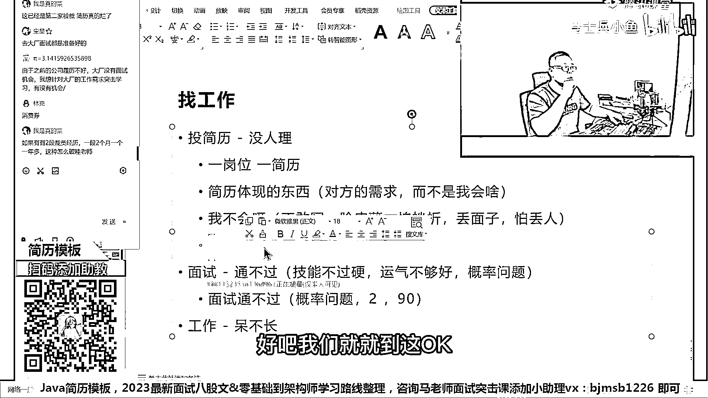