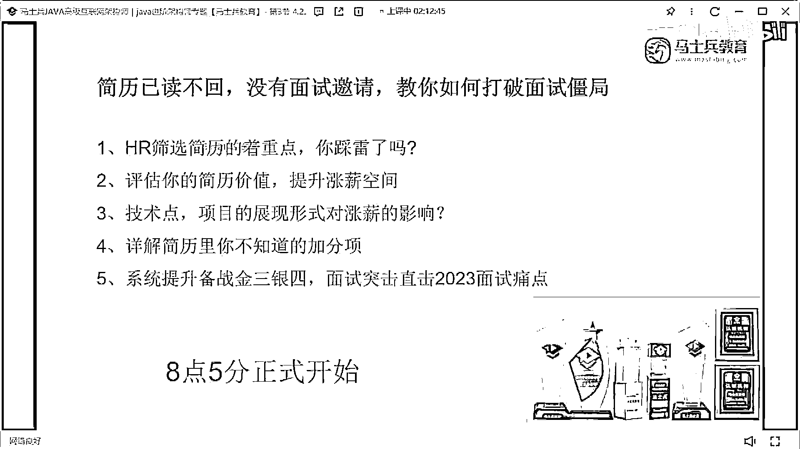
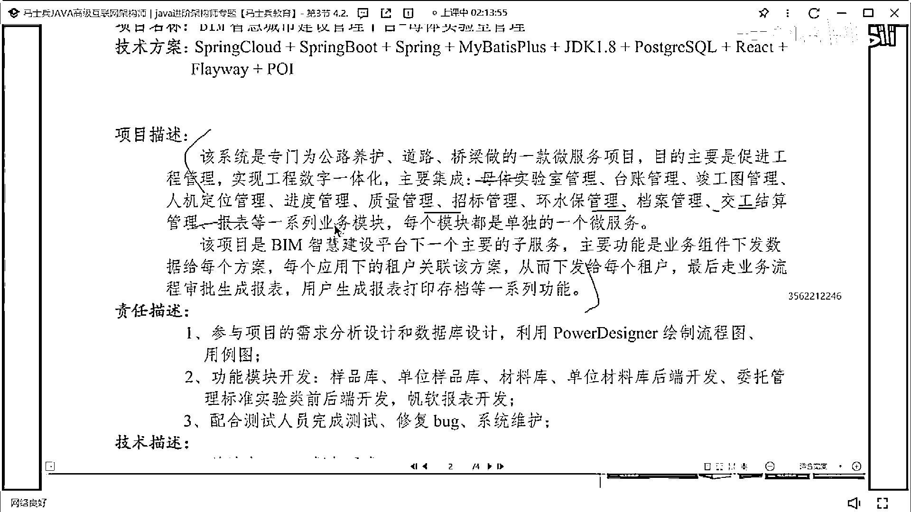
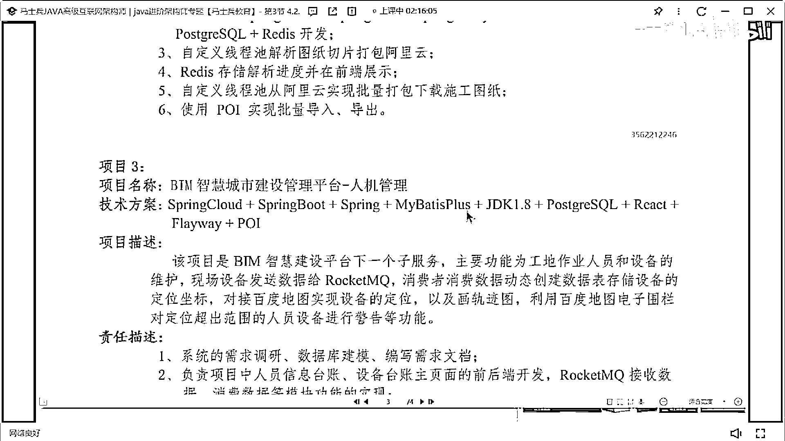

# 什么样的程序员简历一看就没戏？当代互联网HR最喜欢的简历套路有哪些？马士兵告诉你普通程序员写简历千万别太老实！ - P23：29岁6年Java简历指导与建议 - 马士兵小鱼 - BV1oP411Q73J

看到誰的了。

看這個前同學，29歲，你看這個，你看這個技能描述啊，這個技能描述看著很舒服，他說呀，這個看著很舒服，把技術站這塊寫的都很好，具內容可以不看，但這個技術站寫的很舒服，好吧，然後20年至今，三年三年，挺好。

工作地點也很好，社會城市，模擬實驗室，實驗室，記住啊，這誰點的呀，這團贊嗎，再讓我扣1來，記住啊，你的技能描述沒問題，下面這塊要好好改一下了，這個留白，這個留白不要有，沒必要留白，好吧，然後下面描述。

這個寫的有點草率了，這個項目描述寫的有點草率了，像描述網還是一句話，介紹宣傳的幹嘛就行了，沒必要把這些基本的模塊都展示一下，這些模塊都展示出來，沒有什麼實際的意義，然後突出一下，你的實驗室。

每天做了什麼工作。

然後裡面有哪些，可以展示數據量，把這東西好好去描述一下，然後職責描述和技術描述，能不能合併一下，技術描述，只需要把技術名詞，羅列清楚就行了，就像你下面那塊寫的一樣，然後職責描述，我剛說的。

用什麼技術實驗什麼功能，做了什麼樣的一個工作，有哪些特殊貢獻，有哪些問題，要這樣方式來寫，進攻圖管理，你這是做了一個大型的智慧城市的項目，裡面分了N多個子系統是吧，就是你這個項目啊，技能寫得很好。

但是項目這塊呢，明明是多個子系統，明明是一個很大的項目，多個子系統，但是你這個子系統呢，描述起來讓別人看起來，好像沒有那麼大型，或者沒有那麼有價值，你的項目要好好去改改，然後這有一個。

你看這個這個六年開發經驗，然後呢對技術熱情，這個地方要注意啊，六年開發經驗，突出一下自己做過哪些架構設計，做過哪些技術技術方案，技術解決方案的提供，對技術有沉澱，這個沒問題，我給大家看一個例子。

就這個東西要怎麼去寫，我找一個，來找一個，你看這東西寫的東西啊，他這麼寫的是，五年大發開發經驗，對吧，三年大型項目，大型系統架構設計經驗，三年以上團隊管理經驗，分佈式高頻發高可用，大數據量。

然後呢系統架構設計研發經驗，正負責註冊用戶，多少到十幾分平安的研發，然後呢紮實的工具，對什麼技術有什麼研究，這樣寫出來的自我評價是比較舒服的，是比較舒服的，OK，就可以參照這樣的，這樣方式寫。

我只是提供這樣的一個樣式，不是讓你說一定要按照這個數據量寫，就這個樣式就這個模板，你可以套用到你當前的項目裡面，你要怎麼去改，懂我的意思嗎，我不是讓你們照抄，你可能沒有這樣項目經歷，明白嗎。

你可能沒有這樣項目經歷，但是你要去寫一些東西出來。

基本上別人感興趣不許出來好不好。