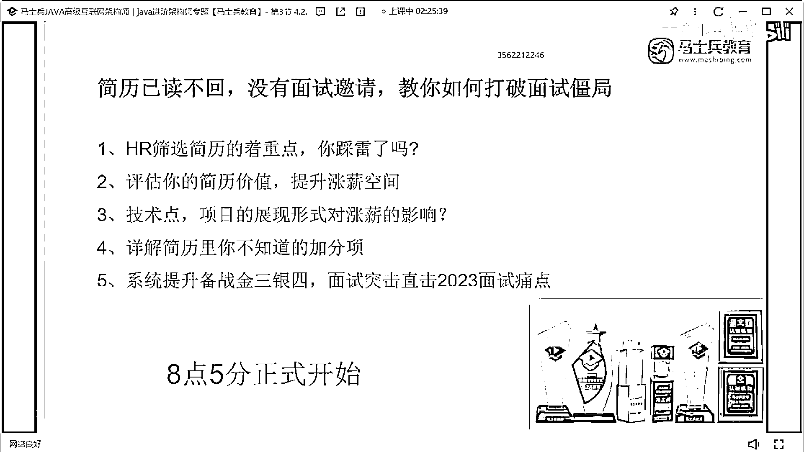

# 什么样的程序员简历一看就没戏？当代互联网HR最喜欢的简历套路有哪些？马士兵告诉你普通程序员写简历千万别太老实！ - P24：一年半Java经验简历指导【切忌频繁跳槽】 - 马士兵小鱼 - BV1oP411Q73J

这个Java EE这个东西不要写了好吧，原来呢分Java SE， Java EE和Java ME，这个东西已经是一个很老旧的一个说法，现在已经没人这么说了，OK，这也是只是把你所对应的技术做了一个描述。

做了简单的单词罗列，就像那个单词本一样，只是做罗列这个技能肯定不行啊，多少年工作经验，两年经验，这个技术不行啊，好好改，项目，就这个，咋整的，这是这个排版的问题吗，项目一定要先介绍清楚项目是干嘛的。

然后再介绍什么，项目用到什么技术，再介绍你在里面负责什么东西，这要分清楚，这项目写的太太太那啥，学生在吗，这是五个月的工作经验，半年的工作经验，哎呦我天，半年，这同学在吗，这同学，这哪个最老实的学生。

这哪个最老实的学生，一定记住啊，这个这个最老实，最老实听好了，下去之后跟这个学生好好去说一下，让他不要跳槽了，听懂了吗，他再这么跳下去的话，他的他以后就找个就废了，他现在基本上是半年一次跳槽。

每份工作都是半年左右，这个经历如果再这么搞下去，那以后一定废了，明白吗，大家现在公司里面的时候，你除了注重你的技术提升，那项目的能力之外，你一定要注意你的履历，以后公司可能会越来越在乎你的工作履历。

因为他在乎的是你的稳定性，这种这种玩法搞下去，真的没得玩了，这没得玩了，啊，就跳槽，你想拿工作钱可以，但是你不能为了这这这点钱，这点钱你，把履历搞花成这样，肯定不行再跳就废了，真的再跳了好吧。

这这这真的不行了，真的不行了，真的辛苦了。

