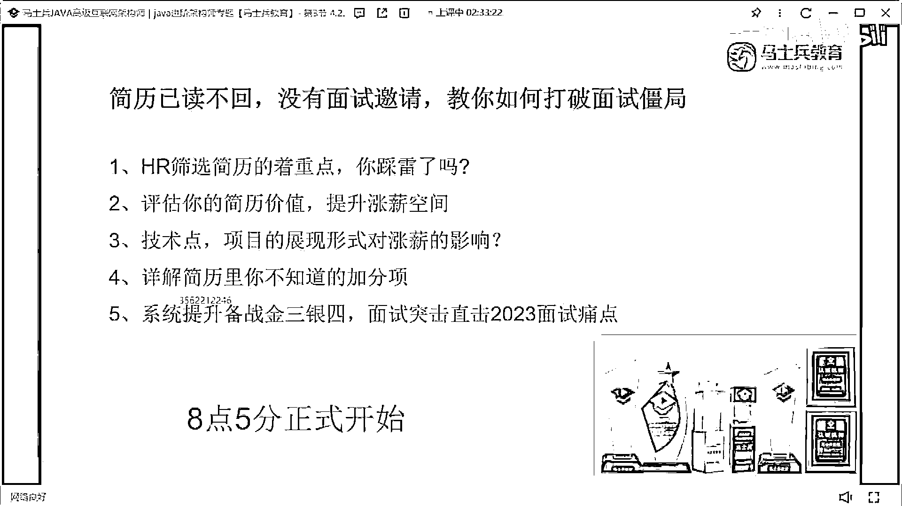
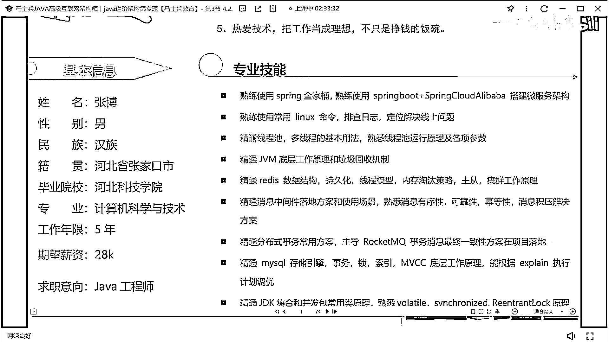
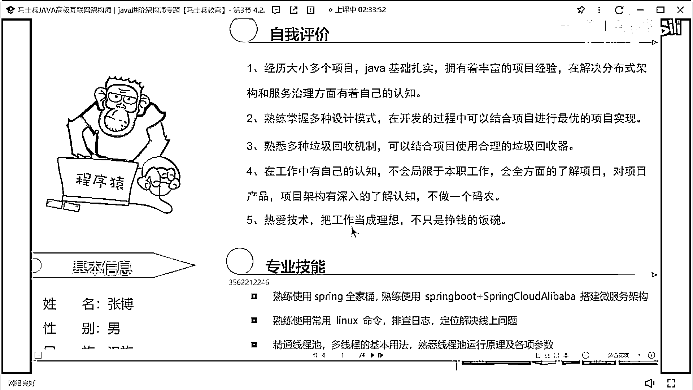
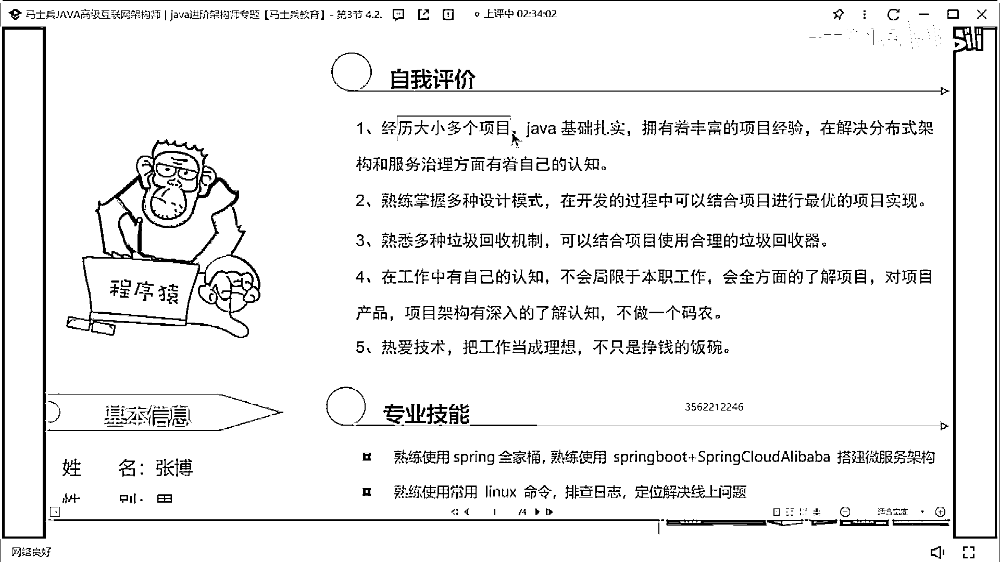
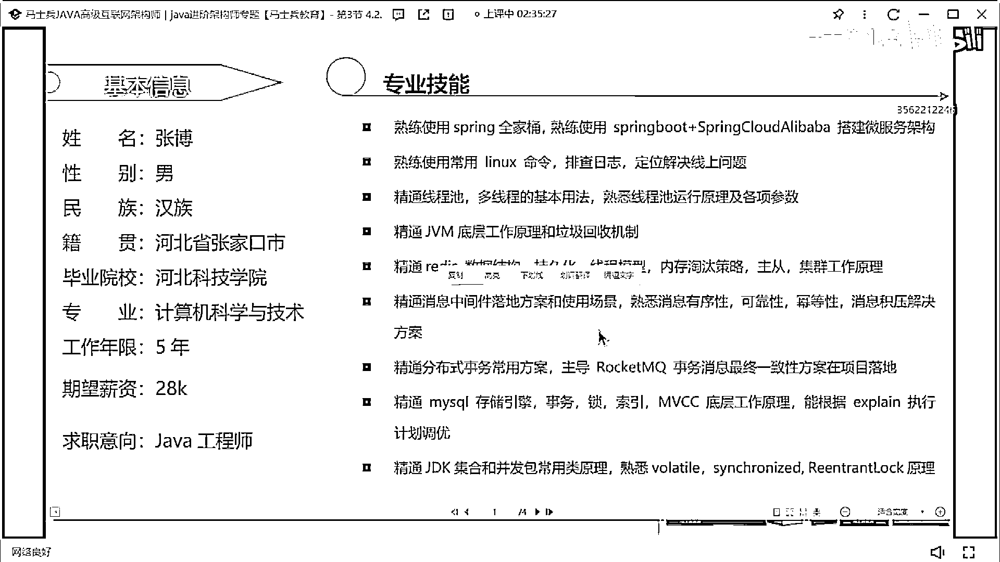
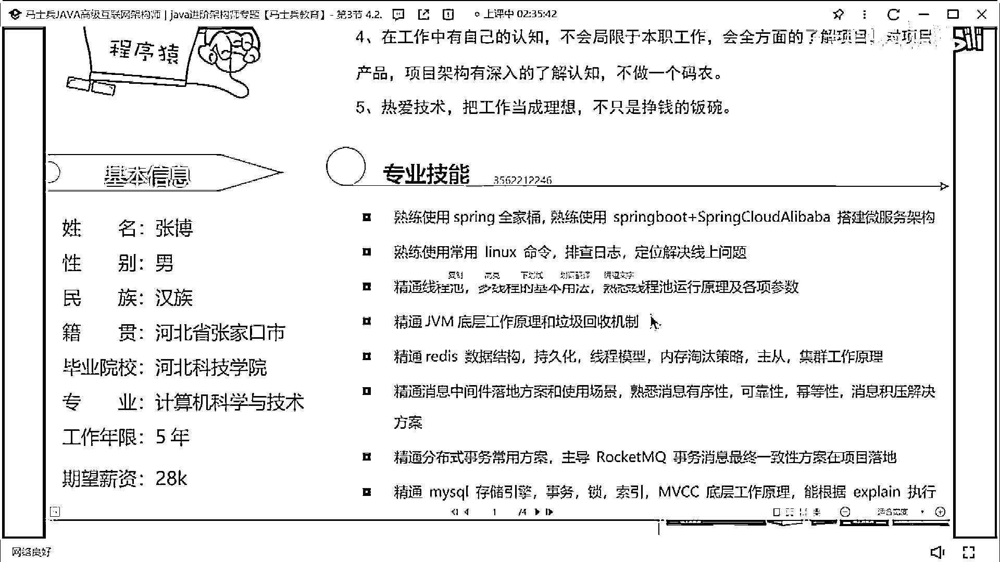
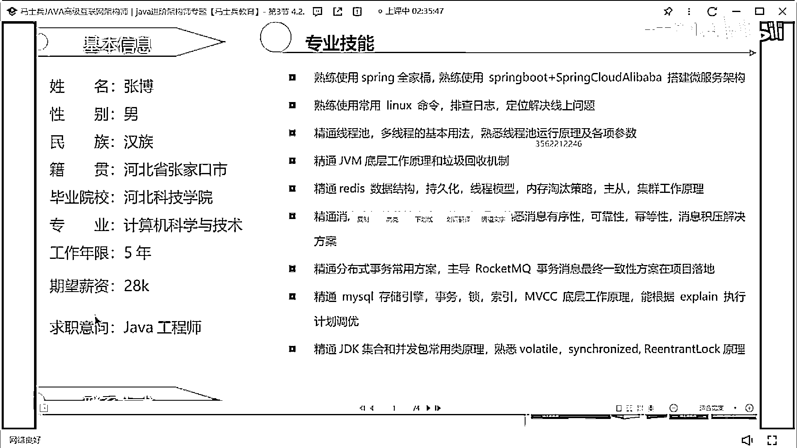
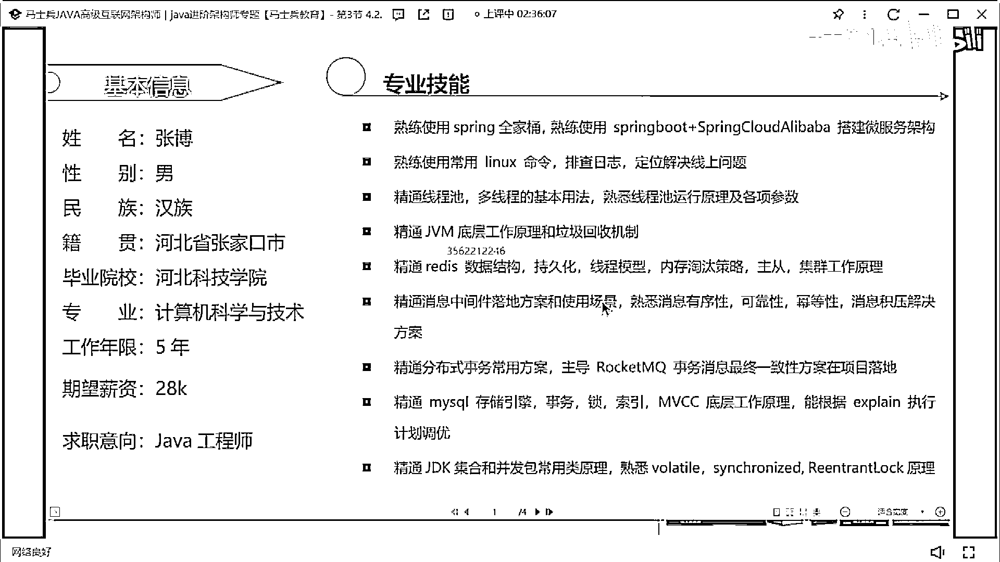

# 什么样的程序员简历一看就没戏？当代互联网HR最喜欢的简历套路有哪些？马士兵告诉你普通程序员写简历千万别太老实！ - P28：5年经验30k简历指导 - 马士兵小鱼 - BV1oP411Q73J

張博。

我在張家口上的大學，這是誰的張博在嗎，要記住啊。

建研不是北方學院，河北北方學院，對張家口兩學校一個建研一個，還有技術學院還有北方學院，說一下這個作品家肯定肯定不行。

這個作品寫太虛了，大家不要寫這個經歷大小多個項目，不要寫這種東西。

沒意義OK，技能，技能，就目前寫的東西可以說得過去，但是1234567899條，你讓你稍微有點少稍微點少，還是要把一些其他的西征墨街技術給添加一下，好吧，河北科技學院公司一兩年，三年，不然兩年半。

這是半年項目，這個啊，這個掉了，你這個項目，200臺少了，兩萬臺，兩萬臺啊，或者想一萬臺，我想要5000臺，200臺太少，好吧，然後這個項目技術，在也有了這個，這叫不叫軟件，這叫技術技術架構，然後呢。

在使用的技術，可以跟我們的職責描述合併到一塊，合併到一塊，好吧，會議錢包也是一樣的，這個多少錢啊，他在哪工作，我看一下，北京，大家理解這多少錢，30給不到啊，30給不到，30肯定給不到的。

20。

我覺得啊，他金他目前的薪水啊，應該在20左右，應該在20左右，你現在薪水多少，24是吧。

24的話，你你這個期望薪水就不要寫28了。

24期望是至少30K嗎，至少30K，好至少30K，不要寫28了，OK，我覺得可以去找碼，充充30，但是你的架構設計能力這塊，要從簡歷裡面做一個凸顯，要不然的話這個肯定不夠，那肯定不夠，好吧。

24為啥沒必要挑。

五年經驗24可以很高嗎。