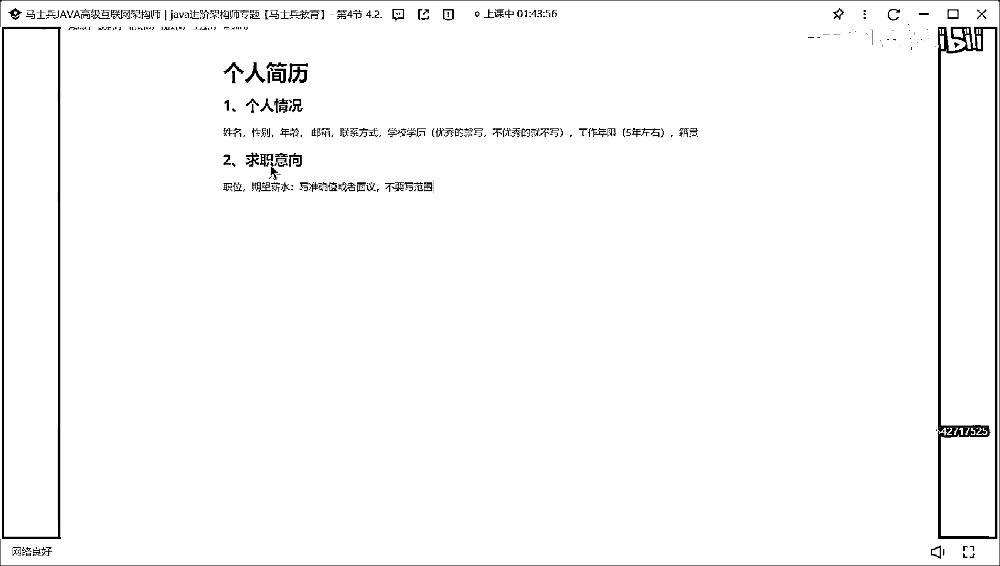

# 什么样的程序员简历一看就没戏？当代互联网HR最喜欢的简历套路有哪些？马士兵告诉你普通程序员写简历千万别太老实！ - P3：程序员简历指导：个人情况，求职意向怎么写？ - 马士兵小鱼 - BV1oP411Q73J

写简历的时候，大概要分为几个基础模块，好吧，第一个模块，叫个人情况，个人情况这个模块呢，其实非常简单，把你个人要展示的基本信息展示出来就行了，比如说姓名，对吧，性别，年龄，对吧，然后呢，邮箱，联系方式。

把这些基本的信息，首先先写到，写到这些基本的信息方式之后，紧跟着后面可以加什么东西，很多人一直问我，老师学校和学历要不要写，要写吗，注意这点啊，朋友们，优秀的就写，不优秀的，就不写，听明白了吗，好吧。

就你你是985双一流，玩玩要双一流，你就写，你是一个慢出身，你写非这样的可以不行，可以不行，我看说这个之外还有一个很重要的点，还还还还还我一般建议大家写这样的东西就极惯极惯，有人说老师我写这玩意干啥。

不喜欢干啥，就我们在面试的时候，先大部分应该在一线城市上工作，但也有二线城市的可能给你的家乡不在一块对吧，就这这这东西有可能面试中碰到你那个对应的省市那样的人，你明白吧，就是这个这个这个很重。

这个你不要觉得这东西不重要，这就碰碰运气的事，就你写上了，对你没有什么损失，不写啊，可能是损失，多意思吧，习惯有什么占不占优势的，就今天下午那个冰冰老师找我去打电话。

我那个电话打过去之后一看何必还能我上周就问他，我说你何必还在哪的，他说武安的，我说我也是武安的，就我自然而然，我就给这个学生有一种亲切感，你懂吗，你懂这意思吧，所以就这东西你加上你你加上他没啥损失。

所以该写就写，别在这扯犊子了，好吧，什么日本籍别扯犊子了，好吧，但还有人喜欢写什么身高体重没必要，还有人喜欢写东西叫工作年限，这我给大家一个建议啊，这个工作年限这个东西啊，如果你现在处于是五年左右的。

你可以写，但是你年龄特别大的，我其实不太建议你写这个工作年限，听懂了吗，不太建议大家写，五年左右的你该写写了，其他就算了，OK，这个个人情况，这块你随便写一下，其实这块关系倒不是特别大。

第二块大家可以非常喜欢写一个叫求知异象，求知，异象求知，这个求知异象的模块啊，你可以写对应的职位对吧，还写一个期望薪水，这我说一下职位就写开发工程师，你也不要去加什么初级开发工程师，中级开发工程师。

高级开发工程师，不要加这个东西，就这样开发工程师就完事了，不要加那么多东西，好吧，然后期望薪水这块还是我刚说的，写准确值，或者面译，不要写范围。

一定记住不要写范围。

好吧。