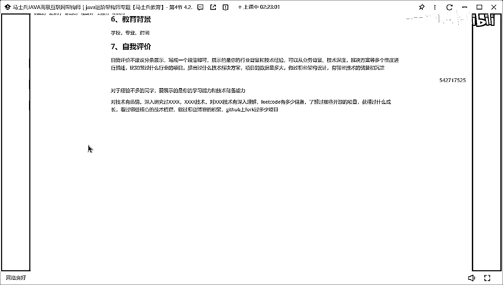

# 什么样的程序员简历一看就没戏？当代互联网HR最喜欢的简历套路有哪些？马士兵告诉你普通程序员写简历千万别太老实！ - P6：程序员简历指导：工作经历，教育背景，自我评价怎么写？ - 马士兵小鱼 - BV1oP411Q73J

第五个，教育背景，工作经历，工作经历，这块我说明一下工作经历的东西，不没必要写的特别复杂，只需要写几个东西，第一个公司名称，好吧，第二个叫时间，第三个职位就行了，第六个，教育背景，一样的学校，专业。

时间，搞定，不要写项目周期，不要写项目周期，我不建议写项目时间，有的在社会写了2022，2023年1月到，点一到2023。3，没必要，不要写，第七个，要做评价，做面前啥，嗯，自我评价，不建议。

分条展示写成一个段落即可，展示的是你的行业背景和技术经验，可以从，又被讲，技术深度，解决方案等多个，唯独，不，进行了，描述啊，比如，做过什么行业的，项目提出过什么技术解决方案项目的，数据量。

不大做过哪些，加购，设计，有哪些技术的储备和沉淀，这样行吗，把这东西还OK了，当然咱们这儿一定有一些同学是应届毕业生吧，我问一下，对于没有工作经验的同学，这怎么写，没有工作经验怎么写，能写吗，咱们。

写啥，告诉我写啥，肯定可以写，没有工作经验，没有实际经历怎么办，日来加班，不要再写了，对于经验不多的同学，要展示的是你的学习能力和技术储备能力，所以这块怎么办，比如说对技术有热情，怎么有热情呢。

深入研究过XXXX技术，对什么技术有深入理解，是吧，你的code有多少，储备，是吧，做过哪些，了解过，哪些开源的，项目好吧，获得过，什么成长对不对，然后看过哪些核心的技术，初级做过哪些博客的，积累。

行不行，给他吧，复刻过，多少，项目，这不可以行，你看吧，就你的学业能力，展示你的学业能力，学太多就OK了，不是不是应届生的话，然后展还是要展示你工作相关的东西，如果你不是应届生。

还是要展示你工作相关的东西，你把你工作相关的东西展示出来，好吧，是，不会这个简历里面要描写的东西，啊。

参加这个方式去把你的简历好好去认识好。