# 什么样的程序员简历一看就没戏？当代互联网HR最喜欢的简历套路有哪些？马士兵告诉你普通程序员写简历千万别太老实！ - P7：程序员简历指导：认知篇（写好自己的简历有多重要？） - 马士兵小鱼 - BV1oP411Q73J

好了 讲到现在了，咋样 有收获没，有收获了 磕个一呢，有收获吗，这儿，最后给大家普及一些认知好吧，这很重要好吧，听好了，咱们有很多同学不太愿意包装经历，我有一些同学啊，老师我不太 内心里面过不去这个坎。

我不太想去包装我的经验，和包装我的简历，这样记住我说句话，简历是三分针，任何人都是要包装的，你愿意也好，不愿意也好，这件事都是必须做的，你不要嘖嘖，老师我实在我就按照正式情况去写，你要按照正式情况去写。

我告诉你百分之一百万没有机会，听明白了吗，项目写几个合适，没有各须要求，三个吧，三个左右，一百三个左右，我看，这是第一件事，第一点，大家需要注意的，第二点，简历的包装，和修改，只是，一个技巧，没有吗。

最本质的，还在于自己的技术，所以还是那句话，技术才是王道，就跟我刚才写的，一样，我给了你这个东西，有几个人敢这么写，我这么写有几个人敢这么写，有吗，我写出来，你们可能都不敢写，你懂我意思吗。

就是你如果你觉得你这样去描述你的技能，描述你的项目的话，你会有面试机会，一定会有，但有多少人敢这么写吗，不敢，所以当你真正的具备这样的技术自信和这样的技术底气的时候，你怎么写，当你不具备的时候。

往先苟着先苟着，听明白意思吧，所以一定要这样，还有一点，第三点，切记侥幸心理，切记侥幸心理，什么叫侥幸心理，不要想着碰运气去找工作，能懂意思吗，现在机会很可贵，所以，在技术没有储备好，简历没有。

修改好的情况下，不要去随意，投币，懂意思吗，哇，这儿要注意了，一定要注意，别去浪费这个机会，别浪费这个机会，这个机会很麻烦，好吧，QPS编写的范义比较合理，这个东西啊，我看你的项目。

你的项目是业务是QP的还是QC的，QC的话才会有QPS，TPS相关的东西，QP的话就没有了，明白吗，你的项目背景能不能扯QPS，能不能扯TPS，这都很重要，我们有一套科学的计算方式。

设计的方式告诉你设计多少东西是合理的，行吧，好了，这是想给大家做表述和阐述的东西吧，就是说破天呢，还是那句话，任何时候，这东西才是最本质的，所以呢，希望大家每一个小伙伴，好吧。

详细的去了解一下你的技术储备，当然了，我之前在上咱们的面试推进班的时候，也给大家做过一些面试前的心理辅导，我把那个画截出来给大家看一下，好吧，这是之前我在讲，特别是在上课的时候，写的这个一般的内容。

好吧，这块有一个心态方面的东西，我这给大家说明一下，把这东西，找工作的时候有些心态你需要了解，好吧，第一个面试前一定要调整好心态，不管你会多少东西，干就完了，出去面试就有心态，老子天下第一，自己超快。

常常发挥，听明白意思吗，就很多同学呢，出去面试有种感觉虚，当你准备去面试那一刻开始，不管你多虚，内心里面都给我把这个底气给我升起来，要不然的话，你很麻烦，好，这就是第一点，第二点得失心不要太重。

全中国企业有很多好公司有很多，没必要在一棵树上去吊死，你可以有心仪的公司，你到最后等你准备充分了，再去面试，但不要觉得说因为一家公司换头换尸，大可不必大可不必，好，第三个找工作永远不能准备好，老同学怂。

心态不好，不敢去面试，我要准备按照你的技术储备，先尝试一些公司，好吧，面试过来之后做好总结，做好准备，不但复盘，请你也参与成长，好，这才向大家说的一些找工作心态方面的东西。

因为现在很多人其实心态是很焦虑的，我现在是很恐慌的，所以我希望大家还是把心态去调整好，因为你只有把心态调整好了之后，你才能够在面试的时候发挥出你自己正常的一个水平，正常的一个水平，这点很重要，OK。

大家现在对于这个这个简单我们就聊这么多了好吧，因为毕业生技术不够，现在专心技术没有实际的开发经验，像我们能找工作吗，能，因为你在学习的过程中不单单是学技术，也会学项目，和睦同学听明白了吗。

就你不单单学技术，你要学项目，我还是那句话叫技术服务于项目，项目加持于技术，懂意思吧，好吧，此人考虑到自学一遍了，为了应付面试，但平时项目都是没用，我该怎么包装，想办法把你的单体项目拆分成微服务项目。

这是你必须要做的，一定要不拆分，上一份工作五个月，其中其他工作两年以上，这个五个月是写的，要写，要写，要写，最近一份工作五个月，这是必须要写的，因为不写的话，你的世保记录很难过得去啊，所以这是要写的。

我看，这样啊，我希望能给大家再说一个心态上的事啊，大家觉得，就有多少同学对这个行业抱一个悲观心态，给老师扣个一，我现在心里很焦虑，对这行业抱悲观心态，同学给老师扣个一，所以下面我想说一说一些话。

我希望大家能把这个话呢，记到心里面去，我知道呢，最近很多同学找工作不太顺利，或者说面试不太顺利，我压根就没有面试机会，有这样一些心态，我也收到过很多同学类似于这样的一个反馈，就这样的反馈。

所以在那天有一天晚上呢，我发了个朋友圈，朋友圈内容的又有很多，等我一下，就我发了一个，哎，操是怎么看，就我自己发朋友圈，内容很多不带大家看了，不带大家看了。

然后这个我这个微信号上面基本都是我们的VIP同学，我想给大家看的是什么，是我们的VIP同学对于现在的行情所持有的心态是什么样子的。

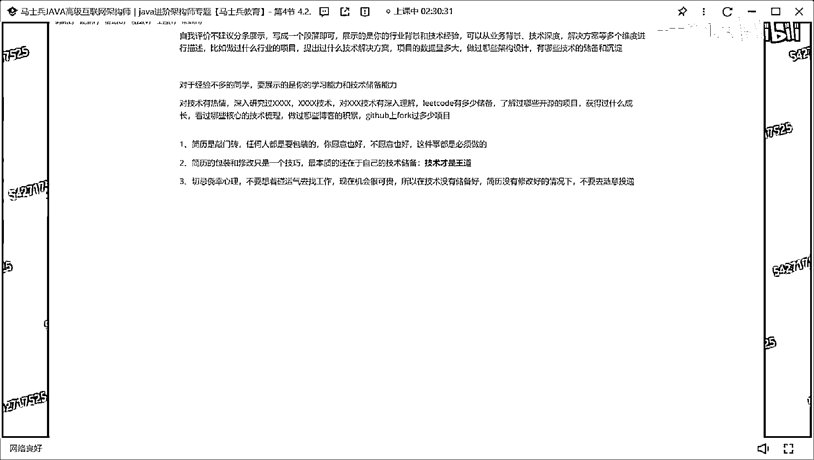

我希望他们的这些回复能给到你一些。

安慰或者一些建议，这我当时发朋友圈，这是很多同学说的话，他说其实行情不好的时候积累就成了，就像冬天的花扎根和活着，但是一旦春天来了一下抽条了，对吧，他说我给压的自己压力太小了，要加压了，然后说说的好。

那老师好吧，然后说了刚进来的裁员凭运气和一点实际找到新工作，工作三天多了，感觉自己身上白纸反思了，确实自己给自己压力少了，必须加压，否则就会被淘汰，后来还有很多同学的评论，老师每天忙着做工具人。

没有时间沉淀，每天七点起十点归，您这凭经济到了没法突破，天天看面试题，一开始就没办法，还是要出去面试，在没有我跟他说了，我说在没有更好的选择之前，他是处于自己，我来自于不足反复进步。

想办法把效率提升起来，临时时间学习，所以说的打铁还得自生硬，继续训练内功，就还是那句话，朋友们现在行情差不差。

确实差。

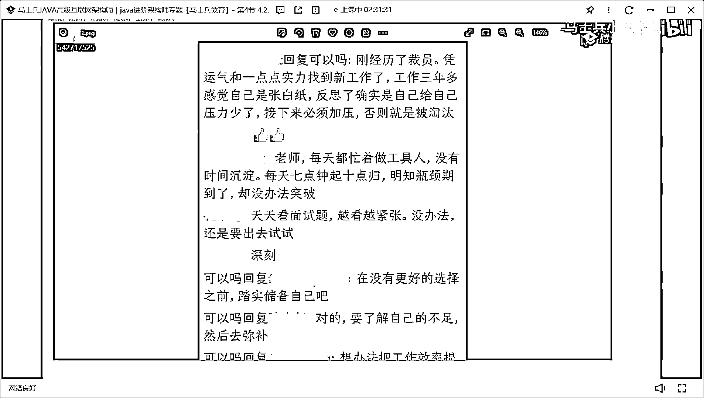

这东西不用我说，大家每个人都有自己的心理感受和自己最真实的一个体会，但是对于这种差行情，你要想的是什么，你要跟很多人一样一起去抱怨行情吗，你要跟很多人一样一起去想着这个行业怎么怎么样了吗，不要这样。

因为你在短期之内，你是不会不会去转行的，听明白了吗，你是不会去转行了，所以说过今天，你现在还是要坚持做开发这件事情，那你所瞄准的矛头是什么，就是如何去突破现在的困境，怎么突破，非常简单。

你看看你现在的技术储备和现在市面上在招人的公司，他们的要求到底差在哪了，你是否知道自己的差距，当你知道自己的差距之后，去做了对应的弥补和提升之后，你就可以去成功，你就可以找到工作。

这个市场上面并不是不缺，并不是说我不缺人了，很多公司在招人，只不过那个人不是你而已，包括我那天发了朋友圈之后，有很多人也也也，我本来那天晚上是自己发着玩的，咱们有很多资讯老师也转发了我的朋友圈。

然后有很多人在底下说了这样说了这样一些话，我也可以解解给大家看好吧，他说这个百里挑衅是你，这是什么虎狼之词，他说是这样，说网络上一直在制造焦虑，建计行业是产生资本最高的行业，不存在什么不行。

如果说这个行业不行，是也就完蛋了，他说天下二人加班就是缺一缺人，分明一个人干不完，他就是不招，非让一个人干当黑工干几个活，那样肯定不招人了，招人少，老板都在不想多花钱，资本压迫才是本质所在。

就是我看到这东西的时候，甚至还有同学发一些更更好玩的，看这个好POA，他说我发的东西是POA他，他说现在没错，现在大家找工作都难，但是企业有招聘的时候同样很难，免得大家能简易投并，真正适合简历百里挑衣。

现在企业并不是缺人，缺的是真的有能力的人，但绝大部分同学太浮躁了，只是一心追求高工资，却忽略了自身能力的提高，就我希望大家把这些话，听到心里面去，这东西不叫POA，我POA也没有意义，你也不会给我钱。

你也不会给我干什么事，我是想法是什么，但我们都知道难，就他这个东西已经是一个现状了，对于这种行情难也好，什么东西好，你能改吗，谁能告诉我，你能改变行情给我扣个1，有人改变行情吗，改变不了。

咱们谁也改变不了，对于咱们谁也改变不了的事情，干什么事，我之前说过，把时间，和精力放在，你能改变的事情上，什么叫你能改变的事情上，你的技术，你的能力，这是你能改变的，那天上课我们聊了一件事，叫小时数。

我问你个问题，大家觉得学多少小时数，可以保证我在这个行里面找一份工作，学多少小时数，可以保证你在行里面找一份工作，学多少，300，就是你投入学习的时间，就是你投入学习的时间，你们每个人冷静的分析一下。

你在搞技术这件事情上面，你到底投入了几个小时，你投入多少时间，你们现在问，你真正有意义的学习时间到底有多少，你真的好想想，当你找不到工作的时候，你反思一下，我有没有学到足够的技术。

我有没有处到足够的能力，当你的能力满足不了公司需求的时候，你找不到工作的时候，你去抱怨市场，你不觉得有问题吗，最关键的是你的抱怨带来不了任何积极的影响和积极的效果，会让你越来越颓废，越来越难受。

我举个例子，比如说，有多少人听过我讲圆满的课给老师扣个一，有之前讲过圆满的课，有多少人听过给我扣个一，有人听过吗，这俩人听过，嗯，很多人一直好奇，老师，圆满课，你花多长时间准备的，或你花多长时间。

你学四分圆满的，我之前给他举个例子，我说圆满的时候，我在VIP课里面，我讲了七十个小时，对吧，我老师讲课是要备课的，对不对，那么我备课，我乘以个四倍的时间不过分吧，有时候花了280小时时间去备课。

我自己想把这东西了解清楚理解透了，我再乘以个四倍时间不过分吧，1120小时，我问一下，你拿出这个时间了吗，如果你没有拿出这个时间，凭什么你觉得你可以把圆满搞透，凭什么你觉得可以把圆满学好，不讲理了。

都不讲道理了吗，你懂意思吗，所以还是那句话，我们现在难不难，难越难的时候，越要沉住气，咬牙坚持，越要想办法，我如何去突破供局，而不是跟很多人一样发牢骚，行业不行了，我要转行了，你告诉你转哪去，转购。

语言生转啥转拿出去，你告诉我哪个行业不卷，哪个行业找工作很轻松，你告诉我，你给我说说，我也去，没有这样的行业，稍而变是兴趣类的，明白吗，你是没办法通过稍而变成你去变现的，你怎么赚钱啊，当老师。

当稍而变成老师，全中国干稍而变成没有一个不会钱的，明白意思吗，就想明白现在自己该做的事情到底是啥，把该要做的该处的东西，你都储备好，该学的东西都学好了，你再去报应，你说老师我现在真的很牛逼了。

我比你们马思明教育的每一个都牛逼了，我现在一天找不到工作，你过来告诉我报应行行，我认当你的技术还太的，跟个渣渣似的时候，你说老师现在行情不好，我并不认可你说这句话，我觉得你在无病呻吟，明白吗。

最关键是这种负面情绪会影响很多很多人，所以我希望大家每一个人正向起来，能够积极起来，能够朝着正向的方向去看，因为别人都告诉你说劝你要转行，有没有人告诉你说你转行什么行业能收获高薪啊。

谁也给不出这样的方案，所以你现在在做的事情就是你最应该做的事情，踏踏实实的把你该做的事情做好，就很简单，那我今天讲课这些例子来说，就这些技术，你说你不知道，你知道吧，有几个人花时间真正的琢磨过和研究过。

你自己不去花时间花精力去研究和琢磨，这玩意儿你想拿高薪，你想找到工作凭什么呀，虽然周老师那句话，你是对渣打这个行业太不尊重了，这行业给了你那么高的薪水，你反而不投入学习，你可以拿那么高的薪水凭什么。

这属于不劳而获，他没道理，你懂吗，所以所有的回报都是你付出的结果，你得先付出，你在没付出之前，因为你没付出，所以没有结果，所以到后你骂市场，你不有问题吗，就你喜欢的姑娘一样，你连追都不追。

你告诉你告诉我，我姑娘真他妈傻，我这么好的人都看不上，你干啥了，人家就看上你，同样道理，所以这些话就说这么多吧，言尽于此，每个人呢，想明白自己应该做的事情，往上那句话，以后找工作可能会变得越来越难。

但是这个行业里面依然会有很多的高薪，但是你要想办法确定的事情是什么，那个高薪的人到底是不是你啊，这个东西现在行业所带来的这种动荡也好，这种行情差也好，说白了，他在进行行业洗牌，因为太多的人进入这个行业。

太多的人两有不齐了，太多的人摸鱼烂鱼充数了，这样洗一下也挺好，洗完之后就会把真正适合这个行业里面的人留下来，而不适合的人淘汰掉，特别是有很多，不学习的，有很多年龄稍微大一点的，有很多混天的。

这样人可能都会被淘汰掉，所以每个同学希望你们能抓紧时间来学习，所以你怎么学，你自己选择方式，你可以自学，也可以学习马生命教育的方式，你觉得选择你自己最适合的方式就行了，但是自学有什么劣势，我这不强调了。

你自己选择，我还是希望能找到一个最高效，最有效的方式，大家来学习，来抓紧时间，沉淀储备完成你自己的这种技术上的这种跃迁，这才是你最应该做，好吧，行了，聊这么多吧，好吧，非科班也要学，一样啊。

非科班也一样啊，这把你，你如果是非科班出身，意味着你的专业更差一点，所以这个时候就又要展示你技术优势和你项目的优势，好吧，好了，我今天晚上也聊了很多了。

也说了很多东西了。

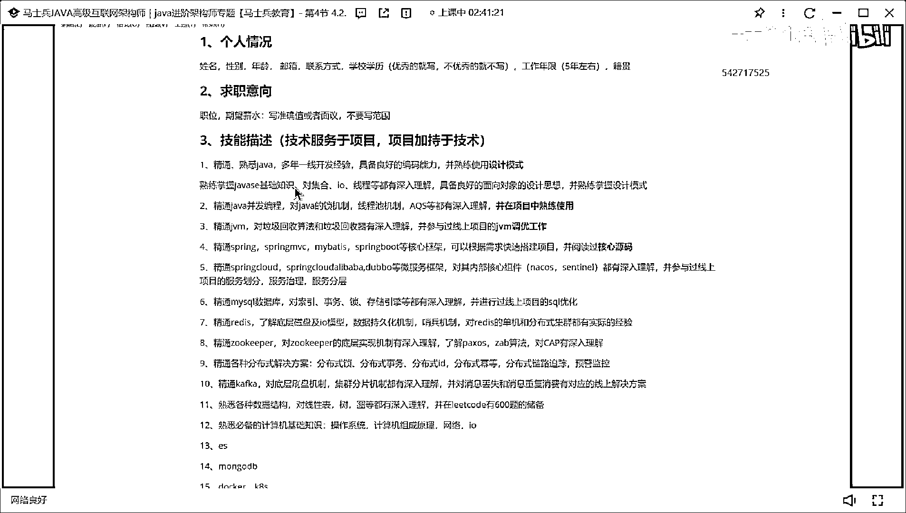

好吧，然后，校级都催我了，没打广告，好吧，简单的说一下，就是马师门教育有一套MC的课程，是来帮大家进行这种进阶和提升的，大家如果有需要的话，可以找一下咱们的咨询老师，这样一个SMAD的文件。

这个文件的是我们的大纲。

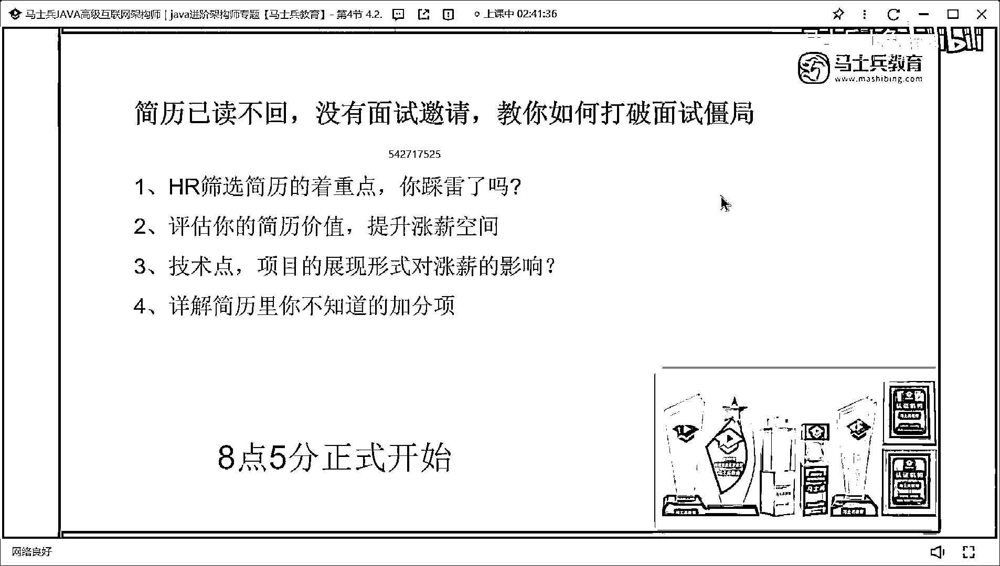

大纲里面的就是展示我们的VIP同学，在马师门教育入学之后，他所要进行储备和学习的相关技术点，当然东西可能有很多，大家去详细了解一下，我还是那句话。

不管你报课不报课。

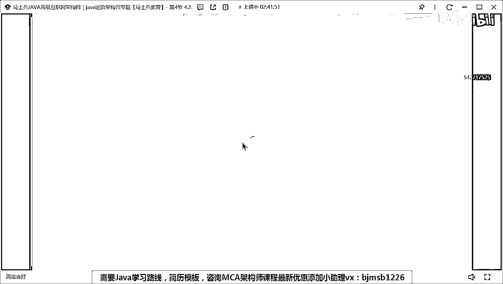

我希望你把这个大纲去拿走，因为大纲我们老师花费了很多时间，精力去琢磨。

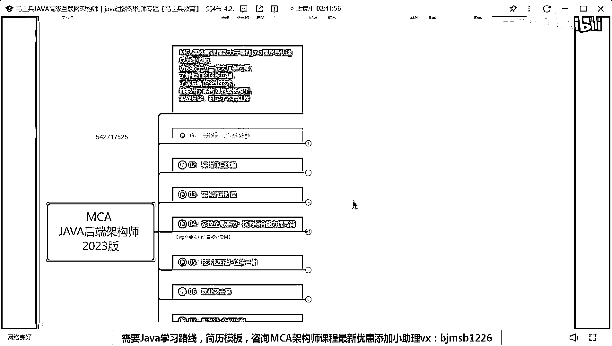

去研究去探讨啊，这里面我们给每一个具体的技术点标注了时长。

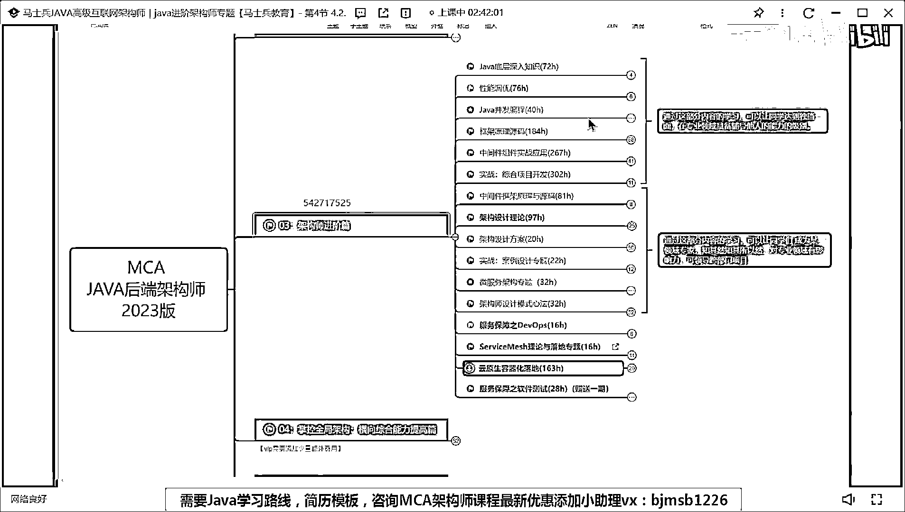

并且标注了对应的技术难度，所以有需要这些内容，同学有需要的找咱们咨询老师，有咨询老师联系方式的直接找他，没有咨询老师联系方式的扫一遍扫码加一个，当然也不要把它理解为说老师，你们不就提供一门课吗。

真的不是一门课，他提供的是一整个完善的服务体系。

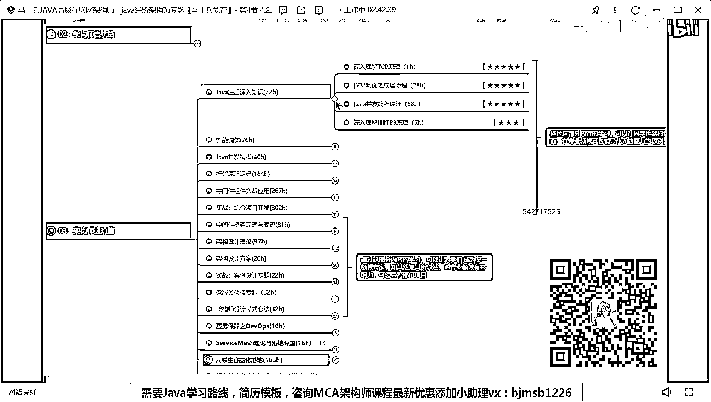

一会儿来详细跟大家聊，好吧，那么，完了，下面我要说一下，很多同学觉得三四月份比较难找到工作。

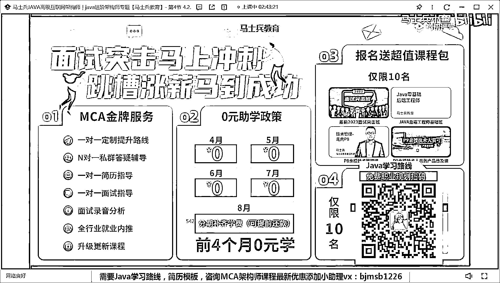

其实我手里有好多找到工作的同学的成功案例，我可以给大家做一个最基础的分享，有人想看吗，有人想看吗，就最近找到工作同学，给他给你们点信心，给大家看一下好吧，这是一个学生在听周三的时候。

这周三说当上了开发经理，加入干他的状态其实跟你们的状态是非常非常类似的，我会给他看一下我们两个整个沟通交流的过程，好吧，这些人找工作也找的很很艰难，真的很艰难，他说了，在在在三上告诉我说投了两百个简历。

只有两个面试还收到这样的回复，小团队给他回复，然后呢，我跟他有个面试录音，我说我要听录音，他说问题什么样子说了一堆，然后最后来了一个结论，结论是什么，他说，我就担心我上一份工作不是互联网的。

最后一份开发，我上一份工作可能是互联网的最后一份开发工作了，后面我就要转行去卖煎饼果子了，我说你抓紧时间储备技术，然后面试前面是一甲不至于，我说卖什么煎饼果子，然后在后面的某一天，老师们突击班。

这是几号，星期一的时候，就这周一，老师们突击班的效果棒棒的，今天面了一个20K，也有一项领导也谈了，带团队，这东西都好了，我说还卖煎饼果子不，他说副业煎饼果子可以搞搞，我说继续学习，补全自己的技术体系。

在南京，能拿着这个东西，这个这个这个offer，他今年，我问你马上看好吧，老板新项目做教育方向的，你现在做医疗的好吧，晚上看，我说要沉淀自己有信心。

大家看我说我说你今天多大了。

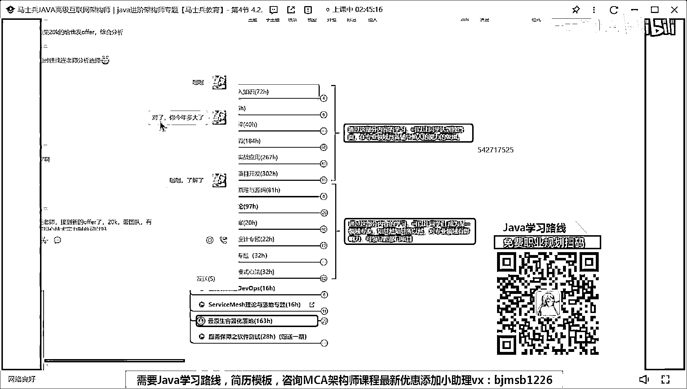

我来截个图，我名字隐藏一下，就接这个就接这块东西，我把这个头像打个码，这边会有名字，我这批一过来。

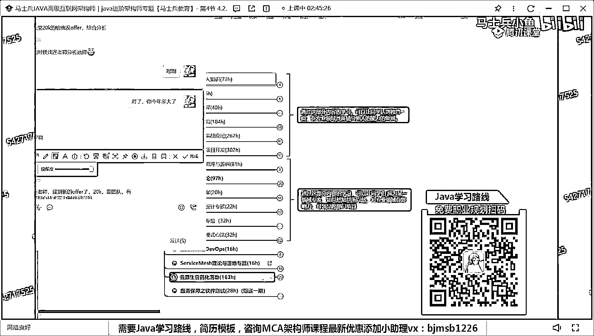

他今年37岁了，在南京，老师说到新方法，20K的团队有点单身技术实力，我说先入再说，没准没啥问题呢，还没开始干有啥可担心的，37岁是年轻，看不懂这种看法，你要沉住气，你要有自己的技术储备。

你要想办法去获得这些成功，懂意思吗，这是你应该做的好吧，看这个四月份的，梁老师迟来的起爆，那个H2找我聊了33K，给我压了31K成15新，比我预想的少了四万，现在右方向没变，还是物联网那套钱少了点。

但是现在大小周双修什么之类的，好吧，感谢老师指导，没有你和马时彬团队的其他老师指导，肯定找不到这份工作，课程我几乎都入了个门，后面跟着你一起学习，共同进步，这份工作呢，看了吗。

就是大家总觉得说我找不到工作，再看这个三月份的，梁老师周老师你们太强大了，我上周五去深圳现场面试一个面试，闷了一个多小时，你们谢成池JVM Redis ES，Mysql，RockMQ，RobinMQ。

Kafka，CAP好吧，按照你们之前讲的技巧搞定了面试完，周末催周等上去，又有新工作，不至于吃鱼吃夜，感谢你们课程强无比，梁老师你们讲的太好了，大神果然不一样，这两天记录都有时间，看了吗。

所以你要想明白你现在缺的到底是啥东西，想明白你现在要补团的技能是啥，所以我说了，我说马时彬教这个课给你带来是什么，不单单是说我给你买一套视频课，你看视频就完了，不是这种更多是什么。

是我们底下全程的这个配套的服务，每个学生报名之后，我们会先做这种学习规划，对每一个学生都会做学习的规划，因为咱们现在学生每个人的学历，年龄，城市，薪资什么东西都不一样，所以不可能有一个统一适配路线。

所有人都统一，不可能，所以我们会给你做路线，量身定制这个路线，好吧，同样的你在学习过程有任何疑问，老师会给你做答疑，对吧，面试前给你做简直知道，好吧，做你去面试的给你做录音复盘，有人好奇这个录音复盘吗。

咱们有我问一下，咱们听课同学多少同学做过录音，做过录音复盘，你自己做过录音复盘，有老师扣个一有吗，有没有做过没做过的扣二，有吗，你做过对不对，我给你看我怎么做的好不好，这是最近前两天，三月份吧。

你去做一个三月份，我喝下要不就这东西，我一样给你看来人记录好吧，不给你整个截图好吧，你们总说没有面试机会，你看看他有多少面试机会好吧，这次路线刚开始是前面是做了，前面是做路线的工作，现在是做路线的东西。

不看了好吧，做了现在之后，面试录音复盘，下面这个东西，怎么去做录音复盘的告诉你哪有问题，怎么去回答，怎么去做表述，你知道他有多少人多少面试吗，刚刚是一个对不对，这是后面给他改简历的过程，这句马上翻好了。

但是第一个面试录音复盘，两个，三个，四个，每一个录音后面都有很多大量的回复，中间打一个解答这个面试的问题，五个，这中间老是答疑的过程六个，看到了吗，你看你看这东西了吗，就是改完简历了。

把你该做的事情做好了，那肯定也不会有面试，可也不会缺面试机会的，懂我的意思吗，所以这些都是要做的，就是你要不断的成长自己，不断迭代自己，这是你在需要做的事情，而且你要把自己的能力去展示出来，这样的话。

你不会重建是机会的，而你们现在所欠缺的其实就是这方面东西，懂我意思吧，现在比试多不多，这看公司有的公司要求比试，有的公司不想去比试。

就看情况。

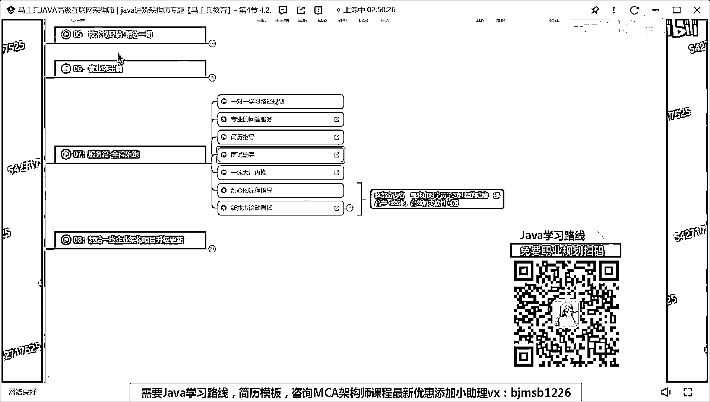

所以我还那句话，对于现在想换工作的，或者已经离职了。

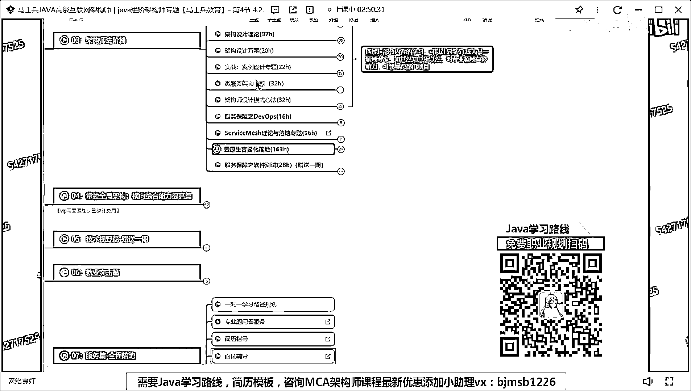

哈，固定空窗期的同学，你现在不要去投简历了，你给我踏踏实实的完成自己技术的储备和成变，等你把自己的技术储备成变好了之后，再去面试，再去找工作，那个时候你的成功率才会有，而如果你只是盲目的去投简历。

我告诉你，你基本上没有啥机会，我想明白每天自己应该做什么事，我想在这个阶段我应该做什么事，把这些东西你都想明白，就这样的话，你才会获得更高的成长，最多成长机会，要不然的话完蛋了，好吧，行。

我觉得别的不多说了吧，应届生怎么办，应届生如果想进入这个行业，永远记住，你首先要保证自己的技术储备，可以做一个独立的开发工程师，首先你要先想办法覆盖你的技术宽度，当你的技术宽度覆盖好了之后。

再想办法去加深你的技术深度，你如果作为应届生，刚看简历的很多学生，像咱们刚刚看简历很多学生里面的一个简历，如果你们的简历都写成那样，我告诉你，你连面试机会都没有，怎么说通过普通通过，面试机会都没有。

现在市场上有大量的人，所以你要想办法在这批人里面脱颖而出，那这里面就涉及到说我要怎么去学，第一种方式你自己学，有多少人在B站看视频，一嘴巴，对吧，今天看点这个，明天看点那个随便看，你真的思考一下。

你看了些东西之后，你学会多少，你掌握了多少，你理解多少，几乎没有，或者很少，你需要做的事情是什么，跟着他们好好学，有体系的学，成长起来，把你的技术体系真正处理起来，这你应该做的，你现在有人说老师。

你们学的太贵了，我是花我不舍得花这个钱，我告诉你，你现在是要通过花钱买时间，你可以自学花两年三年自学，你这么学完了，我告诉你花花太多粮了，懂意思吗，我们的课卖成这样，这么多人买，为什么。

他有他自己的价值和含量，这么多同学来购买课程，不说别的，马上就要光光光网站里面，有张就业喜报。

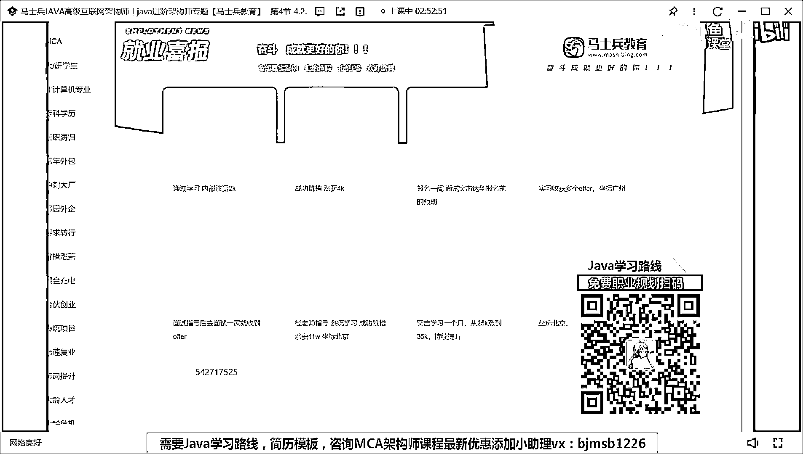

这是找我们汇报就业喜报的同学，这是进度条，你看看光这些同学有多少人跟着我们学了，你再想想你自己，你差在哪儿，能懂意思吗，有的学生学了几万个小时，我学了几千个小时，你想想你才需要多少，能懂意思吗。

所以这个人的差距就这么拉开的，你要想办法在短时间之内，你也不要别人差距，你主要耗费的就是钱，花点钱买课，我一样就是老师我没钱，我就自学，没关系，你自学去，对不对，选择你最行之有效的方式来学习。

还是一句话，马生病教育教育带给你的是什么课程服务，我来保证你在短期之内或者最短时间内达到你的目标，懂这意思吧，就这些买课的学生找我们汇报喜讯的学生，他们都是傻子吗，他们学完课之后达不到效果。

他们会找我们汇报喜讯吗，这里面任何一张图，你随便可以看有一堆，明白吗，一堆他们他们又不是傻子，涨工资涨两千内部涨薪，对不对，还有一个学生，我都忘了学生了，那些叫啥来着，还有学生学生。

那个记录我要给你们看一下，就那天那个学生跟我说了挺好的，叫叫叫，就啥来着，这些呢，都三个小时说了，今天今早看了老师的发文，我深有感触，市场上虽然卷的厉害，但是只要有技术是能力帮身，面试是没有什么问题的。

这次面试我投了有160家公司，大部分因为非同招本科挂掉，其中提交过几个有20家，难道面试机会的有三家，这三家都到了二面了，而且拿到其中一家的offer，有一家二面因为学历挂掉了。

我觉得是能技术能力足够努力的提升，投资一下自己提交面试机会，肯定会蜕影而出，本来想入职新公司之后来报喜来报喜的，看了梁老师的发文，忍不住跟老师感慨一下，我之前的当前薪资是17成15。

拿到offer是24成13，听明白了吗，7月27日人事查的时候觉得我得个税，个税可以谈的更高，听明白了吗，感谢各位老师的支持，感谢梁老师简易指导，感谢马师傅教育的课程，看到吗，多亏马师傅教育的课程。

涨幅薪资有40%涨幅，不然我不会有这么大的提升，听明白意思吗，就是就就这这这这些东西，你当初报告不能梁老师原版课来的，看了梁老师讲原版课，学了的知识调达好多面试官，感谢梁老师，就这种东西。

你说你不学或者你不想投心精力投时间进去，他不可能达到，就我讲原版课，你说老师你把你给梁老师共享出来，凭啥，我花了一千多小时琢磨出来的东西，我免费分享给你，我凭啥，换句话说，马师傅教育是一家公司。

它不是一家慈善机构，这有老师要生活，老师有自己的孩子妻子，他要生活，所以你要理解知识付费这件事情，同样的你所付出的时间，付出的精力，付出的金钱，最终都会换成等价东西回报给你，换来是什么，你薪水涨幅。

而且不是长期薪水涨幅，是短期内薪水涨幅，那后面再长期学系统学，你会获得更多的成长和提升。

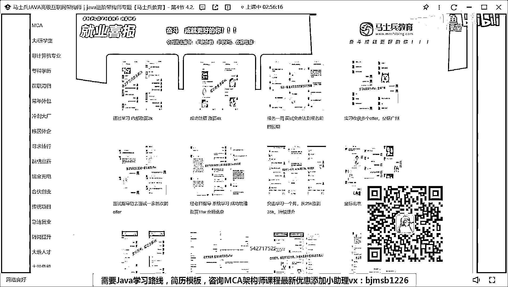

请不吝点赞 订阅 转发 打赏支持明镜与点点栏目。