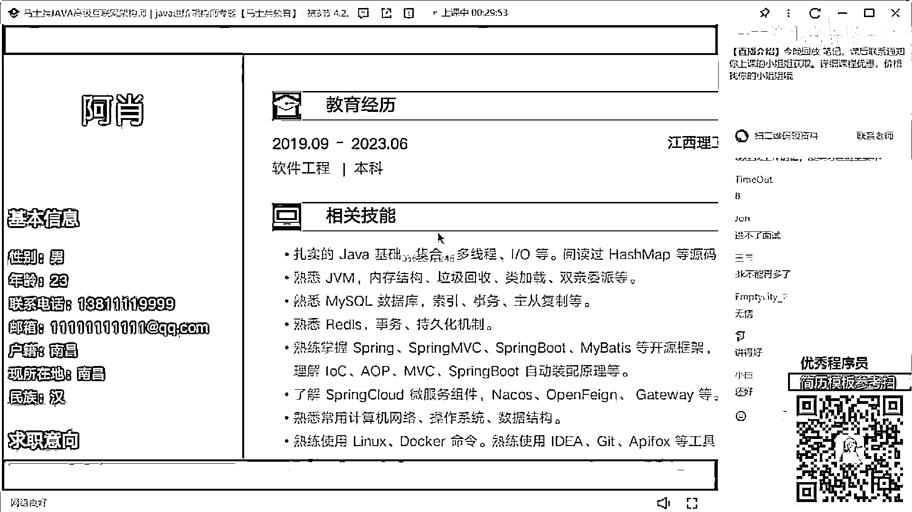
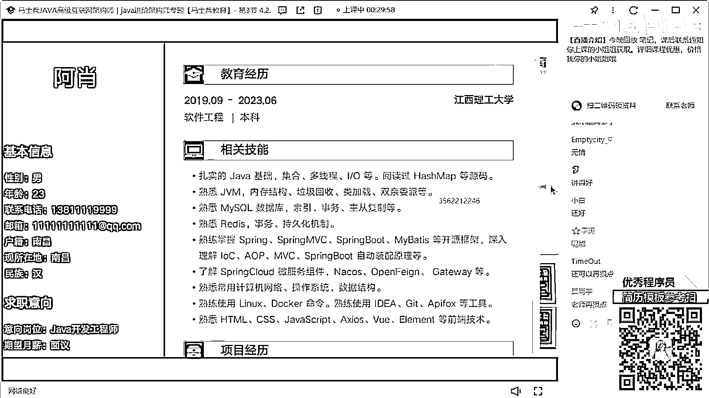
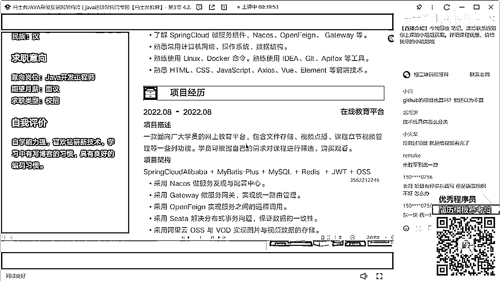
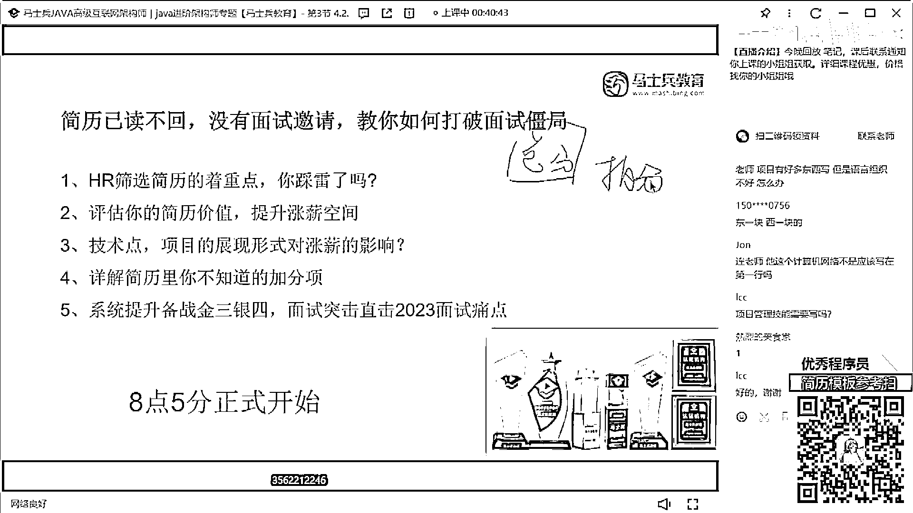

# 什么样的程序员简历一看就没戏？当代互联网HR最喜欢的简历套路有哪些？马士兵告诉你普通程序员写简历千万别太老实！ - P9：【敲重点】科班应届简历指导 - 马士兵小鱼 - BV1oP411Q73J

來看這個同學。

這個同學在嗎，再回來扣個1來，還好是吧，在嗎在阿蕎同學。

太輕了，在嗎，最好知道是誰啊，阿蕎，Linger是吧，來看一下這個同學，他的勤能情況，23年畢業，應屆畢業生，今年6月份大學畢業，然後呢，技能有張牙基礎的，HashMap的，JVM的。

Mesacode的，Redis的，SpringBot的，SpringCloud的，然後Linux Docker，前的這些技術，項目經理，在線教育平台，然後技術架構是這些，主要職責是這些，然後江理論壇。

是一個網上教育平台，什麼之類的，通過的，通過的技術，有SpringBot的，Redis的，SubuElement的，自我評價，資訊能力強，先說一下，他作為一個應屆畢業生，他會受到面試邀請嗎。

如果你們是面試官，你們會給他面試邀請嗎，會啊，這個簡直裡面有什麼問題啊，聽好了，從目前你所展示的，這些技術站上來看的話，其實比很多應屆畢業生，要強得多，要強得多，但是這裡面，依然有很多，對應的一些。

短板的描述，沒有加進來，大家把會打在公屏上，也要是語色，我也沒說不會啊，對不對，我說了，這個技能描述，從這塊來看的話，可能還不錯，但是這裡面缺少一些技能描述，比如第一個，並發編程沒有加進去。

第二個MQ相關的技術，沒有加進去，然後我希望大家，所有人注意一件事，不要在簡歷的技能描述裡面，出現一個東西叫了解，因為了解等同於不會，聽懂了嗎，所以不要加了解這東西，沒有意義，然後你要突出什麼東西。

你現在大學生，這塊東西重點突出，計組了，網絡了，操作系統了，對吧，這個東西可以突出，數據結構單獨拿出來寫，包括你對於算法方面的儲備，單獨拿出來做一個描述，那麼緊跟著，在你的項目裡面，要把你上面設計到的。

所有的技術，或盡可能多的技術，要把它給覆蓋掉，這寫了一個在線教育平台，你的時間是2022年8月到2022年8月，是怎麼完成的，一天，一個月，一個月搞定一個網上教育平台，就如果你們在大學期間。

沒有這樣辦理了一個實習經歷，或沒有這樣辦理了一個工作經歷，但其實沒關係，你可以把它說成，你在你們學校的教研室，老師組織的教育，什麼研究室裡面，可以做這個項目，但時間週期，要把它給排好。

同時你要詳細的去解釋清楚，裡面到底包含什麼內容，懂意思嗎，這項目告訴他是一個在線教育平台，那在線教育平台裡面，應該包含什麼東西，第一個直播內容，第二個錄播內容，第二個第三個課程展示，學員管理。

這個東西可以寫，你是不是可以加上，這個在線教育平台，已經包裝成，你在教研室給外部企業用的，你們老師接的私人的項目，這項目目前已經在用了，某種平台找一個小型的這種教育平台，把它給寫上去，是不是可以。

包括你們能不能加一些數據量，目前滿足多少人同時在線觀看視頻，加一張平方碼，就可能實際上這個項目還沒開始投產，沒開始上線，但是你們在一開始構建這個項目的時候，裡面其實已經準備了這樣的一些預處理工作。

他可以扛得住這個東西，如果扛不住怎麼辦，動態控訴容，是不是可以把這個加一下，但作為一年畢業生，老師一年畢業生，我有表寫到這個程度嗎，有，還是那句話，你要展示自己的優勢和價值，這是這個項目。

然後下面這個職責寫太少了，需求分析，數據庫設計，代碼建法重構，然後什麼項目代碼開發和接口測試，你寫跟沒寫一樣，你要寫的是，我用什麼技術實現了什麼樣的功能，遇到了什麼樣的問題，怎麼解決了，懂意思嗎。

下面項目也是一樣的，這項目說白了，就類似於是你們學校裡面的一個課題小作業，和類似於一個畢社的一個東西，這個其實含金量就不是那麼高了，最好再加兩個，哪怕是找一個開源項目，你最好能夠寫進去。

突出一下你自己的項目的實際開發能力，和你實際的這種編碼的能力，怪小樣說，吹的越多死的越慘，是你不吹連面試機會都沒有，你是選擇在面試中被捶死，還是選擇，連面試機會都沒有，你自己挑，就很多人一直抬槓。

老師這塊我能寫精通嗎，技能我能寫精通嗎，我寫那邊寫那麼多，問到我答不上來怎麼辦，我覺得大家可能都想錯了，為什麼，你連面試機會都沒有，你啥都會沒有面試機會，你告訴我你會那會那會那會那會幹啥，就是你要記住。

在你本人的技術知識的儲備之上，適當的去誇大一些東西，適當的去包裝一些東西，讓你能夠更多的被別人看到，你的價值和能力，先把面試機會拿到了，拿到面試機會之後，哪怕沒過，最起碼說我面試了。

我知道我自己哪有技術短板，我應該如何進行查漏補缺，我最起碼長了面試經驗了，你天天照實寫，寫的非常樸實無華，寫的非常誠懇，非常認真，你沒有面試機會，對你的成長在什麼地方，懂意思嗎，所以這東西啊。

我希望大家能認同這個說法，我不會坑你們，坑你們對我沒有意義，我不會坑大家，懂嗎，你按照我的方式去做，可能你內心可能大學剛畢業學生，你可能內心不太能接受這個東西，但是為了生活，你必須要給我接受。

人該低頭的時候就要低頭，老師我就想照實寫，我就不想包裝，我就想說這個實際的，你等著沒工作吧，懂意思嗎，市場要求是這樣的，你必須這麼幹，我還是那句話，你打不過別人，你就服從，聽懂了嗎，要不然你就幹死別人。

要不然你改變市場，你要有這個本事，你就做去，沒這個本事，你給我踏踏實實，企業喜歡幹什麼，企業要求什麼，我們就會什麼，這才是對的，我希望大家想明白這個事，收起你們那些所謂的，說直接點。

可能會有很多應屆生的同學，收起你們那些可憐的自尊心，收起你們的內心的正直，收起這些東西，因為這些東西對於你找工作，對於你的生活而言，沒有任何的加持和意義，好吧，所以我說了，剛剛說的東西。

先從這塊再做一個豐滿，好吧，然後項目經歷這塊再好好寫一下，感覺沒啥寫了怎麼辦，當你感覺自己沒什麼東西可以寫的時候，就說明你本身的技術，儲備，你的項目都有了問題，你應該先想的是。

我把我的技術和我的項目經驗，補充起來再想找工作，而不是在我什麼都沒有的時候，我想說我要怎麼寫，其實什麼都沒有的時候也可以寫，你能不能扛得住，你要能扛住你就這麼幹，好吧，這個自我評價就沒意義了，好吧。

再問一下，咱們有多少同學是應屆畢業生，給老師扣過1，這我要給大家說明一件事，說明一件什麼事，就是咱們有很多應屆畢業生，因為我剛剛說了，對於很多在職的同學而言，他可以在自我評價這塊。

突出一下自己的行業背景，自己技術經驗，自己在項目中遇到的一些問題，自己提出的解決方案之類的東西，好吧，都是這樣的情況，但是對應屆畢業生而言，老師我沒有真實的工作經驗，那我這塊。

我應該怎麼去描述我的自我評價呢，其實非常簡單，作為應屆生，你要展示是什麼，是你自己本人的技術沉澱，和你自己的技術儲備，那這塊怎麼寫，舉個例子，比如說對技術有熱情，深入研究過，研究過什麼樣的技術，對吧。

對什麼技術有深入的理解，然後在lead code上面，有多少題目的一個儲備量，對吧，我之前自己做過哪些開源的項目，在項目中獲得了什麼樣的一個成長，對吧，自己私下裡看過哪些核心的技術類的書籍。

包括自己看過哪些GitHub的項目，我自己做了哪些博客的積累和沉澱，這樣東西是可以寫的，就是你所有要展示的東西，一定不是虛的，而是可量化可被面試官所提問的東西，因為你只有把你會的東西，給面試官展示出來。

他才知道怎麼去問你，能理解意思嗎，應屆生同學，能聽明白了嗎，好吧，他這個同學寫的技術戰，對於應屆生而言，其實已經很不錯了，真的很不錯，因為很多學生可能都不太敢寫這東西，像JBM什麼內存結構。

垃圾回收類加載，說明文可能不敢寫，包括MySQL什麼事務所，主動複製可能都不太敢寫，但他敢寫出來我覺得已經不錯了，這個同學面試機會我覺得肯定會有，肯定會有，但是面試的時候，你能達到什麼樣的一個程度。

就看你自己技術上的儲備了，懂意思嗎，GitHub上面也算嗎，我還以為不算，你在大學裡面，當你沒有那種實際的環境的時候，你可以說我在教研室裡面跟老師做了兩個項目，但是除此之外。

我自己私下裡面還做過很多項目，看過很多開研的項目，不就可以了嗎，對不對，像下面說技術軟體的分類，技術軟體不需要分類，我很討厭大家在這塊加上什麼前端技能，什麼後端技能，什麼運維技能，分得很清楚，沒必要。

沒必要，好吧，就是12345678910挨個羅列出來，把你的技術寬度和你的深度，給他展示清楚就夠了，好吧這個同學，我剛剛告訴你。

給你個建議了去改一下。

好吧，老師項目有好東西，有好東西寫，但是語言組織不好怎麼辦，語言組織不好，你就想，如果你想給別人解釋清楚這個項目的話，你會從什麼地方來描述，其實你在描述的過程，就是你寫的過程，什麼樣的方式。

叫總分的方式，然後你可以把你的項目，做一個最基本的拆分，拆分成什麼，拆分成一個思維導圖，按照思維導圖的方式來進行描述，好吧，RCC說項目管理技能可以需要寫嗎，需要，如果你真兒八經帶過團隊。

有這種項目把控的能力，人員管理的能力，可以在你的個人評價裡面加，捐錢網絡不是應該單獨寫一行嗎，你可以拆分啊，如果你有這個能力的話，你還給什麼HTTP，DBS，什麼三次握手，四次分手這樣的東西。

你敢寫的話你就寫嘛，單獨拿出來寫沒問題的。

