# 程序员秋招 顶级避坑指南！-马士兵 - P11：非科班出身和科班出身的差距在哪里？ - 马小洋qwer - BV1Uz4y1x7hC

学课班怎么去课班图神，原来不是学电脑计算机专业的，学电子的 学理科的 学其他理科的，甚至学文科的，各位同学 我给你告诉一个朴素的道理，就是从技术角度，你如果想追上课班，你怎么办，补以下四门课。

四到五门吧，补一下五门课吧，技组 操作系统 网络 数据结构与算法，Marsoco或者是其他数据库的原理与条约，这不用担心，马老师给你提供的课程大纲里面，全都有 没有一个落下的，我们的课程大纲。

我寻求全而生，为什么，因为我要帮你做定制，我就不可能去遗漏某些知识点，这是为什么我们是2000多个小时，而很多机构是200个小时，因为他们是ABCDE照着讲一遍，然后在ABCDE再来一遍。

在ABCDE再来一遍，No，马老师这里的是，全而生，然后新前沿的技术，直播 更新，形成一个知识库，再从库里面，第一 整个库的知识是你的，第二 从库里面帮你找出，现在最适合你的，短期跳槽掌心的东西。

在底层基础这里，打开有点多了，在底层基础这里，操作系统和技组在我这里，被合成了eMark，IOU网络，计算机网络，Linux系统的基础，基础的网络运维，算法与数据结构，这里的基础拿下。

就跟计算机系没区别了，好 我就讲到这里，除了基础的知识之外，老师帮你准备好的，还有大数据层面，软件设计层面，网络层面，服务保障层面，那么分布式层面，微服务层面，算法层面，原理层面，源码层面。

高性能的架构设计层面，案例驱动层面，项目层面，没有项目吗，没有关系，老师用现成的项目帮你落地，突击层面，简历指导层面，云源生层面，管理层面，老师一门课。

覆盖你大半辈子的职业生涯。

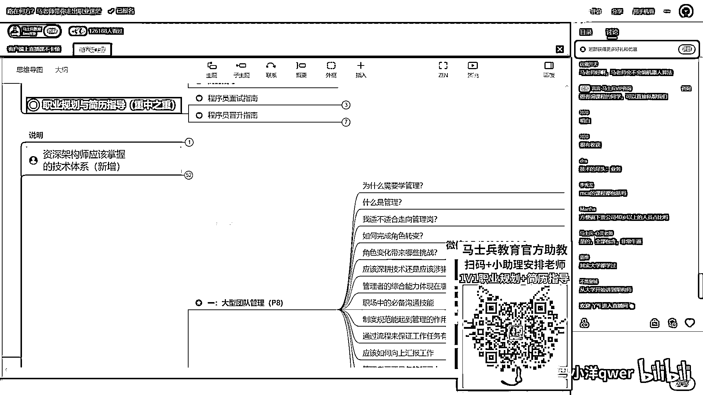

不用重新掏任何的钱。

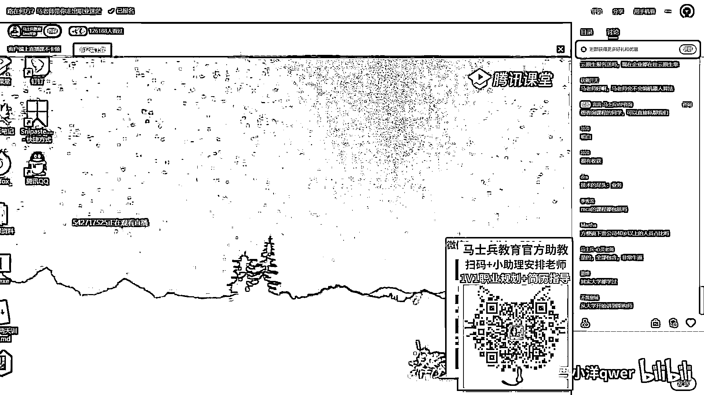

一门课搞定，愿意每年花个188块钱以后，年年跟着我们学，别的不敢说，保证你调不了队，保证你淘汰不了，保证别人裁了你之后，你肯定会找到，能找到下家，好，内容我大概就介绍到这里，好吧，今天的话题呢。

基本我也就聊得差不多了，我里边说聊了很多，不知道大家有没有收获，有收获的同学给老师扣个一，也算今天没白听，对了，马老师有没有面试的录音，我这个电脑上没有，我们老师的陪跑，比如说你在面试的时候。

觉得自己突不过，有问题，你可以偷偷摸摸录下来，找咱们老师帮你听一听，这个是我们面试的陪跑过程，也是帮助你拿到很好薪水，或者入行的最快速的方式，好，大家看看还有，自己这方面还有一些，有什么样有问题的地方。

找老师问。

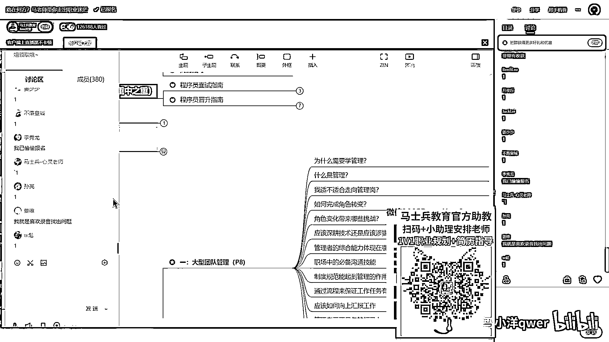

马老师这里，今天晚上。

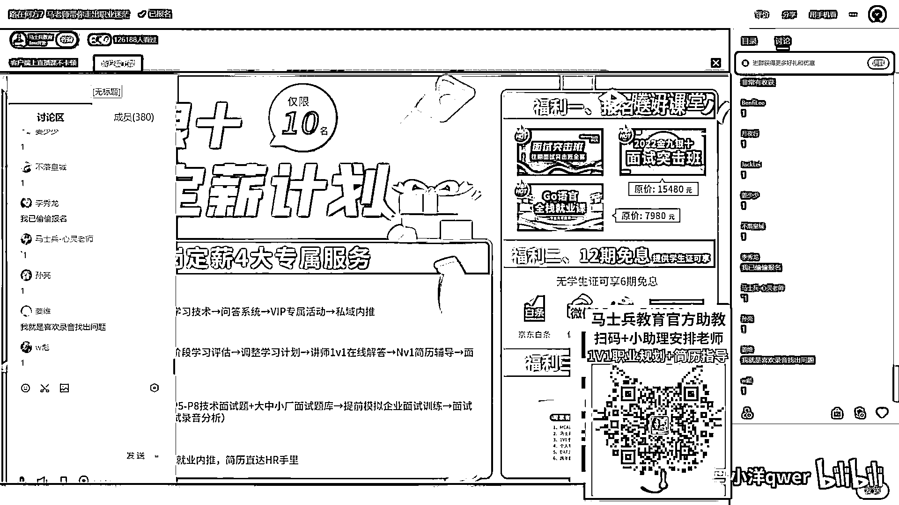

在马老师这里报名的。

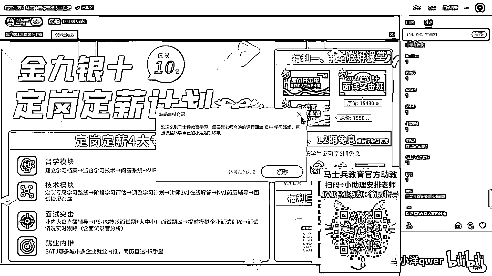

第一，3+15，这个你今天晚上可以享受，第二，今晚报名，马老师这里送你一门，勾浪的全职就业课，就这些，我看看，还有同学，自己就业这块，职业发展这块，课程这块，有问题的，找老师问，每个月呢。

我就讲一次这方面的东西，希望大家会珍惜，我看有同学已经帮我，拉了群了，我等会在群里头回答一下，就是你有些什么特殊问题，不方便在公开场合问的，你可以找一下咱们小姐姐，我们在私下里场合单聊。

不是说你一定得找老马老师报名，马老师就会带你，不是这样的，就是基本的一些，大的层面上的东西，比较容易的，你不用缴任何的费用，老师也会告诉你，好吧，多久搞活动，黑卡没有了，别等了，如果再有黑卡。

马老师把钱推给你，黑卡已经很长时间没有了，以后也不会再有了，黑卡是给咱们最早支持咱们的，那会儿我们课程体系不是特别完善，让好同学出去对我们的信任，报了我们的课，会给很多的优惠，现在也是一样，后面课程。

你像勾浪后面就要分离出去，只有涨价的机会了，黑卡一定不会再有了，你就不用再想了，什么时候你再等黑卡，那就是公司出问题了，刚毕业数学专业，双飞一本准备这行，学完只能去外包吗，你学到的技术。

没有说某种技术学完，他只能进外包，没有这种说法，不要这么想事，就是你学的越牛，你的选择面就越宽，你可以去选去外包或者不去，你学的不是很到位，可能只能有一些初级的外包岗位，找到你，但是对外包。

你也不要太抵触，有很多很多人，外包对他来说就是入行的跳板，因为他现在技术还不到位，好多外包能帮我们先解决入行的问题，他没有什么特别差的地方，只不过我们讲呢，为了你的长远发展，他外包的这种连续积累能力。

其实并不高，就是他的业务能跳来跳去，能不进则不进，实在不行，我们通过外包去过渡一下，过渡一年也没有什么了不起，如果有想创业的话，相对而言做交流想好，创业是另外的话题，创业跟你技术并没有太多关系。

创业选好方向之后，你的手下的团队去实现技术就行，你具备，你创业如果是技术思维，一万个里头死一万个，我说清楚了吗，所以你创业这件事啊，你第一个想的应该是市场，而不是技术，所以走什么路线，是另外的话题。

你要是想那个，就是搞技术的做创业的，我就没见过几个成的，多耐前景怎么样，不怎么样，老师好，能破解品管的系统吗，不能，脑子想啥呢，我这整天，别老想外面邪道了，能，这事也不可能公开教你，那是犯法的。

自己不懂吗。

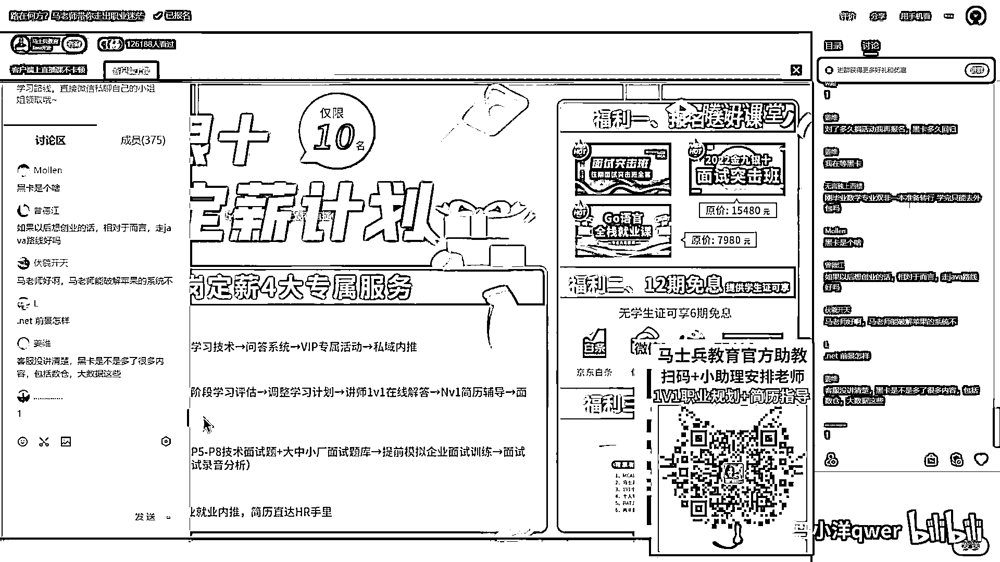

想学网络安全，了解一下咱们的网安课。

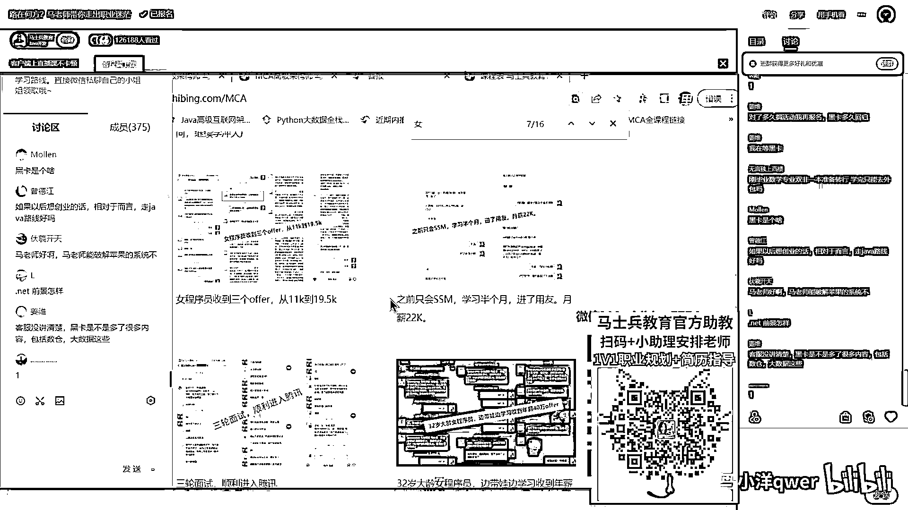

网安课要想实践，去咱们自己的靶场去，你不要那个，拿别人的系统公开跟他玩，抓起你来，那就是好几年的问题，那也不是闹着玩的兄弟。

我希望你能重视。

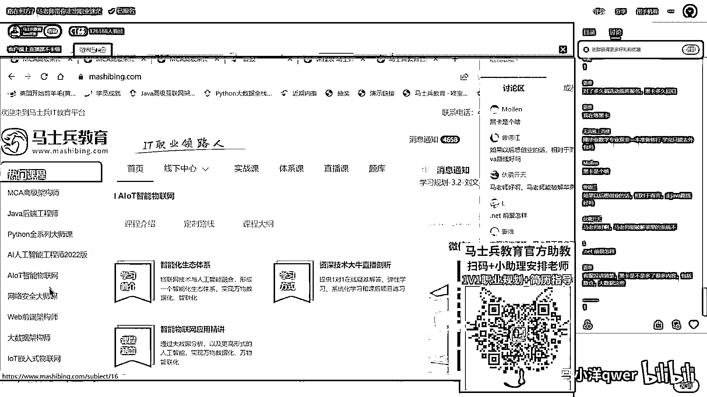

咱们这是咱们的网安课，这是我们的资料下来就不说了。

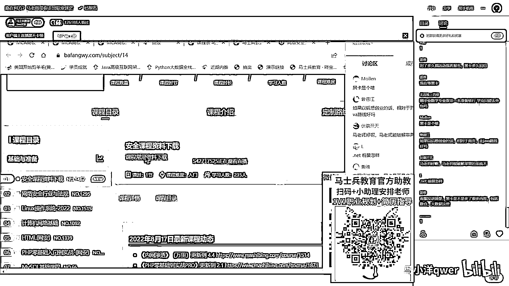

这我们的第一门课是什么东西，第一门课叫第二门课，就是第一门课是下载，第二门课是什么，网络安全行业与法规。

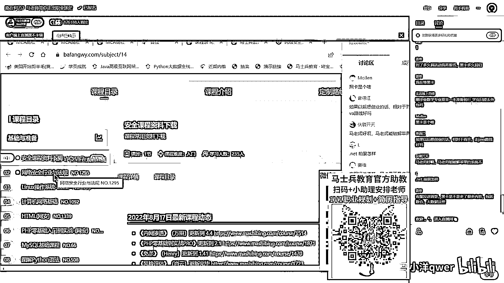

这个是你首先要学习的东西，然后渗透和防御，就是你渗透防御的时候，去哪里渗透，去哪里做防御，去这里。

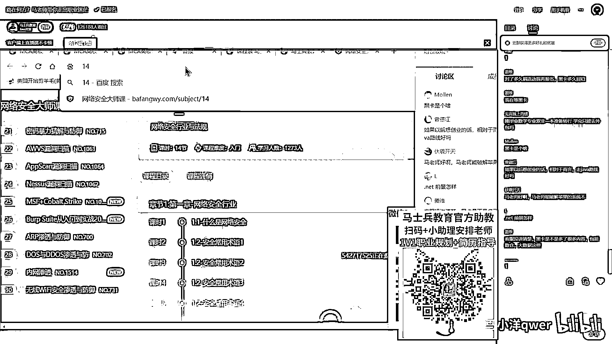

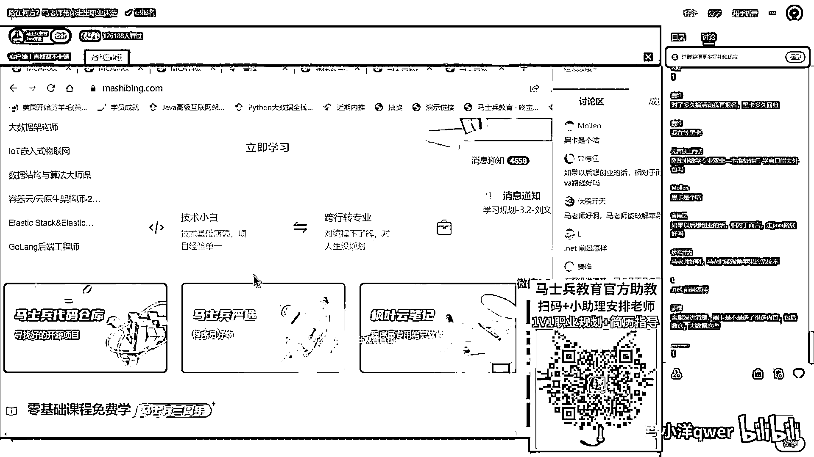

去靶场。

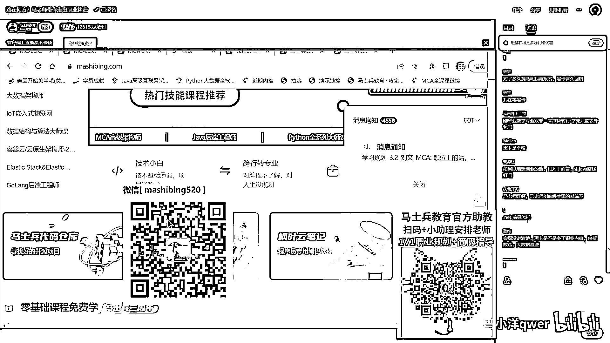

去咱们自己的靶场，这是专门给你开放的，你可以用来做攻击做练手用的。

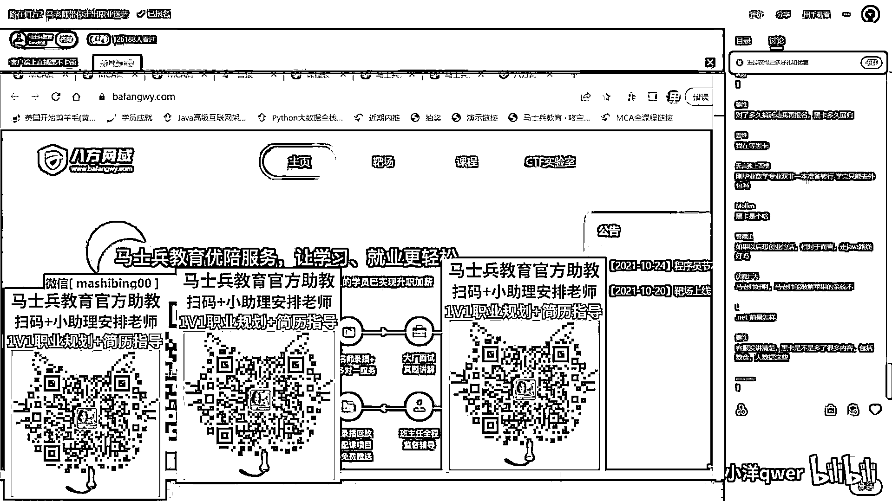

你不要拿着别人去练，你练完了之后，抓起你来，赖谁啊，所以别在那胡搞瞎搞。

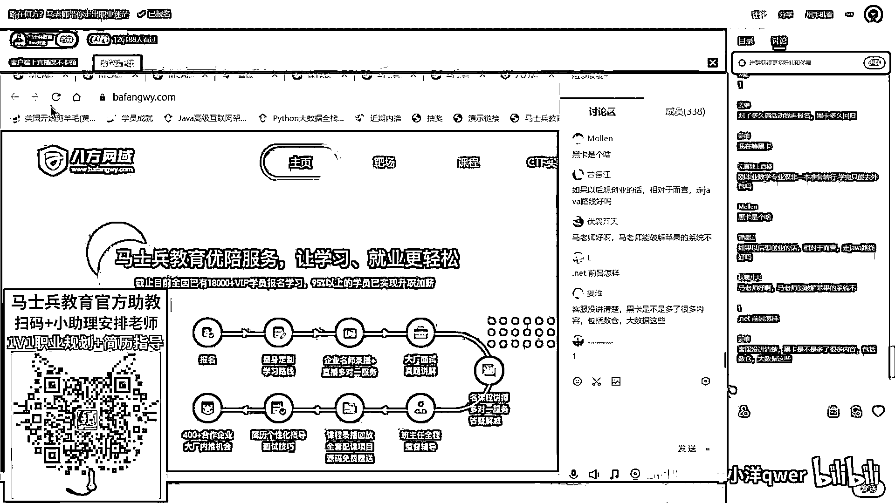

没有一点法律意识，在那胡搞瞎搞，在职业这个方向怎么样，什么叫在职业，这方向怎么样，这有点没理解，你考在职业，我说过，就是说你有经历，有经济实力，有这个能力，你的学历肯定是越高越好的，可以考虑。

但是你经济实力够的话，可以考虑MBA，MBA也是那个研究生学历嘛，但是呢，他的面宽就要比那个纯技术的要好得多，可我没讲清楚，黑卡什么树藏大数据这些，黑卡没有黑卡，我都跟你说过了嘛，没有黑卡，在想什么呢。

不知道医院的信息怎么做，这个太简单了，他只是业务上不同，技术上就是咱们讲的这个，Java Horton的技术，柯文哲跟我讲了，有个京东认证说不送，那是个京东认证是啥，这个我不太清楚。

你问一下咱们客服的那种，是不是和京东合作的一个认证，凡是有认证的，你肯定是要考试的，凡是有考试的，你肯定是要单掏钱的，这是肯定的，就是那个，因为你这个，钱可能交给京东了，他有个京东云的认证吧。

找咱们小姐姐详细了解一下，或者说是不是ES的认证，那可能是京东云的认证吧，如果是京东云的认证，你要考试的，你考试肯定是需要单交这个钱的，那小姐姐不懂技术，不懂技术让那个小姐姐去问。

因为我也不知道你问的是哪个问题，让那小姐姐去问一下，可以让小姐姐拉一下连老师，拉到群里，然后让连老师帮你解答，好不好，我们有些认证的合作，像ES的认证，阿里云的认证，CKA的认证，那个京东云的认证。

像这些个，你如果有这种需求的，你肯定是需要单交费的，一般来讲呢，你平时也没有这种诉求，就认证你不考，也不耽误你去跳槽掌心什么的，考了那就是一个很好的加分项，是这么一回事，严选商城在里面吧，这肯定的。

这必须的，三本的规划我错过了老师，你理解了这个一本二本之后，其实我讲过plan B plan C，三本大概率是要投plan B和plan C的，你走那个直接三本硬件，往很好的厂子杀的可能性并不大。

你要搞清楚这一点，至于学习什么样的内容，我在前面讲过了，基本上大概率的就是那几项，你如果说不想杀进一线大厂，短期没这个规划，算法就让一边，你像那种那些面试的挖苦和基础知识，越多越好，应用级别内容要熟练。

架构设计的知识要掌握，大概就是这些，你的选择面就很宽了，而且薪水能够涨得起来，好我看还有其他问题吗，如果没有的话，那我今天就到这里了，同学们，刚才PPT能下载吗，你找一下咱们的小姐姐，找她去要。

连老师今晚没睡吧，应该没睡，找咱们小姐姐，让她去拉一下连老师就可以了，没睡，我们老师们应该12点左右才会睡觉。

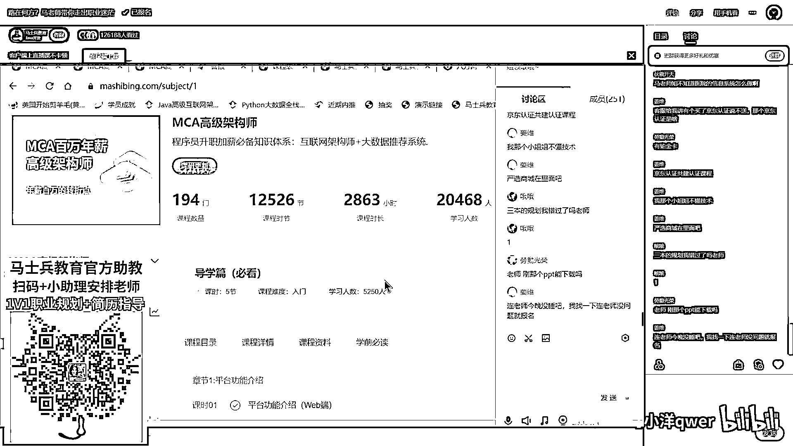

因为我现在还在讲课，老师这一课全是Java的吗，架构师的课是包括了Java的课，部分GoLang的课，还有一部分呢，小一部分是C的课，大数据的课。

大概是这些。

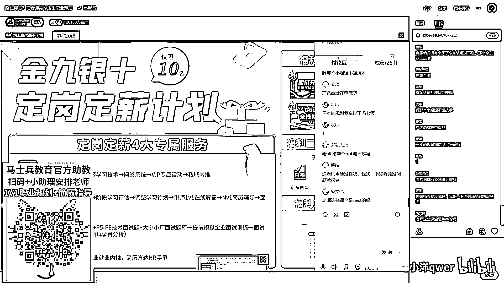

由这些来构成，你可以找一下咱们的课程大纲，要一下都可以，管理的课，技术中台的课，AI的入门课，产品管理的课，那么云源生的课，这个常见痛点的这种规避的内容。

在线的bug处理。

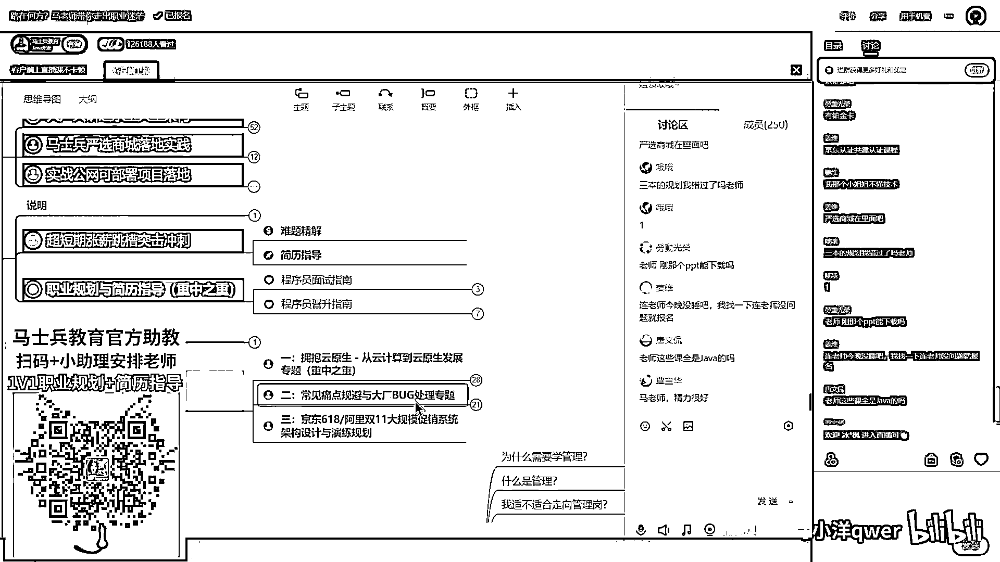

同学们大量的遇到，这些课题的课，算法的课，项目的课，项目的课，架构的课，严选商城的落地课，原理和层面解读的这方面的课。

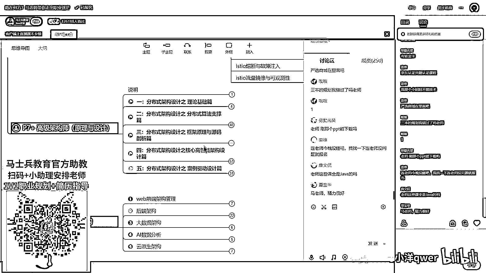

ServiceMesh方面的，像普罗米修斯就是GoLang方面的，这个不局限在某种语言上，以训练比较高薪水的家伙式为主，你也不要给自己画圈，说我必须得是那个，就得是这个语言，因为我只会玩斧子。

所以我干什么都用斧子，这个想法是错误的，他们看，我只会玩斧子，所以我切豆腐也用斧子，砍柴火也用斧子，切菜也用斧子，这不合适好不好，多掌握一些技能没有坏处，当你掌握了斧子的技巧之后，实际上你换菜刀。

也很好用，也很好上手，你换削水果的刀，其实也很好上手，基本原理都是相通的，算法和代数据有什么区别，这完全是八竿子打不到一起，不是一个东西，大数据的内容，你可以找咱们小姐要一下，从头到尾读完。

它主要是对于大量的数据的处理，这里面的算法是，咱们作为程序员，不管你是哪个方向，大数据方向也跟语言没有太多关系，它是你的一个基础的内功，大数据可以认为是我们某一个外功，就是算法，算法是一斤斤。

大数据是罗汉拳，一斤斤好了，罗汉拳打的也有力，然后加到后端，可能是地躺拳，一斤斤做好了之后，地躺拳打的也有力，能理解了吧，偏硬件的一般就是CXC++，是的，喜欢做偏硬件的，物联网方面的。

建议你结合一下AI，我们叫AIOT，原因是什么呢，因为嵌入这个方向，它的薪水不是特别高，哪怕你很有工作经验的薪水，也不是特别高，怎么突破呢，和AI相结合就比较容易突破，这我不知道大家了不了解。

如果我现在要做的工作经验和以后想进大厂的要求不一样。

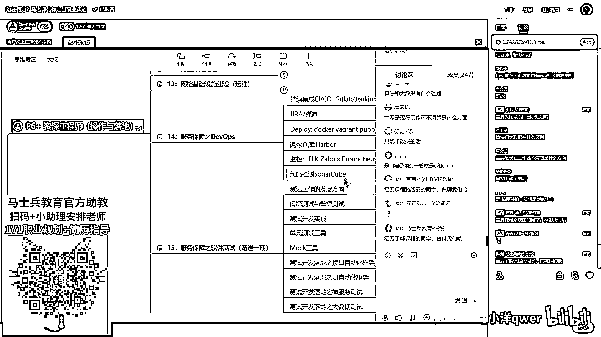

那我说这个，要做的工作经验和以后想进大厂的要求不一样，你这个如果的很有意思，我没太理解你的意思，大厂的要求，大厂的要求，我试和这个课，咱们课是干嘛的，你要搞清楚就是提升，多赚钱，入行。

就是大概是解决这个层面的问题，大厂有好多岗位，要求也是方方面面，你过去要做保安的，那咱们这个课呢，肯定是，就像你的要求一样咱们课也不保证你100%能进到大厂，我们会教大厂相关的技术。

但是你原来做保安的那没准人家大厂也不会要你啊，应该和我一样做通讯行业相撞互联网是吧，通讯行业没有问题，通讯行业没问题啊，你记住啊，进大厂是一个系统工程，有些人呢是天生有优势的，他就在那个行业里。

课班出身，学校又好，学历又好，他就很容易进，那有些人呢没有这个优势怎么办，根据你特定的情况进行对应的弥补，听懂了吧，只能是这样啊，那有时候我就是弥补不上，弥补不上也没有办法，我原来一直做保安。

我就想强撞互联网还要进大厂，巧妇难为五米之炊，老师不是说所有的100%的情况都能帮你解决，具体情况具体分析啊，反正这么多年呢，遇见的各种的事情也比较多，只要你不太离谱的，大概率都能解决，太离谱的。

谁也解决不了，算法和架构，哪个上线高，首先你要理解这一点，算法呢，一般提到有两种啊，第一种叫AI的算法，如果平时指的是数据结构算法的那个算法，它和架构不冲突，它是架构的基础，在现在呢。

和能和架构的薪水相媲美的是AI算法的工程师，这个学历要求比较高，上线其实是跟架构差不多，但是它比较窄一些，AI嘛，AI算法的发明和训练，这个东西呢，大多数人往往是博士，博士后，族里的人呢。

多数都是985211的研究生起步，但是就业面来说，肯定还是架构高一些，我给你讲过，就是因为它和业务有关联，如果你是纯算法，和业务没关联，学历好，你能拿到一个比较好的薪资，学历不好的话。

你可能架构的平均薪资都未必拿得到，上线高还是架构，架构肯定是上线更高的，比如说200万年薪呢，咱们课程里给大家讲的，给大家讲的那个P8老师，徐和徐老师给大家讲管理那个，原来在阿里200万年薪。

然后P9的那个老师给大家讲产品管理的那个老师，原来也是在阿里，它是200万到400万之间，我具体薪水呢，也没太了解，各行有各行的高薪水的点，但你要跟我讲，你说AI算法工程师我到科学家那种级别。

那也就嗨了去了，自家曾经那个在，北美那边招10年左右的，做AI算法的，博士生76万美元，还有外加一个签字费，大概10万美元左右，80万美元左右吧，所以这个东西，具体情况，具体分析了。

都是一些特殊的案例了，现在做软件是不是不如转硬件，你要去做芯片设计吗，芯片设计可能还有一些机会，否则呢，大多数做硬件的都不如做软件的，这就造成了很多人都去做软件了，就是一窝蜂而上的时候薪资就下来了。

真的有某一天大家都去做软件了，那做硬件的薪资就高了，动态分析啊，不要太拘泥于一个僵化的世界，想知道薪水怎么样子呢，多看一些招聘网站的数据，多去逛一逛，多采订一些样本，马老师会不会写交警的道路控制系统。

课程有交，本科软工应该还是有希望吧，进大厂或中厂，有希望，没有问题，双飞，飞科班资质平平，到您的课努力学习，进大厂需要几年，举个例子，他是一个二本的学生，他算是科班，他那会儿的科班也就那么回事。

具体需要几年，这个东西我很难去估计，原因是什么呢，第一个，学习的能力怎么样，你原来具备的基础有哪些，我只能跟你讲的是，到某种程度，到什么样的程度，你就可以去冲这个大厂了，只能跟你讲到这些。

其实前面我已经跟你说过了，你再回想一下，第一个你要掌握到一定程度上的算法，不需要特别高深，动态规划，找到这个程度很多大厂就可以接受了，基础知识或者面试八股，这块你玩命背，使劲去了解，这块叫做越多越好。

用碎片化的时间去掌握它，用正确的学习方法去掌握它，效率就会比较高，第三个呢就是架构设计的知识，然后应用级别的内容，第四个是加分项嘛，大数据语言生这些，就是你完全去掌握这些，就要看你掌握。

用多长时间去掌握，长得特别好的时候你就是把握性大一些，长得特别差的时候呢就是概率低一些，所以具体学习多长时间这块呢，你不要，给自己画一个特别死的这种东西，我就一定是要，两个月三个月四个月五个月六个月。

大多数有一定基础，你原来跳槽能够跟得上的话，原来跳槽的这种，机会能够就是跳槽的这种，人家大厂不嫌弃的话，三到六个月左右的业余时间，就可以冲了，如果要跟算法可能需要六个月，如果说不需要跟算法。

因为有些厂子有些厂子啊，尤其是有些中厂他根本也不考算法，其实三个月左右，你可以冲了，就是概率大或者小的问题，不知道我说清楚没有，曾德江，我也很愿意，给你给你一个确切的这种，像是说你需要多长时间。

需要多长时间，你觉得你需要多长时间，但这个确实很难给，但这个确实很难给，像去微软三星这些过气国际大厂，前景是不是不去国内大厂，你居然把微软，看作是过气国际大厂，我也是醉了，前景是不是不如国内大厂。

三星可能不如，微软不如，微软不服，现在是快11点半了，现在是快11点半了，我们的优惠，半个小时，12点截止，不要错过，大家去看，还是那句话，亏不了你，我大概11点半下播，然后回一下咱们群里。

单独给我拉的群，有些同学他应该是不太方便在公开客问的，我回去回一下群里的信息，华为的鸿蒙系统，老师不了解，华为的鸿蒙系统在咱们课程里都已经有了，点点直北，国际大厂排名，没有这种排名吧，没听说过这种排名。

机翼电器怎么样算大厂，按新思讲的话，它应该是比不了互联网大厂，但机翼肯定也是算大厂，比较有名的大厂来说，肯定就是，FAAG，还有哪个，Facebook，Amazon，Microsoft，Google。

什么，还有什么，Oracle，等等这些吧，因为机翼呢，毕竟它的专业并不在计算机层面，而是制造业嘛，所以它肯定比这个前面说的那几个要稍微差一些，所以它肯定比这个前面说的那几个要稍微差一些。

所以它肯定比这个前面说的那几个要稍微差一些，所以它肯定比这个前面说的那几个要稍微差一些，所以它肯定比这个前面说的那几个要稍微差一些，Oracle确实有点弱，Oracle确实有点弱。

Oracle确实有点弱，Oracle确实有点弱，Oracle确实有点弱，Oracle确实有点弱，Oracle确实有点弱，Oracle确实有点弱，Oracle确实有点弱，Oracle确实有点弱。

Oracle确实有点弱，Oracle确实有点弱，Oracle确实有点弱，Oracle确实有点弱，Oracle确实有点弱，Oracle确实有点弱，Oracle确实有点弱，Oracle确实有点弱。

Oracle确实有点弱，Oracle确实有点弱，Oracle确实有点弱，Oracle确实有点弱，Oracle确实有点弱，Oracle确实有点弱，Oracle确实有点弱，Oracle确实有点弱。

Oracle确实有点弱，Oracle确实有点弱，Oracle确实有点弱，Oracle确实有点弱，Oracle确实有点弱，Oracle确实有点弱，Oracle确实有点弱，Oracle确实有点弱。

Oracle确实有点弱，Oracle确实有点弱，Oracle确实有点弱，Oracle确实有点弱，Oracle确实有点弱，Oracle确实有点弱，Oracle确实有点弱，Oracle确实有点弱。

Oracle确实有点弱，Oracle确实有点弱，Oracle确实有点弱，Oracle确实有点弱，Oracle确实有点弱，Oracle确实有点弱，Oracle确实有点弱，Oracle确实有点弱。

Oracle确实有点弱，Oracle确实有点弱，Oracle确实有点弱，Oracle确实有点弱，Oracle确实有点弱，Oracle确实有点弱，Oracle确实有点弱，Oracle确实有点弱。

Oracle确实有点弱，Oracle确实有点弱，Oracle确实有点弱，Oracle确实有点弱，Oracle确实有点弱，Oracle确实有点弱，Oracle确实有点弱，Oracle确实有点弱。

Oracle确实有点弱，Oracle确实有点弱，Oracle确实有点弱，Oracle确实有点弱，Oracle确实有点弱，Oracle确实有点弱，Oracle确实有点弱，Oracle确实有点弱。

Oracle确实有点弱，Oracle确实有点弱，Oracle确实有点弱，Oracle确实有点弱，Oracle确实有点弱，Oracle确实有点弱，Oracle确实有点弱，Oracle确实有点弱。

Oracle确实有点弱，Oracle确实有点弱，Oracle确实有点弱，Oracle确实有点弱，Oracle确实有点弱，Oracle确实有点弱，Oracle确实有点弱，Oracle确实有点弱。

Oracle确实有点弱，Oracle确实有点弱，Oracle确实有点弱，Oracle确实有点弱，Oracle确实有点弱，Oracle确实有点弱，Oracle确实有点弱，Oracle确实有点弱。

Oracle确实有点弱，Oracle确实有点弱，Oracle确实有点弱，Oracle确实有点弱，Oracle确实有点弱，Oracle确实有点弱，Oracle确实有点弱，Oracle确实有点弱。

Oracle确实有点弱，Oracle确实有点弱，Oracle确实有点弱，Oracle确实有点弱，Oracle确实有点弱，Oracle确实有点弱，Oracle确实有点弱，Oracle确实有点弱。

Oracle确实有点弱，Oracle确实有点弱，Oracle确实有点弱，Oracle确实有点弱，Oracle确实有点弱，Oracle确实有点弱，Oracle确实有点弱，Oracle确实有点弱。

Oracle确实有点弱，Oracle确实有点弱，Oracle确实有点弱，Oracle确实有点弱，Oracle确实有点弱，Oracle确实有点弱，Oracle确实有点弱，Oracle确实有点弱。

Oracle确实有点弱，Oracle确实有点弱，Oracle确实有点弱，Oracle确实有点弱，Oracle确实有点弱，Oracle确实有点弱，Oracle确实有点弱，Oracle确实有点弱。

Oracle确实有点弱，Oracle确实有点弱，Oracle确实有点弱，Oracle确实有点弱，Oracle确实有点弱，Oracle确实有点弱，Oracle确实有点弱，Oracle确实有点弱。

Oracle确实有点弱，Oracle确实有点弱，Oracle确实有点弱，Oracle确实有点弱，Oracle确实有点弱，Oracle确实有点弱，Oracle确实有点弱，Oracle确实有点弱。

Oracle确实有点弱，Oracle确实有点弱，Oracle确实有点弱，Oracle确实有点弱，Oracle确实有点弱，Oracle确实有点弱，Oracle确实有点弱，Oracle确实有点弱。

Oracle确实有点弱，Oracle确实有点弱，Oracle确实有点弱，Oracle确实有点弱，Oracle确实有点弱，Oracle确实有点弱，Oracle确实有点弱，Oracle确实有点弱。

Oracle确实有点弱，Oracle确实有点弱，Oracle确实有点弱，Oracle确实有点弱，Oracle确实有点弱，Oracle确实有点弱，Oracle确实有点弱，Oracle确实有点弱。

Oracle确实有点弱，Oracle确实有点弱，Oracle确实有点弱，Oracle确实有点弱，Oracle确实有点弱，Oracle确实有点弱，Oracle确实有点弱，Oracle确实有点弱。

Oracle确实有点弱，Oracle确实有点弱，Oracle确实有点弱，Oracle确实有点弱，Oracle确实有点弱，Oracle确实有点弱，Oracle确实有点弱，Oracle确实有点弱。

Oracle确实有点弱，Oracle确实有点弱，Oracle确实有点弱，Oracle确实有点弱，Oracle确实有点弱，Oracle确实有点弱，Oracle确实有点弱，Oracle确实有点弱。

Oracle确实有点弱，Oracle确实有点弱，Oracle确实有点弱，Oracle确实有点弱，Oracle确实有点弱，Oracle确实有点弱，Oracle确实有点弱，Oracle确实有点弱。

Oracle确实有点弱，Oracle确实有点弱，Oracle确实有点弱，Oracle确实有点弱，Oracle确实有点弱，Oracle确实有点弱，Oracle确实有点弱，Oracle确实有点弱。

Oracle确实有点弱，Oracle确实有点弱，Oracle确实有点弱，Oracle确实有点弱，Oracle确实有点弱，Oracle确实有点弱，Oracle确实有点弱，Oracle确实有点弱。

Oracle确实有点弱，Oracle确实有点弱，Oracle确实有点弱，Oracle确实有点弱，Oracle确实有点弱，Oracle确实有点弱，Oracle确实有点弱，Oracle确实有点弱。

Oracle确实有点弱，Oracle确实有点弱，Oracle确实有点弱，Oracle确实有点弱，Oracle确实有点弱，Oracle确实有点弱，Oracle确实有点弱，Oracle确实有点弱。

Oracle确实有点弱，Oracle确实有点弱，Oracle确实有点弱，Oracle确实有点弱，Oracle确实有点弱，Oracle确实有点弱，Oracle确实有点弱，Oracle确实有点弱。

Oracle确实有点弱，Oracle确实有点弱，Oracle确实有点弱，Oracle确实有点弱，Oracle确实有点弱，Oracle确实有点弱，Oracle确实有点弱，Oracle确实有点弱。

Oracle确实有点弱，Oracle确实有点弱，Oracle确实有点弱，Oracle确实有点弱，Oracle确实有点弱，Oracle确实有点弱，Oracle确实有点弱，Oracle确实有点弱。

Oracle确实有点弱，Oracle确实有点弱，Oracle确实有点弱，Oracle确实有点弱，Oracle确实有点弱，Oracle确实有点弱，Oracle确实有点弱，Oracle确实有点弱。

Oracle确实有点弱，Oracle确实有点弱，Oracle确实有点弱，Oracle确实有点弱，Oracle确实有点弱，Oracle确实有点弱，Oracle确实有点弱，Oracle确实有点弱。

Oracle确实有点弱，Oracle确实有点弱，Oracle确实有点弱，Oracle确实有点弱，Oracle确实有点弱，Oracle确实有点弱，Oracle确实有点弱，Oracle确实有点弱。

Oracle确实有点弱，Oracle确实有点弱，Oracle确实有点弱，Oracle确实有点弱，Oracle确实有点弱，Oracle确实有点弱，Oracle确实有点弱，Oracle确实有点弱。

Oracle确实有点弱，Oracle确实有点弱，Oracle确实有点弱，Oracle确实有点弱，Oracle确实有点弱，Oracle确实有点弱，Oracle确实有点弱，Oracle确实有点弱。

Oracle确实有点弱，Oracle确实有点弱，今晚回到河口，讓我們來看看這位神神秘秘的廠商。

