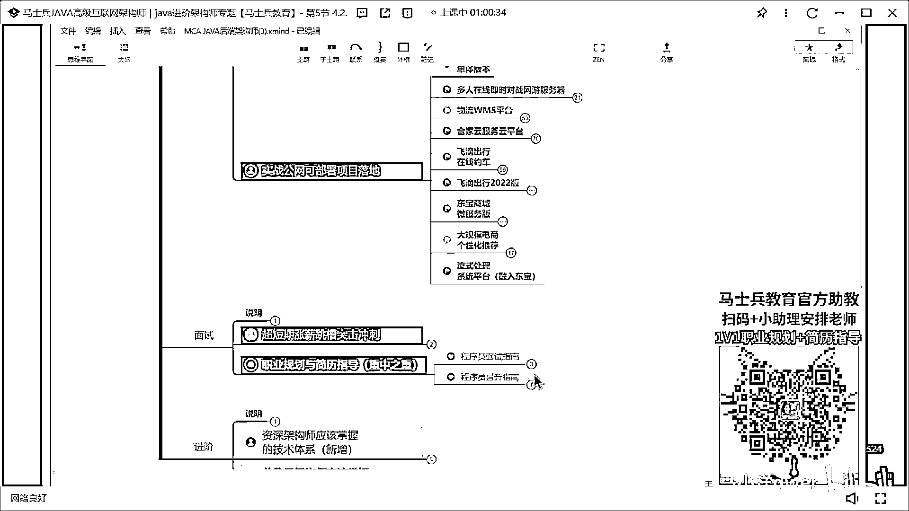
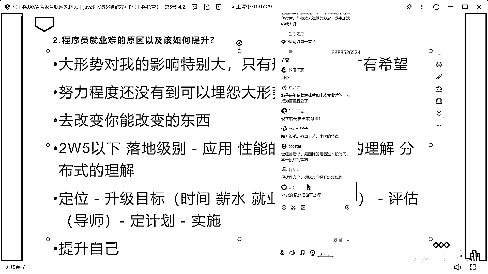
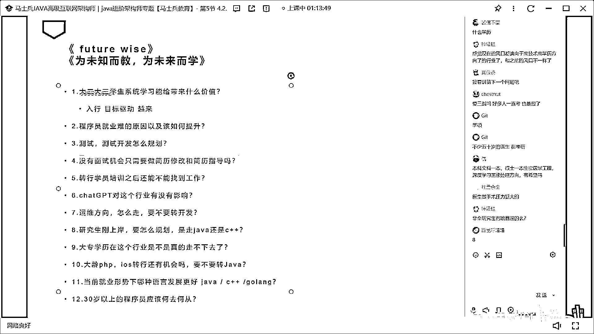

# 程序员秋招 顶级避坑指南！-马士兵 - P12：程序员就业难的原因以及该如何提升？ - 马小洋qwer - BV1Uz4y1x7hC

这个内容的话呢，内容比较多，因为各个就业的内容呢，它的原因呢五花八门，完全不太一样，那么我顺带着呢也把那个剩下的那些，和这个有关的问题一块给大家解决，那么各位同学认真听啊，就是说现在所谓的成员就业难。

每年，基本上每年都会有学员问我这个问题，说老师我这个今年就业的哎呀哎呀，感觉又很难，是吧，明年就业感觉又很难，我已经被问了二十年了，每年都很难，在很多同学眼里看来每年都很难，那么今年呢是不是最难的。

将来是不是最好的，我觉得这件事呢其实，各位不用考虑的，不用太把它当回事，就是所有的同学呢，总是感觉大形式对我的影响特别大，这是一种错觉，只有形式好了，这个是很多同学的认知，就是大形式对我的影响特别大。

只有形式好了我才有希望，今天在听课的同学呢几百位啊，我觉得，这么说啊，我们今年整个，就是去年，去年整个大学生的就业是一千多万吧，今年可能还是一千多万啊，去年大概没有就业的大学生。

如果统计出来的应该是七百多万，那么今年的话呢，我估计也不会少，你说大形式对人有影响吗，其实有其实当然也有影响，但是我不知道大家会考虑过没有，在这个之外呢也有很多人，人家已经就业了，而且呢就业的呢还不错。

我给大家念几个这个就业的，我们的就业的信息啊，这个你听一下啊，稍等啊我就临时想起来了，我们来看看他的学历和拿到的薪资好不好，当然这是我们，线下的一些个信息，不过没有关系啊。

这些学员呢你都能找他联系方式啊，没有假的，山东电子职业学院的2022届的专科，去年的研究生，23万，然后，台州，台州职业技术学院的云计算技术应用的专科，22万，然后，这是，有几个本科的，这两个本科。

华北理工大学化学专业的去年的应届生，29万，那个，南洋职业技术学院大数据的2019届的专科，这是几年前的专科了，他这个在外面混了几年，18万5，嗯，这个怎么给我的都是专科生啊，京州职业技术学院的。

2023届的专科19万，那么湖北国土资源职业学院的16万8啊，这个新乡职业技术学院的，这个是2019届的33万啊，嗯，安阳职业技术学院的，大数据应用的2019届专科18万5，这个念过了。

还有一些本科生啊，本科生的就业去哪了，好久不找了，就是本科生的就业一定是超过专科生的，这个没有问题，那个，其实你会发现啊，就是各个大形式你说对影响到个人吗，他会影响啊，但是呢，对于那些有基础能力。

做出了努力的同学来讲，你会发现呢，这样能够搞得定，反而是那些个天天担忧大形式，然后影响甚至影响自己情绪，天天跟那焦虑，但是不付出努力不付出行动的同学，那些个那些个反而完蛋了，他们搞不定明白吗。

因为很多人呢，对于大形式的理解就是大形式好了我才有希望，但是事实上是什么样子的呢，很多人的努力还不足以谈论这个问题，各位同学我奉劝大家一句，首先第一点，就是大形式这块不仅你改变不了，我也改变不了。

从国际形式到国内的形式，可以这么说，目前都不是很好，当然国内的形式跟疫情期间相比在逐步变好，但是它变好到什么程度会到什么会会会有速度有多快，是一个什么样的上升曲线，这个事儿没有谁能够预测。

我就很讨厌当你不能够去改变一件事情的时候，然后天天去担忧和焦虑，然后去反而去放弃了我眼前该做的努力，这件事是你的一个非常非常错误的选择，你不要傻不拉几的去干这件事。

那个各位同学不要让那些个你自己改变不了的事情，来占据影响你的你的你的情绪，天天就负面情绪，爆棚是吧，每天就是给自己各种各样的负能量，负能量完了之后呢又不做出努力，该躺平躺平，该打游戏打游戏。

反正大形式也不行，所以呢我算了我躺平肯老打游戏的了，我希望大家伙呢先做出自己应有的努力，你做出努力之后呢，如果说还搞不定好了你这个时候就可以埋怨大形式了，我想问大家预计在座的诸位。

拍拍门亲自问拍着胸脯自己问自己一句，有多少人的努力程度说我，我确实做出了我能做出来的最大努力，做完了之后呢我还没有搞定，好了你这个时候确实可以埋怨大形式了，有多少，哪个同学可以拍着胸脯这么说。

如果说你不能够拍胸脯说这件事，我麻烦你不要对大形式关注太多，好吧同学们，还是那句话，虽然说去年有700多万没有就业，但是依然有300多万就业的，搞定了的甚至薪资还不错的。

为什么今天咱们在座的几百人不奔着那300多万去，对不对，这件事不知道我说清楚没有，再说一下整个国际大形式呢，所有的这个世界上所有的国家，基本上没有几个国家目前形势比较好的，中国还算是非常不错的。

我们五一的消费大家会也都看到了，可以这么跟大家说，一般来讲的话呢，影响到我们这个行业的时候实际上是比较靠后的，为什么会这样呢，整个的这个我们从经济学上来讲的话，我们所有的行业大概分为第一产业。

第二产业第三产业对不对，第一产业农业第二产业工业第三产业服务业，我们属于哪个，我们属于服务业，一般来讲只有第二产业能够让人的薪资，变得越来越高，能够支撑我们更多的就业，你说你我整个制造业好了之后。

我才能够带动各种各样的服务业的发展，这个你理解也好不理解也好就无所谓，一般来讲所以所有的形势不好的时候呢，先从制造业开始，形势好了也一样，从制造业开始慢慢的会影响到咱们的生意，慢慢的这个服务业。

然后呢从我们现在的整个的国内的形势来看的话，就是各种的投资，国家的这个投资上的拉动，金融方面的支持，包括我们所有可以了解到的数据，他目前得出的结论是在缓步回升，缓步回升，但是他到底有多缓。

将来会不会反复这件事说不好，我还是那句话所有的同学们，你们这些东西可以去了解可以去听，但是请不要被它影响你的情绪，OK，马老师入行这么多年，所经历的这个行业的发展，没有说这个行业一路向上一条直线的。

基本都是波浪式，就是波风波鼓波风波鼓，那么在波鼓的时候应该干什么，退而修身好吧，退而修身，从这个各种各样的方向来发展来看，就是在波鼓的时候你看到的往往都是失望，都是各种各样的这种失落焦虑。

但实际上在这个时候能够说退而修身，反而是最好的选择，然后慢慢等大行业发展起来的时候，你会发现所有在这些地方躺平的人，即便行业发展也跟他们没有关系了，所有在这个地方在修身的人，行业慢慢起来的时候。

新产生的这些机会就是他们的，好大道理呢我就讲这么多，其实非常简单的一个东西，不要被自己影响不了，就是自己左右不了的东西，来影响你的个人情绪，天天负面爆棚这就完蛋了，所有能够成功的人。

所有能够这种有发展的人，实际上都经历过各种各样的低谷，各位同学们我这里多说两句好不好，我们有整整一代人是吧，我们经历过六七十年代五六十年代的这种贫穷落后，然后我们经历过动荡，你说他们有没有这个低谷。

有些人在低谷里头可能就完蛋了，淘汰了，但是有些人没有放弃的那些，当我们一旦度过那个时间的时候，你会发现起来的是这批人，OK，然后几个个例我就不多说了，你好好想想看，所有的你能够想得到的所有的那些人。

你可以称之为榜样的，你看看他们有没有经历过谷底，对不对，你只看到了他们在这个站在山峰上的那种，那种怎么说就是那种那种那种荣耀对不对，但是你实际上是没有看到他们在背后努力辛苦汗水，这些你可能没有看到而已。

所以各位同学呢我再说一遍啊，就是说不要被这种改变不了，就是你影响不了的东西所左右好吧，去改变你能改变的东西，OK，我们的课程体系里面呢，有一些软性的内容，我以前对这些软性内容呢，其实也并不是非常的重视。

我以前想的就是把咱们的成员啊，打造成为一个六段型战士，或者四段型战士，这个了解内容比较多就可以了吧，我了解嗯，不要说我了解这个AI是吧，了解后端了解前端，要了解大数据啊，当然还有一些还有更多的。

把这个综合起来呢，我可以做一个特别牛逼的project，这项目OK，然后在这个基础上呢，我能够进行选行做一个架构师，但其实呢，我慢慢发现有很多人呢，他不能够做出改变，就是所有的人都是一样的。

如果他自己不希望改变，那么没有人，没有任何人能改变得了他，那么自己不希望改变的这个，最希望最最最差的这个点在哪里呢，实际上他这个核心在这个内核里面，他并不是这些个技能战，那么怎么去改变你这个内核。

就是你对这个系统的认知啊，你对这个世界的认知，这块的话呢，反而是文史哲的内容，文史哲心理学是吧，管理管理学等等这方面内容，以前我对这块呢，并不是很看重，但我后来慢慢跟学生接触久了，之后才发现。

其实很多人缺的反而是缺失的，反而是这块，如果你这块比较稳定的话呢，其实外面这些你就一定能够有力量，去支撑你的学习，有力量去支撑你的成长，啊，OK，我转行了很多身边不少同事都转行了，这不是好事吗。

好多机会不就出来了吗，对不对，转上的非常多，好多岗位是不是就让出来了，而且我了解到的很多比较差的人转行了吗，那么你这些货真价实起来的同学，不就更有机会了吗，还有很重要一点，对啊我们念念老师说的很对啊。

转上去做什么了呢，是不是，嗯，好，我们来聊一些具体的你该怎么样进行提升，这个具体提升的话呢，这个面呢又又又非常非常宽了，我们以渣打成员来举例子，好吧，我建议大家啊转上摆摊，好吧你要去转上摆摊的话。

我也没脾气了，那个我们以渣打成员来举例子，各位同学们，你说该怎么样进行提升，提升的实际上是一个很粗的一个概念，比方说有的人呢我现在拿一万，拿两万，然后我现在想拿两万五，有的人拿三万，我现在想拿四万。

这实际上的每你会发现的每一步的提升的都是一个具体的动作，而且每一步提升，它内容实际上是不一样的，在这呢，我建议大家呢去，了解一下咱们，后端架构师的整个课程体系，这块内容的话呢。

基本上算是按照薪资的从低到高，这么来安排的，好吧，那个，这么来说啊，这个内容就算是你没有，你你你你你你你不愿意跟老师学，没有关系，你把这个内容拿过来，从头读到尾，你就会发现了，这是一条，这是一个攻略。

就是你怎么从新手，逐步的走向王者，好吧，在这里面基本都涵盖了，OK，目前基本上所有语言里面，薪水最高的就是架构师，这里头呢，咱们就是以那个后端架构师为例做的一个课程体系。

那如果你是CIA就去要CIA的版本，好不好，如果你是golang去要golang的版本，啊，这个严格来讲的架构师跟语言的没什么，没什么太多关系，嗯，如果说你现在还没有入行，那么基本上呢。

在咱们的另外一门课就是那个入行课程里头就可以，就可以进行入行，找咱们小姐要也可以，第一步学什么第二步学什么，学到什么程度会拿什么样的薪水，这个在咱们整个课程体系里面，课程大纲里面都有说明，嗯。

我呢给大家举几个小例子，好吧，就是说我给你我给你，我给你举几个例子啊，我们拿以在这个这个这个这个，这个北京就业来举例子，北京就业呢，一般来讲的会分几个不同的这样的档次，比如说你现在是属于两万五以下。

就是年薪三十万以下，年薪三十万以下，那么这个时候你怎么怎么提升呢，怎么才能达到第一步，我们拿到拿到年薪三十万呢，年薪三十万以下，好，年薪三十万以下呢，一般我们定义为他为什么呢，就是落地，落地级别。

什么叫落地级别啊，就是说白了别人给你一个任务，然后呢，让你给你给你一个任务，让你你你你你用擅长的语言，把这个任务给落地，这就是落地级别，那么这个落地级别呢，当然内部也可以分好几好几个不同的这样的档次了。

初级的入门的是吧，初级成员中级的高级的OK，高层，但是基本上呢，两万五以下就是落地这个级别，落地这个级别的重点在什么地方呢，落地这个级别的重点的其实就在于，应用，不管你是Java， Golang。

 C++，基本上都是你熟练熟练运用，熟练运用，用用的很熟练，常见的这些个这些个开发的模式以及框架，都了解的比较熟练，用起来比较比较得心应手，那知道这些个各种各样的细节，最好还有一些性能的优化。

这就比较有把握，原理的理解，常用的中间键，Redis你说哪个语言不用呢，C++也用， Golang也用是不是，然后Java也用，OK跟语言无关的，原理的理解，分布式的理解，到这个程度基本就可以。

OK不知道我大概说清楚没有，就是所有的你该提升如何提升这件事，首先你要确定你是在哪个等级，然后呢你下一步能够提升到什么等级，这个很重要，就跟我们升级打怪是一样的，所以如何提升这件事。

第一步要做的是什么内容呢，第一步要做的是定位，我现在到底是几级，如果我们分12级，我现在是6级，那么我现在想下一步冲到7级或者8级，好7，8级欠缺什么，我差哪些，我应该补什么，速度要有多快时间有多长。

明白我说的意思吗，各位同学，好你第一步的是要定位，好吧，这个定位你如果定不好没有关系，找咱们老师来帮你定，马英九教育这么多年，我们的课程体系，为什么是这样的，从头一直到尾到项目。

从入门开始到底层的各种各样的基础，像这些个很不讨喜的这些内容，咱们都有，到并发的这种底层的编程，通讯的框架的原理，消息中间件，缓存中间件，软件设计的基础，架构的实践，微服务的实践，性能的优化。

数据的处理，基础的设施的建设，服务保障测试等等，我们为什么做的比较全，这个大概从整个课程体系下来，目前是已经讲完的4000个小时左右，这个基本上是其他机构的，大概10倍以上的课程量，为什么会这样。

第一个讲的比较细，第二个讲的比较全，为什么强调全这件事，就是我希望所有同学，在这个课程体系里面，优先你做的第一件事是要定位，我现在属于哪一级，我现在还差哪些内容，然后我学完哪些内容之后，能够迈入下一级。

这个不知道我说的够不够清楚，希望大家会能在这个课程体系里面，感受到的是那种，每个人定制化的学习路线，定位好了之后，通过我们老师的了解你的内容，读你的简历，对你进行测试，然后了解你现在大概属于什么内容。

属于属于什么级别之后，再帮你进行一个，定制化的路线学习，这样的话就能帮你短期，解决升级的问题，升完这级之后再升下一级，一门课就让你从头升级到尾，我们现在能够提供的总的级别，大概在年薪百万以上。

就从入门到年薪百万以上，这一门课就有了。

这个呢是我们原来，应该说是我主导设计的一个主要的思想，这个不知道我说清楚没有，就是你第一步先定位，定位好了之后呢，定升级目标，我是要就业还是我要升到下一级，我是从2万升到2万5，还是我从2万到3万。

从3万到4万等等，到什么级别，然后呢定好这个目标之后呢，需要经过老师的评估，导师评估，就是你这个目标合理不合理，因为你这个目标里头呢，实际上是需要有时间，薪水，这个，比如你的这种就业企业的规模。

这些方面的理解，OK，如果说不知道的话，找咱们导师做评估，评估完了之后，说我们这个升级目标比较合理，定计划，实施，其实就这么简单，所以怎么提升呢，这是大方位的，OK，各种细节上的提升的话呢，每个人呢。

由于他不同所处的级别不同，每个人呢他所选的语言不同，这个呢你如果这个，自己搞自己搞不定的，找咱们小姐姐，让咱们小姐姐拉群，拉一个小群，让咱们老师帮你评估，就OK了，升级目标快速入行开始，是的。

这不让我说清楚没有啊，各位同学对这话有疑问呢，你可以直接问，没有问题我们就准备迈入，下一个问题了，好吧，最为难的原因是不是，当然还有些具体问题，我一会儿给大家讲，说你们没有面试，没有面试机会。

你这时候是什么问题，该怎么办，好了，没有问题的给老师扣个一，下个级别不知道怎么突破，对啊这块，我们干的不就这件事吗，就让你突破到下一个级别去，可以继续的给老师扣个一，马老师您说前端。

是不是真的走下坡路了，就是你们关心的这个吧，师弟师弟，你们关心的这个呢，你努力的想清楚，我说的这个问题啊，就是好好的说，我说的这个问题，OK，我想问的一句就是说，各位认为目前在国内的行业。

有哪些没走下坡路的，或者说你认为呢，他在后面的时间里头，持续会上坡的，有这样的行业吗，你们认为呢，就是他持续上坡，中间不会经过，拨风拨骨拨风拨骨这样的，各位同学，有吗，是啊，AI，AI你可能不了解。

AI其实已经经过一个拨骨了，最近这个Chai GPT又把它带起来了，明白吧，AI在Chai GPT诞生之前实际上一直在拨骨，中间学医，那个你们还可以转学医了，总比土木好，土木你要知道的是。

前面有好几十年的土木，一直是不错的，就任何行业，我再跟你说一遍，就任何行业，任何行业都有拨风拨骨拨风拨骨，OK，当你处于拨风的时候，你别得瑟，当你处于拨骨的时候，你也别失落，任何行业都有拨风拨骨，OK。

天坑材料，那个有个考研的老师，曾经说过说，说过是吧，你们这个搞IT的，还跟这儿嘚瑟来嘚瑟去，这个你要知道的是，很多其他方面的这些个行业里面的毕业生啊，可能干半辈子都买不了一套房，但是IT的人呢。

很多年轻的时候，就至少能够落下一套房，好吧，信息安全，天天要吃饭才可以搞到老，它的竞争激烈程度，你有没有想过呢，对不对，就是你们老想着说有一个行业，然后又比较轻松能够入行，然后又比较轻松能够拿到高薪。

然后又比较轻松，各位大哥，我认为你们想多了，如果有这样的行业，以我们中国人的这种卷的程度，早就所有人都卷进去了，是不是，做中医可以做一辈子，那么你知不知道，你作为一个中医，在你45岁之前。

差不多你都很难赚到钱，你们知道吗，你们了解过没有，中医做一辈子，你知道中医在前些年受到打压有多厉害，你了解过没有，你只是看到他眼前，稍微有些繁荣了，对不对，风舞长仪放眼量，把目光放长远一点。

如果再从大的这种目光的角度来讲，各位同学不管你处于哪个行业，麻烦你做一件事，提升自己，就这件事我认为才是，我们现在所有行业里头，最能干的一件事，并不是说我教培训的，我要求大家去这么做，大家报我的课。

不是这个意思，你们好好想一下，AI的诞生了之后，它的发展速度又非常的快，你如果还在那里裹足不前，那么你就不要要求自己说，我要拿很好的薪水，你就别想了好不好，如果说大家伙说那个，想赚一些又稳定的钱。

去送外卖，这个外卖呢我倒是认为，后面不会，短期内不会淘汰，但是你想想看它的发展，怎么样对不对，行，还是那个话啊，如果大家伙为了大的形式，跟着焦虑来焦虑去，没有意义好不好，做好眼前的事才是最重要的。

得找准方向，找错方向提升难度加倍，可是对于方向这件事啊，对啊，外卖的没有增值可言啊，对于方向这件事。

其实就属于到预测，找准方向，这个竹篓宇说的特别对啊。

就是找准方向这件事，同学你们想想看啊，找准方向这件事是一个什么样子的，找准方向实际上是涉及到预测，明白吧，预测，这世界上最难的事情是什么东西啊，其实就是它，就你找准方向的意思是，我找了一个就业方向。

然后这个就业方向呢，在我进去了之后呢，它会持续几十年的不断的上升发展，我在里面呢，发展的就跟着发展就特别好，说白就是我想当那头，风口上的猪，就是找准风口的意思，各位同学们我想问大家一句。

如果你能够预测这个世界，那你基本上接近于神了，能听懂吗，所以所谓的找准方向，其实本质上是预测，但是预测是这个世界上最难的事情，你比方说经济学家的预测，经济学家预测这个预测那个，你看你仔细去看一看。

那个经济学家有哪个预测准的，OK，所以这些我就不说了，你们说这些废话呢，我就觉得意义不大好不好，我不太给大家讲那个大的，这些个虚拟的东西的原因就在这，感觉学历太影响了，那就补学历啊，你在这感觉有个屁用。

补吗，有这么多补学历的渠道，为什么不去做呢，怕找不到工作，你找了没有，那么你就在那怕好了，对有很多人不就是这样吗，找工作就越难，是不是找不着，为什么，因为怕被面试官看不起，因为怕面不了，因为怕没机会。

因为怕面不够，那个小姐姐不敢去表白，为什么，因为怕被拒，怕又能怎么样呢，你怕了有用吗，找了找不到，找原因了没有，学历咋补，妈呀，你实在不知道怎么补，找咱们小姐姐吧好不好，要不要提升个硕士之类的，这个。

学历这件事是这样的，就是说你在有时间有精力的情况下，有这个经济实力，你提的越高越好，但是你说我要我要我要，我要搞一个这个硕士，我是搞在职的还是搞这个，这个这个这个这个，非非全的对不对。

然后呢我搞这个硕士，我是搞一个，专硕还是这个这个这个这个这个，其他方向的硕士，然后我是要搞一个MEM，还是要搞一个MBA，这些东西呢，你要考虑的是这些个性价比，我给你举个最简单的例子。

比如说我我今年25了，我如果要考一个那个这个，非全的非全的话呢，我就用我的业余时间就可以了，但是我如果考一个全职研究生，我就需要我28甚至29的时候再出来，那么这时候你要考虑的是，我这三年我目前的工作。

我能找到的工作，三年的工作经验和我三年的研究生，读下来之后，25到28我们就25到28，这是这三年的选择，这是机会成本的选择吗，就是这三年我干了读研这件事，这三年我干了工作这件事，你要好好考虑的是。

这两个方向的性价比到底哪个高，明白我意思吗，比如说我三年我现在我现在拿两万，然后我读完研出来之后呢，我预测我应该拿四万，但是我正常工作呢，我预测我可能拿也拿四也拿四万，给你举个那个什么的例子吧。

好那你这时候考虑我这四万，我怎么发展哪个会更好，明白我意思吗，这个东西你稍微做一下比较，然后你就能知道我到底要去干什么了，我要不要干这件事，本质上这是一个机会成本的选择，就是做任何事呢都有成本的。

最最简单成本就是机会成本，就我干了这件事我就干不了那件事，我要看看哪个哪个干哪件事，对我来说它的收益是最高的，好吧，要三战吗，好多人一直考一直服了，我觉得好多人一直考的主要原因，是他没有找到就业的方向。

还有一个呢很多，还有一些那个很很很不靠谱的人，就是我躲在那个房间里，号称我在考研实际上在那打游戏聊天，刷短视频啃老本质上是啃老，三本集的你考研条件到了材料一本，两年出来之后还会好一点吗。

去学JAVA没问题，你只要认了一个方向使劲搞肯定没问题，放心，好了不少50岁的医生在考研，所以刚才有很多人认为医生这个行业，它是不断持续往上然后压力不大，你纯纯纯是扯淡，你是没有了解过而已。

医生这个行业他为了平支撑，你要知道他付出的薪水付出的辛苦呢，大太多了，我们就不要说中意就是西意，你在45岁之前，你想赚赚一些什么样的钱是很难的，你们去了解了解稍微好不好，不要在外面只是比简单的人云亦云。

医生做手术压力挺大，那个压力不算大，非全研究室有啥靠谱的吗，看这里，我们聊下一个测试测试开发怎么用，这个是一个那个什么的问题啊，就是一个细节入行的问题，一会儿再聊这个问题啊，我们来聊这个问题。

就是没有面试机会，因为这个问题是很多人所面临的问题。

就是到底我就是没有面试机会了，我怎么办，拜拜。