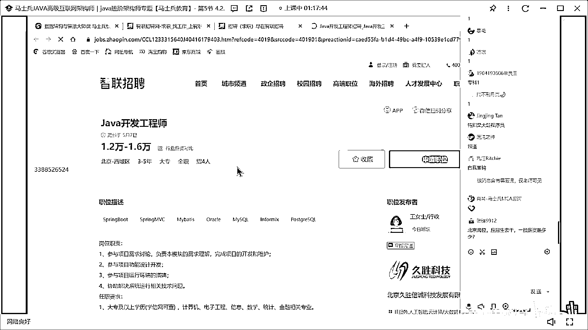
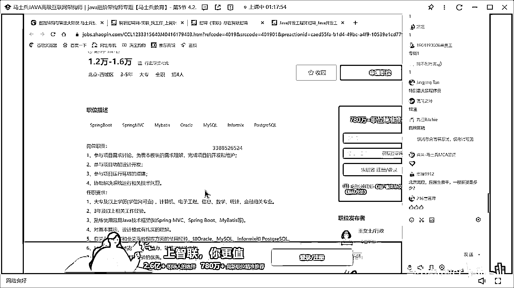
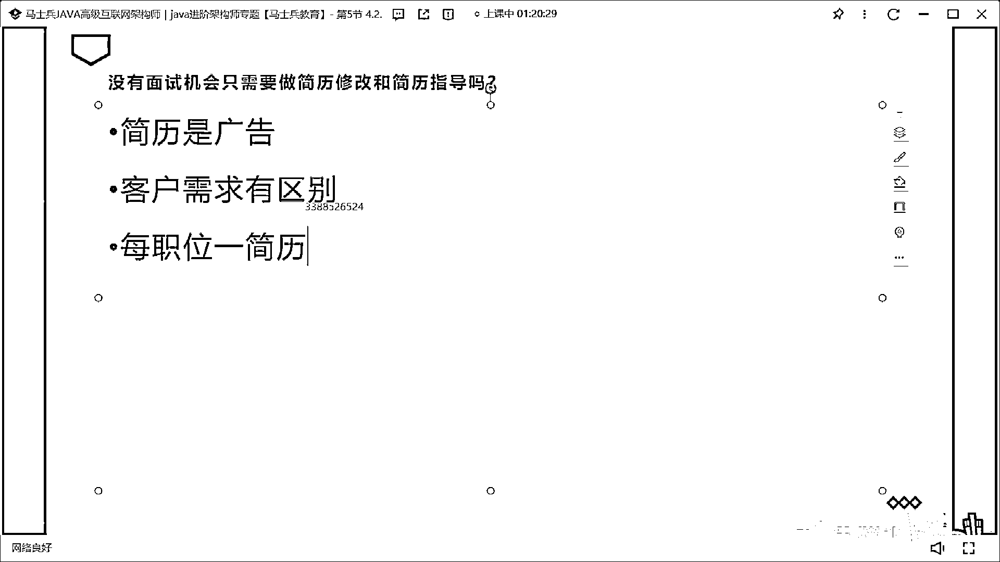
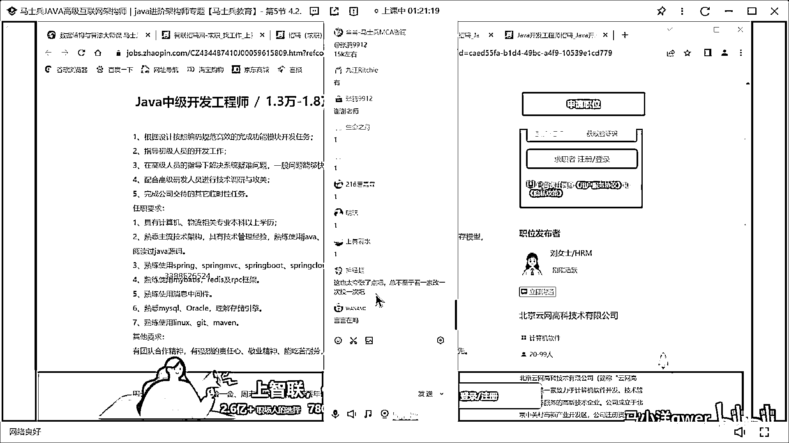
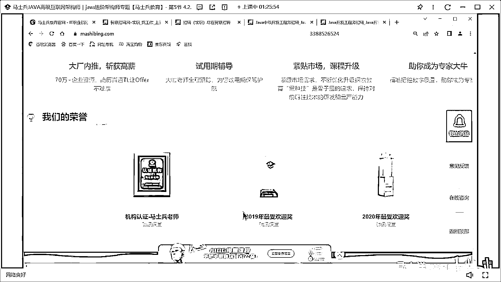
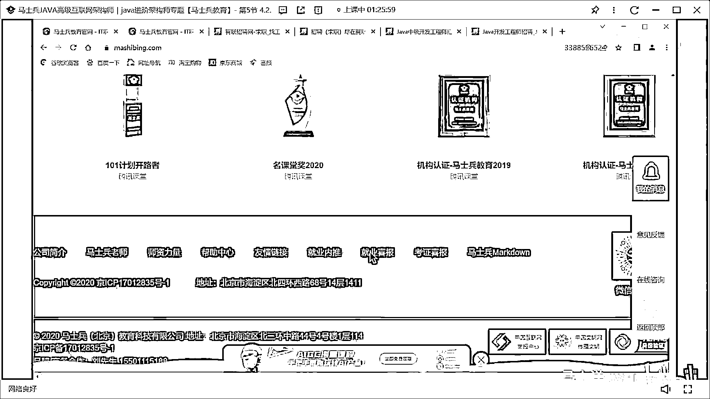
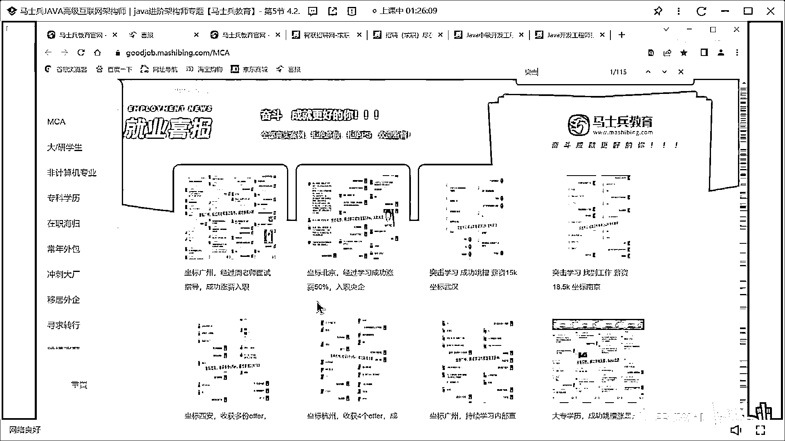
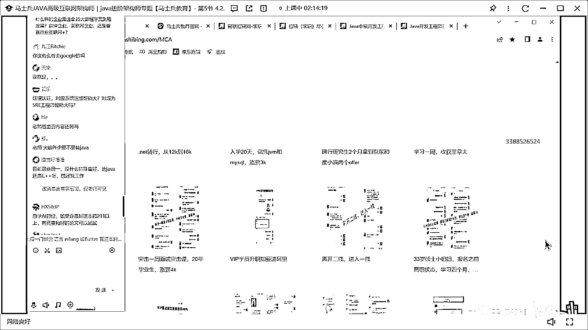
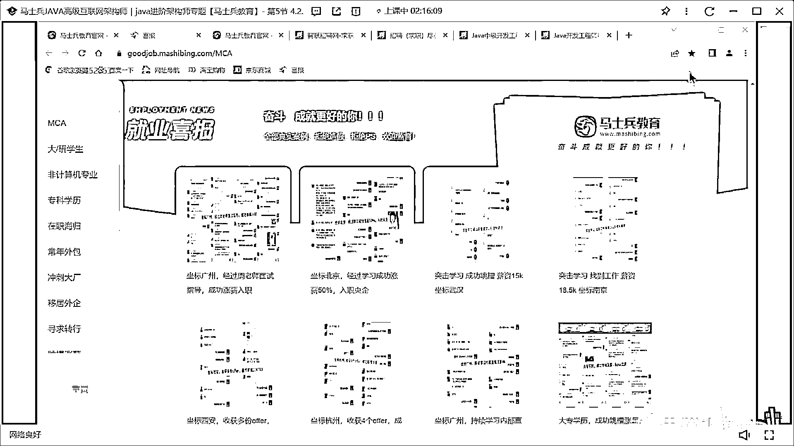

# 程序员秋招 顶级避坑指南！-马士兵 - P13：没有面试机会只需要做简历修改和简历指导吗？ - 马小洋qwer - BV1Uz4y1x7hC

没有面试机会只需要做简历修改和简历指导，各位同学来有这个问题的一个老师扣个1我看有多少人，好 听我说啊，其实没有面试机会要干的事就干这两件事就可以了，就是简历修改和简历指导，其他的实际上什么都不需要。

同学们你们闭上眼睛，把自己拔高站在一个上帝视角，看你找工作这个问题，你会发现在地球上就会有一个小人，然后呢去找一个他不认识的，从来没有了解过他的一个单位，当然这个单位的话呢，会有一些人出来读他的简历。

其实本质上就是干这么一件事，然后呢没有面试机会的概念呢，就是我读到这个人的资料之后，我不想见他，明白吗，HR或者呢他的专业上司，比方说他的这个leader，一般HR呢他也读不懂很多专业名词。

所以他还是要到leader那里，HR只是过滤一些硬条件，好 到到另外这里呢，我读完了你的简历之后不想见你，我跟你之间我是不了解的，但是我读完你的材料，注意这个材料是你自己写的，是你自己写的。

你写完了之后呢，我leader看完了之后我不想见你，那意味着什么，因为你的材料写的绝对有问题，因为我对你的了解仅限于你给我提供的一份材料，明白吗，提供了这份材料之后呢，你写的材料太烂了。

我看完了之后我根本不想见你，这样的话你就没机会，不就这么简单一件事情吗，兄弟们，想想看是不是这个问题，那为什么你写的材料，别人看完了之后不想见你呢，是因为你没有重视这份材料，你的重视程度不够。

有很多很多人，我看了他那个简历，那真的是写的跟屎一样，就是你要知道这份简历是一个什么东西啊，这份简历本质是一份广告，这个广告的产品是什么，就是你自己，请大家记住，如果你打广告的时候，你面向的是什么呢。

你是会那种，一份广告会是简单的说明书似的吗，很多人写简历就是个说明书，从哪年到哪年，从哪年到哪年，会了什么干了什么，尤其那些应届生，那个批简历写的，还会打乒乓球，还会那个，做修图，有毛病吧，广告。

请大家记住，这是广告啊兄弟们，这是营销啊，所以所有的人，我讲要学一些那个软性的东西，你认为你在不和人打交道，你认为你不了解市场，不去做营销，不了解，实际上你本质上是，你离不开这件事。

同学们你们好好想一下，这个广告的目标应该是谁啊兄弟们，广告目标应该是谁，告诉我，是不是应该是客户啊，你的客户是谁，你的客户是不是各个企业，本质上说你，你对这个企业打广告，要把自己卖出去。

那么你是不是要问清楚，你的客户需要什么，很多人写一份简历，自己会什么提了还往上写，但是从来没有人认识，读过对方需要什么，你读过吗，你跟很多人找工作的时候，是不是打开一份招聘。

我们打开一份招聘。

随便搜一个。

打开一份招聘之后，打开完了之后。

这不也招大专吗，打开完了之后呢，哦OK人家是招Java的，好批了啪啦把简历扔进去，这个简历怎么写的，没看。

看这里，同样都是Java开发工程师。

你说这两个同样都是Java开发工程师，你仔细读，你说这两个有没有区别，我们仔细来看一眼，这12000到16000，这要求的是什么，技术框架，对基本算法设计模式有扎实的理解，这还是打专程。

是不是都开始了解算法了，你的简历上有写算法吗，告诉我一下有没有写，有关于数据股，非关于数据股的经验，对不对，新创优先，你考虑过没有新创是什么东西，你了解过没有，沟通能力能推动，好不说了，我们看这个呢。

13000到18000，我们来看这个，框架，主流技术，设计模式多线程JVM调优，阅读Java原码，各位同学，同样的都是薪水差不多，你们有没有发现，一个企业的需求和另外一个企业的需求是有细微区别的。

了解过没有兄弟们，这块能理解的给老师扣个1。

我再说一遍，就是你的客户对你的需求是有区别的，简历是广告，客户需求有区别，我可以告诉大家，在形式比较好的情况下，你就弄一份那个完全一样的简历，然后呢，你把海投，投给那个不同的人，他有区别，那是他的事。

他有他跟我这个匹配不上，那是他的事，跟我没关系，我蒙也能蒙上，但是在就业形势不好的时候，我面对这么多企业，我用唯一的同样的一份简历全扔过去，并不也不关心人家到底要什么，我反正把我会的往上一写。

我就往外一扔，你觉得这个时候你的竞争力还强吗，我读到一个千篇一律的，所有人都会的一个东西，一万人全会，我就找十个人，对不对，我就找十个人，一万人投过来的简历，内容都差不多全会，你认为你有什么竞争力吗。

没有，那么想到怎么办了没有兄弟们，怎么办啊，做微调啊，最简单的告诉大家一个方法，就是每值个一简历嘛，同样的刚才这两个，你要不要做微调。

在一份简历里面。

这份简历里面要突出什么东西啊，是不是要突出并发类的，调优类的，原码类的，对不对，消息中间件类的，Linux， Git， Maven， MySQL，我看人家没有像这边的要求说，这种这种非公安数据库。

是不是Infomix， PostgreSQL，没有没有这些东西啊，是不是不一样啊，兄弟们你发现了没有，这基本算法，这边有要求，这边有没有，没说呀，没写呀，OK，你再去读，你再打开另外一个。

它还有区别兄弟们，神经病说对啊，没错，这也太夸张了吧，总不能看一家改一次，投一次，好，我告诉大家是一个终极解决方案。

就如果你这么干。

基本上你一定会有面试机会，如果你这么干，当然你嫌累，我就没脾气了，听懂了吗，嫌累你可以退而求其次，每类职位一简历，这个尤其是适合那些年龄稍大一些的，年龄稍大有经验了，他能够涵盖的职位面也比较多。

有的人既能做区块链类的，也能做后端类的，也能做架构类的，甚至还能做管理类的，那你是不是要分四份简历啊，同学们，你们好好想想这件事，网络运输能写的技术点全写上去，这个是最，怎么说呢，就是不是很不是最好的。

一定不是最好的，你会CR+你也写上去，会勾浪也写上去，没有用，有很多企业会认为你太杂了，反而不专，明白吗，投三千份才能两三个offer，三千多份简历，你投三千份拿两三个offer，是因为你海投的呀。

你如果按我的方式，你很可能你一百份投出去，就能拿到二三十个面试机会，too string，毫无交代的方法，如果你认为累，我就这么累我不干，那老师就这么一脾气了，好不好，这个尤其适合那些年龄大的。

年龄大的每一个就业，每一次就业，都是非常非常重要的，每次跳槽都很重要很重要的，你连这个最基本的都做不到，你还想说我要拿到一个很好的东西，你就像我像个亲，是吧非常愿意跟人家成为男女朋友。

但是我就不认真写我的资料，那同学们你们想想看，你这么不重视的话，那能怎么办，能有好结果吗，还是那句话，在我们以前行业，比较发展不错的时候，你可以随便投海投，你可以捞机会，但是即便在那样的情况下。

其实你捞的机会，跟我教你的这种方式相比，也是亏的，按我这种方式，你有针对性的，重点的拿出来，你可以不用全的，你可以拿出20%的，说我这个重点性的，我比较喜欢的，那么你有可能拿到的薪水，一万五比如说。

但是你用海投的和别人，并不是完全匹配上那种形式去做的，你很可能也能拿到这个岗位，但是你没准拿到的薪水一万二，这中间就差了三千，你愿不愿意为了每个月三千，一年三万多，年年都有的三万多，去做这个努力。

这个取决于你自己，这块不知道我说清楚没有，就是你用哪怕就是原来形式好的时候，你一份海投投出去，你捞到的机会，实际上也不如你，有重点的有侧重的，有针对性的这样的投地，所捞到的机会拿到的薪水高。

这块能听懂的，老师扣个1我不知道我说清楚没有，这是一个很重要的环节，很多很多人并不重视，尤其是应届生弄一份特简历模板四处投，老师我没有面试机会，废话你有才怪，这里面还有一个很重要的理念，我教给大家。

就是不会的东西，要不要写，人家要求的东西我不会，人家要求的东西我不会，我要不要写上去，那你们告诉我一下要不要写，实际上写，写了你免不过咋办，你写不会的东西你要赶快写啊，不要写，写，背，好同学们听我说啊。

我们有一些学问，我给大家看几个小案例，给大家看几个小案例。

给大家看几个突击的案例啊。

这是先被裁了两月，突击课恢复13。5，原来被裁的时候13。5，后来找不着工作，在我们老师的指导之下，这是我们老师的指导过程，简单的一个一个一个指导，开始突击，突完的效果。

这是突了一个月的。

重庆，长新涨了40%，这是突击没收到时间，主要给大家看一下时间吧，这是一周一周的突击时间，就达到预期了，这是突击一个月2万5涨到3万5了，还有好多突击的例子，一百多个我在这里就不说了。

同学们你们考虑一下啊，就是说这个为什么短期的突击，就能够涨新能够能够起到涨新，回到行业，这样的效果原因是什么，就这个不会的东西要不要写，听我说，这个呢，大多数在绝大多数情况下，完全可以写。

比如说原来我不会，我只做过单机的，这样的项目经验，我没有分布式项目经验，那么对方要求了，人家明确要求了，我能不能写上去，完全可以写上去，因为没有没有任何人，第一知道你原来不会。

第二没有任何人都是天生会的，这些内容都是学出来的，从我投出去的简历到我开始面试，中间是有时间的兄弟们，了不了解，我今天他不是说我今天我上一秒钟投的简历，我下一秒就面试，就我就我就就必须得去。

中间是有时间的，这个时间三到十天不等，我今天投的简历，我要去面试的时候，可能是三天以后了，这三天能干些什么样的事，能能敢突击这件事，很重要，突击只要你的方法对，我们每每每每一年都有专门的突击班。

只要你的方法对三天可以干很多事，只要你的方法对一周左右时间，基本上所有你不会的内容，你都可以跟面试官聊一聊，那么只要你能跟面试官聊上，就有成功的概率，能理解吗，所以大部分是可以写的。

只有一种情况下不要写，什么情况下呢，就是我我确定我一定能拿到面试机会，别人给我内推的，那么在这个时候呢，内推过去，我这跟他跟他确认过了，我这个简历已经够了，那就不要多写了。

因为你多写的时候会面临别人问到的问题，你可能答不出来，因为你不熟嘛，不要说我说清楚，这个这个问题没有，我再说一遍，你写的这些东西，其实本质上就是一个你短期的目标，你写的这些东西，比方说人家要求分布式。

我现在不会，那么短期你要干的一件事，就是要把分布式进行一个突击，就OK了，因为只要你把分布式突击出来之后，你这份简历就已经达到了对方的要求了，你就可以去参加面试了，当然这个是面试的事业的概率嘛。

我大概有比方说我有20%的几率通过，那也可以啊，20%的几率通过怎么了，那意味着我能够找到五个机会的话，我就能拿到了拿到一份offer了，对不对，各位兄弟们，那这话能理解的给老师扣个1。

尤其是在那种我必须得写上才有面试机会的，我为什么不写，我一定要写，还是那句话，没有人知道你不会，明白吗，他一定得见了面跟你聊完之后，他才知道你到底会还是不会，掌握到什么程度，突击两个月你能找到工作。

我有一学生突击十天找到工作了，他只会html css，找到后端开发，当然这里头的方式方法非常多，我给大家举个简单的小例子吧，写了有些还不一定会问，是在有经验的基础之上，是在有脸皮的基础之上。

那么你能够苟得住吗，这不是前端吗，现在有突击班吗，有，同学们，我给大家举个小例子，就这块内容呢，其实对大家会的要求是你的内核要稳，就我刚才讲，我原来希望每个人都是六变形战士，种的技术特别多，但实际上呢。

你的内核不稳的话，种的技术再多，你发展性也不好，后来我慢慢的教大家呢，怎么把这个内核稳下来，内核要稳，内核稳很关键的一点，就是很多人的脸皮太薄，脸皮薄是内核不稳呢，一个常见的这样的方式。

就常见的这样的表现，脸皮太薄，脸皮太薄就意味着什么呢，意味着什么事都不敢干，不敢去争取不敢去拼，以前有个同学出去面试，面试被面试官怼了一顿之后，回来之后再也不敢出去面了，后来我就问他。

你为什么不敢出去了，太丢人了他说，他娘子你就想想看，你做了个面试，你丢人丢到哪儿去了，你就丢到面试官那儿了，丢了多长时间，丢了半天，你第二天问着面试官说，昨天那人是谁，他肯定想不起来，就因为这点破事。

自己跟自己闷着，不敢出去了，从此之后不敢出去了，太把自己当回事了，明白吗，表白受了几次打击，哎呀这帮女人太难搞了，以后不跟女人混了，你自己想过没有，你的这个也太玻璃心了，那一份是心态，可以这么理解。

心态是其中之一了，同学们你们想，你们想一想，我用一定的概率，是我写，我的简历里头写的挺牛逼的，我有些，我有30%我是不会的，我写上去了，对不对，好我连准备都没准备，你下一秒就要求我去面试，行我就去面。

好我就问你，有没有可能性，他只问那70%，有没有可能性，他问了，他问了就把问了80%，然后你答出来，这80%里头的大部分，对不对，然后呢他就有可能，收你进去，也就是说你只要去，就一定的概率。

面试找工作是个概率问题，是概率兄弟们，这点一定要理解，所以你要说因为那个怕丢人，都不敢出去试，那还混啥，那你啥也干不了，明白吧，更不要提说你这30%，你不会，但是我加上一些突击啊，就让我们很多人。

我们很多学生为什么短期之内，就有提升原因就在，他就愿意去突击了，咱们解决他的心理问题之后，再加上我们的突击的效果，我们老师们会知道，比方说你Redis不会，我们会知道会告诉你。

Redis常问的问题有哪些，你哪怕就背题，每天背不就行了吗，这不就简单的突击吗，当然我们突击会比这个要复杂一些，是不是你的概率就提升了，原来25%会提升到30%，OK，那不就得了吗，这块应该都能听明白。

对不对，当然突击的方式学习方式啊，方式方法很多，我教大家就是说，比较有效率的突击的方式，什么样子的，这块这块大家想听吗，就突击的方式，因为以前有好多同学，所谓的做突击的，他那个方式方法太笨了。

大家听我说，我给你举个最简单的例子，就是你们平时经常犯的错误，就是你们突击的时候，有很多人学内容啊，他学内容的时候是不分，不是不有目标的，为学而学，什么意思呢，这个大家都知道，我们一般学一个新的。

关于IT类的这个内容，最耗时间的在什么地方，我们拿成员来举例子，最耗时间在哪，在调试，搭环境，然后呢，调bug是吧，其实就是调试bug，搭环境，敲代码，是不是在这些地方，你们回想一下，如果让你们学一个。

比如说你们开始学Tomcat的时候，Tomcat是个什么东西，如果就让你说Tomcat是个什么东西，你学这个要花多长时间，让你学这个问题，但我估计几分钟就可以了，但是你们学Tomcat的时候。

实际上真正的毛病在，真正的花时间的点在哪，是不是在这些地方，我搭这个环境我没搭好，一搭搭好几天，一个bug卡我，能卡我好几个小时，如果说我们学习一个新的内容，能够把这部分先剔除掉，我们只要干嘛呢。

我们只需要了解，它是干什么的，然后呢，它用来解决什么样的问题，别人问我的时候，他问我常见的，他的内容是有哪些，但是我不去搭环境，我不去真正的敲这个代码，我不去调试这个bug，同学们你们想想看。

这个时间大概我们测算过，至少节省80%以上，能理解吗，但我想问你有多少人，在面试的时候会要求你去，马上搭环境，调bug 敲代码的，除了算法之外，那个走不了，没有捷径，除了那个之外，你面试的时候。

有多少现场面试官要求你，马上给我来，给我搭个环境，调个bug 敲个代码，不会，但是你只要，也就是说你只要把，这20%左右的内容搞定之后，实际上你有很高的概率，能够通过面试，这点大家能理解吗。

能理解的可以，那就行了呀，你通过面试，是不是就拿到offer了兄弟们，不就行了吗，当然我觉得，很多人马上就会怼我，说老师拿了offer之后，我不会这个，我日常工作也干不了啊，你废话你日常工作干不了。

你大晚上，你晚上啊，你晚上的时间，咱们马老师的课里面，4000多个小时用来干嘛呢，是不是都教你，什么样的环境，遇见什么样的bug，该怎么办，你晚上时间，时间给我琢磨不就完了吗，你白天就正常工作。

不要问别人，有什么问题，就行了，这样的话，你撑下去的概率，是很高很高的兄弟们，因为从你拿了offer，到入职这段时间，也是有一段时间的，你入职之后，也是有周末的，也是有休息时间，也是有培训时间的。

这段时间干嘛，干这件事，我们退一万步讲，你就算没在里面待住，没有关系啊，下一家，在你增加了上一家的经验值的前提之下，你搞定下一家，是不是时间就长多了，所以突击的话，对这种企业，很简单，背题就行了，背题。

哪怕你没有接触过，了解他是干什么的，大概了解就OK，有面试观问，ESMQ的项目中，怎么实现的细节，这个能去背吗，可以背啊，这有什么难背的吗，只要你听过我们课程的内容，你就完全可以背得过，还有一个。

就算是你这次，你这次背的内容，那个他问出来，你没有答出来，那么下一件是不是可以，答出来不就可以了吗，你回来会要不要做总结啊，做个总结不就OK了，是不是你每家的概率，都比上一家高一些，你采用这样的方式。

多拿面试机会，采用这样的方式，使劲突击，你是不是短时间内，就能解决问题啊，就你可能会非常奇怪，我给大家解决的，解释的就是说，你可能非常奇怪，为什么我们很多学生，时间很短，我们这里面列举的，一个月两个月。

都是业余时间，好吧，老师说这校招特别管用，校招入职基本上很久之后，对啊，没错啊，肯定管用，面试官问得很细就露馅，露馅就露馅嘛，这是个概率的问题，你能不能理解，你不是追求所有的面试，你都能cover住。

你不要这么想事儿，我们学的最好的学生，也不能说面试加成试，没有没有这种可能性，校招容易转行的，没有什么，哪方面难的，它是个通用解决方案，这点很难理解，对不对，以前老有同学说，老师我那个找到工作了。

就来报你们的课，反了，找我们来先学课，然后再去找工作，你自己找一万二，我帮你找一万八，因为这些个东西的理解和指导，是我们老师一对一的，对你进行指导的，所以帮你改简历，帮你做简历的指导，帮你做面试的指导。

这个机会就来了，老转行的，然后就用语法基础就能入行嘛，你入行如果是找到工作的话，你只懂语法基础怎么可能呢，肯定是要往后学习对应的内容啊，我专生本歌说事遥遥全日志，大厂社招卡的雪莉吗，有的大厂卡，华为。

平安，央企，微软这些卡，有的大厂不卡，京东，脸家携程，顺丰，双份100个科班西安邮电没有实习，大厂给面试机会吗，双份西安邮电没有实习，给啊，这个必须给啊，西安邮电那个华为肯定会给面试机会。

跟有没有实习没关系，大龄的学习底层还有必要吗，如果有时间，大龄的很重要问你的内容，叫做系统设计兄弟，系统设计最关键的内容，实际上就是原理底层圆满的理解，明白吗，就是当你透彻的去读懂，某一个东西的底层。

它为什么这么设计的时候，实际上你的设计能力就提升了，当你透彻的理解了，比方说拿我们的那个，一个重点课叫Spring的圆满，我们讲了90个小时，从头给你读到尾，当你透彻的理解了某一门。

某一个典型的框架的原理之后，实际上其他框架，你看起来也就轻松了，这就是设计，OK，所以当然有必要，只要你还在搞技术就有必要，开搞管理了就没必要了，CC明白了吧，加砖40家有机会进大厂吗，机会很渺茫。

把这个行给我踢出去，骂人是吧，骂人肯定不能留你，我的意思是操作系统，技术算法之类的系统学习，技术算法，看你要不要进大厂，进大厂估计也要问，还有你的年龄到底多大，你所谓的大龄是多少，老师知道有哪些不卡吗。

我说过了吗刚才，大砖应届上海头简历没回复，下面该咋办，你头简历没回复，不是今天这个讲的不就是头简历没回复的问题吗，你好好想为什么没有回复，头简历看人家要求什么，要求的那些不会的一定要先写上去。

短时间内做突击不就行了，大砖35，那算法就不要学了，我认为意义不大了，因为你这个时候进大厂，这个意义不大明白吧，算法题签到够吗，看什么难度，看什么难度呢，签个easy的那意义不大呀。

medium hard肯定是够的，完全没问题，而且你不要老说同类型的，其实算法最核心的是要总结出题的类型来，这是咱们那个左老师的专长，26开始学了可行吗，可行啊26岁完全来得及，大砖韩寿本。

公司不承认简历石沉大海，你大哥，我今天讲什么呢，不就是教你怎么去找吗，怎么怎么去找这个面试机会吗，你简历石沉大海，你好你要是真没办法了，就过来找老师，老师帮你看简历，简历哪写的不好好不好。

就是就是本身就是简历问题吗，就是你广告写的不够好，你如果就哪怕就是你大砖，你这个内容写的很多很到位，他一定也有也有对应的面试机会，大龄是30以上吗，没有这种定义啊，射招还得刷算法吗，进好的厂子就要刷。

老实说接私活就让达到什么水平，那看私活的要求了，接私活这件事不靠谱啊，我先告诉你，你先接接试试，那是真不靠谱啊，接私活这件事呢，有一个靠谱的方式是你接国外的，但是待遇也不是也不会很好。

土木29本科学大数据转行能进大厂吗，有希望啊，这个是没有没有没有硬没有硬上的，这剩下就是看你的那个，那个那个学习的这种掌握的熟练程度，这方面了就是你没有硬上，大砖三射怎么突击，你问什么什么意思。

什么叫怎么突击啊，就是你定好你的目标内容之后，定好你的目标，我多长时间我想拿到拿一个什么样的薪水，比方说我假设你现在2万5，我想下一步跳槽拿3万，那就意味着我要涨5000块钱左右。

这5000块钱我欠缺那些，把这个定好了之后，重点就突就突这些，收到offer之后一般突击几天再去面试，没有收到offer就已经能够工作，你了解什么是offer好吧，你说到面试邀约之后，一般突击几天。

这个每个公司的每公司不一样，一般都有个几几天的准备时间，大三学C++的报科要转Java，没必要，没必要，我们课程体系是各种语言都涵盖流行语言，我们都涵盖，科班本硕一本还能进中场吗，没问题啊。

今年感觉HC特别少，那个竞争也少，跟你这种水平竞争的人也不多，你只要干过他们就可以了，渺茫近大长3%希望，说什么意思，想去北京找班20个亿吗，当面见见面，你可以来长沙找我，八年Java现在转Go。

感觉Java太卷了，那你Go不卷是吗，八年Java现在转Go，你现在认知是在语言上卷，其实本质上，我跟大家讲讲语言，待会听，我在刚开始给大家讲课的时候就说过，大家如果想了解细节方面的不同语言的。

不同细节的找咱们的APP下载下来之后呢，第一门给大家的免费课就是这个，大家自己听啊，就是所有的语言，专门只做纯语言Dota天花板，Go也好Java也好CIA也好JS也好C#也好，可以这么说啊。

如果你只是满足于做一个这个方向的程序玩，做一个落地性的这样的东西，初级的设计这样一个东西，他们的天花板都差不多，三四十万五六五十万左右，基本肯定到头了，明白吗，你做勾浪超过五十万的人也非常的少。

甚至超过四十万的人到现在为止也非常少，你纯做Java只是做落地超过四十万的人也很少，JS基本上到头了，可以这么说C#更是，CIA的话呢，如果说你这辈子可能达到顶级薪水，应该也就差不多在六十万左右。

那么在这个基础上，你要考虑长远往后提升的话，实际上叫架构师，作为一个NB的架构师，实际上他不受语言所约束，当然日常的你常用的语言，那对你来说呢，那是必须得更深入的去了解的，OK。

架构师本身又分好几个层次，后端架构师，大数据架构师，两个加起来要成为基础类架构师，那么，那个业务架构师，产品架构师，好，可以这么说，如果你想架构师往上更高层次上发展，Java是最容易的。

就是到架构师这个层次，Java是最容易拿到高薪的，你理解我说的意思吗，那么Golden也可以拿到，也没有问题，OK，但是的话呢，Java是最容易的，为什么，因为Java做的通常都是业务相关。

到一定程度你就会发现，我们一个企业赚钱的东西，是它的业务逻辑，那么在往上走的时候，你会发现，对业务逻辑比较了解的人，跟他的语言实际上这时候关系都不大了，好了，这个时候最容易走向管理岗，最容易走向。

拿到更好的架构师岗，最容易呢，拿到薪水更高的，这样的机会，听懂了吗，你是可以不卷，没有关系，OK，你现在如果是跑去C，做那个，AI相关的签入室，是不是，这个体系里也有，那他也不卷，但是你要知道的是。

他长远的发展是什么样子的，会不会有天花板，天花板是多少，明白吧，嗯，各位大伙觉得安卓怎么样，安卓很多天花板，大概也就在40万左右了，可能你这辈子啊，就是你这辈子，再往后都突破不了，明白吧。

就很多做安卓的人，到年龄大了之后，来找老师说老师我想突破，太难了，OK，所以除了看短期利益之外，一定要看长期利益，做技术总监了，失业了，下一步呢，继续找啊，失业了，回到行业，为什么不回呢。

签入室竞争小一点，和AI相关的签入室需求量呢，更多一些，目前不是说需求量更多一些，就是说就业是没有问题的，签入室的就业一直没有问题，这么跟大家说，但是薪水一直就不高，理解吗，40岁干了7年。

PHP现在转Java可以吗，呃直接转架构师，这么去干，把你原来的所有的这些个，PHP做的东西，完全润色成为Java做的，直接转Java架构师，这条路是可行的，好吧，游戏和游戏客户端怎么样。

游戏客户端的顶新，差不多也就在三四十万左右，啊就C#做那个，做那个什么的，C#做做做做做交本语言，去做那个Cocos和Unity，游戏游戏客户端不就做这些事吗，顶新也也就在这了，游戏后端是他的主程。

一般是用Golang，然后Java，C++这三个语言，但是主程的话呢，如果不考虑奖金的话，那么他的顶新差不多也就在四五十万，就是月新在三万多四万多这样，当然你不要老跟我提那种个例，红是荣耀。

这个这个这个年年中奖48个月是吧，这个全整个行业里面，大概只有千分之一的概率是这样的，因为我没有面试，现在我坚持一下，大哥你换还要换什么，当天环境如果没有好的实习，有的公司又很看重。

怎么通过简历约到面试，主要是有的会问实习，真的很奇怪啊，其实大多数的优秀的企业，并不是非常看重实习，那你没有实习，你就说没有吗，你解释清楚为什么就行了，我实习的时间我用来提升了，我用来学习了。

如果说非常看重实习的一个企业，我并不觉得它是一个很好的企业，好吧，身边有同事转签收室和安卓，我也觉得上线高，上线肯定是最高的，就是你不要求将来，我只要求眼前，那你搞签收室没问题，放心吧。

像是AI天花板多少，应该，这个只是粗略的估计啊，差不多应该在五六十万左右，我说的是那个，不是说AI算法兄弟们，AI算法工程师的天花板就很高了，百万以上两百万都是他天花板，但是如果你只是把AI拿过来之后。

到签收室做应用明白吧，我说的是这个意思，能辅导我们考研吗，我们有考研的课，我们有考研的专门，那个那个考研的四门课，咱们这里都有，而且呢讲的会比考研内容还要深，但是我们会，不是针对考研。

而是针对就业和面试，OK，安全的方向还是云渊生好，这两个东西它是交叉的，它并不是一个竞争的关系，那么安全有没有云安全啊，那一定是有的呀，所以他们两个不是，不是竞争关系，明白吗，搞安全的人也要了解云渊生。

搞云渊生的人呢，可以考虑，可以不用考虑安全，实际上是这么这么回事，那现在哪个城市IT行情稍微好点，一线，一线往二线，二线往三线肯定是这样的，转行的人，只要把他签收室找工作容易入行，容易入行。

目前签收室要比，更容易入行一些，但是薪水要，你要你要接受薪水低不少，接受这一点，我这个月排满了民事，你这个有点，有点那啥呀，得瑟是吧，国内35以上车员，真的多吗，看到还是有35，很多呀，你要知道我那个。

十年前有同学问的，问的就是老师我过30怎么办，后来五年前问的是，老师我过35怎么办，其实最近很多人问的是，我过40怎么办，那个，很多企业也慢慢的发现了，与其招那个，没什么经验的这些个愣头青。

我还不如去招那个，有很多经验的，这样的一个年龄稍微稍微大的成员，一般来讲，为什么说你3540，你就开始薪水不如年轻人了，这个有可能是你这段时间，你就没提升，理解吗，我天天CRUD，我躺平，我不去进步了。

那你凭什么去和那些，28，9正能打的年纪的人，又有几年经验的人去竞争，其实本质上还是你，该成长的，该到这个年龄，该掌握东西没掌握，现在好像都要成熟，我这种初级成员人家看不上，你为什么不一步迈到。

那个成熟去呢，有这种机会呀，嗯，四年扎了，后面两年干够，挑槽，逐哪种语言好写，写两份简历，每种语言，这个语言本身呢，嗯，擅长和不擅长，就是他擅长干的方向，和不擅长干的方向，但是呢，你要比较的时候。

应该是比较两个offer，但是你勾浪拿了一个offer，你扎了拿了个offer，这两份offer要做综合性对比，理解我说的意思吗，就你写两份简历，扎完也投，勾浪也投，然后呢，拿了offer之后。

用offer做对比，而不是用语言做对比，嗯，还有我们项目，有语言研修的相关经验，但是工作经历不好，这个没理解什么意思，什么叫工作经历不好，一年经验，约不到面试怎么办，兄弟，我刚才讲的，你认真听了没有啊。

你如果实在约不到，找咱们小姐姐帮你，好吧，现在入行门槛是啥，入行门槛什么意思，哪一行，我们IT有好多细分行业，城市外都有好多细分行业，我们拿Java后端举例子，分部式为服务的项目，能搞定，就是入行门槛。

都说缺少是比Java难，但职业寿命长，看到什么程度，如果能到一个，做移植，做最核心的底层，就是Linux的核心元码，和我们硬件的结合，到这个程度的时候，它的职业生涯会比较长，但是反过来讲。

Java如果能做到架构师，这个程度的时候，它的职业生涯也非常长，明白的意思吗，就是你得到什么样的程度，如果说最普通的这样的职位，他这句话肯定是有问题的，分部式为服务，服务部团的Cloud。

对可以这么理解，塞加天花板真的不是Java，塞加做编译器，门槛很高，基本上说不再做，对你要了解，聊这件事呢，就是必须还得聊，你的学历是什么样子的，比方说，重点来说，我们整个招聘的调研，是招聘网站的调研。

薪水排第一的是什么东西，是架构师，兄弟们，这个是薪水排第一的，请大家注意这个架构师呢，其实本质上来讲，他跟语言关系并不大，只不过Java语言，是最容易成为架构师的，OK，很多架构师所涉及到的东西。

实际上是跨语言的，举个最简单例子，你盖一个楼，有的地方我要用铁，有的地方呢我就用木头，适合用铁用铁，适合不能用木头，适合Java用Java，适合勾浪用勾浪，适合塞加用塞加，这是一个优秀的架构师。

他并不是说我拎着个锤子，看谁都要钉子，我只会Java，所以我所有东西都是Java干，但这不是优秀的架构师，明白了，明白我说的意思了，这个，我回到我们刚才这个话题，就说，说天花板这件事情。

排第二的实际上是AI算法工程师，那么你说他的天花板，有的人说会比那个Java更高，这个是没错的，如果说你是AI算法工程师，你的这个天花板，肯定比做那个Java的成语言的算法要更高，就是这个天花板会更高。

他甚至比好多架构师的薪水都要高，但是这个AI算法工程师的要求是什么，你可能没仔细看，一般来讲，首先，大厂，首先是大厂，中小厂做AI算法工程师的很少很少，明白了，因为他直接少和窄嘛。

还有一个带头的人往往是什么，985的博士，至少985的硕士，这是带头人，整个团队里面后面屁股后面跟的人呢，211的研究生，当然如果你要是真是那个达到这种，这种程度了，那你去干这个肯定可以问题不大。

但是换说回来，大家不要把AI算法工程师理解为AI应用工程师，所谓应用工程师指的是，别人把这个模型搞好了之后，你拿这个模型来直接做应用，那这个和那个开发公司是没区别，好吧，系统认为要724小时待命吗。

听上去挺紧张的，基本上要，紧张也谈不上拿一个专门的那个，手机也好或者什么呀，最起码关键几天，你肯定是需要724小时待命，而且他不是说有一个人724小时待命，就是同样的岗位，我们可以用三个运维。

财大气粗我可以用三个运维，我可以用四个呀，你值六个小时，我值六个小时，他值六个小时，他值六个小时，我就搞定了，老师说初等数学不错，高数基本为零，我挺喜欢学点高数能搞AI算法吗，作为小学稿可以。

但你作为职业稿，我觉得你肯定是不够的，大学有什么比赛值得参加，丰富简历，算法竞赛，只要和编程有关的，算法是最加分的，AI目前也不好搞，本数985都挂大厂，AC太少精灵游戏，对呀，我刚才不讲了吗。

就这个直接宰呀，都往大厂杀呀，那大厂的这种，他也没那么多呀，嗯，老师讲累了吧，身上懒药刚才吧，这都被你听出来了，高数没学好，学这样影响不大吧，完全没关系啊，老师有些机构将自己课程发布在B站上。

如果学完能达到就有水平了，你要真能自学，从头到尾的学完，那应该是能达到的，但是很多人呢，他在其中花的时间实际上是不如报班的，就是说你自己学，你遇到了问题之后自己解决，这个尤其是咱们搞IT的。

你自己解决这个时间啊，是正常报班的三倍以上，你自己算这个时间就行了，先搞算法，先发几篇ACI看看，带头人一般有这个要求，但是后面跟屁虫一般来说，没有这个要求，五年外包，没有假发面试机会，大哥你。

这我说你啥呢，你肯定是简历水平不够啊，开发可以胜任测试的岗吗，这个当然可以，肯定可以，测试胜任不了开发，但开发肯定可以胜任测试，技术岗怎样算机会准，管理岗算架构式，有的是机会啊，学对样的东西。

然后去面试不就是最简单的机会吗，你们内部的提升也是常见的机会啊，老师广传就是您把这样的搞这么卷的，我要有这么大力量的话，那我太牛了，我们只是内容教的深入了一些，很多人了解了更深入的内容。

就不要去就不愿意去问那个比较浅的内容，本身我是教大家越来越专业，入职两年有合适的课程吗，MCA有合适的课，找他们小姐姐，就是我刚才介绍这门课，从那个零开始，一直到带你百万年薪左右的水平，定位自己的级别。

然后往下一步一步升级，面大厂站位高级需要具备哪方面的能力，第一算法，第二基础的面试八股，这个大概有8到12门课，JVM多线程性能调优，独一安码设计模式，Redis， Kafka。

 ZooKeeper这些，然后呢第三个呢是你的架构设计能力，这个很重要，主要是高并发，主要是那个互联网三高相关吧，高性能高扩展高弹，然后呢如果后面有些加分项，如果能了解的话那是最好，比如说大数据。

然后云生这些，开发可以胜任运维岗吗，肯定可以啊，但是胜任运维岗的话需要稍作学习，它要比，需要比胜任测试岗的话要稍微的花点时间，我可以这么跟大家说，开发可以胜任IT的任何岗，除了硬件的那个工程师之外。

开发是核心好吧，你自己想想看，那个测试的高端岗是不是叫测试开发，越为的高端岗是什么，自动化运维，云生运维大数据运维安全运维，对不对，都离不了开发，明白吗，就是说所有的其他岗。

你的往上升的时候都要了解开发，而你本身做开发的人想去了解这些个呢，就比较容易，高浪只有大厂有外包，投大厂机会没有回应，对啊，所以说你选语言，为什么不选宽的那个，好多人说加万卷，但你选了加万之后。

你从一线到四线到五线城市，你都有机会，从一线厂到八线厂，你都有机会，你选了够之后，你只能去拼大厂，你自己想吧，对不对，地点程度两个月找到失误，今天太难弄怕，两个月搞定还可以啊，这些不是说那么那么的什么。

那么差，老师简单考虑，每月能写一万行代码就能挣一万吗，一万行有效代码肯定可以挣一万，那个你以前可能不知道，那个印度人的一个月的有效代码是300号，知道吗，当然薪水偏低，但是就算薪水偏低。

你一个月一万行有效代码，肯定可以挣一万，34功能测试运维对年龄要求低，转测试自动化还是系统运维，运维对年龄要求低的原因，其实就是你们公司得比较稳定，然后呢，就是熟了，说白了就是又你又熟了，然后呢。

没有什么提升薪水提升空间，你要只求稳定，我觉得你可以考虑转系统运维，你有什么意思吗，但是你除了那个求稳定之外，还想求一些薪水的上升空间，就是说没那么稳定，但是薪水上升空间大一些，那肯定是测试自动化。

所以看你求什么，哪个岗位不加班，一般来讲大数据岗相对加班偏少，但是没有说IT一点一点都不加的，我的天哪，给大家感觉给大家这个答疑，就就已经把这个时间给用完了，不过没关系，先答疑吧好不好。

我们老师说一行代码八美金，你要是跟那个美国那差不多，你知道吧，跟美国差不多，蓝桥被扎了，计算机二级扎完，值得报考吗，值得报考吗，二级无所谓啊，蓝桥杯你要是能拿一个名次的话，那还是值得的。

谷歌成员一年写3000行代码，对啊我跟你讲就是有效代码这件事，没有你想的那么多，一个月一般写不到一万行代码，有效代码确实写不到，一般来说写不到，我们国内成员有效代码200行，那你是胡扯。

国内有效代码肯定比印度多多了，现在每个月的代码有好几百行，好慌啊，写文等沟通需求，这也是很重要的，慌的话就提升技术你知道吗，就是你可以不跳槽，你要随时做好备材或者跳槽的准备，这样你就不慌了。

开发未来面临35如何破，35本身是你35岁人，你没有掌握应该掌握的东西，从大的角度来讲的话，一般我们入行的时候啊，是要求的你的整个的技术方向比较窄，一般入行的时候要求比较窄，但要求比较深。

一米宽一百米深，这是你入行的时候的要求，随着你年龄的增长呢，会慢慢变成一百米宽，但是方方各个方向都有五六米深，你擅长的呢，可能还有几十米深，这个我不知道大家能不能理解，就是你需要你了解的东西会越来越宽。

宽度要够，这是从技术角度，年龄变大之后呢，还有一个要求就是你和别人沟通的能力，这也很重要，天天和电脑打交道是很简单的，因为你给他个指令，让他干嘛他就干嘛，和人打交道是另外一回事儿，理解业务的能力。

我们最终呢是技术要赋能业务的，大家都不要把技术脑袋拔不出来，我们所有的程序和开发的东西，最后要赋能到业务上，让它能产生效益，你所写的东西才是有用的，理解业务的能力，管理的能力。

管理能力包括了几个大的方面，管理自己管理别人，如果你没有前面的几个，你是做不了任何管理的，OK，所以这几方面能力加上来之后，你才能破得了这35+，这个问题，五年PMP工作上转前端，写一年前端不喜欢。

没有掌控感，转家外来急忙，你32岁之前就一定来得及，银行开发怎么样，可以啊，挺稳定的，喜欢数学高数，找AI的数字学AI行吗，你试试吧，你要是感兴趣，你要找兴趣啊，是没问题的，你要说你通过自学搞AI。

然后入行去做AI算法工程师，那这个太渺茫了，转购了现在大厂进不去，有外包经理怎么搞，把你所有购的东西，用Java搞一遍去找Java，这样大厂中厂小厂，一线厂二线厂，几线城市都有机会。

塞加加厂会有哪些方向有前景，塞加加的话呢，一般来讲，他比较专，游戏的引擎，系统开发，就是你如果真的是到那个大厂里面，做那种系统开发，那他其实还是挺高的，说系统开发就是你去开发那些底层软件，工具类的。

还有就是属于，框架类的这种软件，你去做数据库，做那个操作系统，还有一个呢，就是嵌入式，这个也是塞加加可以搞的，OK，比较专的方向，比方说音视频，音视频的软件，这些都是塞加加可以搞的，好吧。

还有一些银行方向的一些，遗留代码的改造，这也是塞加加搞的，OK，大概就这么几个方向，什么样的企业最适合35大龄调操发软件互联网垂类，没有特殊的企业，说我就要35+的，没有这种东西，这些个。

你列出来的这些，其实都可以收35+的，也可以收35以下的，你去找机会，你投就行了，没有，我没见到哪个企业说，我就哪种，或者哪种类型的企业，我就收35岁的，没有，这有没有去google的吗，有啊。

打开这个网页，搜google就可以了，google的，google，努力拼搏，轻松搞定google，这个有点不对啊，其实搞定google还不是不是很容易。

google核心就是算法和system design两项，还有个搞定谷歌的，但是他的标题里头没有列出来。

就是搞定微软谷歌都搞定了，核心就是算，搞定谷歌，我告诉你啊，就是你搞定，你如果在北美你要搞定谷歌，要比搞定腾讯，在国内要搞定腾讯要容易的多，红包认证系统运维帮助大吗，SRE帮助大吗，认证有比没有强。

但是人家真正的你红包认证，你认证那些个初级的港，对你的运维来讲呢，也没有太大的帮助，好吧，就初级的初级的认证，老师后面内容还讲吗，待会说认证问题太多了啊，讲我一定给大家讲完，今天所有的内容想听的。

我一定给大家讲完，好不好，搞一门新的语言，Berlang和Flutter，有机会进大厂吗，这个机会没有吗，你为什么不搞主流的，我搞不懂你们为什么，这种想法就特别奇怪，有的人就特别喜欢，搞那种非主流。

知道吗，有那种特别宽的路不走，必须走那个窄的，在他想法里头呢，我走这个窄路，没人跟我竞争，然后呢我就觉得我概率更高，但是你想过没有，你窄路会越走越窄，后面会越走越窄，你的长远发展也不好。

但是你走这个宽的呢，他实际上后面会越来越宽兄弟们，所以不要去搞那个烂七八糟的，PNG的电脑版Until the Demon低的多的多，Rust的语言之间挺火的，没有你想象的那么火。

最起码国内找Rust的很少很少。

好了那个继续讲吧，我们看还有哪些。