# 程序员秋招 顶级避坑指南！-马士兵 - P5：大一，大二，大三，大四学生的学习计划，职业规划 - 马小洋qwer - BV1Uz4y1x7hC

好，我们下面来聊一点点就是大一大二大三大四的这种学习计划和职业规划，好，听我说，现在开始要薪资流水了，不讨论这个问题了，薪资流水，我给你看我的微信，我现在主要是电脑上没有。

那位兄弟的薪资流水跟他报的完全不一样，他要照样进荷马，有办法嘛，好吧，不聊这个了，好，我们现在来聊一下这个学习规划职业规划，我这么跟你讲，能进大厂的一定进大厂，进不了大厂进中厂。

进不了中厂找薪资高的小厂，总之能往上爬一定要往上爬，这是最简单最朴素的道理，千万不要听这个跟那个说那个说，我先去小厂锻炼锻炼，小厂的综合锻炼机会比较多，扯淡，进小厂的，你的职业的发展永远不如进大厂的。

多去做比较比较你就知道了，越大越好，好，我现在教你，我现在用进大厂的要求来教你该怎么学习，各位同学认真听，进大厂最优秀最理想的方式是实习直接进，这是最好的，如果你实习说进到一家中小厂。

你大概率就不要去了，不要为了挣那么几千块钱去干这件事去，太傻，为什么这么说，你自己仔细好好想想，你进到一家中小厂，别人会不会拿核心的东西来给你这家给你个实习生来做开发，会还是不会，这家企业会傻吗。

把核心的东西给一个实习生，反正过两天也不一定在这工作，那不是那不是那不是大傻子吗，所以你的实习就是个打杂，你能学到个啥，就是个打杂的，出去买杯水去打印个这个，做个表格输出，也就这么回事了。

学不到什么东西，如果进不了大厂，那没什么可说的，你就还不如把时间用花在花在学习上，好吧，好，我给你看看我们带过的学生的实习。

给你瞅一眼。

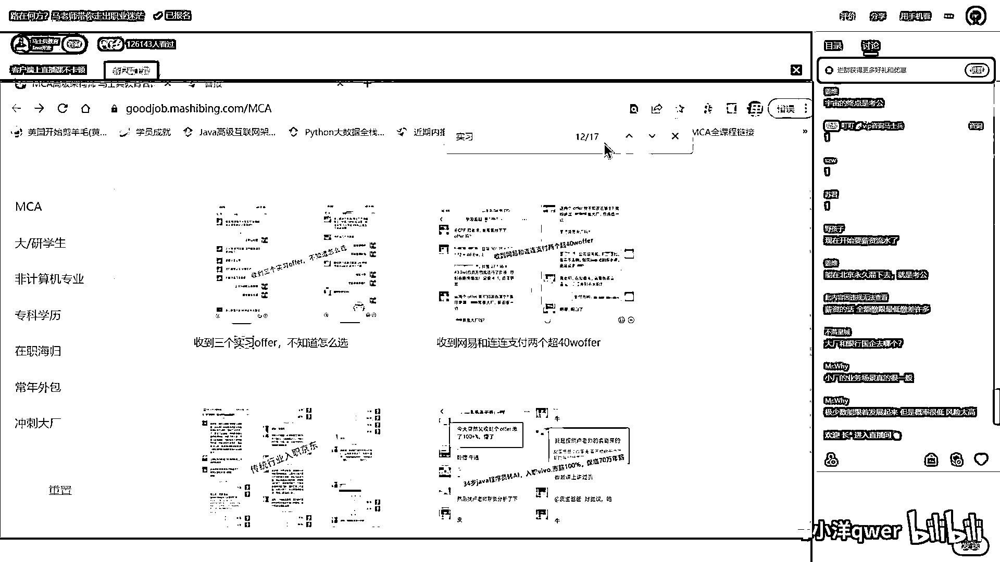

找一个典型的，这是大三，我们带他进入入职的字节。

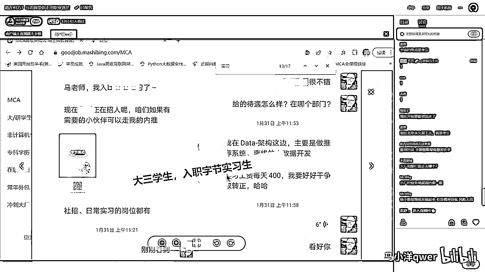

这种企业当然就值得去实习，有这种企业的实习的经验。

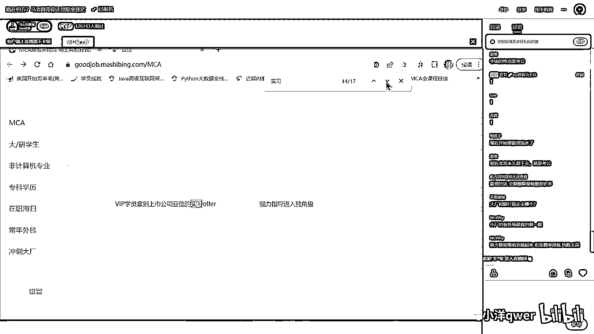

这么跟你说你就好多了，你在后面找工作的时候也就方便的都容易的，最好是直接留在大厂，雅心的实习，AI的实习。

大二找到的。

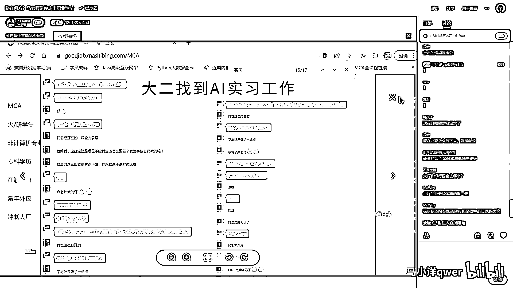

这是疫情期间拿到的实习，大三的学生23岁的。

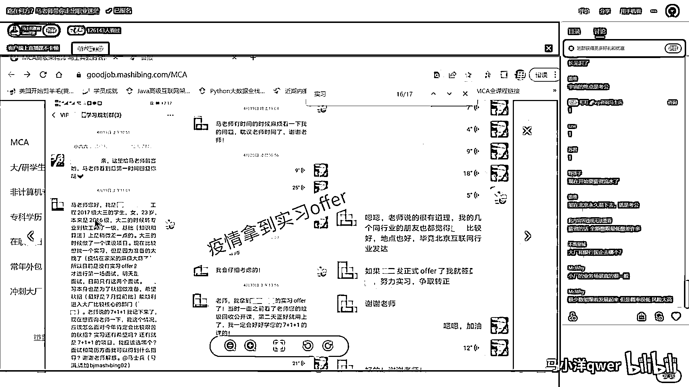

一个女生，这是美团的实习，这是腾讯的实习。

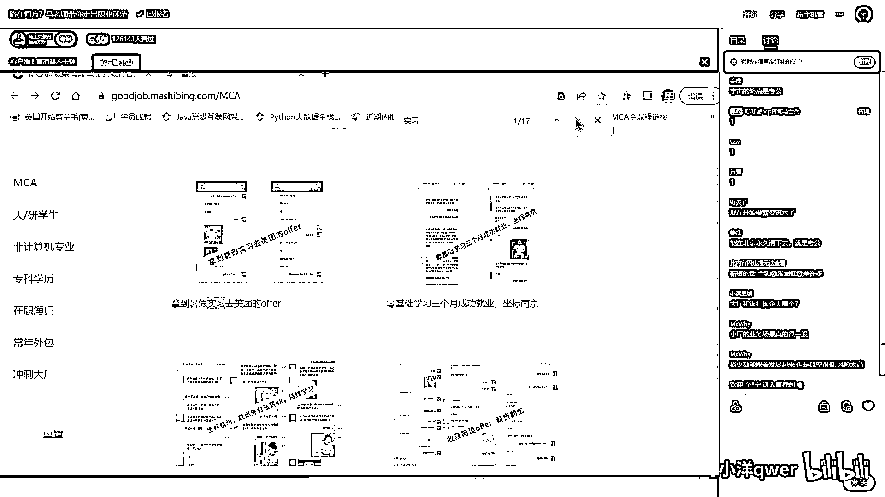

学了半年，好，我教大家呢怎么进大厂去实习。

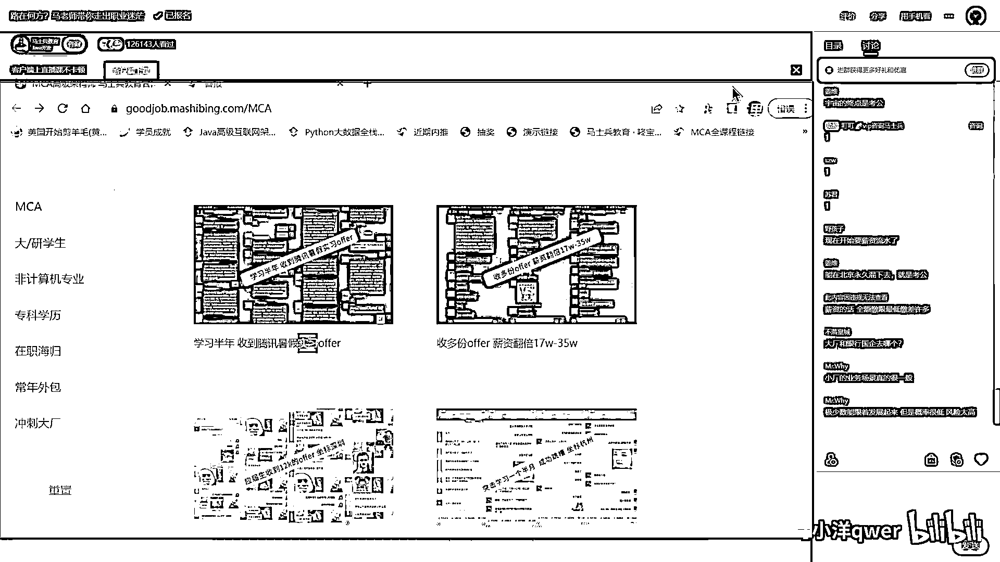

我现在讲大厂好不好，因为呢，你的所谓的中小厂中厂的各种，他们是什么实习，什么找工作，超不过大厂去，所以就给你讲一个最大范围，然后剩下的就是裁剪，你剪掉那不需要的东西就行了。

各位同学进大厂的第一需要是什么，很多人跟着学啊，学买学买车口学家为SE学项目，学前端，学AI，学UI，是吗是吗，这学了一大堆，全走歪了，第一权重叫算法，各位同学一定认真听清楚，你想进到大厂里去。

找工作也好，就是尤其是对于咱们年轻的学生啊，找工作也好实习也好，第一权重叫算法，这个权重是最大的，我可以这么跟你说，你剩下的啊，就是第二权重，第三权重，第四权重，甚至你一点点都不会，只靠算法。

你都可能进得去，来各位听明白老实扣个1，我再说一遍，就是我后面还会跟你说，第二权重，第三权重，第四权重，第五权重什么的。

但是我告诉你啊。

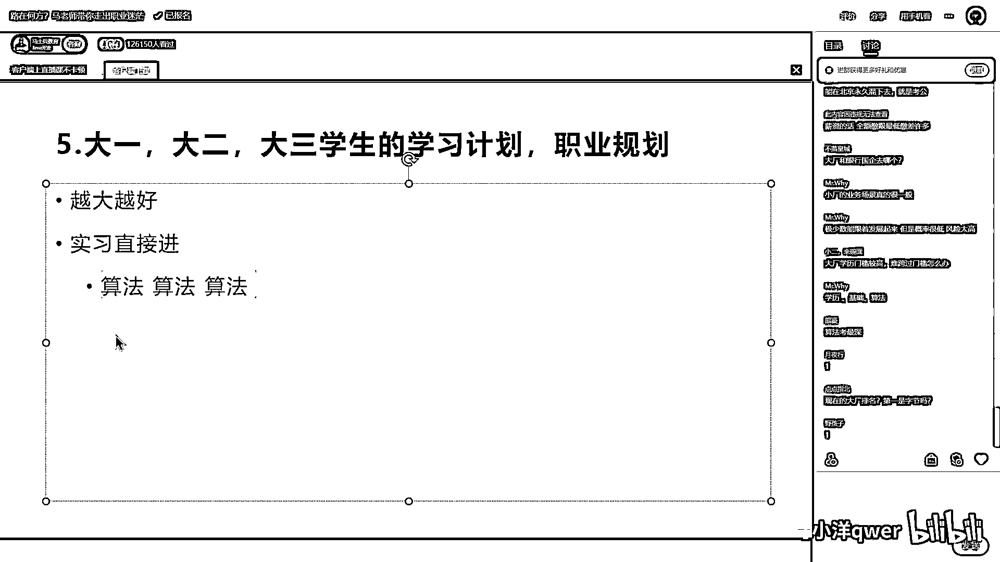

你可能只靠这第一权重就能搞到定，给你搜一下看看，这是算法拿到了自己的offer。

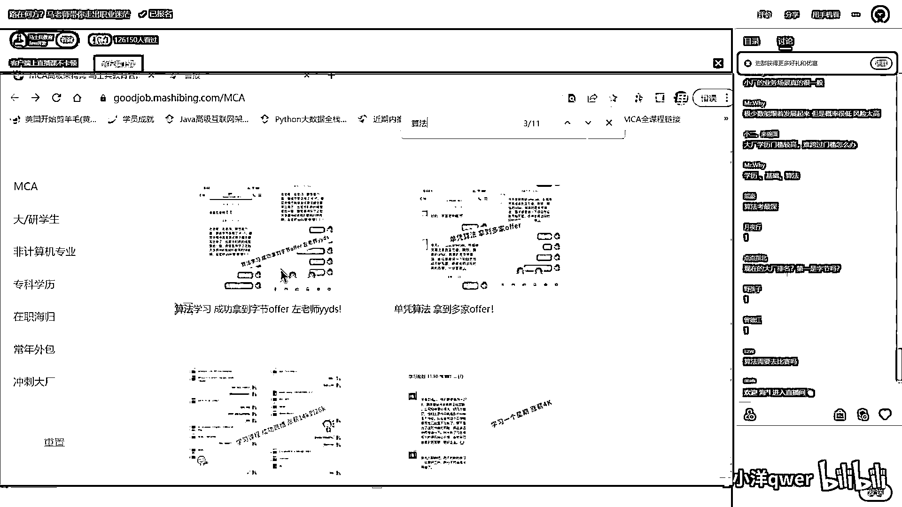

左老师教的，我被自己的录用了是吧，关键点就是算法面试题，全部都写出来了，这是关键点，教的难度要低一些啊，坚持学习大多数mid级的，middle级的，就中等难度的，他做特别顺。

这是凭算法拿了很多个offer，他拿的offer都是牛逼的offer啊，微软的，然后亚马逊的，然后微信的。

全球顶级公司。

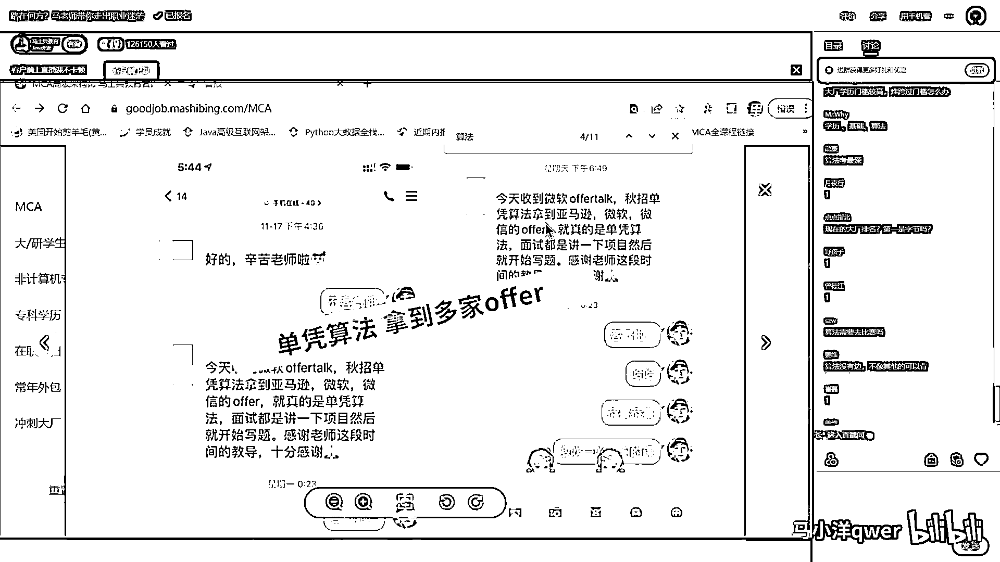

当然大家会尤其是学历稍差的同学，你也不要有压力。

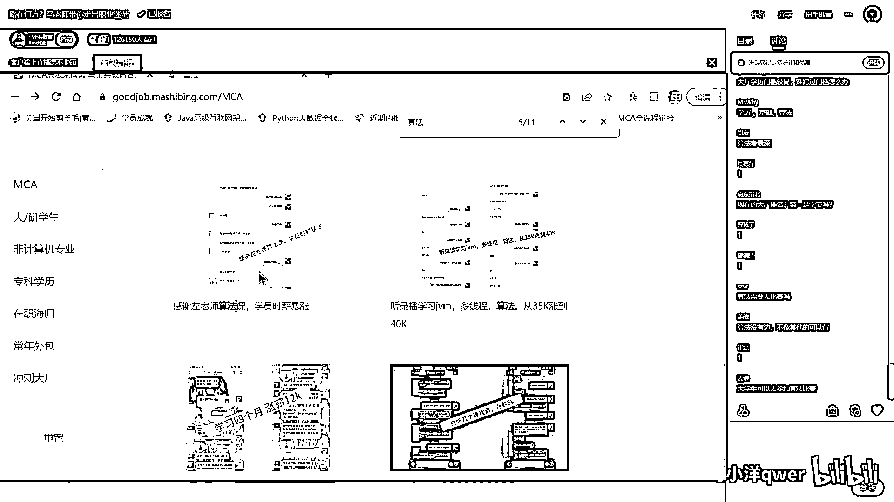

你呢完全可以把算法，刷算法这事往后拖，什么时候选进大厂，什么时候刷，什么不想进大厂，你刷不刷的其实无所谓，所以算法呢是一个极端，左老师课让我进微软半年，我也简单给大家介绍一下，就是我们算法讲什么东西吧。

关于那个算法的老师，左成元左老师，有同学知道的吗，同学知道给老师扣个1，同学知道是吧，在咱们体育课里面呢。

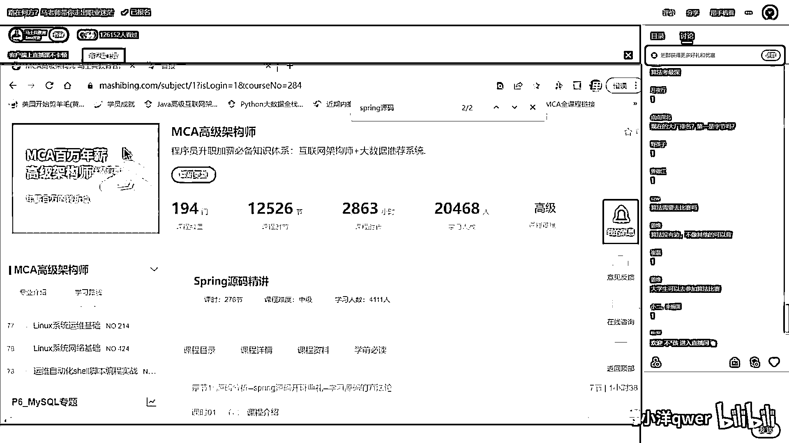

有门课呢就是这个算法，数学构理算法啊。

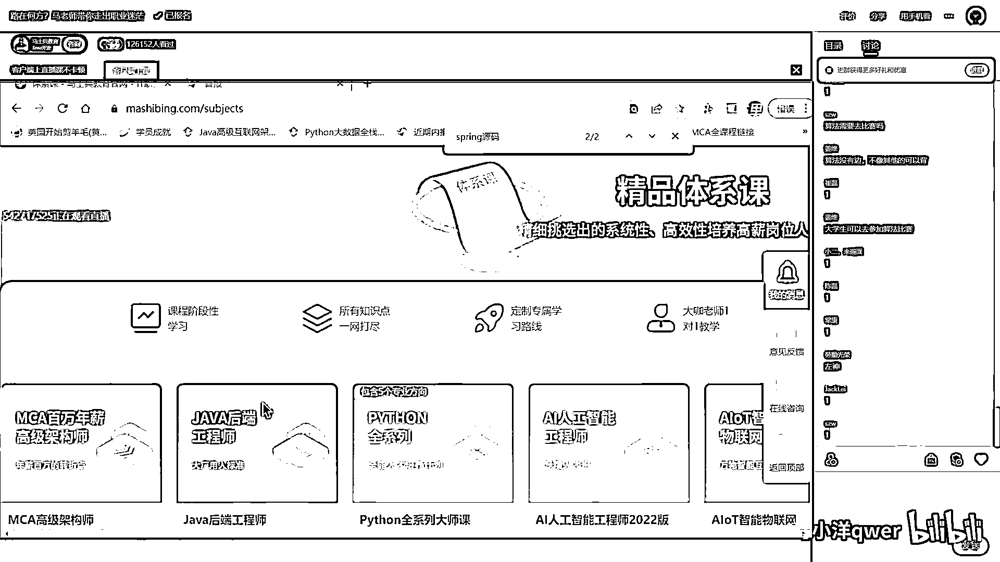

不是那个AI算法，这个要搞清楚啊，这就是咱们程序员们日常用到的数学构理算法的大师课。

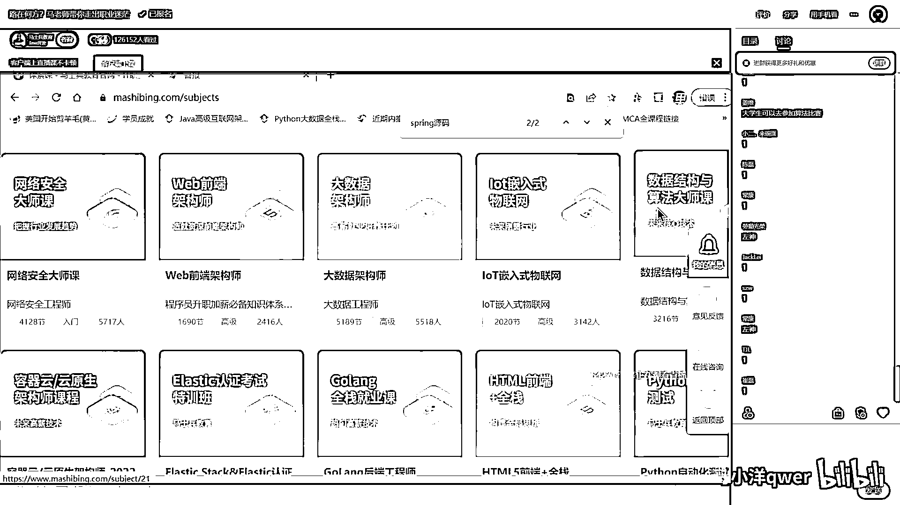

大概整体加起来是400个小时左右，从那个入门级的新手班开始，然后呢进行体系班的学习，体系班学习呢大概讲到，前追数，而叉数的基本算法，还有呢图的问题图可以说，比方说拿华为来讲啊，就是必考。

他的算法题里面一定有一道题是考图的啊，图的拓扑训练图的各种便利，经典的地规，然后呢动态规划，然后再到什么KMP，莫里斯便利啊，Nature啊等等这些，前追数AC自动机等等这些，还有一些资源限制类的题目。

有序表等等，好我就不给大家一一念了，达到这种程度的时候呢，其实国内的大多数，不太有，就是大厂啊，不是特别那个牛逼的那种大厂，基本就可以拿下了，当然你好，进自己的这种呢。

我希望你呢还要是把后面的这个利扣的刷题班，把这个要搞定一下，就是利扣的刷题，每周有营养的大厂的算法面试题，这是咱们每周收到的，咱们同学们出去面试，遇到的各种各样的问题，然后左老师会给大家再梳理一遍。

那么还有呢，复习用的，高频面试的打包，以及呢压题的内容，这个都可以，这是咱们算法课，左老师呢是原来华中科大的，这个，本科，然后去到芝加哥大学，北美芝加哥大学，然后读的研究生，然后毕业之后呢。

在亚马逊工作好多年，然后回到国内，讲算法课，已经讲了好多年，买过左老师算法书是吧，官科上左老师进谷歌是不是真的，完全没有问题，我就这么跟你说，就是左老师的算法课是支撑大家进，国际一线互联网大厂的水平。

这是第一权重好吧，当然算法的学习呢，我也直接教大家一下，就是学习这块，学习算法这块，不要搞突击，这个突击是搞不定的，算就是唯一，其他的都可以做突击，其他的好多的东西呢，我都可以教你怎么去。

怎么去做这个突击，但是唯一的算法突击是搞不定的，你不知道同学们能不能理解啊，就是算法这块是一个细水长流的，和其他的方式并行着学的，这样的一种学习方式是最好的，然后第二权重是什么东西呢。

我们称之为叫面试八股，或者叫基础知识，面试八股吧，基础知识或者叫面试八股啊，这个内容比较多，这个内容特别多啊，408的四门课，操作系统网络原理，那个操作系统网络，计算机组成，还有数据结构。

就是考研的四门课，那么还有一些，还有哪些东西呢，你比如说数据库，Mysql的原理和调优，主要是原理和调优的部分，这些相当于数据库的原理和调优，这个是你们计算机的专业课，可以这么说。

就是各位非计算机专业的，想追上计算机专业，如果从系统学习的角度讲，就这几门课把它搞定，你就追上计算机专业了，还有你比如说和语言相关的啊，JVM 多线程 并发是吧，这些都是好多必考的点啊，细节特别多了。

就是属于什么Redis，然后比如说像思辨源码，设计模式等等，还有一系列的吧，我在这就不一一敲了，总之他这时候问的会特别开放，特别多，各种各样的细节知识就扑面而来，很多同学在复习的时候，老就就复习这一块。

但其实呢，我跟大家讲就这块知识呢，叫做知识的海洋，各种的纷繁复杂的细节，扑面而来，这种你可以这么说，你永远都复习不完，甚至永远都学习不完，你学习多少年，这里面的好多新知识，对你来说还是你不知道的。

也有很多，那这时候怎么做，很简单掌握重点，掌握重点，我原来我们会规划过三加一，就是三门课加一门课，也规划过六加二，就看你具体时间了，也规划过突击，就是看你具体的时间，剩多少该怎么去做，如果是大一的话。

我当然建议你，从早从小，慢慢学，使劲学，争取把它系统化的全掌握，那是最好的，时间也够，但如果你到大三，你就只剩下什么，三个月四个月五个月了，好，这时候怎么办，在其中挑重点，为什么。

因为这个东西是一个概率，你复习了其中几个，他问到的就是这几个，你就可能会过，你复习了90%，他问的是10%，你可能过不了，所以这个东西叫越多越好，我这么讲大家能听懂了吗，听明白给老师扣个一来。

没有问题吧，嗯，27月报名，想听大厂是不是学到春招，春招就会比较大，你七月你秋招，只能说拼一下了，就看你的你的基础知识，到底长到什么程度了，就跟你讲的这个，第三权重是什么，第三权重才是应用的内容。

就是我讲的从Spring，什么什么这个，一直到Spring Cloud，分布式项目这块，所以你看到了这一点，很多人啊，在学校学习的时候，然后说我掌握了这些应用，那些应用老师，我是不是能进大厂。

差得远了两回事，进大厂找工作两回事，我再说一遍，进大厂也是找工作，但是进大厂找这个工作，和你日常用的，找的中小厂的开发工作，是完全的两回事，它的重点也不一样，搞清楚，有好多那个，进大厂的同学。

他可能只会前两个，他没有搞过项目，他也能进到大厂去，有好多呢，掌握了很多这种，实际的当中的应用啊，跟着网上的什么开发了，这个东西那个东西，学了一大堆，但是他也未必进得去，因为什么，重点不一样。

一定要搞清楚这一点，大厂并不是招那个CRUD的，对对对，应用框架的这种，应用级别知识，对他来说并不重要，后面是什么东西啊，就是各种的加分项目，加分的设计，科平发的知识，这个大数据量的知识，是吧。

还有像什么云原生等等，是吧，AI的入门了等等，这种是掌握也行，不掌握也行，多了比，多了比不多好，多了比，就是掌握一些比不掌握好，大概就这么些东西，这里头好多学校都没有教，对，有好多学校都教了。

你们就都能搞得定了，不知道我说清楚没有，当然还是那句话，如果你的目标是找一份普通工作，把前面两个呀，权重放低一些往后放，把这个往前提，就比较容易找到那个入门性质的，入行性质的工作，好吧。

研究生是不是就需要第三个，你要杀大厂，我不管你是研究生，这个权重都是一样的，甚至你刚参加工作，32岁以下，我告诉你，想杀大厂，这个权重都是长都长都长一样的，就是这四个。

他的权重是权重一权重二权重三权重四，我说的是杀那个一线有名的大厂，有些厂子他根本就不要求算法的，好不好，他就要求那个应用级别的，那就无所谓了，具体问题具体分析，但我跟我跟大家这么讲，就是作为一个程序员。

其实正常来讲，算法应该是大家具备的，最基础的知识，只不过咱们国家，好多程序员转行过来的，好多企业呢，他就着急要人来了之后，能干活就行，所以他根本不考这玩意儿，但是对于成熟的，很多国外的企业，北美的企业。

澳大利亚的新西兰的欧洲的，我告诉你人家考什么，人家下面都不考，对于国外的很多企业，下面是都没有的，就考这一个，就考这一个，这里能听明白黑老师扣个1，我再说一遍，国外的很多就考这一个，假如说你有。

这是没有工作经验，你有了工作经验之后呢，对于国外来讲，就再加一项就可以了，这项叫System Design，就加这个，有没有听说过那个，咱们原来东莞电子厂的，有一个女工，到了美国之后，刷题刷了一口。

刷了半年，刷进谷歌的故事，有没有听说过，有听说过的，你扣个1，给老师一点反馈，听过对，所以国外认为，作为程序员，只要你学会了，数据结构与算法的知识，其实像这种应用级别内容，那不是手到擒来的事情吗。

那不是很简单的事情吗，分分钟就能搞定的事情吗，事实也是如此，你见过微软考东西的时候，给你考什么应用级别的，好多东西，No，好多时候，在家如果你是有过工作经验了，他会考你System Design。

这是一个系统活儿，这个活儿呢，是需要你去读一些原理，掌握一些原码，掌握一些设计知识，包括这些设计模式，原码等等，去理解这些东西中间件的，原理性的东西，然后你才能够做得出来的，谁让你有工作经验了呢。

没有工作经验的，这个东西没有，直接就是算法，好就讲到这儿，我相信我们国家，慢慢的也会走向这个程度，算法会越来越受到重视的，以前好多企业不考算法的，现在你看看，有名的企业已经开始考了，他是必考的而且。

必考，他还在TD上演讲过是吧，这个我倒没有听过，本来就属于工科，在乎算法这种思维这些，是的，是这样的，我就讲到这里，好这块，没有问题的，我们就继续下一项了。

好像有一些重复。

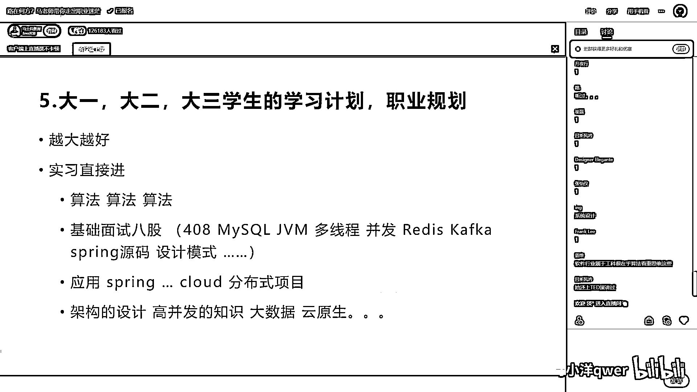

有些重复。