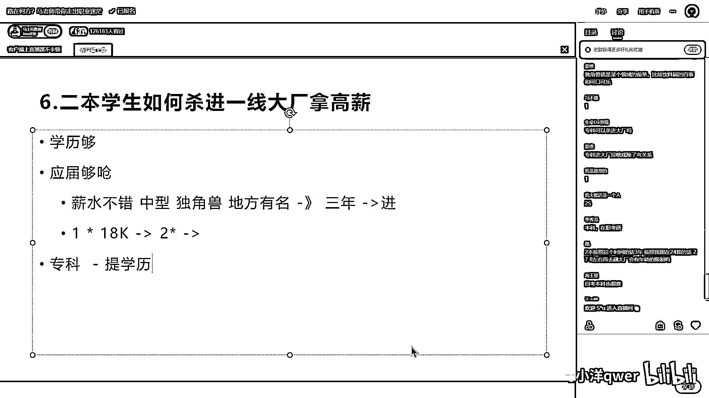
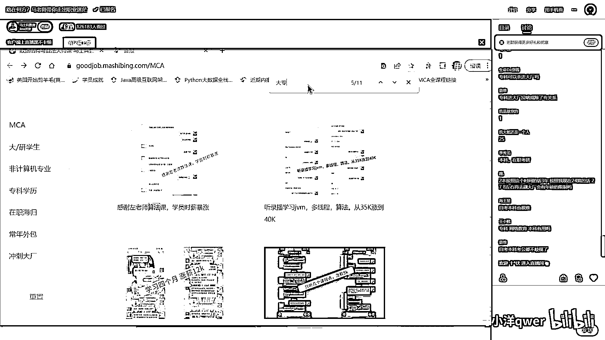
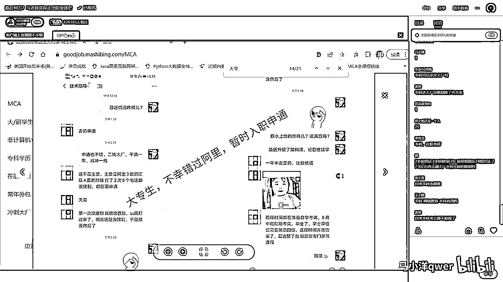
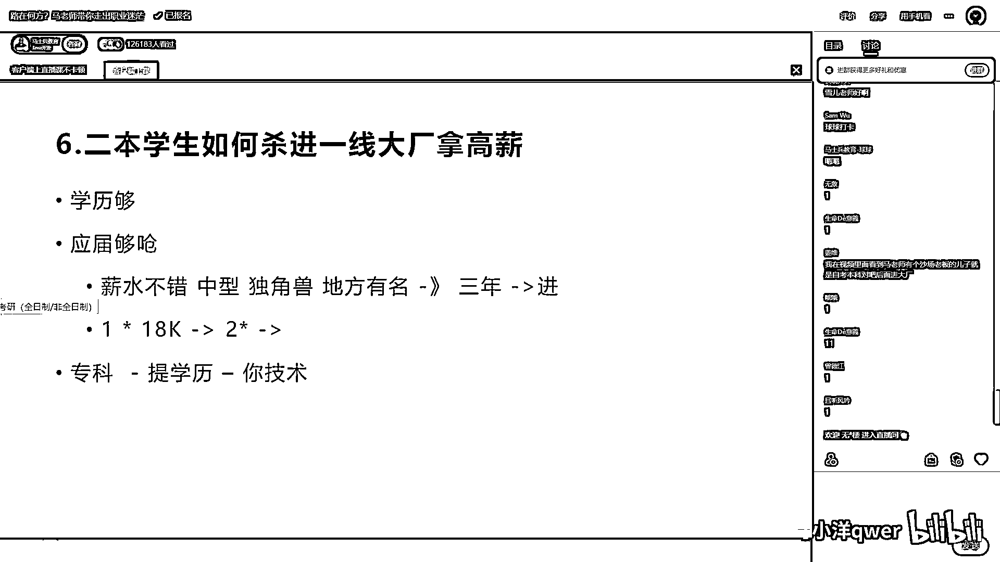

# 程序员秋招 顶级避坑指南！-马士兵 - P6：二本学生如何杀进一线大厂拿高薪？ - 马小洋qwer - BV1Uz4y1x7hC

二本學生如果殺到一線大廠拿高薪，其實剛才跟剛才有一些重複，就首先第一點二本夠不夠殺一線大廠的，就是我是一二本我能不能進阿里，這邊跟大家說夠，學歷夠了，這學歷是夠的，可能突破很多同學的這個認知。

老同學說我學歷不太好，我說什麼學歷啊中北大學，沒有問題知道吧，這麼跟大家說啊，就說你二本學生是可以進到一線大廠的，但是但是我們說，應屆夠嗆，一定要理解這一點，應屆是夠嗆的，什麼叫應屆夠嗆啊。

就是你剛畢業的時候想殺什麼騰訊阿里，京東華為這些一線大廠夠嗆，因為人家不去你學校招，那你這時候怎麼辦，採用的是取先救國的plan B，plan A也行老師也有些其他方式讓你應屆拼一把。

把握性不高但是可以拼，至少不是他的概率不為零，但是我先略過他，具體有什麼需求的咱們再單聊，但我教你另外一種方式，就是你一定要在，你應屆的時候如果能到一家，薪水不錯的廠，或者是什麼中型企業。

或者什麼獨角獸類公司，或者你們當地有名的地方有名的，這種都可以同學們，什麼叫地方有名我給你舉個例子啊，比如說在長沙你進了什麼三一重工，中聯重科等等，你在上海你進深通等等，這些個你進了這個東西。

或者說你在珠海你進格力等等這些好吧，進到這些企業之後爭取能進到這些企業，實在不行的你說我公司人數還可以三四百人，然後我拿了一個薪水也不錯，這樣子也可以，那麼取現就過的方式是在這裡工作滿三年。

然後三年之內練什麼，這三年怎麼練，我上面這張PPT已經列過了，這三年練這些聽懂了嗎，三年頭上就進了，這是Plan B，來各位聽明白了老師扣個1，好吧OKOK，大家聽明白了吧。

那同學說了老師我的薪水不行怎麼辦，薪水不行Plan C，一年頭上要跳一次，注意不可以早也不要太晚，一年頭上跳一次，比方說你入行就是8K8千塊錢，你放心你8千塊錢做三年，人家大廠可能也不要你。

薪水太低了想不出你的水平來，怎麼辦一年頭上跳一次，要達到殺大廠之前的那個薪水水平，比方說拿到18K，這種有沒有可能性可能性巨大，你這一年之內按老師說的練，18K真的比較輕鬆並不難，然後再用兩年。

用18K的薪水帶到一家不錯的企業，待兩年，然後再進，來各位聽明白了老師扣個1，聽我說啊，你像咱們一些老師，他本身就是二本，咱們曹老師也是二本，但是不影響他進阿里，OK，行吧，好我們說專科和三本。

學歷更差一些的，專科和三本等等，首先第一點，所有的專科，我永遠建議你一定要把提學歷這件事情，給我放到日程上，注意你的日程表上一定有一項叫做提學歷，不管你現在年齡多大，你哪怕32了33了。

你現在還是一個專科學歷，我真心建議一定要把提學歷這件事情，苦口婆心的給你要放到日程上，中國的學歷越來越不值錢，中國每年畢業12萬博士，每年的科研的需求其實都4萬，剩下8萬的博士生是四處自己去。

要去解決就業問題的，好多的博士，實際上他是拿了一個很低的薪水，到一家什麼樣的企業，可能為了落戶也好，可能為了幹什麼也好，我了解到的很多的博士，他們的工作的薪水也是偏低的，我告訴你，2萬多的多的是。

就是讀完博士生拿2萬多薪資，多的是知道吧，就是說學歷變得不是很值錢，你就可以想像一下你專科的學歷，你還有什麼競爭力，是沒什麼可說的，你學歷這塊，你一定要把提學歷放到日程上來，當然是越高越好。

你最差也要給我讀一本科下來，你才能慢慢的打開你的職業空間，我會告訴你後面提學歷，怎麼樣系統化的進行提，但是提學歷的同時，你要想殺進大廠裡去，有沒有可能性呢，可能性是有的，但是你肯定要比本科差。

比211、比985的可能性要低，這件事我一說你應該能理解，但是它可能性確實是有，我給你舉個小例子。

你看咱們以前的同學裡面，我搜一下啊，我忘了他寫的是大專還是專科了。

我搜一下大專吧先，這個同學，這同學他面試的時候他阿里三面，正在四面就是阿里三面已經過了，正在四面的時候，兩次八個電話，阿里給他打了兩次，給他打了八個電話，當時就在面神通，結果就去神通了，神通也可以。

也算是不錯的企業，很不錯的企業，拿薪水就行了。

有沒有可能性有，但它概率一定要比那個本科要差不少，要搞清楚這點，所以當你學歷這塊沒有辦法和別人去拼的時候，只能拼技術，這沒什麼可說的，你只能拼技術對不對，而且你想想看，如果前面我站了兩個人。

一個是專科生，一個是本科生，技術還差不多，我會要誰，你自己問你自己，神通是啥快遞嗎，對神通快遞，所以你不僅，你要提技術，而且呢你的技術還要超過那些跟你競爭的本科生，企業只認同招非同招，自考網教就寫了。

差別不大，你這麼說話其實是一點責任都不負，中國大概有上百萬家上千萬家企業，你說的只是其中一部分，我舉個簡單例子，前面站了一百個美女，你說我是專科的，可能只有三十個能夠接受你，你說我是本科。

還不說我是到底是什麼網教的還是什麼呢，這個數字可能就提升到四十了，你說我是同招，這個數字呢可能就能提升到五十六十，它是這麼一個概念，來這塊能聽懂你老師口音，不要說這種絕對的話。

只能說明你認知不到位好不好，實際上沒有什麼絕對的事情，我們就聊到這裡。

那我們現在。