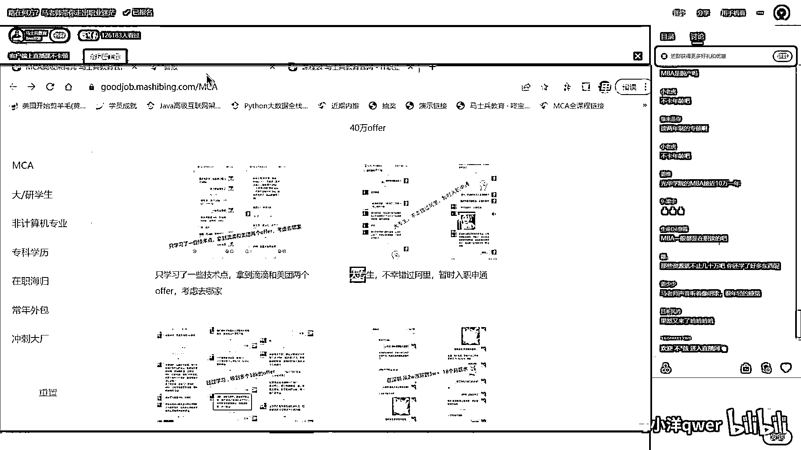
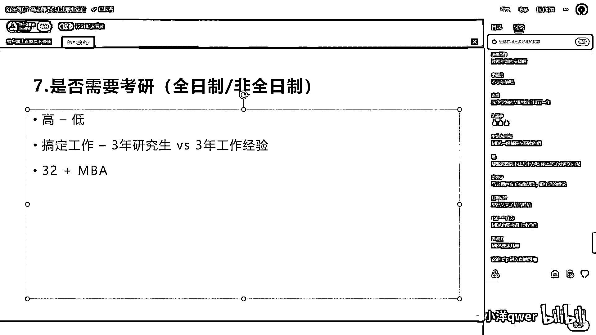

# 程序员秋招 顶级避坑指南！-马士兵 - P7：是否需要考研（全日制非全日制） - 马小洋qwer - BV1Uz4y1x7hC

來聊這個問題就是是否需要考研，考全職還是非全，我覺得這個問題你們自己有答案了嗎，學歷只影響面試的機會，是的，是否需要考研呢，好我再說一遍，學歷高永遠比學歷低好，沙場老闆的兒子，嗯是的。

那個學歷高永遠比學歷低要好，這還用說嗎，高永遠比低要好，這裡面比較討厭的，我跟大家說一個比較討厭的事情，有一點負面，但是大家聽聽了解就會知道，你知道有一類，特別噁心的研究生啊，或者說博士生啊。

就是大概在國外讀一個，什麼，一年，就拿研究生了，拿研究生學歷了，英國水碩，還有呢，有的博士特別土的那種不是馬來西亞的，還有那個韓國的，有的是白俄羅斯的，原來還有烏克蘭的等等，這些博士長什麼樣呢。

出去之後呢最短的在外面，國外待八天交完錢，然後這個學歷可能就拿到了，最噁心的是這批人，他們回來之後，他們會找到一大批，國企招聘的，好多國企的招聘現在都研究生起步了，國企的招聘，還有一部分是落戶的要求。

你博士的我就給你落戶，我不管你哪個博士等等，就頂替了國內很多很多優秀人的，崗位的機會，尤其是這些出國讀的，好多還是有錢有權的一批人，這是現實情況，當然我相信這個情況如果愈演愈烈，國家一定會出手管這件事。

總之呢現在的，這種學歷，肯定是要越高越好，那全日制一定比非全要好，這個，毋庸置疑，但是這裡面有一點，我提出我的看法，就是說對於你畢業，已經可以搞定一份工作的時候，就說我搞定工作沒問題，假如建立在這個。

角度，來說的話，那麼你去讀一個研究生，讀全日制的，相當於你要對比一件事情，三年研究生，是不是一定比得上，三年工作經驗，我畢業，我就到神通了，我在神通工作三年，和我還要去讀三年研究生這件事情來比較。

你要比較這個東西，能聽懂嗎同學們，這個還真不一定，就是這個時候你要具體看，我讀的是什麼學校的研究生，以及你這三年工作能賺多少錢，我三年工作經驗之後，我能夠拿到什麼樣的機會，我三年讀研究生的時候。

我肯定是要喪失這三年的機會的，我喪失的損失夠不夠彌補的上，這個就要具體問題，具體分析了，好，各位能聽明白了，也老是扣個一，至於你說我要讀一非全的，那就無所謂，你就去讀，還是那句話有比沒有強。

有同學又跟他往上抬槓，說老師啊人家就不在乎，必須看全日制大，我跟你說那是部分企業，再說一遍部分企業，你有一定比沒有強，你一定要秉承這個觀念，說到這裡，我們再來說學歷這件事情，我永遠建議大家。

我給大家一個粗略的說法，就是32歲以上的同學好好考慮，可以考慮讀MBA，因為這裡面就涉及到管理了，它會大大的加強你等個的，那種格局演界，以及你就業的空間，當然前提是你能夠，接受你將來是一個。

綜合性的綜合素質的人，這我就不展開了，咱們簡歷模板裡面，有一個44歲的大哥，原來是專科，自考了本科，讀了MBA，年薪是百萬到160萬，總之提升自己吧，好不好，MEM比MBA差遠了，一分錢一分貨好吧。

所以研究生這塊，到底怎麼讀，你要看我要讀的是哪個學校的研究生，然後呢對應我能找到的工作經驗，到底長什麼樣，你說挺差的一個學校的研究生，是吧然後，我的工作經驗，還真未必比得了，你說我985三年的研究生。

我建議肯定是要去讀的，所以這個東西呢，不一樣具體問題具體分析，好吧我們就說到這，MBA是脫產你可以讀脫產，我不建議讀脫產，你脫產你損失多少錢你想想看，你32歲能讀上MBA的。

甚至說那個企業裡能幫你報銷一部分的，你都是那個頂尖的人，都很不錯的人，都是願意自己有發展的人，你掙錢你這個，你這個你脫產你，工資光差就差多少呢對不對，光華學院MBA接近10萬一年，那你有沒有考慮過。

光華管院MBA讀完了，你的收益是多少，你光看說10萬一年，好我們同一課堂上，有的課程五六千塊錢，你得想想看，你讀完之後收益是多少，整個課時加起來200個小時，好我們課貴一些，我們課一萬多塊錢。

我們課程確實貴一些，但是你要知道我們這個課，第一我們水平很高。

第二，光這個課是已經講完的課。

我們就講講完的課，別的不說，你講完的課是2000多小時，它能比嗎，多做比較好不好，要看你的收益，你付出10萬收益20萬，你付出5000收益6000，你自己想去，是不是，這個東西不一樣，好不好。

然後呢像我們這是已經講完的更新完的課，除了更新完的之外呢，我們還有一個正在直播的課，這個是，這是咱們課程表。

這個是咱們的課程表。

這是咱們每天直播的課程表，各位同學你們自己看就行了，我們有好多那個講課的機構啊，他們每週啊就三節課，是吧。

然後每節課兩小時，好了一週六小時完事，這是咱們的課啊自己看。

每天排的滿滿的，光我們的直播平台，每天的流量4個T，每天流量是4個T。

你就會知道有多少同學在這學習，有多少同學在這長進。

加入我們，讓自己變得成長更快一些。

更有效率一些。

你投入這點錢，你的收益要遠遠比這點錢，收益要多得多，好。

當然除了直播錄播，嗯講這就是。

稍微插播一點，今晚的活動，插播一點點。

今晚呢，我們在馬老師的直播間，今晚報名課程的，第一我剛才講過了，我會送大家一本，golang的全站的就業課，方便你呢將來，萬一真的有哪天你用得上，好吧，這是我目前正在講的，金九銀十的面世突擊。

另外呢再強調一個很重要的問題，這也是最新，剛剛申請到的，只限今晚明天一定真的就沒有，這個是很難申請到的，現在，嗯是什麼問題呢。

主要是這個。

主要這個問題，是咱們小姐姐，跟我強調了半天的問題。

就是三加十五的，教育助學，這是三加十五是什麼意思，前三個月呢你是不用付一分錢，然後後面分十五個月分期付款，注意這不是，這是一個分期付款，分期付款，就是你八月九月，十月十月都是零元，然後十二月以後開始。

分期補期學費，這個呢就給那個目前經營壓力比較大的，但是注意啊你這個分期，是必須要還的，是必須要還的各位同學，你不要認為說我分期是不是後面就不用還了，是給你短期資金緊張的同學用。

是給你短期資金緊張的同學用，最後一次的機會，就是20號到22號，就這三天我們好不容易申請到的，限量，滿額隨時就截止了，這我一定要給你們強調一下，一定要評估自己，你如果說現在說離職了。

然後呢想快速回到行業，我現在手上沒有錢完全可以走這個，三個月讓你回到行業一點問題都沒有，很輕鬆，就是你一定能還得上，但是你說我就是學生，我就根本就不知道那個後面，能不能還這個錢你就別用啊。

我就不建議你用，我再說一遍，希望大家聽明白這件事，這不是一個，那個說可還可不還的東西，你要用這個是必須要還的，但是你短期資金緊張，或者說每個月能拿出來的錢並不多，考慮這個沒多少錢。

好強調一下好吧。

OK，另外呢，如果採用這個學生證的話呢，也可以享受12期的免息，如果沒有學生證，可以享受6期的免息，還有一個呢，就是今天晚上在馬老師這報名，我送一張白金卡，我送一張白金卡，這張卡什麼意思。

我們每年直播的課程，很多很多，那麼，現在報名，兩年以內的直播課，是免費的，兩年以後的直播課，假如你後面還想聽我們直播課，188塊一年，如果沒有這張卡，1888，如果有這張卡，188，我們只收一個流量費。

剛才講過，我們現在平台的流量，每天就是4個T了，後面還會再增長，所以呢，維持我們正常的運轉，我們需要收一個流量費，當然也只有這個流量費，你就可以免費再聽一年，你如果不想聽了，188不交就行了。

原來的你還可以繼續聽，大概是今晚的活動。

OK，我們繼續來聊。

咱們職業發展的一些問題，剛才是講到哪了，咱們就是需要考驗這件事情了，好，學歷這塊，大家還有什麼要問老師的嗎，有的話你摳出來，有利息嗎，沒有利息，好，學歷這塊，還有什麼要問老師的嗎，不知不覺已經。

是10點40了，哪些學校的MBA值得去，你要說的話，肯定就是什麼，清華了，北大了，中歐了，長江了，復旦了，越好的學校越好，這個也需要看你自己的能力，跟經濟實力，比沒有強，嗯，江維問。

21198我記得你也可以，簽保信協議，你來線下可以簽的，嗯，你到咱們線下來，有我們老師來盯著你學習，我們就可以跟你簽了，那麼有興趣你可以找咱們小姐姐，問一下好吧。

但是你說線上我們是沒有保信協議的。

線上我很難保證你，我說讓你今天學兩個小時，但是你到時候不學，我怎麼給你保啊，保不了的，你像線下我給你舉個例子，線下我們為什麼可以保信你，因為你不來學習我們老師是需要過去找你的，像線下我們。

我們在長沙的這個班，你遲到，不來學習，我們班主任是需要去那個，直接去宿舍把你揪出來的，當然今天，說起這個事來呢，我也比較生氣，今天是剛剛勸退了一位同學，這同學他媽的，sorry，不好意思爆粗口了。

快氣死了，就是真正的皇帝不急太監急，線下只有入行，入門，只有入行的選校，線下沒有加購啊，加購你正常的不要離職啊，你每個月賺的錢我老師就能讓你漲薪，根本就沒有必要說，非得來線下我們盯著你漲薪，那沒必要啊。

你來線下你說你耽誤好幾個月，自己不賺錢你何必呢，這麼多的同學，已經漲完薪了，這沒有什麼，你跟他們難道還有什麼，大的區別嗎就你漲不了，那怎麼可能啊，漲6k的四個offer，年薪20萬漲到38萬的對不對。

漲薪7k的，漲11k的，DD50萬offer的等等，就是說這種的啊你不要離職，不要離職，你每個月賺的錢老師就能讓你漲起薪水了，沒有這個必要啊，我說的是什麼呢，就是說入行有困難。

入行確實有困難自律性也不高的，說我，我線上學習我覺得我自律性不好，那你就來線下來老師盯著你，可以跟你簽保薪協議，今天當然你保薪協議，你不按我們來不聽我們的，那就勸退只能勸退，今天剛勸退一個，氣死了。

不來上課，然後遲到了人家別人把他叫醒了，還惱，然後遲到了，乾脆就不來在宿舍打遊戲，真是皇帝不急太監急，這種的我們就直接勸退，不跟你，不跟你，這麼說不跟你置這個氣，太內殺了，哪個城市有線下。

目前有兩個城市長沙和上海，你可以選一個，都可以。

再會，嗯。