# 什么样的程序员简历一看就没戏？当代互联网HR最喜欢的简历套路有哪些？马士兵告诉你普通程序员写简历千万别太老实！ - P11：成都8k简历指导与建议 - 马士兵小鱼 - BV1oP411Q73J

那下一個。

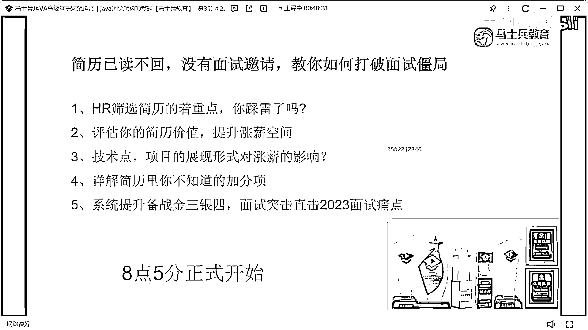

這個小哥哥來看一下，這是我說的那個問題啊朋友們。

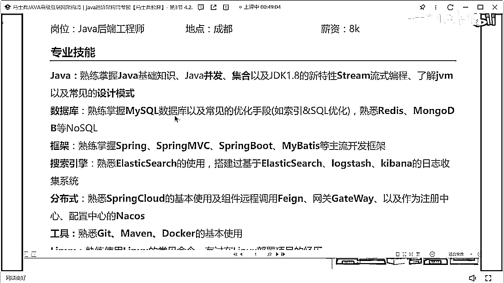

就是技能這塊，我不希望，給大家自己去加這個分類，沒必要，你就把你所有的技能，1 2 3 4 5羅列出來就夠了，沒必要去給他加這個，加這個分類，然後轉到MySQL，把Redis 盲目DB合到一塊了。

SSM，ELK平臺，Smart Cloud，這個技能。

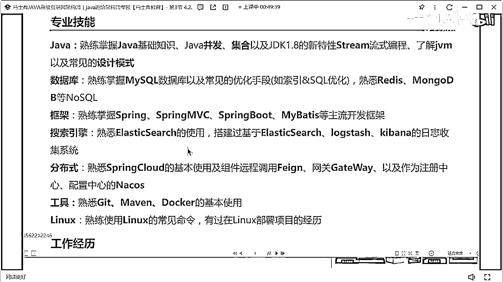

2020半年半年的工作經驗。

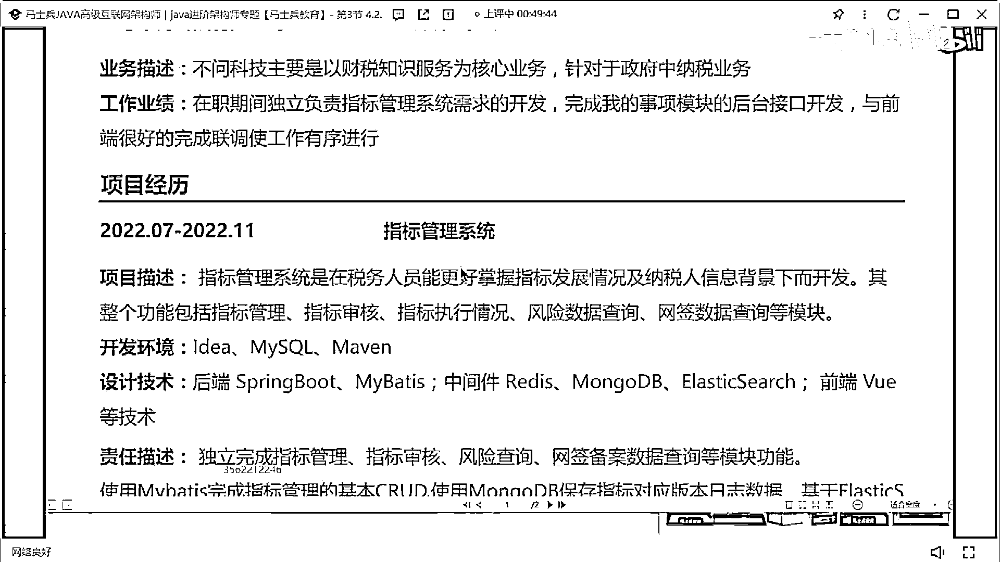

指標管理系統，那是中大互動平臺。

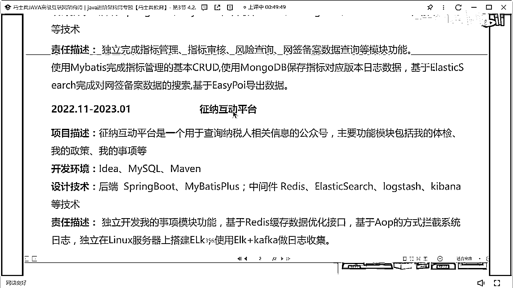

我說一下這個問題啊。

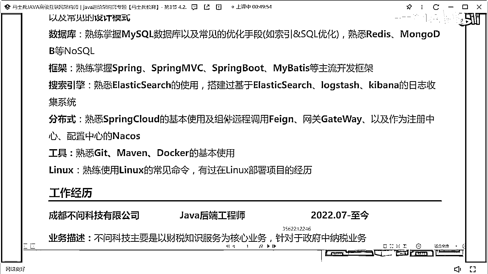

第一個，有很多人一直覺得老師我不會寫技能，有啥不會寫的，這條技能如果這條讓你們寫，你們會怎麼寫，那注意啊，如果你是一個非硬體人生，你已經有正兒八經的工作經驗了，你的技能是不需要這麼去寫的。

不需要寫這麼散，你明白嗎，你可以怎麼寫這東西，主要工作經驗比較多了，要寫一個，聽通，聽通，或者寫一個熟悉，Java，對不對，然後說多年，開發，經驗，具備，良好的編碼，習慣並熟練使用，設計模式就夠了。

就夠了，你現在是有工作經驗的，也不需要把它降高了，第二個比如說MySQL，MySQL怎麼寫，你可以這樣寫嗎，如期MySQL，對MySQL的，事物，索引，座等相關，實現原理，有深入，理解，並參與過，線上。

項目的，優化，工作，能這麼寫嗎，能懂這意思嗎，把你的技術深度和你的技術細節，展示一下，這塊你挑你自己會的東西寫嗎，然後後面給別人埋個伏筆，埋什麼伏筆，我做過SQL優化，那這個東西。

列到這塊的意義在什麼地方，就是引導面試官去問，你做過哪些SQL優化，那麼你是有機會和有能力，提前把這些SQL優化的案例準備好，準備好，明白嗎，所以好好改你們寫的方式，你說你會SSM。

Winbox這些開發方向有啥意義，你後面可以加一個東西嗎，這在加個啥，這個地方加一個什麼東西，能看出來你能不能凸顯你的技術深度，這塊加上能凸顯你的技術深度，就加一句話就行，並閱讀過核心原碼，懂嗎。

引導他去問你原碼，你說老師我沒看過原碼怎麼辦，能不能看看IOC的原碼，能不能看看循環依賴的原碼，能不能看看自動裝配的原碼，能不能看看Splineboard啟動流程的原碼，這四個問題能不能背下來。

問到你其他的東西，你說老師不好意思，你們也說不好意思，這塊我沒接觸過，我說的看過核心原碼就是這四塊，這四塊你看你有沒有想問的，能不能這樣說，牛皮吹破了，不吹你就這麼寫，不吹你就這麼寫好不好。

不吹你就這麼寫，你就寫上你會這些框架就完事了，原不了能怎麼辦，我就寫了我閱讀過核心原碼，問到了我就是不會，能怎麼辦，會怎麼樣，會怎麼樣你告訴我，不就是不過嗎，不就是面試不要你嗎，對不對。

所以你先去想辦法拿到面試機會再說，好不好，老怕被打擊收起你的玻璃心，老怕被打擊，被打擊了怎麼辦，被打擊了怎麼辦，老怕被打擊收起你的玻璃心，老怕被打擊，被打擊了怎麼辦，被打擊被打擊了嗎，你回來哭一場。

我在被窩裡面好好哭一場，還能怎麼樣，好吧，剛好看一個同學說了一句話，說我去了之後幹不了活怎麼辦，誰說來著，誰說一個去了幹不了活怎麼辦，你先去了再說。

先別擔心能不能幹活。

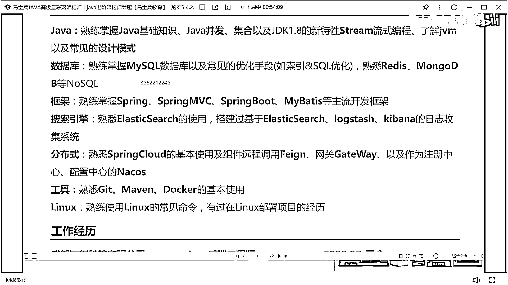

這就跟什麼一樣，寫了不會去公司打掌。

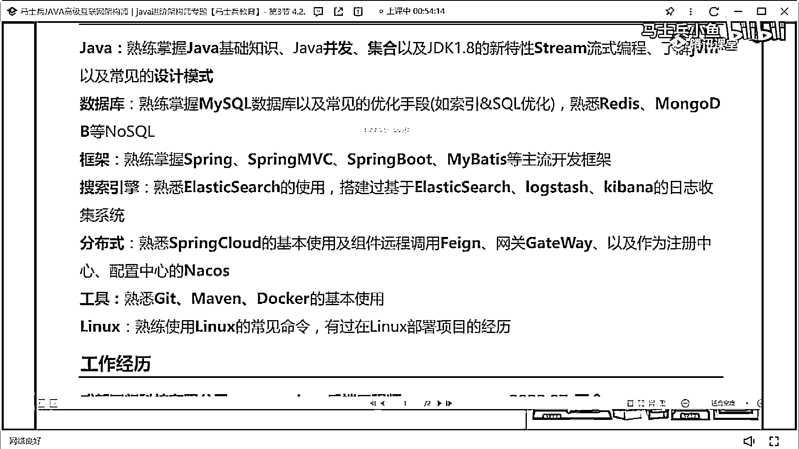

不會能怎麼辦，最起碼說你能感受一下面試吧，最起碼你能知道，面試官看完你的簡歷之後，他對哪些點比較感興趣了，對不對，最起碼你長了一次面試經驗，你沒有什麼損失嗎。

好吧。

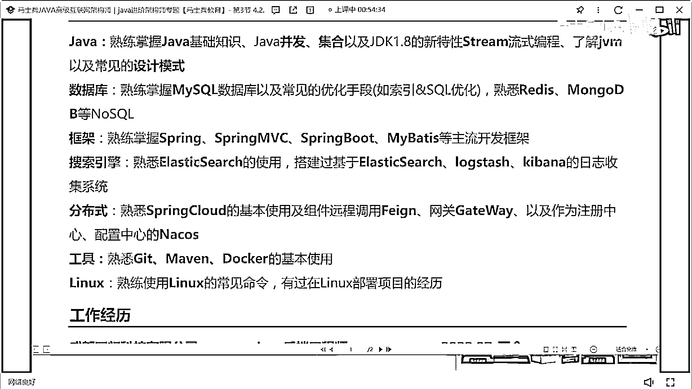

就這樣不多說了，然後工作經歷這塊。

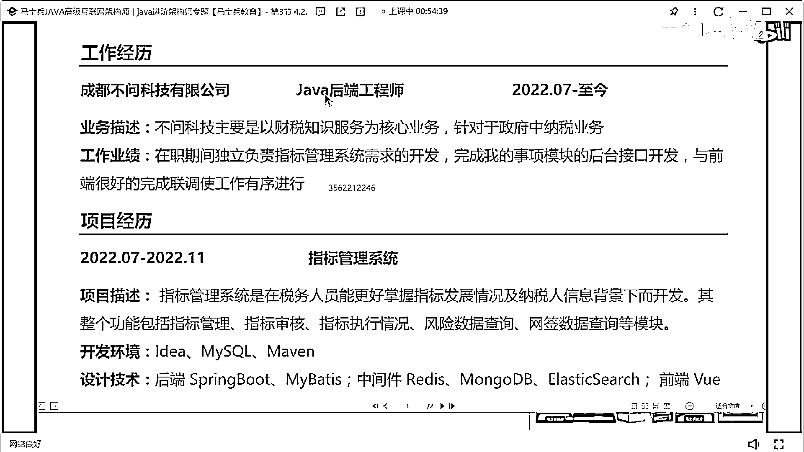

這可以這麼寫的問題，然後這個項目也是我說的，就這個項目寫的有點簡單了。

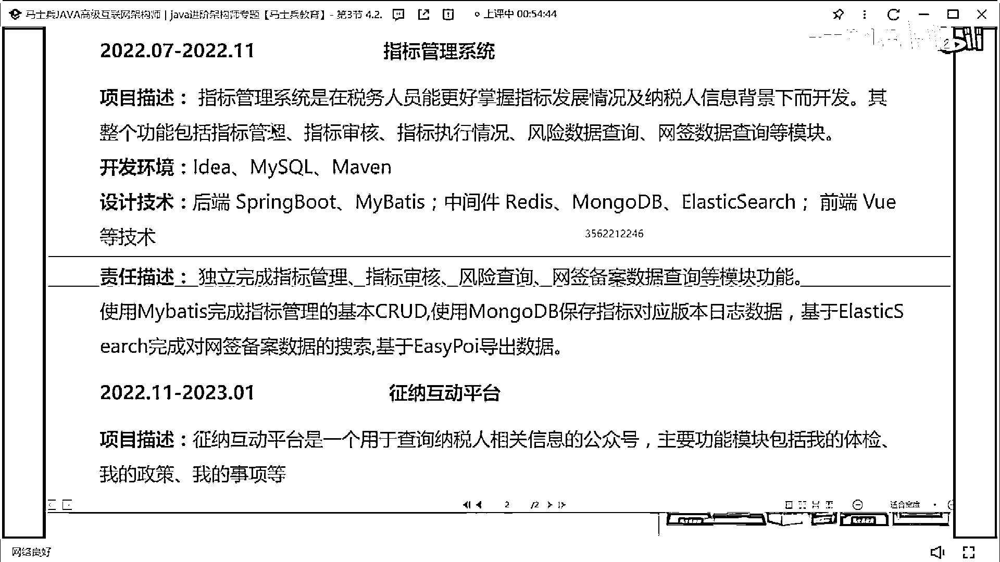

指標管理系統的就是一個後台管理項目，這個你說要包裝其實也沒啥可包裝的。

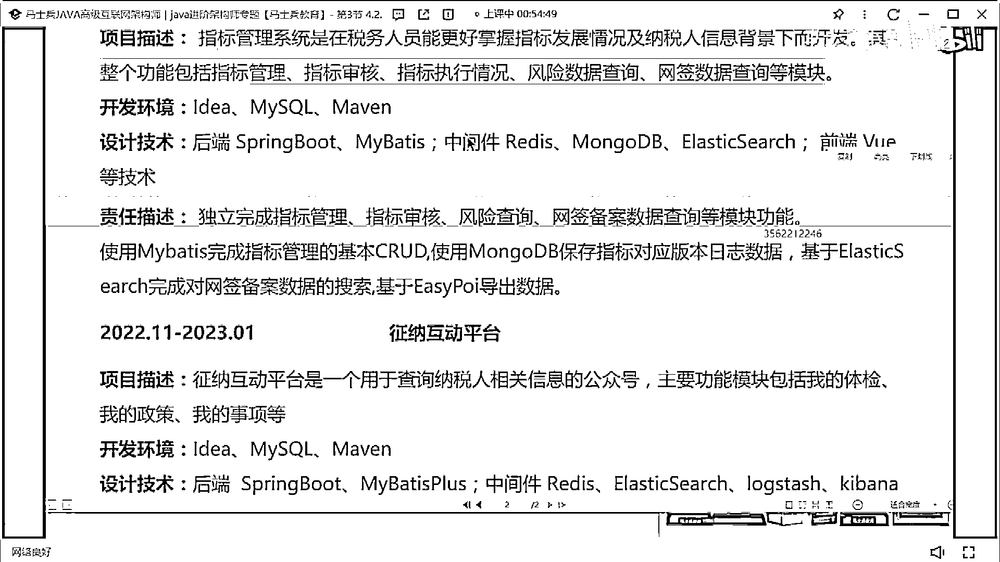

然後這個徵納互動平台，然後裡面包含什麼體檢，體檢了政策了事項什麼之類的，這塊最好可以說一下，包裝一下你們這個平台大概有多大，然後你們大概有多少，每天有多少個訪問量，然後目前積累的VIP用戶。

或者說客戶用戶大概有多少。

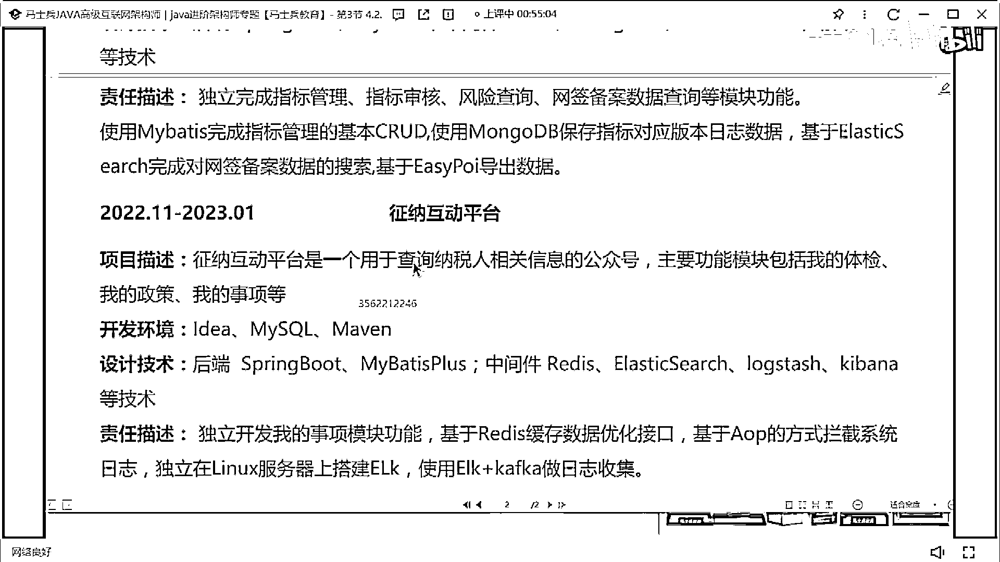

最好加一下數據量量數，然後這裡面有很重要點，一定記住啊，不要去給我加這樣的東西，面試你的是技術面試官，他對於自己的技術體系，有自己的認知和了解，你不需要告訴他，這是前端的技能，你也不需要告訴他。

這是後端的技能，你也不需要告訴他，這是什麼技能，不需要分類，把技術名詞羅列一下就OK了，好吧，然後職責描述這塊一定記住，一定要分條寫，12345678，把它展示清楚懂了嗎，把它展示清楚。

不要寫成一個段落，寫一個段落之後，我很難從裡面發掘到重要點和核心點，好吧，過了啊。

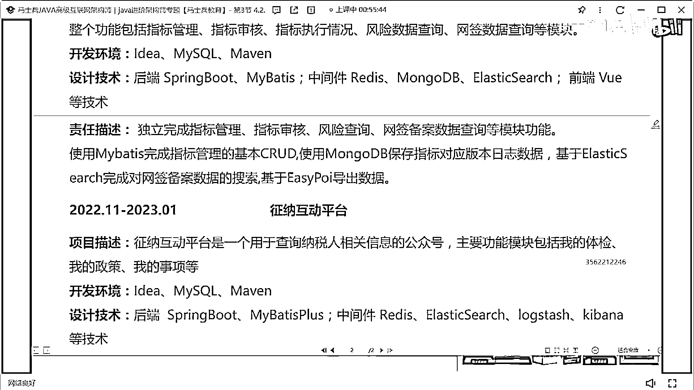

不說了，看今天能不能篩選出來一個讓我比較滿意的簡歷啊。

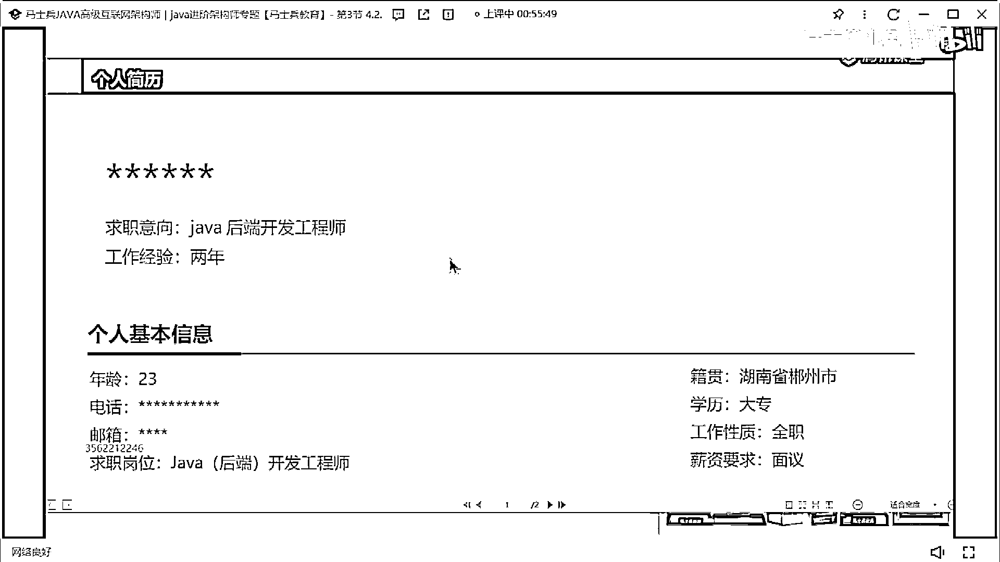

感谢收看 喜欢我的视频别忘了点赞 订阅 转发 打赏支持明镜和点点栏目。