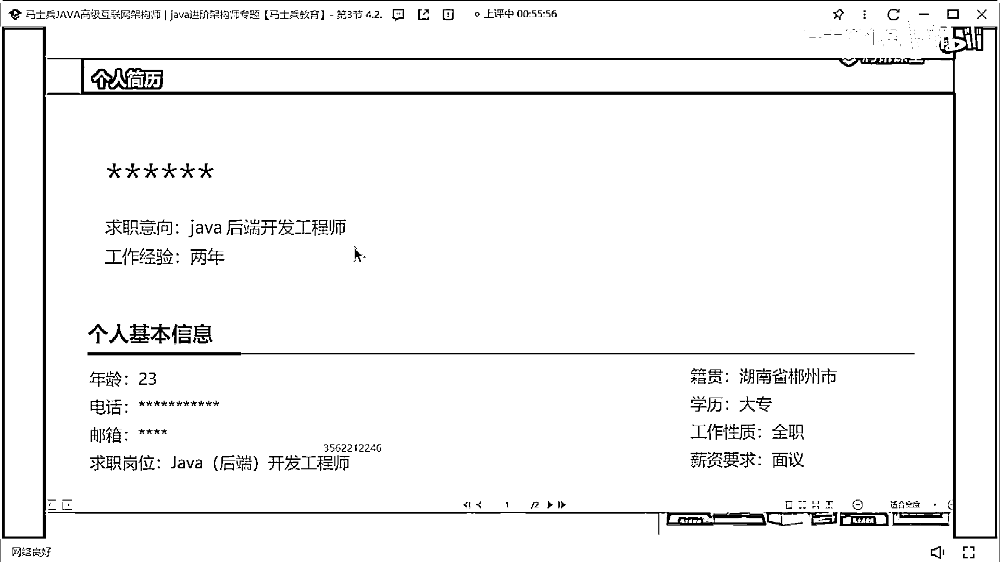
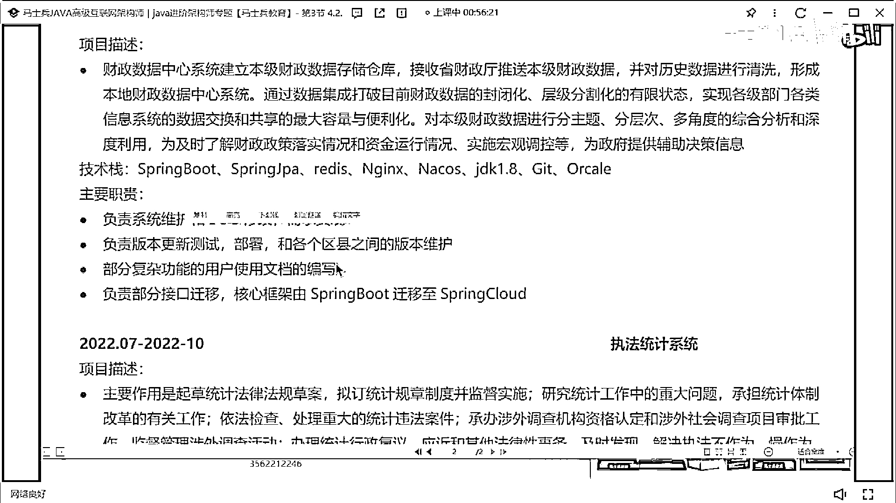
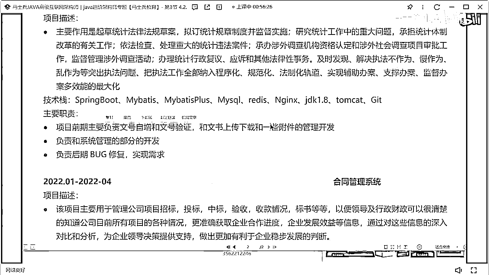
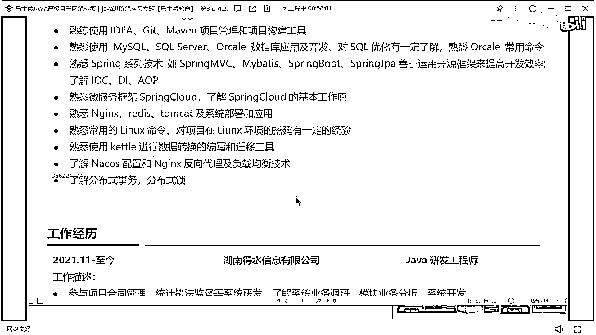
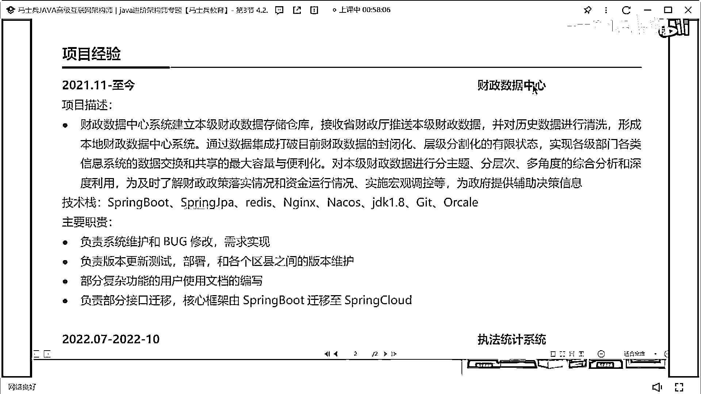
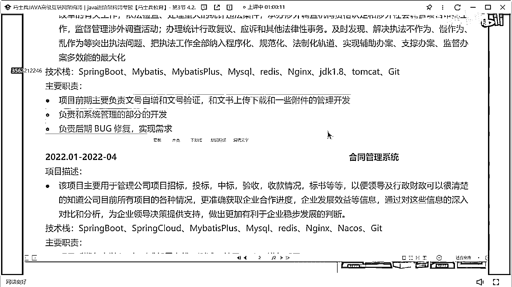
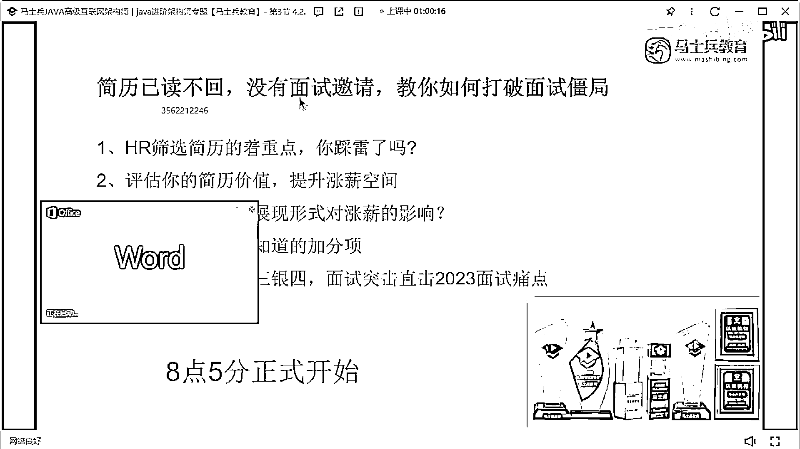

# 什么样的程序员简历一看就没戏？当代互联网HR最喜欢的简历套路有哪些？马士兵告诉你普通程序员写简历千万别太老实！ - P12：专科学习一年半Java经验简历指导 - 马士兵小鱼 - BV1oP411Q73J

看這個同學了吧，十萬高企，我覺得一般的項目都扛不住十萬這樣的一個東西。

23歲大專的一個學歷，十萬技能描述，這是21年10月份，一年半的經驗，財政數據中心，執法統計系統。

合同管理系統沒了，這個簡歷給多少錢值多少錢。

大概這錢值多少錢，8k，大概也就是10k左右，10k左右的一個區間，這個同學你記住了有一個很重要的點是什麼，你現在學歷是大專，大專學歷不是很佔優勢，所以這個地方不要有了，大專學歷不要在這展示。

下面單獨放一個模塊展示學歷，一線程式二線程式給不到，二線程式給不到，他這個地方雖然寫的會有一些問題，但是最基本的技術的寬度還是展示清楚了，但是在描寫的時候，在描述的時候。

像這個postman什麼swagger，idea get a moment，這東西沒必要放這麼前面，大家一定記住，你們在寫技能的時候，寫技能的時候，用側重點的寫，你想讓面試官重點問的技術往上放。

非重點問的技術往下沉，像這些東西什麼postman，swagger什麼idea get a moment，這樣東西不能到最下面，包括前端技術寫到最下面，然後把你這些mycircle。

什麼threen框架，什麼cloud，什麼n這個字，然後開頭nuggets，什麼n這個字的東西，把它往上寫，分清楚重點在什麼地方，他這個描述也是一樣的，其實說白了，只是為了把技術名次做的羅列。

其實也沒有突出對應的技術深度，和你自己的一個技術價值，然後工作經驗。

一年多的時間，下面項目經歷，這個項目這塊財政數據中心。

我不知道這項目是真實的還是假的，像這種財政數據中心也好，還是執法統計系統也好，它其實裡面是可以展示具體的數據量的，大家發現了，我在講項目的時候，一直給大家強調數據量這個東西。

為什麼給大家強調數據量這個東西，因為人對這種大段的這種文字的東西，是很難一眼挖掘到它的重心所在的，但是你在你的文字描述裡面，突然加了一些數字，或者可量化的一些東西展示的時候，人能一眼看到。

那麼這些點同樣也是面試官比較感興趣，或者說能比較喜歡問的點，那麼你可以根據你寫的這些數據量，去給他介紹一下你們項目的架構，你們項目的數據沉澱，你們項目的存儲的解決方案，明白嗎。

就這東西是涉及到引導的一個最基本的過程，必須要有這樣的東西，沒有這樣東西是不合適的，所以這種東西你該加要加上，所以每個項目上來，如果能加的話，最好把可量化的東西給它加上，第二個就是負責這個職責。

職責這塊寫的，我說實話它寫的並不好，為什麼，系統維護，Bug修改，大家都這麼幹嗎，然後負責什麼版本維護，文檔編寫，負責什麼遷移，就這塊寫什麼東西，我一一給大家說，職責在描述的時候，要分兩部分。

叫虛實結合，第一部分是虛的東西，第二部分是實的東西，什麼叫虛的東西，什麼叫實的東西，所謂的虛，就我們說的什麼需求分析，什麼數據庫設計，什麼項目進度監控，什麼代碼reveal，這樣虛的東西，該寫寫。

那實的東西是什麼，用什麼技術，實現什麼功能，遇到什麼問題，怎麼解決的，這東西要寫下來，可以是一個功能模塊，可以是一個小的業務點，但是你要突出你的價值所在，因為你在簡歷裡面寫這樣的東西，是為了什麼。

是為了讓面試官感興趣，他可以有東西可以去問，這才是最主要的，你要寫的這麼樸實無華，面試官可能沒啥可問，OK，像你這個項目裡面，職責描述基本寫的都一樣，這肯定不合適，每個項目應該會有所區分。

有所區分。

好吧，不說這個了，就這個了，感謝大家收看，下次見。

