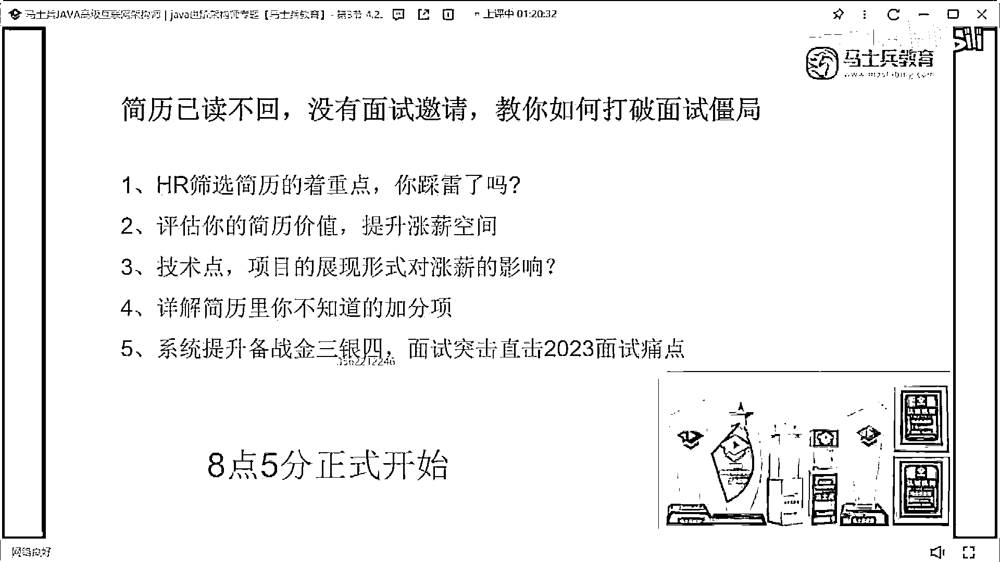
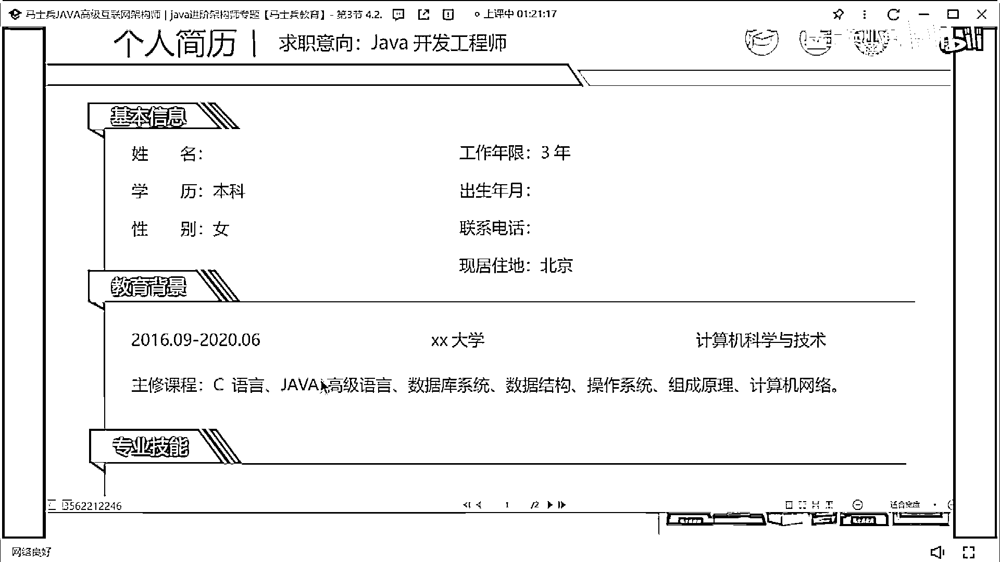
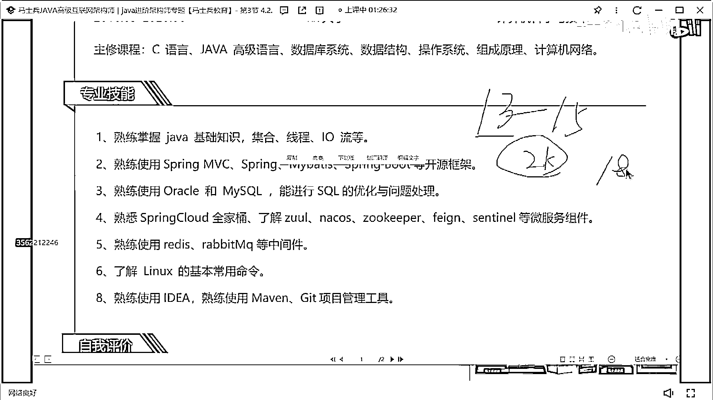

# 什么样的程序员简历一看就没戏？当代互联网HR最喜欢的简历套路有哪些？马士兵告诉你普通程序员写简历千万别太老实！ - P15：3年Java经验女生简历指导 - 马士兵小鱼 - BV1oP411Q73J

來下一個。

來這個萌妹的，看那姑娘在嗎，追逐記憶，第一個所有人以後都記住了，從你大學畢業，不管你大學有沒有畢業，大學裡面展示的所有課程沒必要寫，聽懂了嗎，大學裡面學的所有課不需要寫，因為這些課對於企業的認知而言。

幾乎等於零，它不需要寫，寫了之後也沒有什麼實際的意義和價值，所以是不需要寫的東西的，好吧，再來看技能。

20年畢業，真實的工作經驗是多少，2022年在中科轉外包，我現在差不多是兩年多，三年的一個工作經驗了，三年的工作經驗，這樣的技術明顯是不足以支撐的，而且這裡面有個很大的問題，1234568，7呢。

7哪去了，對吧，然後這裡面雖然寫了7條，這個這個其實沒啥用，是不是意思，就相當於你展示技能只有這些，那只是把這些技術名詞做這些羅列的話，那說白了，他怎麼能撐得過你三年的經驗呢，撐不起來嗎。

還是我說那句話嗎，大家所有人都是這樣的技術羅列，那你的優勢在什麼地方，別人憑什麼讓你去面試，懂意思嗎，我還是那句話在技能這塊，所有人技能在一定都會好好描述，那麼既然好好描述了。

你就要想辦法去展示出你的技術深度和你的技術細節，OK，這個作品就很虛了，不寫了不看了，好吧，作品下寫到最後，如果你的作品下很優秀往前提，不優秀往後放，技能特長沒必要，你的英語四級學生會主席。

這種啦啦隊這種東西，他沒有啥，加持的點，對找工作而言沒有什麼加持的點，好吧，項目這是一個銷售平臺，60萬人吃業務員投保，方便業務員投保，寫的簡單了，這本身是一個保險的銷售平臺。

那麼你就可以把你們保險目前有的保險的數據量加上，同時可以把每天啊，並發操作數據量加上，可以把這個整體的數據量擴大一點，你60萬業務員啊，十分之一的人每天入一份保險就6萬，這數據還是可以寫的，好吧。

然後呢，相關技術不要這麼寫，有人考前兩種加微微二，不要這樣寫，把你設計的每一個技術點，一二都要清楚，頓好分割，開發環境沒必要，主要職責，客戶查詢建議書生成，數據庫設計開發文檔編寫，我還是那句話。

叫用什麼技術實現什麼功能，遇到什麼問題怎麼解決，以這樣的方式來進行描述，一定要這樣描述，監測平臺，一樣基本一樣的，好吧，這兩項目嗎，這個這個叫什麼來的，追逐記憶同學，你現在差不多將近兩年的工作經驗。

兩個項目有點少了，因為你這個項目，它不是一個非常大型的項目，不是一個大型項目，所以你可能要寫三個，才能支撐得起你這兩年的經驗，OK，好好聽課，好吧，他是20年開始參加工作的，那兩年的經驗。

兩個項目有點少，這項目就這種項目，沒必要開發一年吧，沒必要真的一年，沒必要開發一年，我開完，反正我看了你的描述，我覺得很簡單，他不需要一年的開發周期，項目描述項目背景，我剛說了。

按照我剛說的方式去做修改和調整，修改和調整，OK，剛有人問老師外包經歷表寫，你如果只有外包經歷的話，你你你只能寫，你不寫怎麼辦呢，你怎麼辦呢，小姐你現在多少錢，薪水多少，你現在薪水多少，1313是吧。

有期望薪水嗎，有期望薪水嗎，這個薪水給的可觀，15，人得有點野心，從13K漲到15K，朋友們，大家一定記住一件事，朋友們，我我我我再說明一件事，你們在跳槽，在選擇薪水漲幅的時候。

我希望在原薪水的基礎之上，至少漲個50%左右，如果你只是想漲兩K的話，你這個跳槽是不值當的，因為你的跳槽會帶來你履歷上的變更，這種履歷的斷層，那麼這種斷層是為了拿到更高的薪水，而不是拿兩K就跳，懂嗎。

所以你下一次找工作，咱不多說啊，咱不多說啊，最起碼你拿個18漲5000塊錢，最起碼，懂意思嗎，讓你漲2000塊錢真的沒必要，2000塊錢跳槽意義不大，真意義不大，所以我希望大家在定目標的時候。

也定的第一別太高，第二也別太低，你們的心理預期不應該是這樣，所以你的薪水漲幅的空間要把它給控制好，同樣的要掌握的空間，你肯定是要把你的技術好好去儲備和沉澱一下，把原理什麼之類的東西好好去思考琢磨一下。

把技術儲備好，項目好好美化一下。

Bentonite TV。