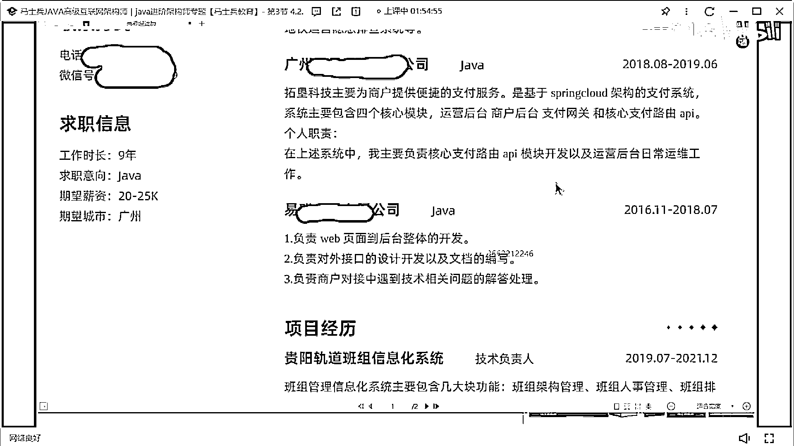

# 什么样的程序员简历一看就没戏？当代互联网HR最喜欢的简历套路有哪些？马士兵告诉你普通程序员写简历千万别太老实！ - P18：31岁9年经验25k简历指导 - 马士兵小鱼 - BV1oP411Q73J

來彩英到你了。

你準備抄了我們抄吧，來彩英同學在嗎。

讓我看你說話了，這是你的簡歷吧，來看這個簡歷啊。

31歲9年經驗9年的工作經驗。

第一個記住，簡歷裏面不要寫範圍，薪資不要寫範圍，你寫的20到25，因為你的你最低接受度是20，我瘋了，我給你25，可能給最低了嗎，所以要不然寫面譯，要不然寫準確數值。

但是一定不要寫範圍。

好吧，第二個，你一上來展示是你的工作履歷。

說實話工作經驗的東西啊，沒必要在最上來的時候開始展示。

這個沒辦法，招聘一定是範圍的，面譯都寫不了，你自己寫的復健簡歷，為什麼寫不了寫不了準確值啊，招聘網站有模板，你必須寫範圍沒問題，你自己簡歷裏面，是不是可以寫這個準確值，或寫面譯啊，你要看的也是看看什麼。

看你的復健簡歷嗎，而不是看你的微簡歷嗎，來第一個個人優勢。

這叫個人優勢，海寅這叫這叫優勢嗎，不叫好吧，第二個公共經營經歷。

兩年一年，然後這是三年，這個挺好好吧。

然後項目經歷，貴陽軌道班組信息化系統，你看啊，你看你這個信息化系統啊，看起來寫的內容很多，就是你告訴我，我怎麼樣能夠在你這麼多的文字描述裏面，一眼看到你想表達的核心重點在哪，你想突出啥，你寫了這麼多字。

像沒有什麼技術實現了，有什麼讓你引以為傲的點，有什麼你值得非常突出和誇張的點，有嗎，沒有，做了三年的項目，寫完之後，看起來內容好像很多，但是沒啥問的，我也不知道問你啥，我看了這東西，我就不知道問你啥。

OK，再來，你給我們線上支付系統也是一樣的，基於自動銷價格的支付系統，你現在工作這麼多年了，還還基於呢，還基於呢，大學生才學基於什麼技術的，什麼什麼東西，好好寫一下，你既然是一個在線的支付系統。

每天的支付交易量是多少，能不能突出一下，你們的並發的峰值是多少，能不能突出一下，對不對，你的職責到底做了什麼事，你看你的職責寫的東西，什麼API模塊開發，運營後台維護工作，什麼行對外的支付接口。

然後還含含Tomcat，Idea，Git，什麼Maven，Springboard，Memelis，這寫的啥，就你這個寫法，我咋能，看出來你項目的價值，和你做突出貢獻，收銀台就更簡單了，就你這三項目。

用了三寫的方式，你現在薪水多少，財源現在薪水多少。

17，你想拿多少錢，你想憑這份錢拿多少錢，就已經記住了，而且還有一個最大的問題是啥。

你整個簡歷裡面。

沒有任何一丟丟一奶奶，關於技術的描述，就你整個的技術的寬度和深度，什麼樣子我根本不知道。

懂嗎，你項目裡我能看到是什麼。

這有個Springboard，項目裡面沒有看到任何，跟Springboard相關的描述點，你到底有沒有用微服，微服你怎麼設計的，我根本不知道，九年的經驗按道理說，應該做過一些架構設計了。

你的架構設計能力沒有看出來，所以如果你想拿到20+，甚至更高的薪水的話，簡歷是一定要改，當然這個簡歷改，肯定是需要依托於你自己的技術水平，你不用說我會轉行的，你可以轉行沒問題。

但是你的經驗裡面在進行寫的時候。

在進行寫的時候，你看一下你這就標寫9年，你這寫是從16年開始參加工作，因為到現在也7年時間了，也7年了，明白嗎，也7年時間了，這簡歷在部長有人回嗎，沒有，你投過嗎那個彩英，我覺得簡歷沒人回覆了。

如果有回覆有外包，非外包也有這意思，甲方公司應該不會讓你去面試，很多人找你，行行行，你當我剛剛說的話都是放屁好吧，我錯了，你當我剛剛說話都是放屁。

這裡有很多人去找你。

是我的認知有問題了嗎。

我知道學歷很好，我知道我知道學歷很好，天天集十個，行行行，我祝你成功，好不好，我祝你成功，我祝你早日難倒高興，我過了寡聞了，我過了寡聞了，是這個學校是很好，然後呢。

每天集十個。

就這個簡歷啊。

如果現在每天都有幾十個，我戒菸兩周，你說，不說了好吧。

行當沒問題，下一個啊。

不說了好吧，我過了寡聞了好吧。

我認知錯了我有問題。