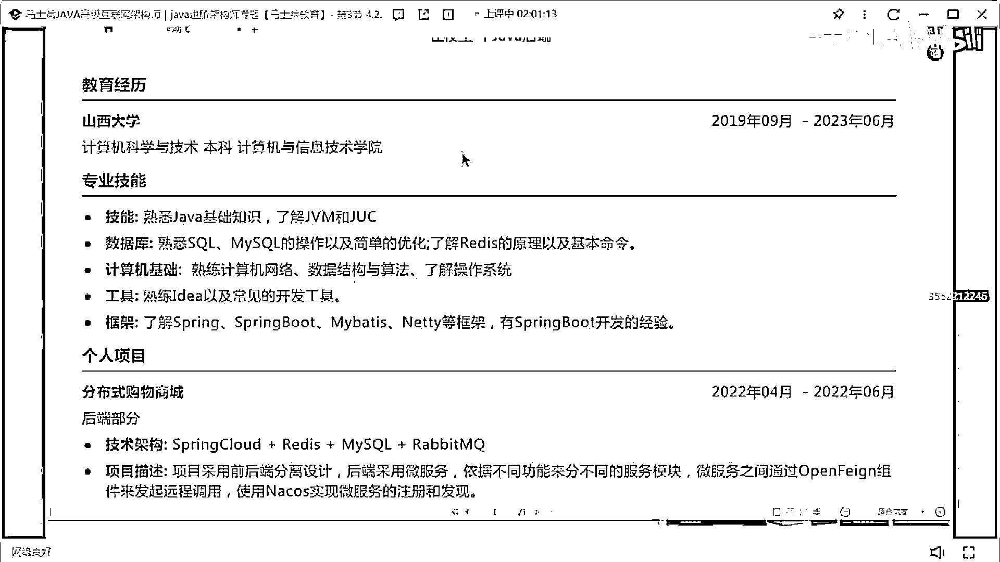
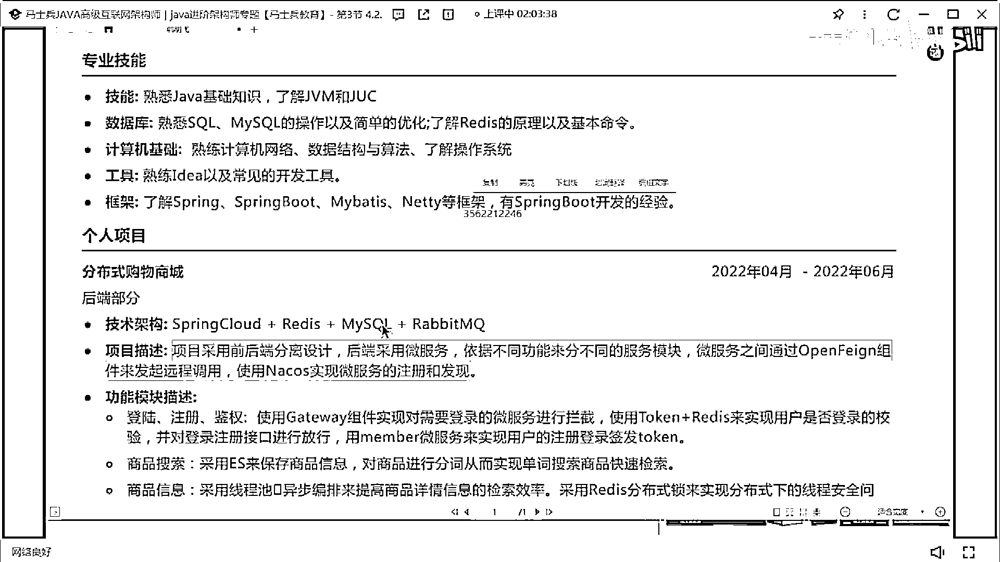
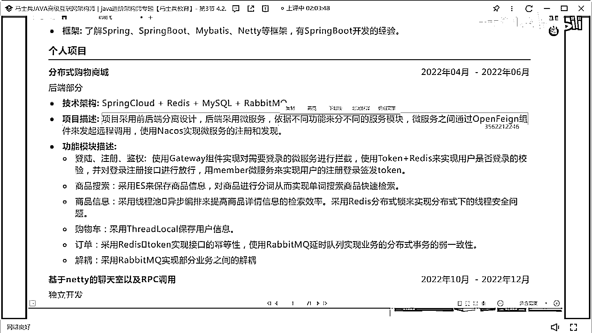

# 什么样的程序员简历一看就没戏？当代互联网HR最喜欢的简历套路有哪些？马士兵告诉你普通程序员写简历千万别太老实！ - P20：科班应届简历指导 - 马士兵小鱼 - BV1oP411Q73J

南明飛。

四年的差不多四年的經驗還沒畢業啊，一年畢業生，這位在嗎，這兄弟有一個項目和我一樣，你倆是不是，同一家公司的，XYJMJUC了解不要寫了解，這個作為一個應屆畢業生，很明顯你的這個簡歷寫的有點有點有點差。

好吧，你看你下面他寫了spin cloud，上面又沒有spin cloud，對吧，然後就把你就一定記住啊，把你上面寫的這個簡歷和下面寫的簡歷一定要，就是你的，這個技術站和你項目裡面用到的技術站一定要。

匹配的上，一定要匹配的上，分佈是購物商城，Netty的聊天室和RPC標用，這個可以算是一個項目，但是上面這個項目，如果你想寫這種商城網站的話，這個寫的有點有點簡單了，有點簡單了，就是商城項目啊。

這可能會說老師我剛批評出來啊，我上次不能寫，你寫上去就上了，其實不是這樣的，是因為大部分的商城介紹是什麼，比如商品模塊，訂單模塊就完事了，其實你可以把商城項目描述的很高大上，描述的很高大上。

可以加一些其他額外的功能模塊進去，這樣的話，別人能知道你這是一個真實項目，但對於印界畢業生而言，最好能夠自己把這個項目去做一個部署，有一個可供外網訪問的地址在，別人能夠看到你對應的項目。

然後你對應的技術站要做一個詳細的描述，就這項目到底是怎麼做的，像描述什麼樣子的，你們做這個項目的意義在什麼地方，一定要去寫一下，這明顯就自己拿自己拿來練手玩的嗎，練手玩的。

然後如果說非要匹配一個經歷的話，我建議匹配一個什麼，匹配一個實習的經歷，因為現在很多大學的老師，在外部是有自己的合作公司的，或者自己有公司，你可以把那個經歷包裝成你們大學老師教研室。

一個公司承接公司裡面的實習或者項目用的，你懂我意思吧，編造一個真實的一個相對於真實的一個實習背景，這樣的話可能更加容易一點，然後把對應的技術實現寫清楚就OK了，但是你上面的技術描述很明顯是有問題的。

技術描述要好好去修改一下，好好去認測一下。

項目這塊，換個項目吧，要非要寫的話就把這項目好好去改了，OK，來看下一個。

