# 什么样的程序员简历一看就没戏？当代互联网HR最喜欢的简历套路有哪些？马士兵告诉你普通程序员写简历千万别太老实！ - P21：本科科班3年Java经验简历指导 - 马士兵小鱼 - BV1oP411Q73J

我們快點說了時間不夠了。

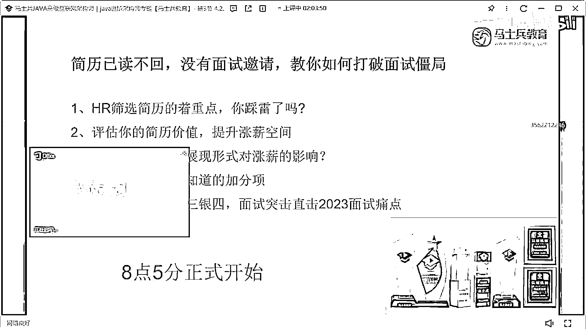

兩小時了都，看這個同學。

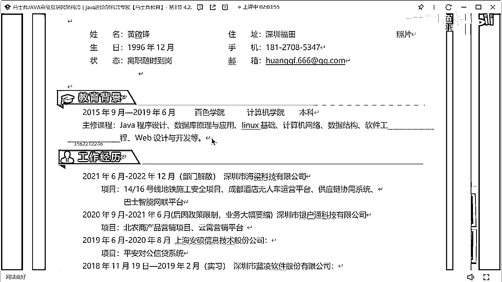

19年畢業我說了，這個大學的這個課程不需要寫畢業，百測學院我去過你們學校，工作經歷，實習一年，一年半，這同學我不知道你在不在，你需要好好的去注意一下你的工作履歷和背景，你就要好好注意一下。

你看你那寫的政策業務縮水，部門解散，就這種東西可能都是跟你沒關係的因素，但是不要突出，不要突出，幹倒兩家，是這個意思，就是看你的描述的話，你把兩個公司幹倒了，懂意思吧，就不要寫這個東西。

就工作經歷只需要寫什麼，寫時間，寫時間，寫完時間之後，然後寫公司名稱，然後寫上你的職位就OK了，臆想一份穩定可持續發展的工作，別這麼寫，別寫這玩意好吧，什麼叫穩定，什麼叫可持續發展，你這寫的東西這是啥。

這寫的，技術站。

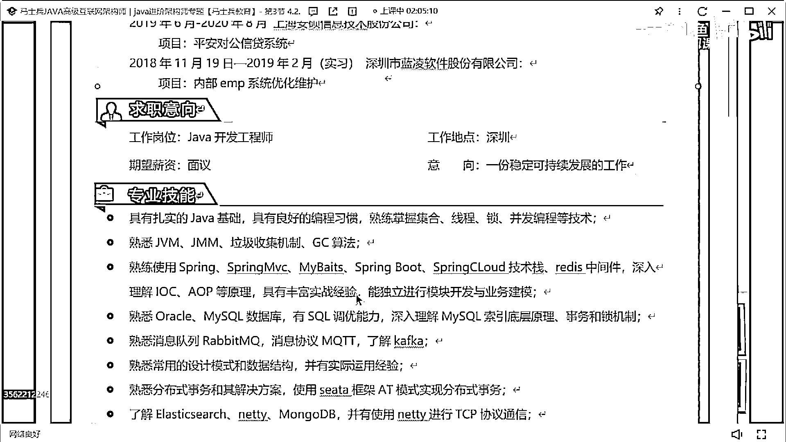

啥玩意這東西，都是，Wireless，WQ，C塔。

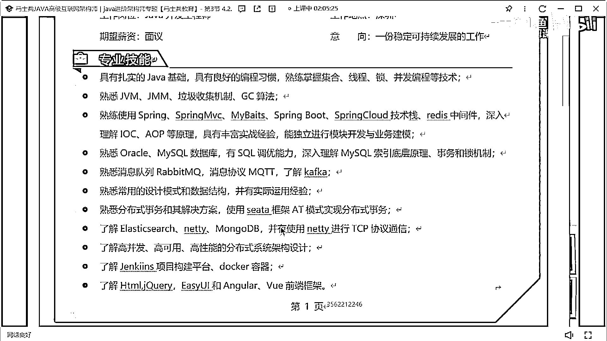

把所有的了解啊，都給我換成這個熟悉，或者熟練。

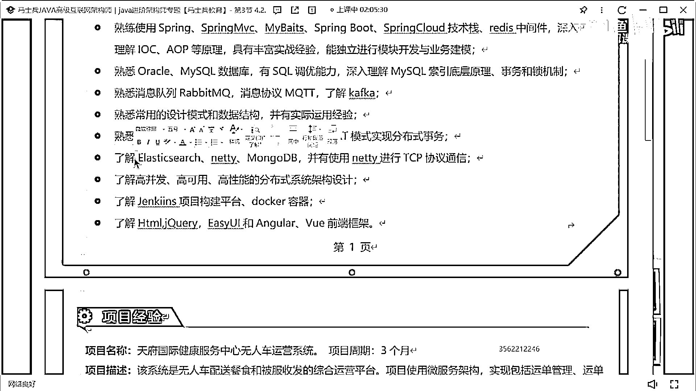

OK，項目，這個週期啊，三四個月就別寫好不好，三四個月就別寫，然後這是一個無人餐配送和被服收發的運營平臺，如果是一個運營平臺的話，你們每天的運營數據是多少，車輛管理的數據是多少，然後監控的數據量是多少。

怎麼做這種書啊，可就存儲了，能不能寫一下，還是項目描述，還是項目描述稍微有點問題啊，職責，還行吧，這個職責啊，大家寫職責的時候要注意一件事，就是寫這個文字描述的時候，不要吝嗇你的文字。

我說了你的這一行的描述，最好能站到二分之一或者四分之三行，就不要只寫五六個字就結束了，這個不太好，分佈式訓練序號，使用什麼樣的技術生成分佈式ID，滿足什麼樣的需求，能不能這樣寫，換一個更好的描述方式。

好不好，像這樣一樣的。

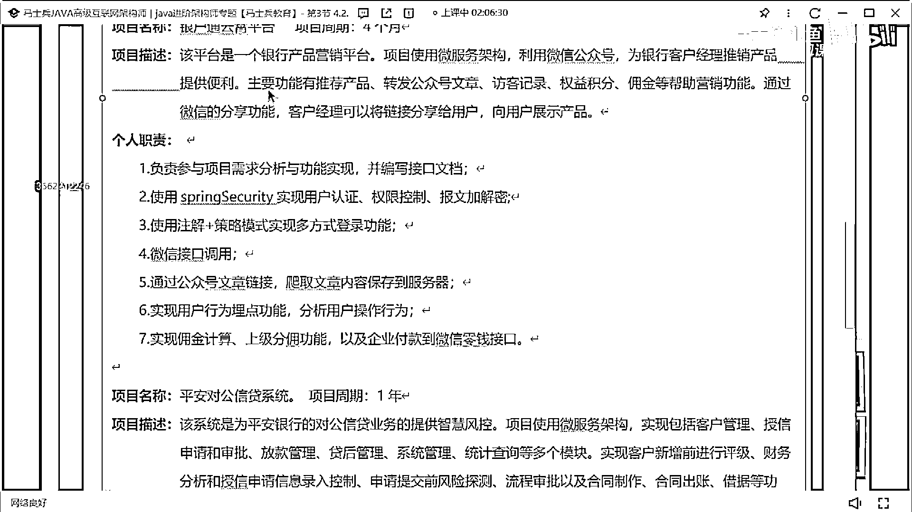

銀沪通雲霄平臺，平安對公信貸系統。

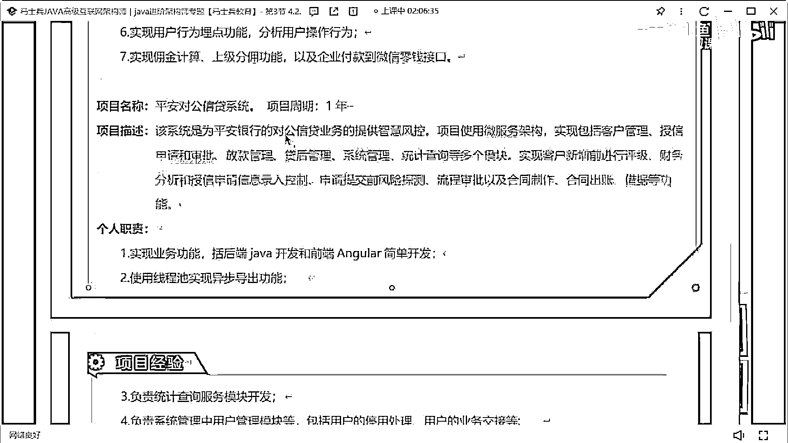

就是記住啊，把你的項目這個描述這塊好好改改，就是還是像描述的問題，職責吧，寫的也很不亂了，勉勉勉強說過去還行。

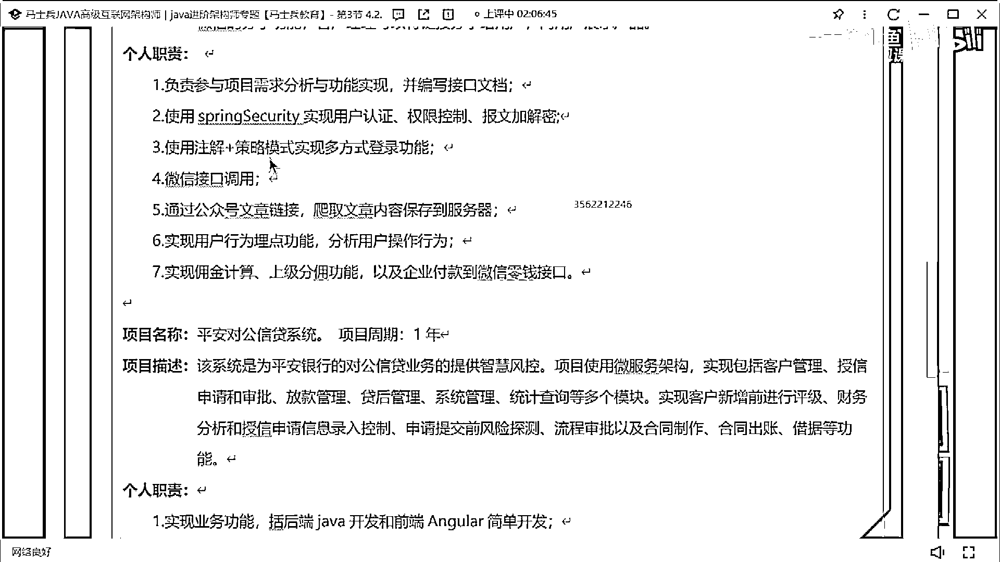

好吧，這個這個沒必要了。

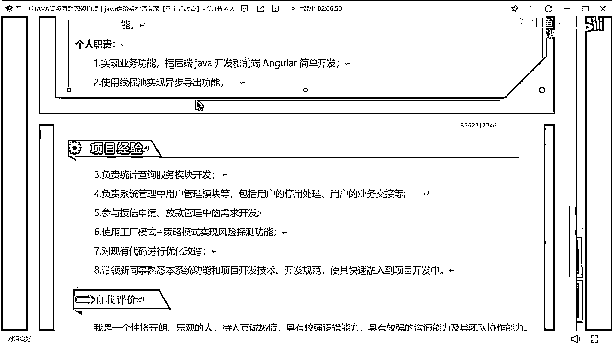

好吧，這沒必要了，我看，來看下一個。

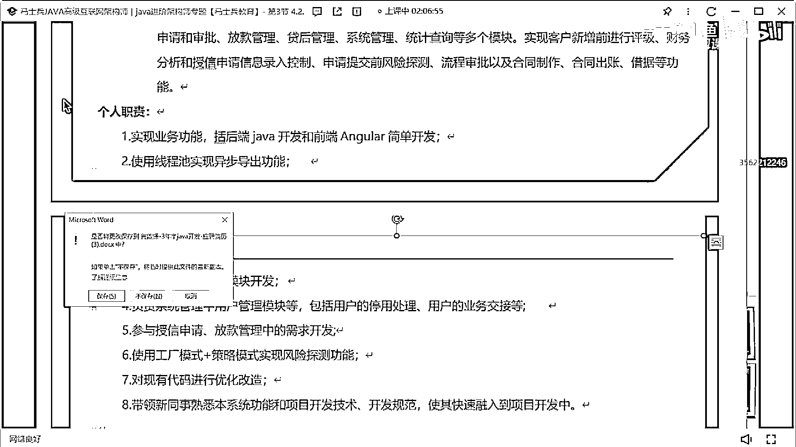

你經歷的滄桑都寫在簡歷裡面。

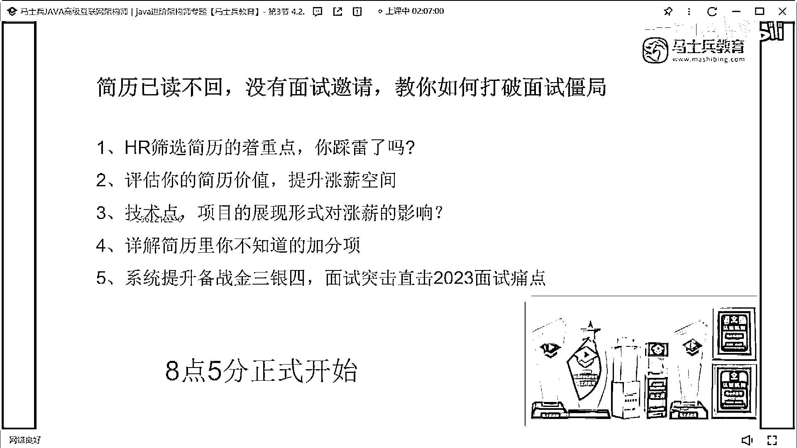

哈哈。