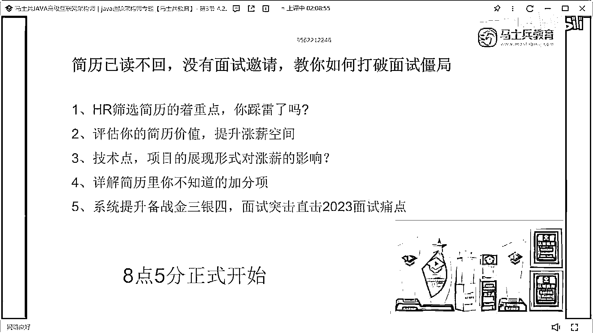
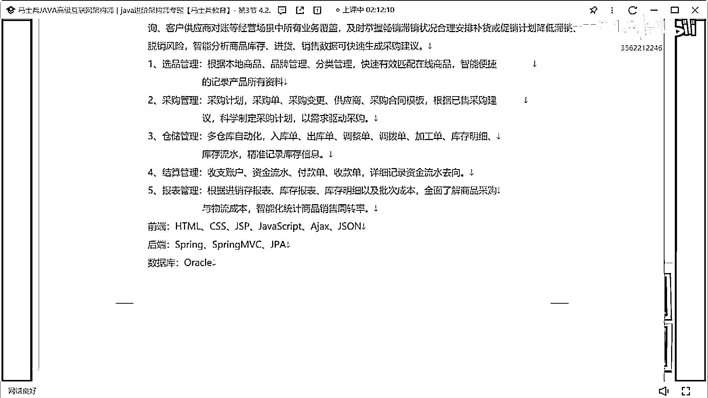
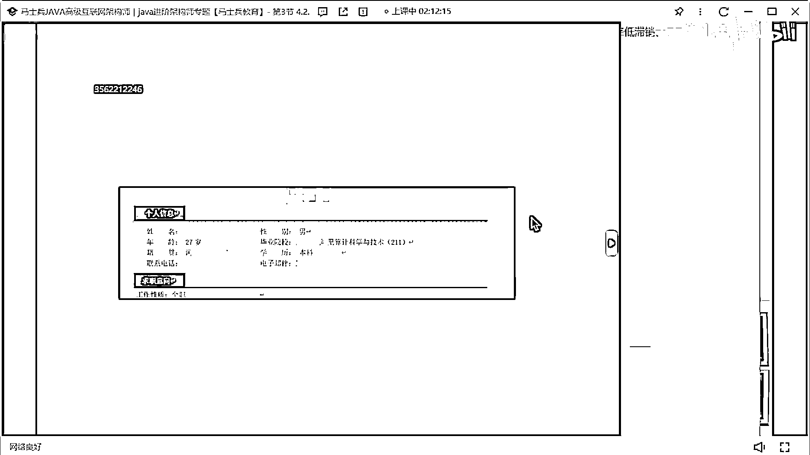
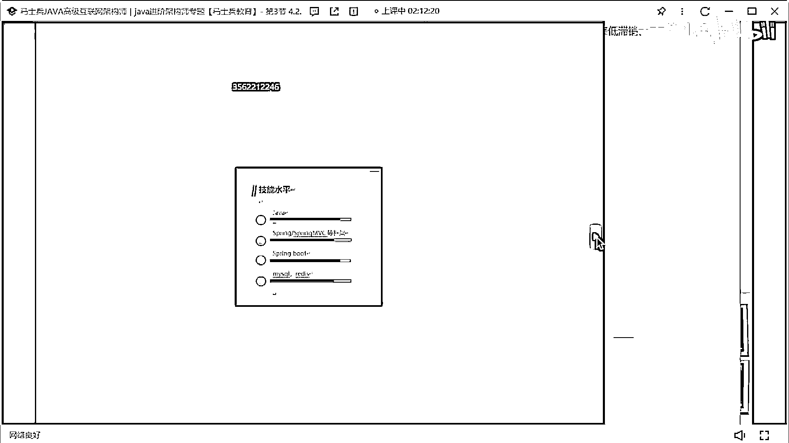
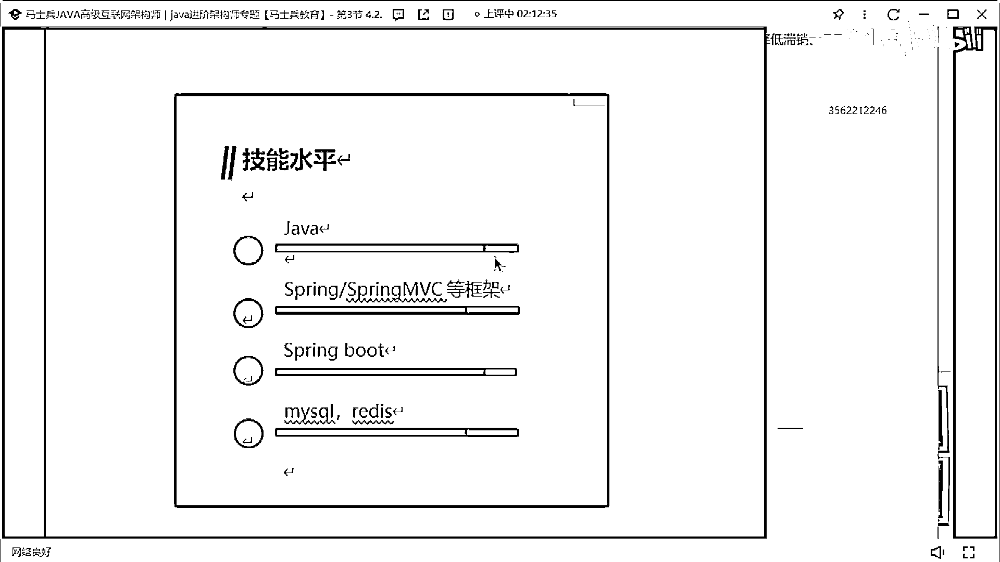
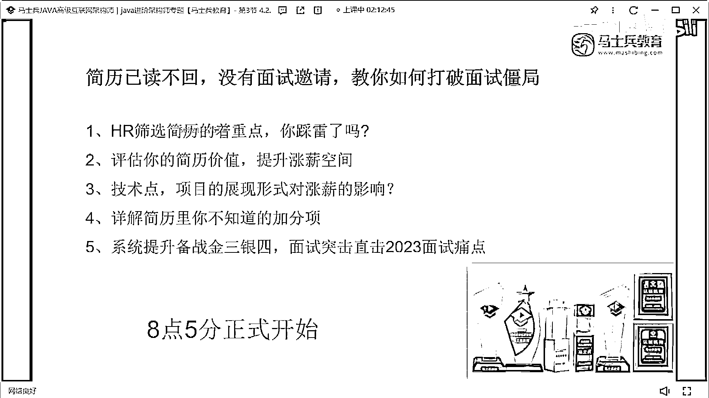

# 什么样的程序员简历一看就没戏？当代互联网HR最喜欢的简历套路有哪些？马士兵告诉你普通程序员写简历千万别太老实！ - P22：某位帅哥的简历指导【反面教材】 - 马士兵小鱼 - BV1oP411Q73J

來看一下某位帥哥的簡歷。

誰的，誰的簡歷啊，哎呦，誰的簡歷，陳同學陳同學，記住啊，不要去招聘網站去下載這種簡歷模板，這類模板第一巨醜第二可讀性不好，第一個先說你的技術站，該對齊的地方要對齊，你上來你作為一個後端工程師。

先立了一堆前端技能，還是非中網的前端技能幹啥，沒必要，好吧熟悉這些框架的原理，然後SQ語法，那SQ Cloud，Eureka， Raybon， Yamaha有研究，有研究沒了，就你所展示的技術站。

就這幾個東西，這肯定不夠嗎，對吧你肯定要把你的技術站給充滿，對不對然後呢，求知異象，求知狀態積極找工作，這樣寫好吧，然後，19307個月的工作經驗，你的技術描述，肯定撐不起你三年的經驗。

100%的剛剛怎麼寫我已經說過了，好吧然後項目經驗OA，這個OA啊，大家注意啊，這個OA不是說不能寫，就現在的寫OA的話一定是一種，SaaS平臺，要不然的話，你就是一種私人定制的平臺，已經是這樣了。

不要寫這種單體的OA項目，這種單體的OA項目來說，不能那個啥好吧，然後你再寫了一下模塊，然後這個技術還這麼去羅列，沒必要真的沒必要好吧，執著就寫了兩，這肯定不行，雅各H2也是一個，招聘的東西。

有的簡易的OA肯定要換好吧，為名無業，就你的所有的項目看起來都是基礎的，CRUD的平臺，就你要經過適當的包裝，把你的項目看起來更多，更加高端上一點，這是肯定必須的，好吧然後最讓我生氣的是下面這個東西。

就這個東西一定不要這樣寫好吧，一定不要這麼寫，這東西幹掉你一定不要這麼寫，然後我之前見過這種寫法，還見過一種什麼寫法，有同學呢，把這個技術寫上之後後面有個進度條，進度條到這，好吧有這個技術進度條到這。

就不要寫這種東西好吧，這是啥玩意兒，而且你要想明白一件事，你前面已經寫過這些技術上的描述了，你後面又去加了這麼個玩意兒幹啥，真的真的沒必要好吧，我不是開玩笑，我給你找下那個案例，我這專門截圖。

我找那個案例，我專門截了個圖，看一下簡歷，有沒有簡歷了，我找一下，我找一下，因為我那個。

這兒呢，你看這個進度條，我準備了很多這種失敗的案例。

你看到沒，就這種東西，我真的我看到這我都要笑死，就是，我都不知道你你寫到這塊是百分之幾。

所以一定不要一定一定不要這麼寫好吧，來看下一個，今天就到这里。

