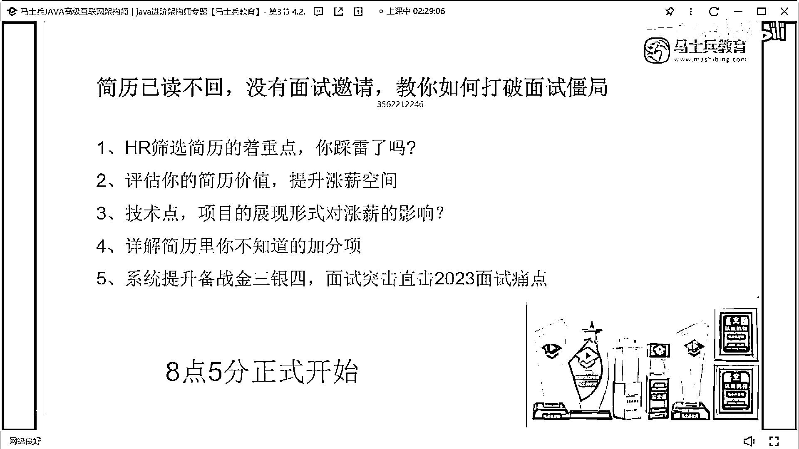

# 什么样的程序员简历一看就没戏？当代互联网HR最喜欢的简历套路有哪些？马士兵告诉你普通程序员写简历千万别太老实！ - P25：5年经验25k简历指导【简历估值与实际薪资严重不符】 - 马士兵小鱼 - BV1oP411Q73J

你看這個吧，陳先生在嗎，看學生啊，你看啊，就這個技能描述啊，一定記住不要這樣寫，渣一設計模式，然後變化編程，然後框架，其實我啊個人其實非常，我說非常吧，就不太喜歡這種，兩列式這種排版的簡歷，它不太好。

它不太好，好吧就是最好就是就是就是，就是屏幕直屬下來，OK然後把你這裡面的技術啊，你很多東西是合到一塊了，沒必要合到一塊，就單條一條一條的把它給留的清楚，其實你寫東西挺好的，其實每一條拿出來。

你寫都沒問題，都挺好的，但你這樣分出來之後，給人感覺就不太好，懂意思嗎，好吧，讓我們看他的項目吧，快速數據系統項目描述這麼多，你看在這個數據量就很好，技術描述，學測描述沒問題，中科軟，不太好，這學生。

現在系統大學的簡歷值多少錢啊，在在在深圳，值多少錢，18年到現在五年經驗，20 25，他在技術如果沒問題的話，至少25，35達不到啊，25肯定是有的，25肯定有35肯定沒有，我覺得35達不到。

但25肯定是有的，這同學你實際薪水多少，誰的這是誰的，25是有的，25是值的，10K，你這簡歷10K，你趕緊跳槽好吧，你看最近工作多少時間了，趕緊從中科軟跳出來好吧，你在中科軟待了三年。

你你你這個被被被壓榨太太太厲害了，你趕緊跑，你你真的你真的，這10K太過分了，就是你你在不在外包沒關系，但你現在這個簡歷寫成這樣，如果你只有10K的薪水，這真的太過分了，真的很過分，真的很過分。

真的很過分，10萬10萬的8K，這個是必須要跳的，現在就跳立馬跳，因為這裡面現在公司啊，可能會卡一個漲幅，但你的這個簡歷，單純簡歷來說的話，25是值的，在簡歷這種技術達，達不能達到的情況下。

25絕對是值的，你現在如果跳到要的話，20肯定沒問題，20肯定沒問題，改一下你簡歷的排版，絕對可以到20真的，我一點不誇張，但是能不能卡你的25，這個東西，你看公司卡漲幅不卡漲幅了。

但你的技術達上來之後肯定沒問題，你趕緊走趕緊走，好吧，中央會不會來打我，中央會不會私下來報復我，明顯你這個真的被壓榨太太，真是太厲害了，真是太厲害了，好吧。

來看下一個。

