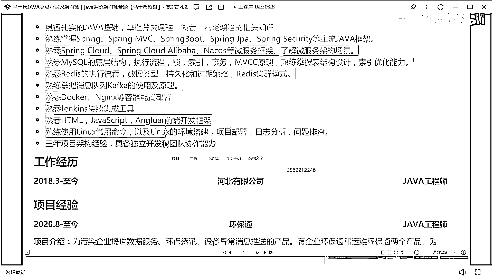
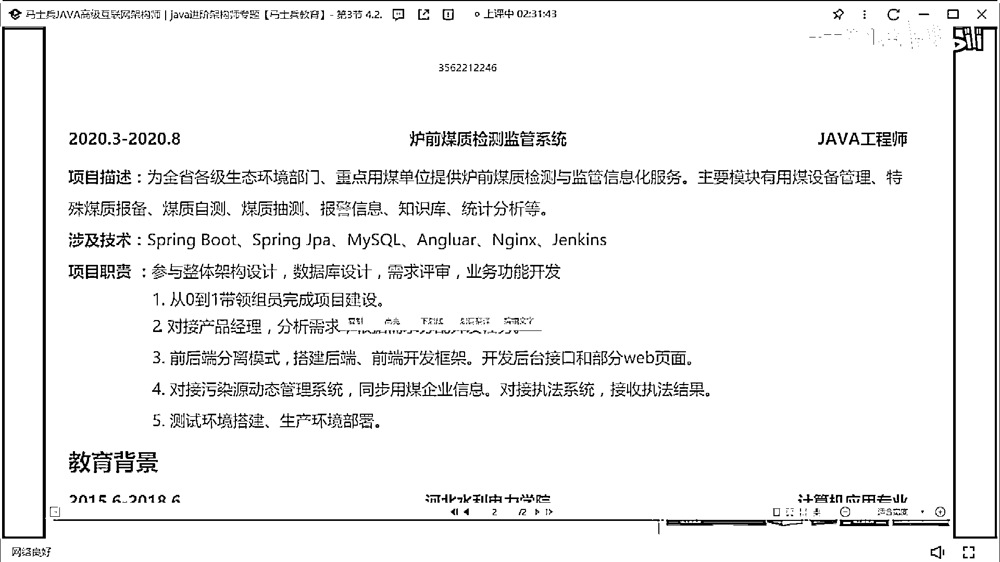
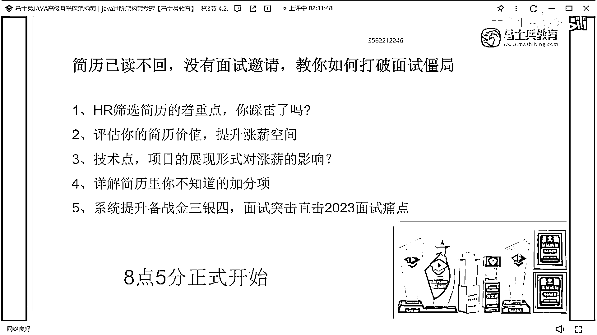

# 什么样的程序员简历一看就没戏？当代互联网HR最喜欢的简历套路有哪些？马士兵告诉你普通程序员写简历千万别太老实！ - P26：石家庄5年Java经验9k简历指导 - 马士兵小鱼 - BV1oP411Q73J

26歲5年經驗，小心點，我感覺我要被打死了，框架，MySQL Redis， Conf卡， Docker Endex，調整一下你這個行間距，調整完行間距之後應該會好看很多，我現在沒法幫你調。

調行間距應該好看很多，18年到現在，5年經驗沒換工作，挺好，你現在5年經驗只有兩個項目嗎，是5年經驗嗎，你看啊，你這有個大漏，這個簡歷是誰的，這個簡歷是誰的，不值得寫也要寫啊，一定要注意一件事。

從18年工作的，你最新的項目是20年開始的，前面也要加一個項目，把你前面的經驗給撐滿一點，你現在這兩個項目不夠大，所以不太能夠支撐得起你這5年的經驗，技術描述按我剛說的方式去改，CLD沒關係。

CLD該寫寫。

最起碼你要把時間撐滿，因為你現在每一個項目可能不太能拿出手，或是不太有可聊的東西，所以該寫的東西要寫出來，如果你一個項目就可以有很多可以聊的東西的話，你就大膽去寫一個項目。

但在你沒有更多可聊的東西的時候，你寫一個項目就是有問題的，所以該寫的東西要撐滿的地方，該撐滿的地方要想辦法去撐滿它，行吧，一定要撐滿，OK，河北人老鄉啊，我也是河北人，大姐姐簡歷值多少錢，在哪工作啊。

在河北咸莊嗎，是在咸莊工作嗎，沒寫在哪，咸莊是吧，咸莊給不到15啊，咸莊肯定給不到15啊，咸莊薪水很低，咸莊給不到15，這個簡歷啊，咸莊，它現在薪水水平啊，我能到10就不錯了，你現在多少錢，有10K嗎。

咸莊10K嗎，咸莊15K已經是很高的薪水了，你看到沒，9K吧，對，咸莊薪水是比較低的，因為我也河北人。

所以咸莊那邊薪水很低。

建議啊，你現在26歲還小，可以去一線城市裡面拼一拼，搏一搏。

沒必要在咸莊待著。