# 什么样的程序员简历一看就没戏？当代互联网HR最喜欢的简历套路有哪些？马士兵告诉你普通程序员写简历千万别太老实！ - P27：应届海归硕士简历指导与建议 - 马士兵小鱼 - BV1oP411Q73J

OK。

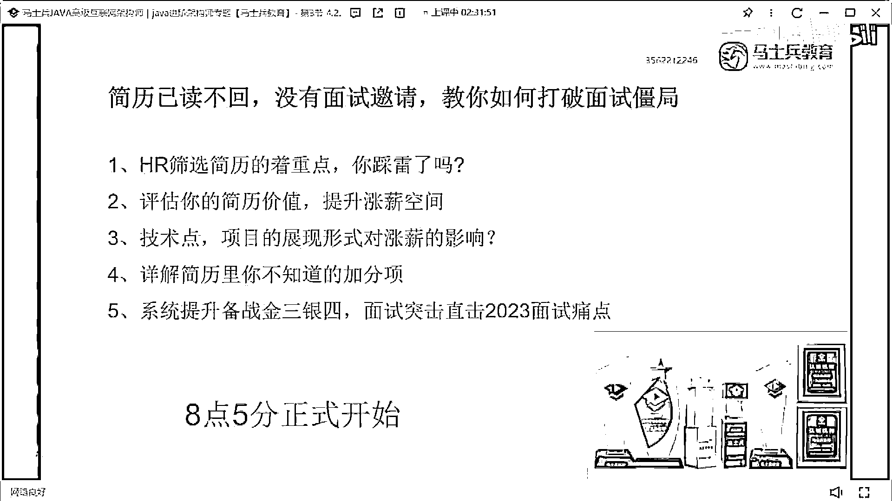

看這個三年級這是，碩士還歸重慶郵電好學校。

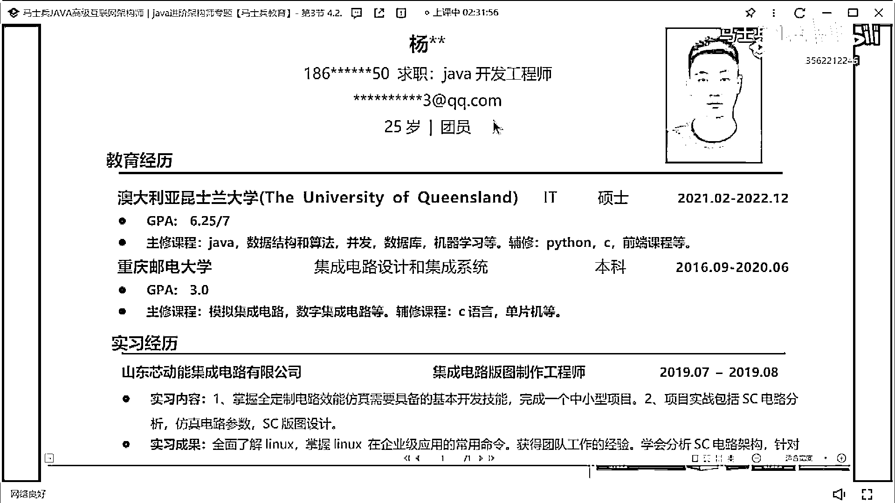

我這個在北京值多少錢，北京啊至少翻個倍吧，北京至少翻個倍。

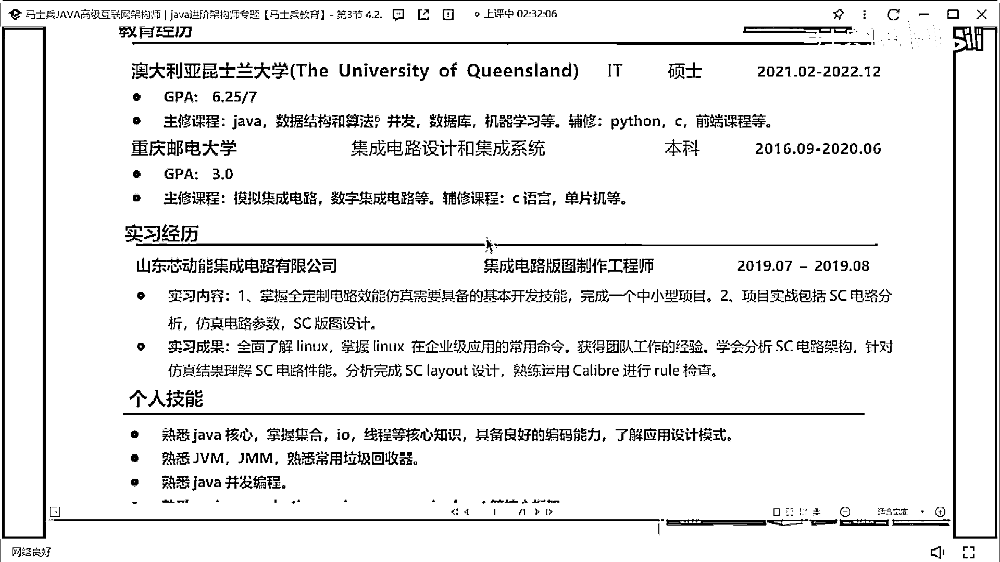

嗯。

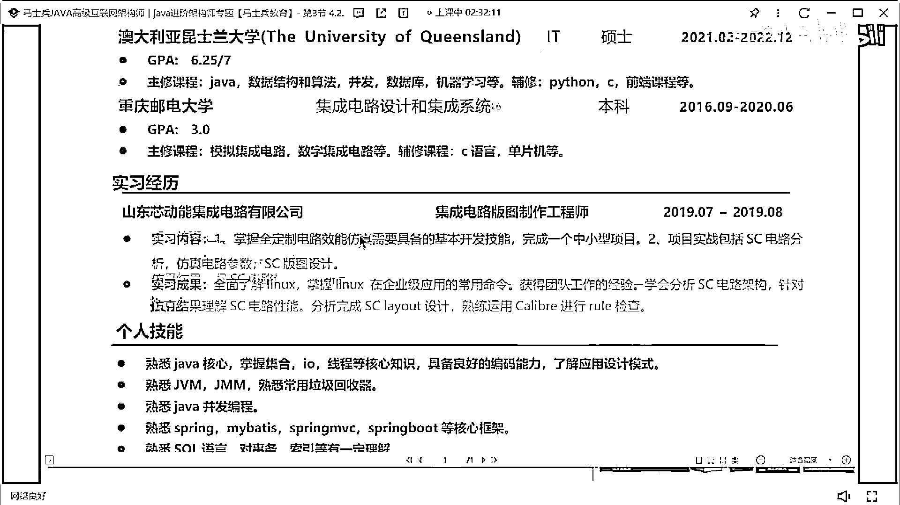

實習，啥時候畢業。

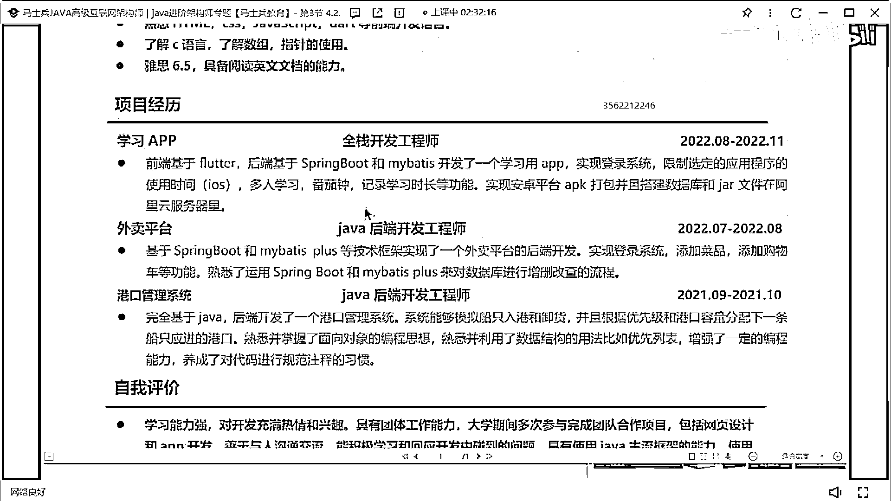

22年10月份就已經畢業大學已經畢業了。

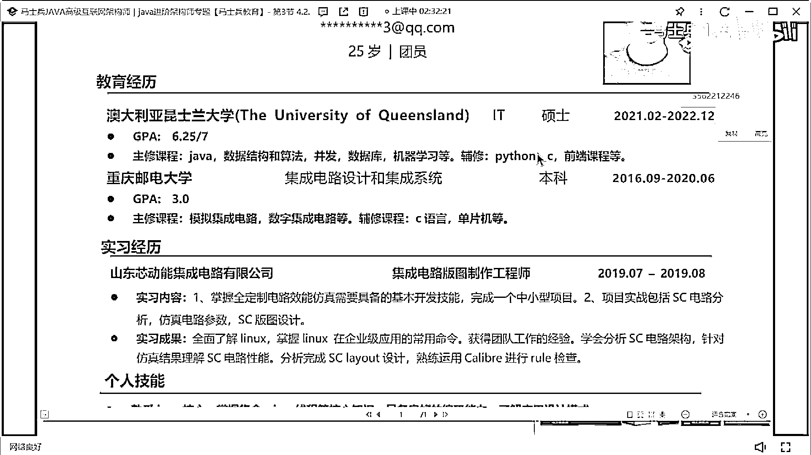

嗯技術戰有點少，這東西啊學歷很好啊，但是這個技術戰有點少。

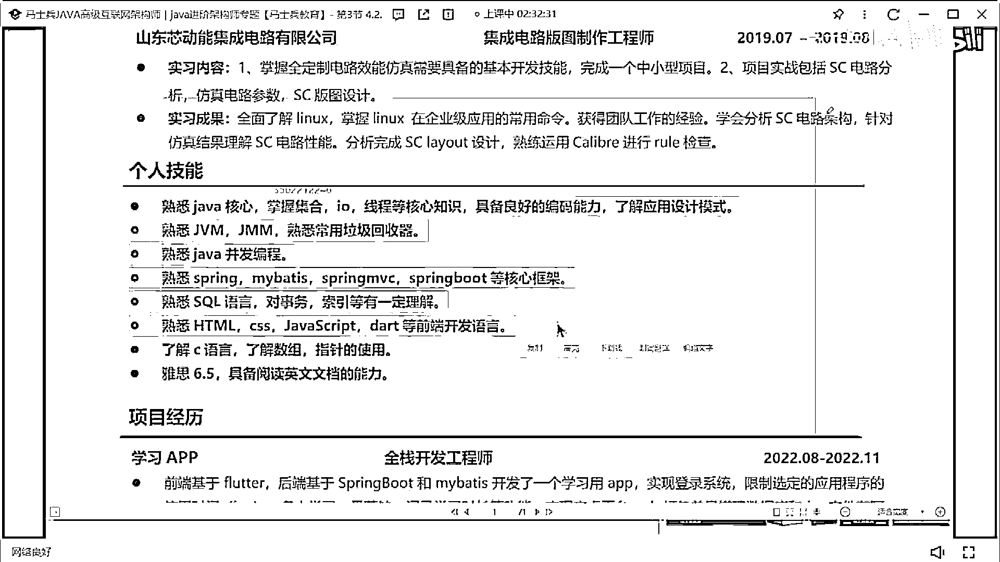

技術戰有點少，項目就沒啥可說，你這個項目其實都說白了都是這種，嗯練練手的項目，練手的項目，這種項目幾乎沒有啥可問和可聊的東西。

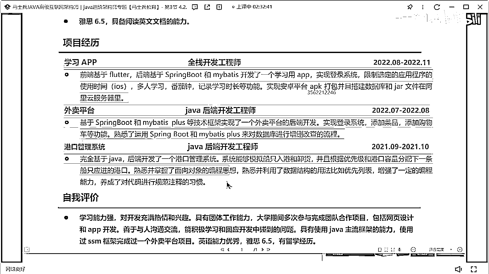

所以就是如果你現在想找一個，呃校招呼也好，還是說想參加找一個工作也好，第一你該補的技術戰能力要補，你現在只學到四分步可肯定是不夠的，肯定不夠的。

像這種。

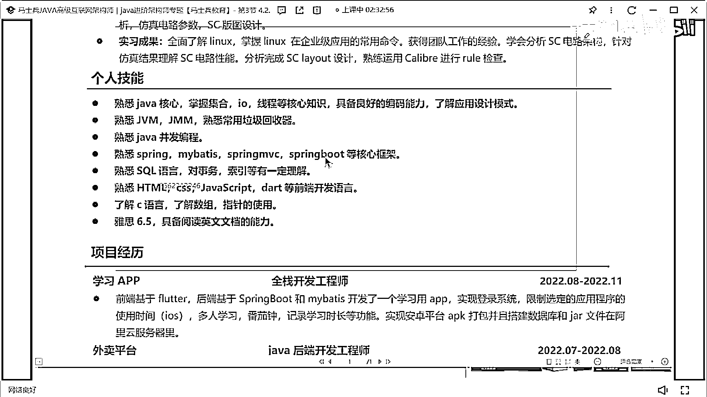

redis 中間件這些東西，微服務分佈式這些東西，你是一定要有所接觸的，第二個你的項目要改。

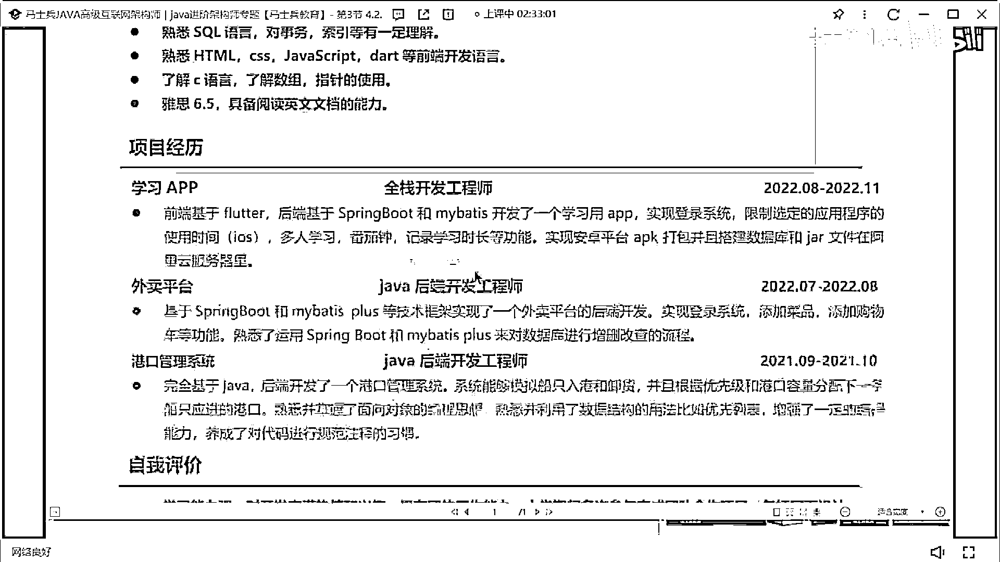

你這些項目都太，就你寫的這些項目目前看起來就是，基礎的入門級的項目，啊就是這個練手的項目，練手的項目它不是一個正兒八經的企業，真實的生產環境理論項目，所以項目是要改的，基礎也好描述一下。

就寬度基礎寬度有缺失。

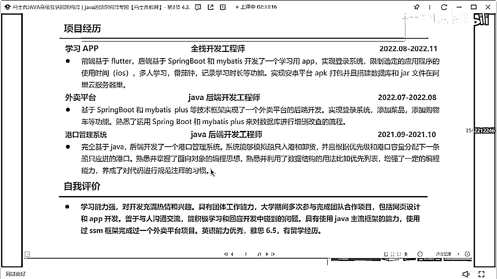

然後呢項目要改，好吧，-end-。

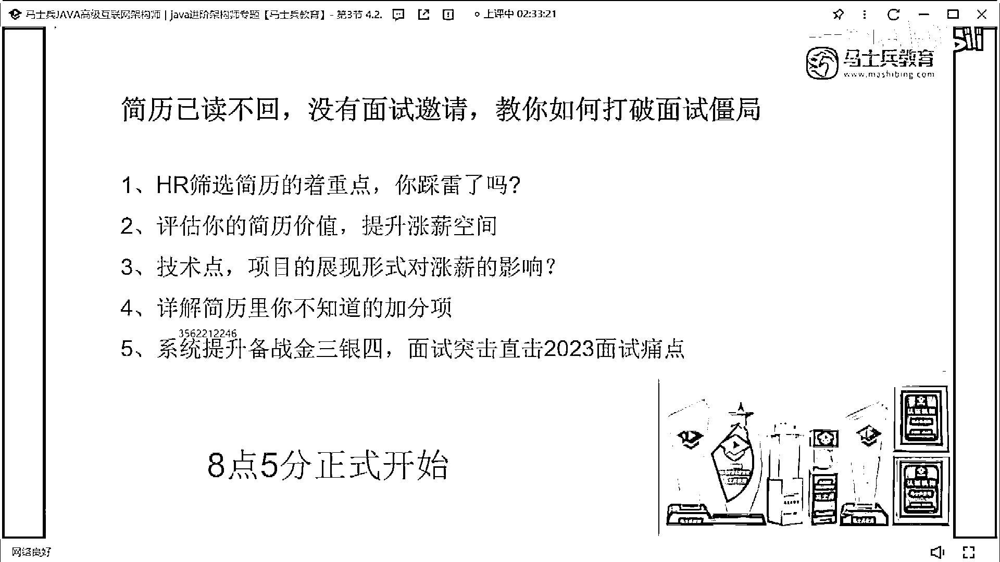