# 什么样的程序员简历一看就没戏？当代互联网HR最喜欢的简历套路有哪些？马士兵告诉你普通程序员写简历千万别太老实！ - P2：【首次公开】适合所有Java程序员的自学路线（2023版） - 马士兵小鱼 - BV1oP411Q73J

在这里呢 我们也。

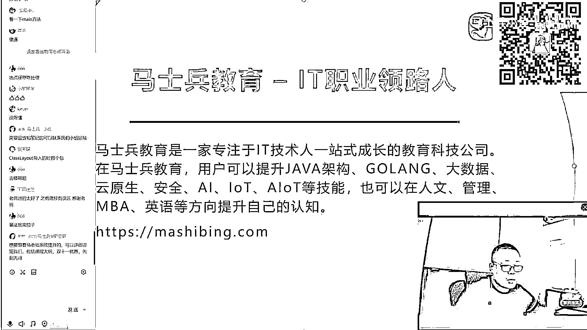

我也给大家介绍我们，2023版的整个的咱们家伙的大纲。

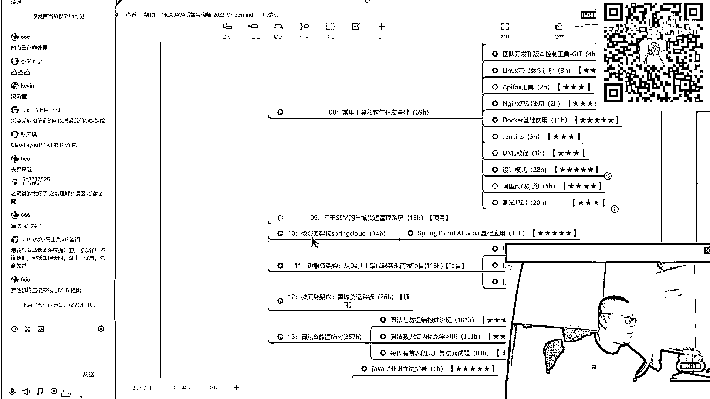

这是我们最新组织的大纲 希望大家伙能够找咱们小姐姐要回去，哪怕呢 你将来是自学都没有关系的，你会发现了这个大纲对你的指导性还是很高。

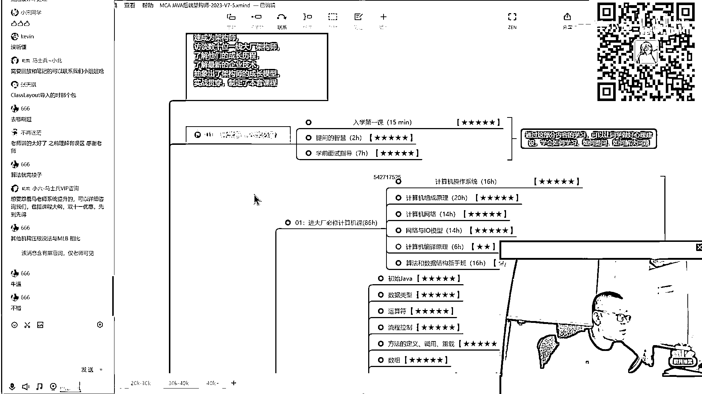

因为呢 新版大纲呢 我基本上采用了一种，小白 从小白 然后直到百万年薪，或者百万年薪以上这种水平的人 他大概会经历走过哪些步骤。

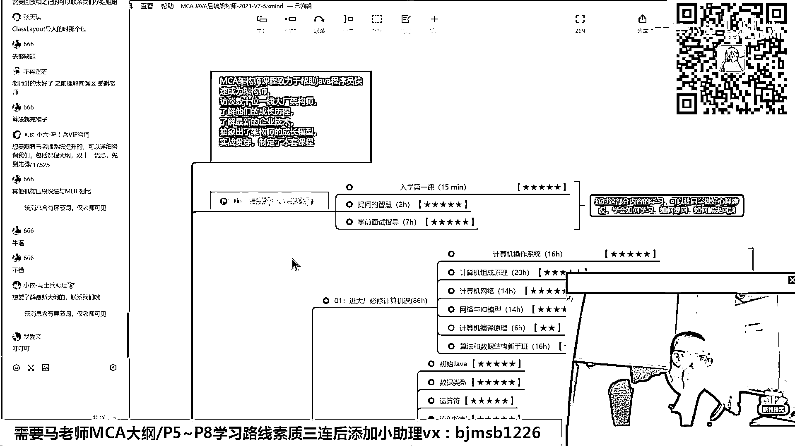

当然不是说每一个人呢 他的步骤走的是完全一样的 这是我们一直以来的教育理念，就是每个人不同的背景应该是学习不同的路线 这也是我们一直采用定制化的原因，就是教大家呢 你们有些人比较着急。

几个月就想工作的 有些人呢 他有充分的时间 我想系统化学习的 那么他走的路线一定是不一样的，重点花费的精力也是不一样的 你的目标是进大厂 那么你的精力会放在什么 要放在什么地方 那么你的目标找份工作 精力放在什么地方。

这些东西呢 会跟大家会不同的背景 不同的定制 但是呢，也需要有一版 就是从一个普通的小白开始 我们大概去经历，哪些个打怪升级的过程 我们才能升级 才能面对最后的boss ok 大概呢是从。

入学这种 学前指导这就不说了 教你怎么学习方法的。

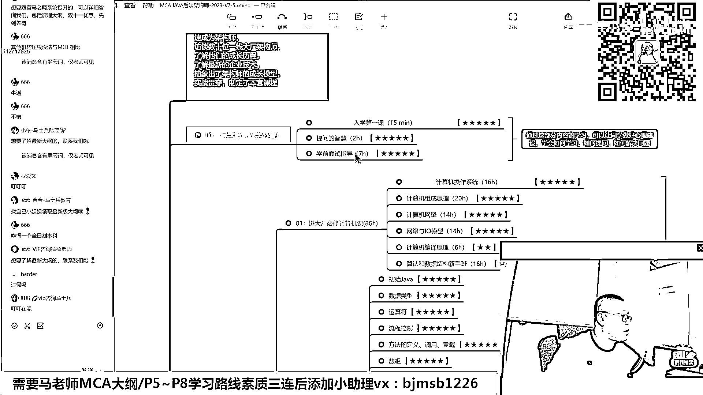

然后 如果对于非计算机器的同学 我真心强烈建议你一定一定要理解这几门课，我这么讲 就是其他像什么数字电路呀 逻辑电路呀 什么这种应联设计呀 这些东西啊 对我们软件工程师来说不是很重要。

但是你如果想跟计算机器的同学差不多 这几门课是必须的，操系统 剂组 网络 还有呢 这个编原理的话呢 我给他两星 编原理一般是，不需要去了解他用到的啊 如果你感兴趣可以去了解。

这里面比较重要的一项叫算法议数学结构 这块呢 我重点介绍一下 因为明天，左老师也会来到咱们现场 就是咱们主讲算法的老师 也会跟大家见面。

左成云左老师啊 这个那个那个那个这个有了解过他的 也给老师扣个一吧 好不好，嗯 明天呢 他应该也会在现场啊 跟我一块跟大家见面，他是原来从华中科大毕业到。

嗯 美国的芝加哥大学读的研究生 然后在美国亚马逊，在中国的百度工作很长时间 然后一直讲算法，呃 我们马克宾教育呢 现在从我的站在我的角度 我是越来越重视算法课的。

我一直从开始就比较重视 到现在呢 越来越重视算法课 好多新版的这种实验都是从算法课开始，哦 我想呢 也给大家强调一下 为什么 原因是什么 为什么这么设计，啊 我们比较强调算法 比较强调原理，原因 因为。

站在那个全球一线大厂的角度啊 北美的工程师的角度 美国的工程师的角度，他们基本上考一个程序二 什么都不考 这些东西全部考 知道吧 他只考一个 就是这个算法。

同学问你们琢磨过没有 为什么 你们可能没有接触过 你们现在从百度上搜一个东西 就是那个，原来东莞电子厂的一个女工 机缘巧合到了美国之后 冲了半年左右的算法题面试进了谷歌，他们又没读过大学。

东莞电子厂的女工，就靠算法啊 面试面进了谷歌 为什么会这样 为什么会这样啊 张天琪看过是吧，嗯 就是为什么国外的面试很很重视算法 而我们国内的并不是很重视 原因是什么，听我跟你讲。

算法课 我们讲知识点啊 我们讲就说我们国内很多人面试你的时候就面试的一些个基础的原理，面试很多应用的东西啊 spring啊 springvc了 mymatics了 你用过没有啊 哪个参数怎么设置啊 他会面试你这些。

好 国内所看重的就是你来了之后能上手能干活 能够做crud就ok了，就干这个 可以了，非常初级的切个菜啊 炒那个那个给备个冷盘啊 就够了 就可以了 明白吧，但是这些东西是完全可以用突击来完成的 突击。

而且这个突击的效果很好 我告诉你，所以如果你们只是想找一份很简单的工作 或者说简单想提个心，这个相当的容易 就是老师帮你总结出来系列的。

掌心提心 你从2万想提到2万8中间差哪些知识点 我帮你总结出来之后 你背就可以了 突击做一个突击就可以。

这效果是可以的啊 这个这个不是不是说不是说很差的一个效果啊 这个我我给大家也看 看几个案例。

这个是10天啊 就10天 我帮他帮他规划好之后 突击面试就干干净滴滴了啊，27k 15个月啊 滴滴的第六。

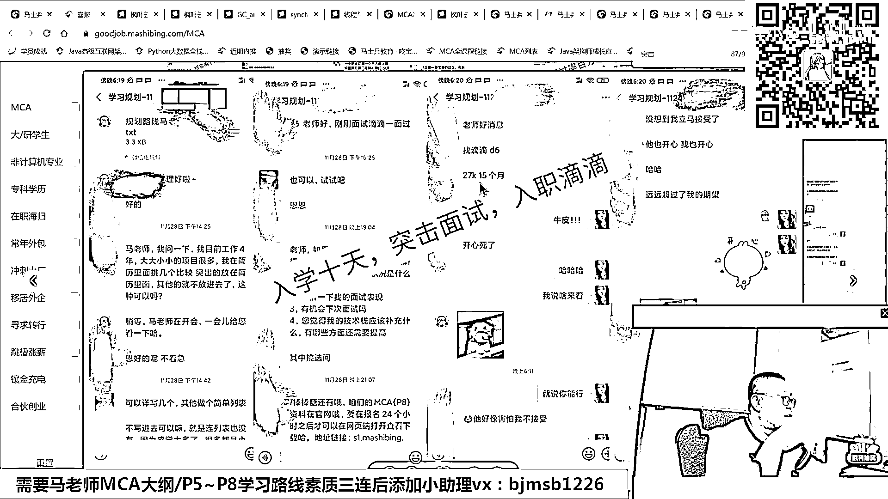

这突击的这个内容呢 挺多的啊 你们也可以去自己去看 这是6+2加面试突击啊 由6+2是我们内部的一个。

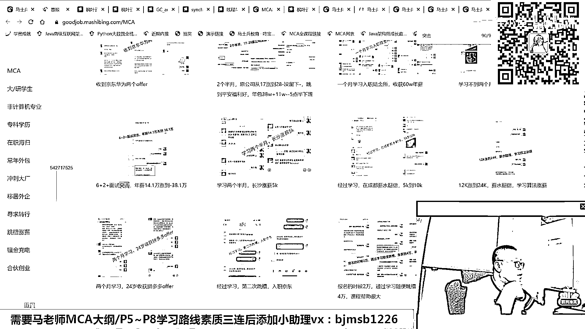

常见的这种这种呃 学习路线啊 然后，六个知点加两个项目啊 14万一找38万一的 找几个那个最近的 这是突击了一个月。

新的14-20k就是突击的效果实际上是很容易的 就是应付国内这个是比较容易的 你知道吧。

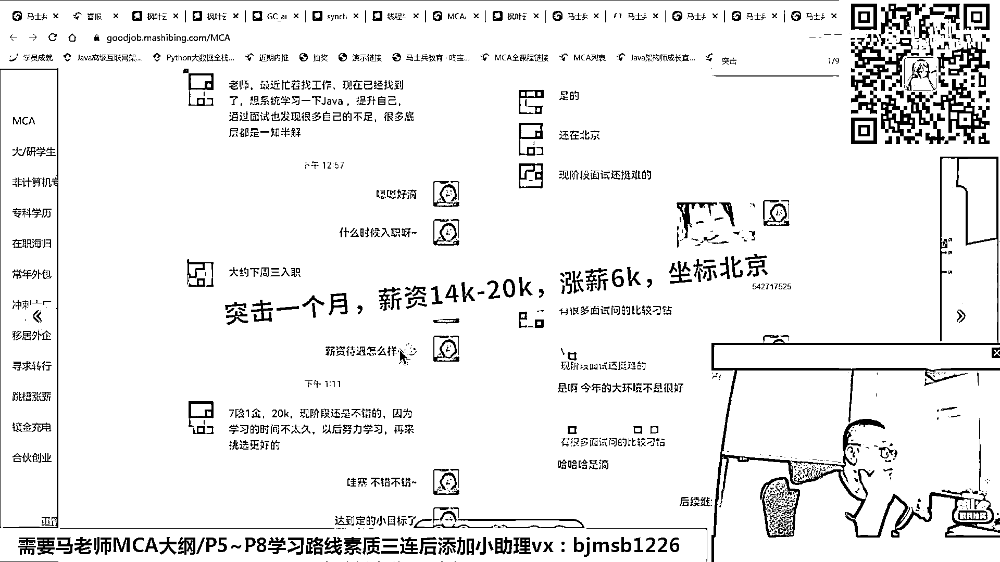

他真心不难，他比较麻烦的实际上是应付国外的，就是老外考 为什么他重点考算法 重点考算法的原因呢 是因为算法没法突击。

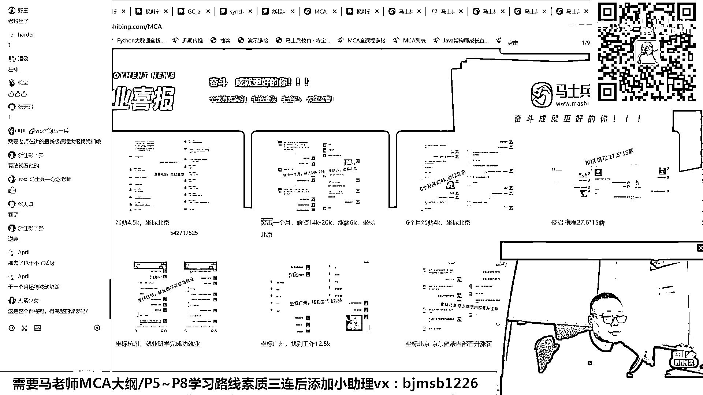

我没有听说过说你算法不太好 然后用一个月时间我突击成了算法大神，没听说过啊 说我不是计算机行业的 然后呢 我背那个知点我能背过，说我一个月之内我算法 我跟这个其他的搞计算机的差不多 没听说过。

所以这个玩意儿是没有那个什么的 这是整个课程有完整的课表啊 呃 等会我给你看就可以了，这个玩意儿是没法突击的 你要理解这一点，没法突击的东西就意味着你没法作弊，你没有办法去搞什么 搞什么那个那个。

强强突猛突去背题 你背也背不行 只能是老老实实扎扎实实的练逻辑，练思维你才能够做好算法题。

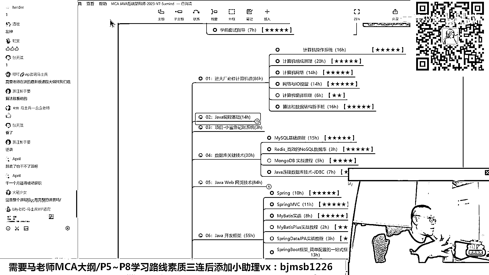

所以这是为什么在这里头呢 我们专门给大家设计了算法课的原因。

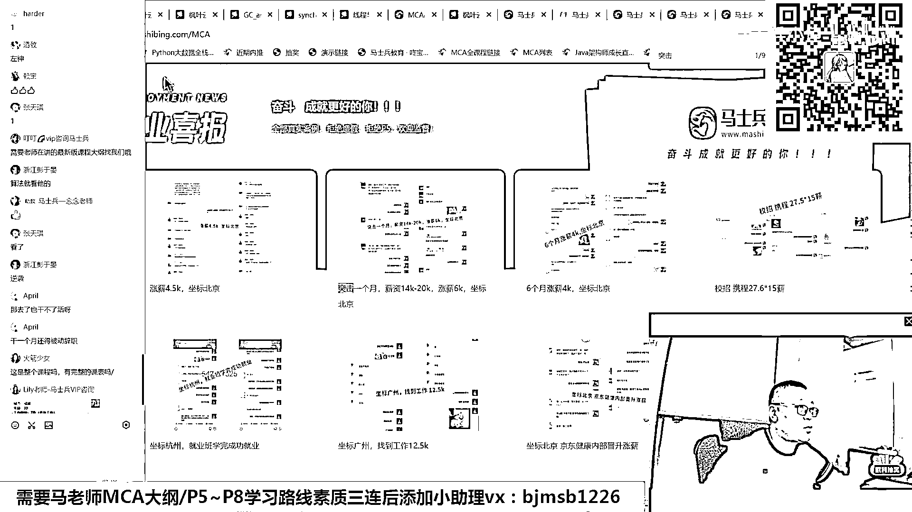

算法课呢 很少有机构去设计这一点 尤其是做这种应用级别培训。

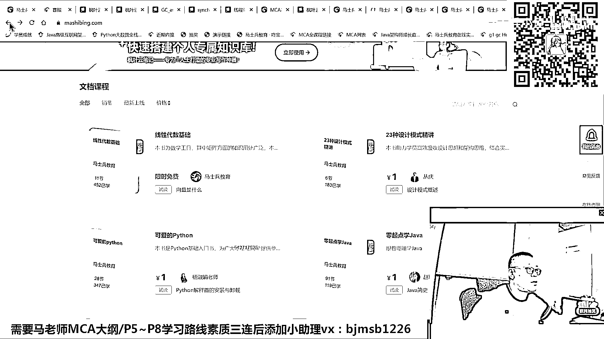

我们为什么设计这一点 就是我们不想让大家会儿这个内力太差了。

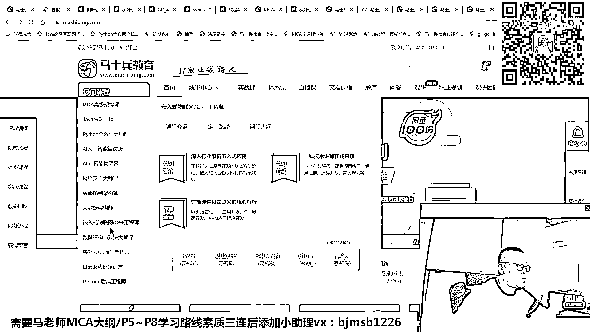

呃 一共有两版 两版加起来是878个小时 一版大概是400多个小时 学一版就可以啊 不要学那么多，会从新手班到体系学习 到刷题 到大厂的算法 每周的大厂算法题。

算法的高频面式和全面压题啊 这是往期的算法 咱就不说了，这是咱们直播的内容 每天都有每周都有直播 做老师讲课。

呃 详细的内容 由于大家会对算法的理解呢 每个人不一样 我在这呢 就不一一的去给大家念这些专业的名词啊，大概呢 我跟大家这么说 国内的厂子，一线大厂不是很强的这种 比方说像京东，像什么。

京东 还有像阿里，就是对算法看中没那么看重的这样的厂子 大概你搞到动态规划部分基本都够了，但是呢 如果说你想到字节 到微软 到铜讯 到华为 这样比较看重算法的厂子。

那不好意思 动态规划之后呢 还有系列的问题，还有系列的问题 大概你就得成体系化的来补，呃 玩算法的人最合理的时间点实际上是在大二大三左右 如果是这样的话呢 我们。

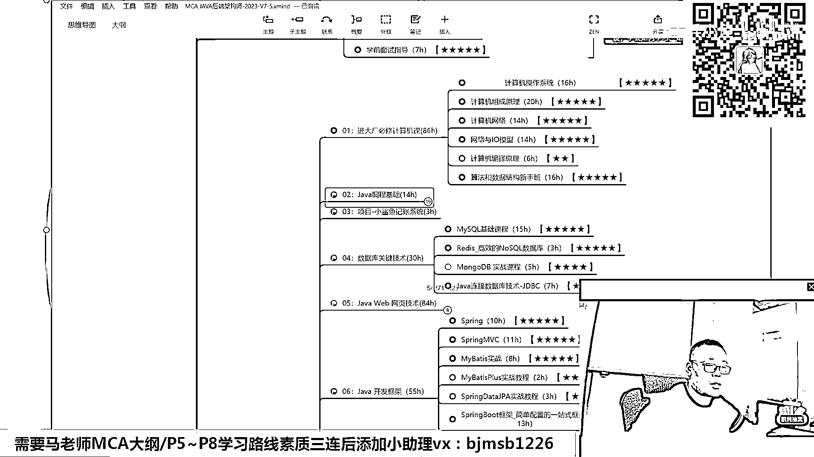

就是在安利里面呢 有通过好多同学啊能送他。

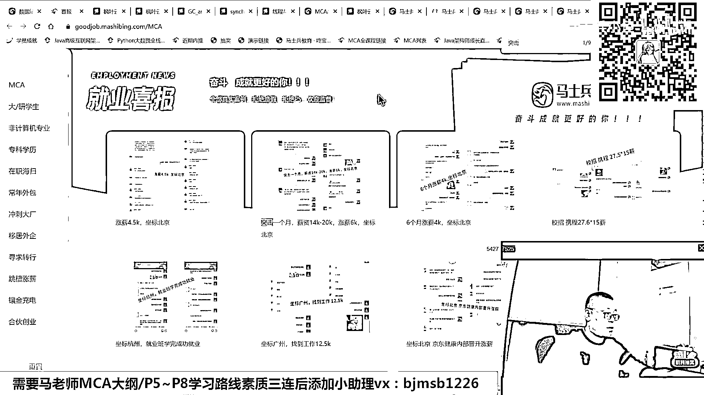

就是通过算法就直接送他送他进那个那个大厂的实习了啊 这是凭算法应届生是六六十万的package是60万加股票。

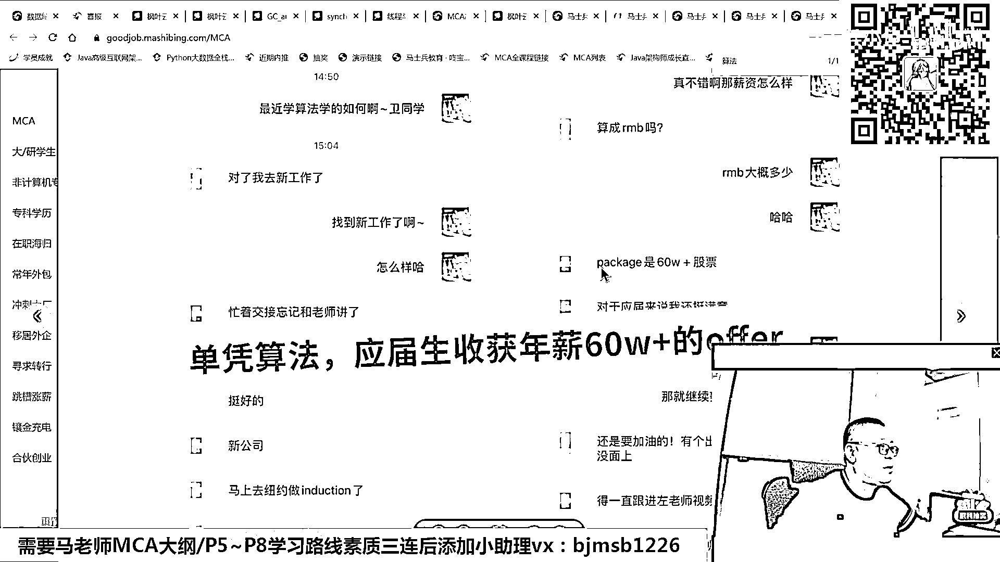

这是那个理想的offer涨了8k啊。

呃 这是拿了字节的 被字节录用了算法的学习。

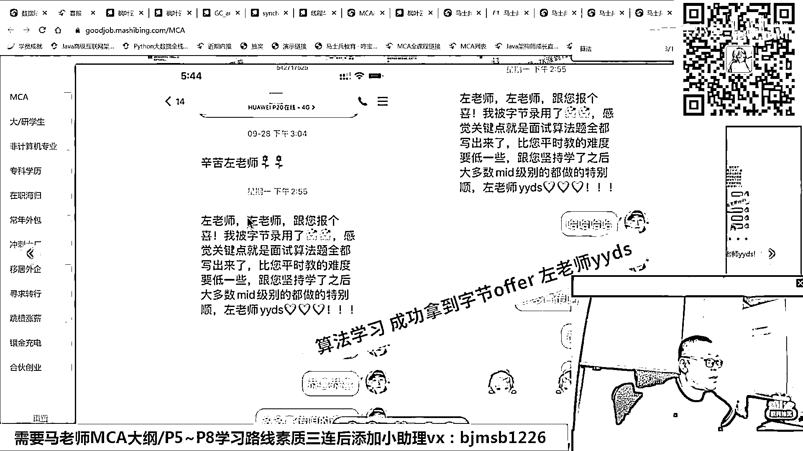

呃 那个想进大厂的同学啊 这块知识务必掌握好吧。

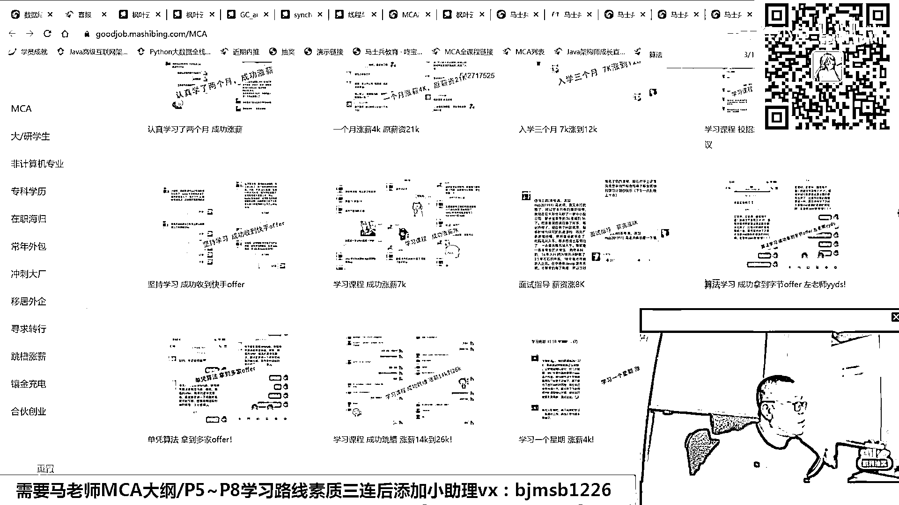

咱们不能够说因为他难 然后就逼而就退而求其次啊，呃 我也给大家请到的是国内最牛逼的算法老师 好好跟着学，进大厂就有戏 如果你不想进大厂的 没关系 算法扔一边 没人理你啊 起码到目前来看没人理你。

但是呢 你如果想进那种中高端的一些厂子 现在有一部分也已经开始重视这部分，哎 主要是原来呢 进这些厂的人呢 他不是靠算法进去的 所以他面试的时候 面试你的时候也不会考你算法 他自己都不会啊，但是。

越正规的厂子就越会考你算法课 这个你要了解 了解这点，这是为什么我们在课程里面呢 给大家专门加这块的原因 基础的编程项目，数据库网页框架项目，工具项目微服务项目项目，算法与数据结构的进阶 软实力。

好 在这里面我大概重复了四五个项目 同学们告诉我为什么项目很重要，那个你们简历有些人投出去之后没反馈 这个我今天刚上课之前就同学跟我说了 为什么。

注意你简历里头有两大类写法 第一类叫知识点 我可以负责任跟你讲 任何一个知识点的学习都很容易，就像我这么跟你讲 你是不是很容易听懂 我们老师 我现在要求我们老师们就是。

你不仅要讲的清楚 还要讲的漂亮 还要讲的，容易，好吧 我这么跟你讲 其实任何一个知识点 你只要肯下去想功夫做 你用碎片化的知识 每天在车上的时间都能搞得定。

很容易 但是为什么你写了一大堆的知识点上去 一大堆名词堆上去，人家面试还不给你机会 是因为你的项目十分不给力，所以在这里是进行了系列的项目 如果你没有做过项目 幼年生大学生。

扎扎实实把项目全做完 写你简历上 一般，刚毕业的时候要求四个左右项目加系列知识点的写法 这是你现在找工作的标配 线下的培训都是这样的，你说你只有两个破项目 不好意思 没戏 好吧，然后如果是想进阶。

后面的项目，这里的项目一级流量网游后端高并发相关日志，中台设计 如果还想进阶进行架构方向上的项目设计怎么办，容器化要了解 是吧 福保账要了解，然后这时候的项目该怎么办 大型团队的架构的管理。

两大项目 第一个是我们的网约车的第四版。

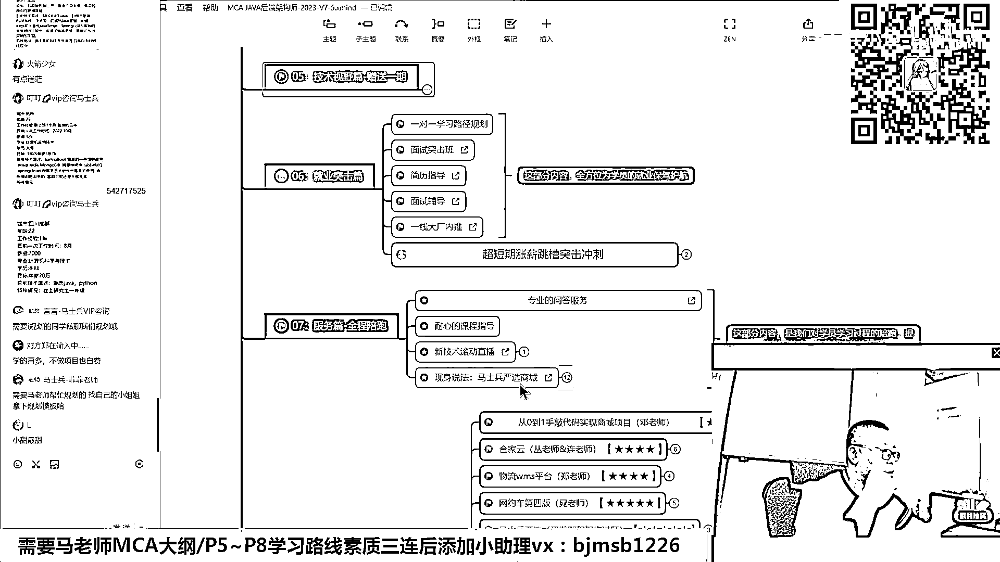

第二个是我们的严选商城 我建议大家 比方说你如果只是想了解落地 网约车第四版够了，如果你想了解站在更高的角度 除了落地之外 还要了解设计 还要了解把控 带头 团队怎么合作出来一个项目。

了解咱们这个项目严选商城，这个呢 你们可以在网页上直接访问的到啊 也可以下单买啊 这个都是可以直接运营的，就是u。com。

你打开之后呢 其实它就是一个电商网站 我拿电商举例的 主要是为了突出技术 业务逻辑比较简单 我们主要为了突出技术。

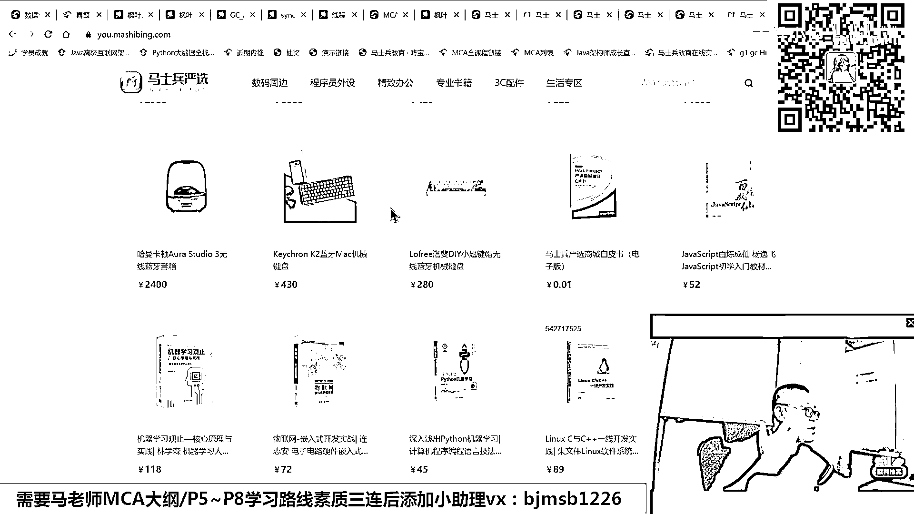

那这个东西呢 前端页面看上去比较简单 但是它核心点呢 实际上是在于它后端的架构设计 以及，人员的组织和配备 我们来看一下就知道了。

这是咱们后端的技术架构 运营的人 用户的人开发和运营 全部组织到一起 通过运营开发的运营开发的一体化，databox结合在一起，网关服务 治理 微服务 技术中台的系列的组件。

以及呢 我们的一些基础组件 短信的es的logstash的是吧 canal的 然后my circle的redis的等等，从技术框架来讲。

你可以来了解怎么去自研框架 从技术的核心技术来讲 用到了这系列的技术监控警告的。

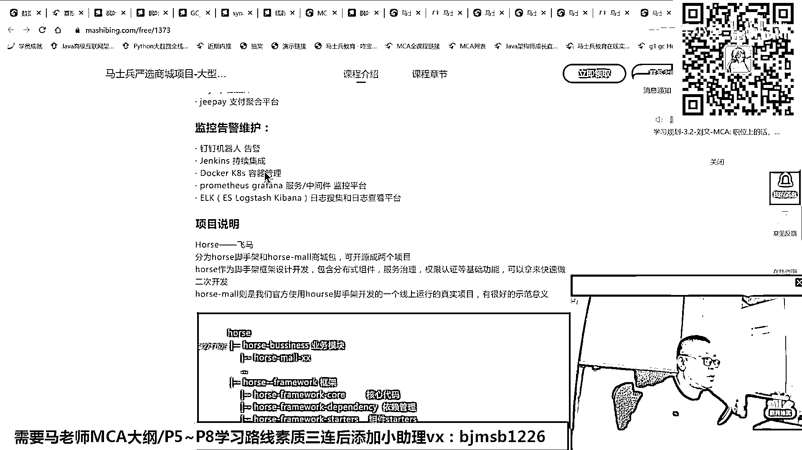

从中台的角度来讲 可以去了解支付中台怎么做，im中台 我们是真正的支持每天上亿流量的im 没有任何问题 上十亿没有问题 没有任何问题。

搜索的中台 用户的中台 以及后端的大数据该怎么做 大数据相关的ai推荐该怎么做，就是从前台到后端 当然做这样一个项目也很累 我就直接告诉你。

马老师为了这个教学项目 大概投入了这么多人 这是我们的启动会。

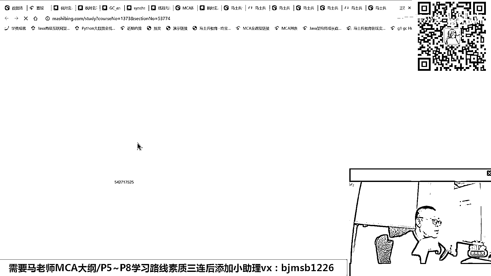

前前后后30多个人吧。

不要小看30多个人 兄弟们 30多个人在很多大厂里面都是一个巨大的项目组 不信你去了解一下，从前台到产品到测试到运维到开发到团队的组织。

到代码的落地。

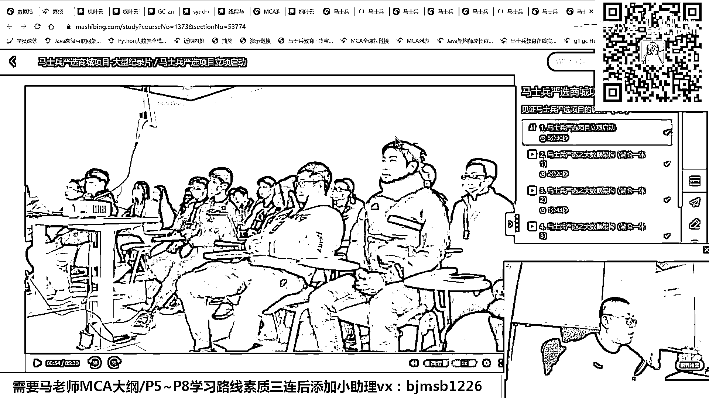

所以项目呢 整个系课程体系里面为你设计了从最初级的简单的小p项目，一直到你可以带领几十个人团队开发的大型项目，做这种投入的给老师点个赞吧 好不好。

一般来说 做教学项目好多都是一个老师带你敲嘛 对不对。

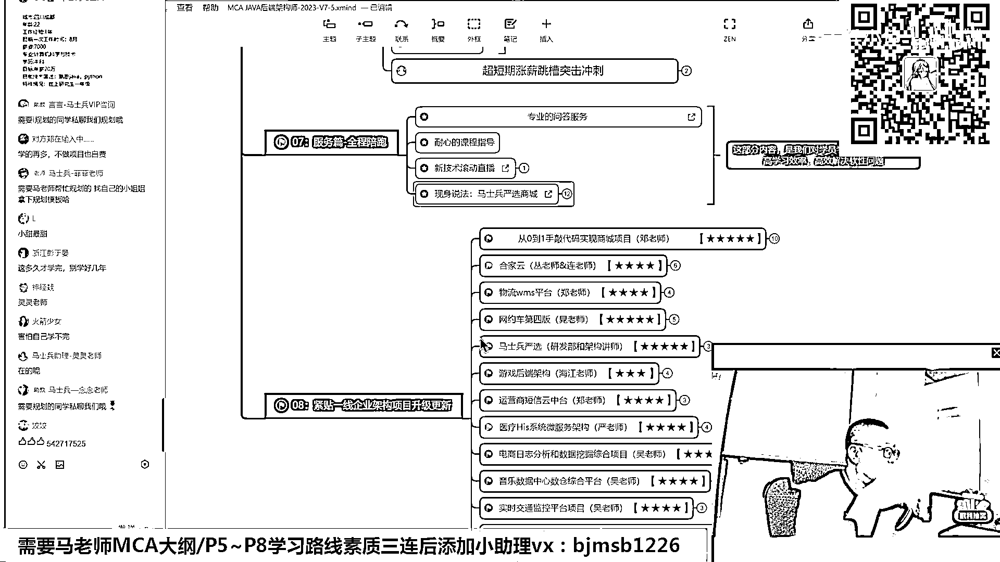

但是想做这种投入的不多啊，包括这里系列的项目 这些项目的话呢 对你们来说，怎么说呢 就是当你们简历上没得写的事 没关系还是项目写进去。

当你们项目有的写 但是你的项目比较传统的时候 用学到的技术封装你原来项目，能不能听懂 再重复一遍 你简历上项目没得写怎么办 挑这些项目写上去。

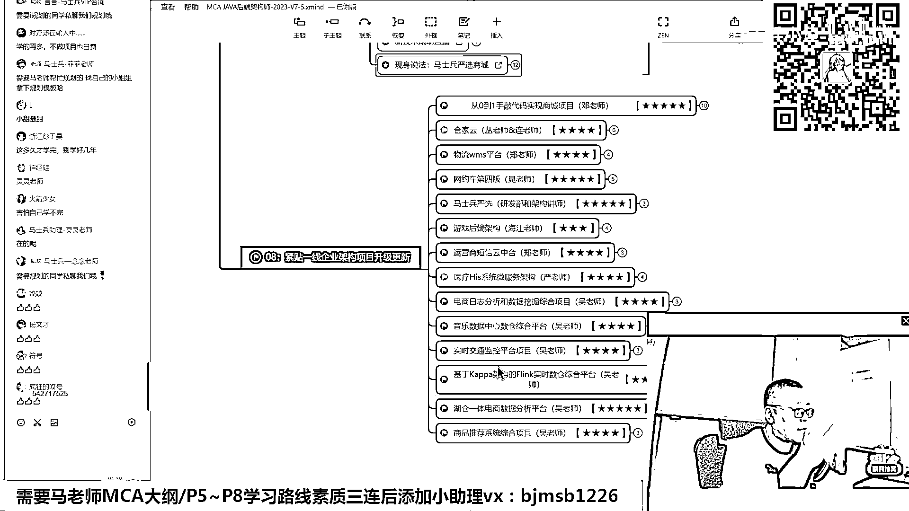

老师呢 也会在就业突击里面教你 教你怎么办呢 就是教你，别人问到你项目什么问题的时候 你该怎么回答。

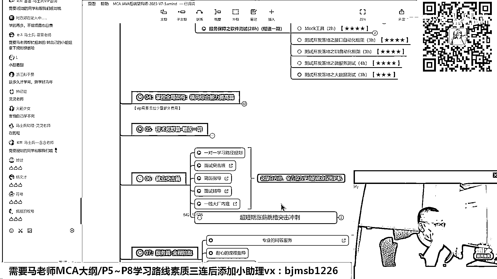

那么如果你项目有的写 你原来做过项目 背景也不错 但是呢 你原来项目比较传统，没有那么好的并发量和架构，没有那么牛逼的架构应用进去怎么办 用学到的技术去封装原来项目，你的简历就比较值钱了。

简历里面其实就两个 无非就是前面的这些知识点，什么架构方案的设计了 架构的理论了 组建的应用了 框架的原理圆满了 底层知识了 性能调优了 都无非就是这些知识点。

是你的前半点。

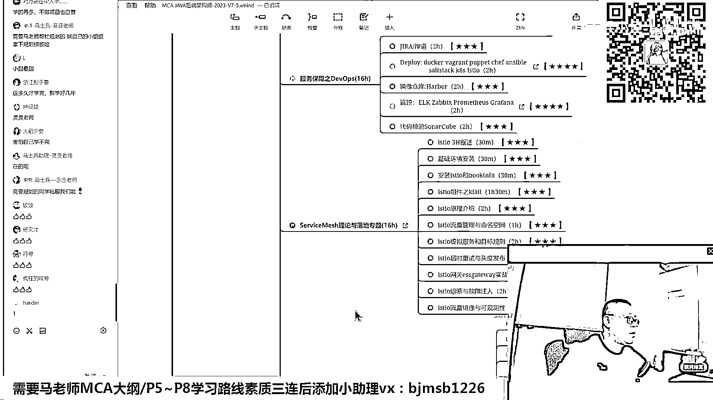

以及你后面的系列项目 无非就这些，当然 如果你追求的是更多的 比方说要做 掌控全局的。

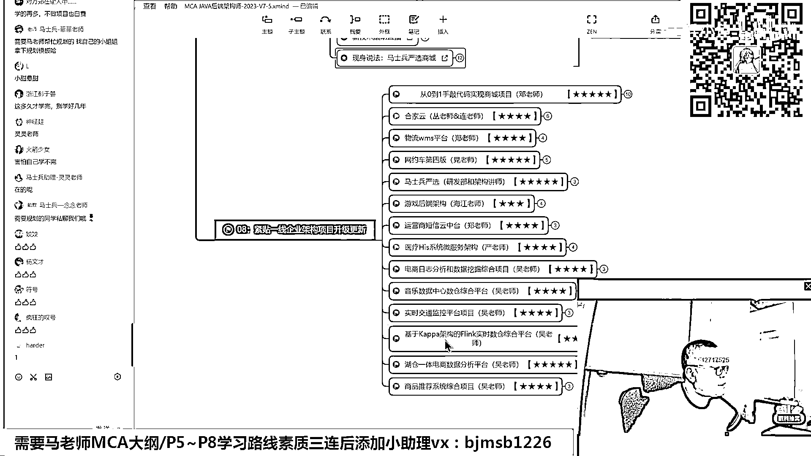

技术视野方面的 团队的管理 产品的管理 生产事故的分享 前端的架构等等，或者是你横向综合能力的这种 云原生相关的 大数据相关的 那么勾浪相关的。

CK相关的 CK相关的 如果你需要的是这些 那就是在这里 好吧，所以大概 马老师的学生呢 从，这种13k的涨到25k的 是吧 刚才大家也看了。

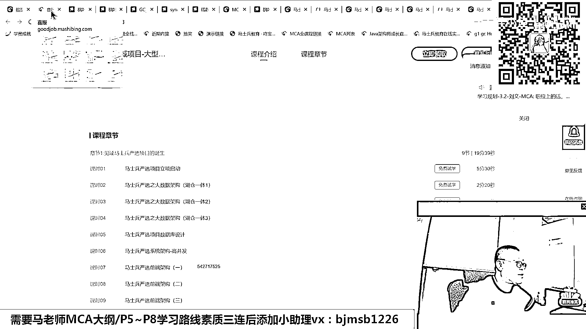

什么7k的涨到12k的 从这种的一直到什么的 一直到。

我带的学生里面 年薪70万 涨到120万的。

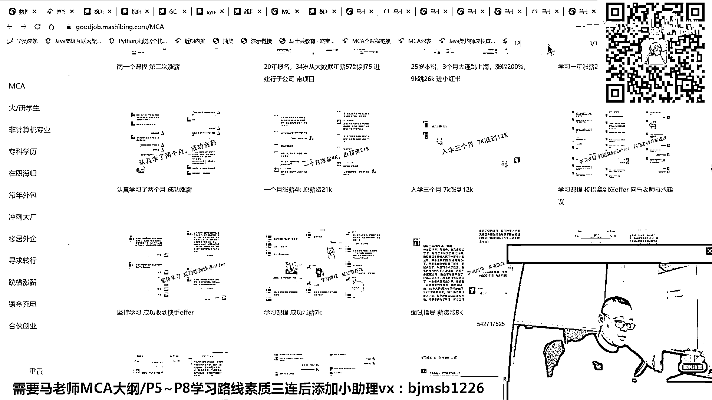

跨度比较大 主要的原因就在于 第一。

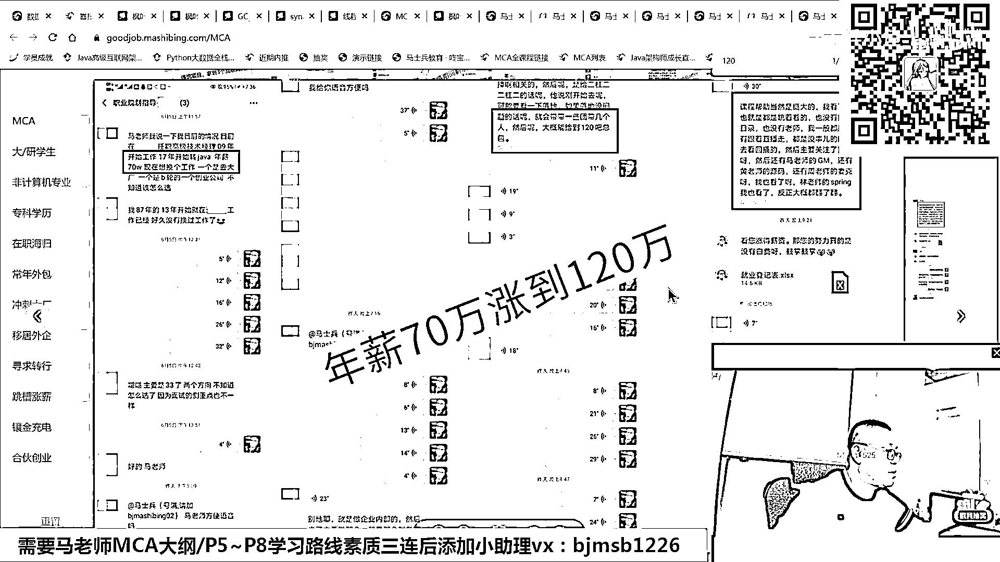

进来之后 先评估你是到底处于哪个台阶上 下一个台阶该怎么卖，跳槽要涨多少 该不该跳 本地能不能涨 然后一步一步一步一步一步走下去 一门课全报。

好 我整个的我们的架构体系啊 还有这个指点的内容啊 大家如果，愿意要过去啊 找咱们小姐去要好吧，我建议你去了解了解啊 就说你可以。

不跟我们学 你说我不想掏钱 没有关系啊 那你就自学 自学呢就是效率比较低 耽误时间比较多，嗯 我带你三月自学12个月，九个月你是亏的 你自学找15k的 我带你找20k的。

每个月差5000 所以你好好算算账，嗯，多了解 把咱们的大纲要过去 对你来说 哪怕自学都是一个指导 好吧。

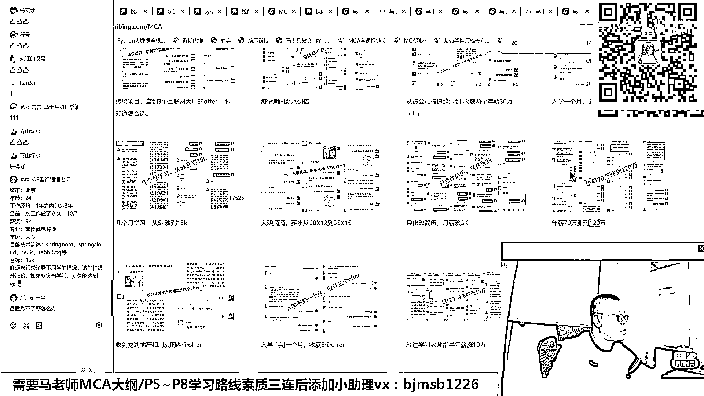

謝謝收看。