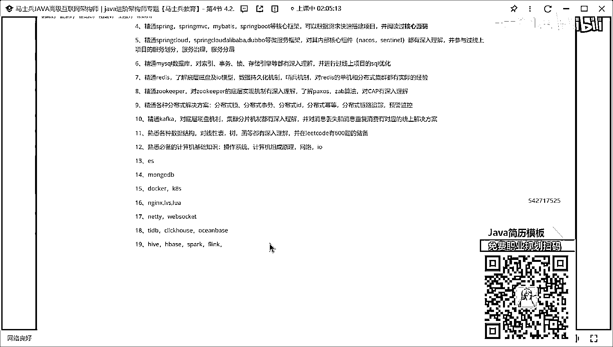

# 什么样的程序员简历一看就没戏？当代互联网HR最喜欢的简历套路有哪些？马士兵告诉你普通程序员写简历千万别太老实！ - P4：程序员简历指导：技能描述怎么写？ - 马士兵小鱼 - BV1oP411Q73J

第三个魔幻来接待写是什么，是个人，技能，描述其实这个前面两块东西是没那么重要，大家基本就扫一眼，看一看就过去了，但技能描述这块，我希望大家每个人一定要好好去写，一定要好好去写。

因为这个技能描述这块是能够彰显你个人的技术深度和你技术细节的地方，这都是必须要好写的，但有同学就会说，老师我不会怎么办，技术上没有怎么办，就我说的必备的技术，你该写还是要写的，你说你未富不会不行。

现在是面试必备，为啥不写范围，你写个10到15K，你告诉我代表什么意思，代表什么意思，10K我可以接受，聊完了，我给你15K吗，我给你15K吗，都行啊，你就写范围，你写范围可以吧，你写范围行不行。

不给你抬这个杠，不给你抬这个杠，反正我说的东西你愿意听就听，不愿意听就拉板，我不给你抬这个杠，气死个人，我说一下技能这块应该怎么去描述，大家注意在写技术的时候，一定要按照一个标准的顺序去写，标准顺序。

很多人写那个简历的时候，写技能描述的时候写的很弱，因为大家注意啊，面试官在面试的时候，每个面试官是有自己不同的风格的，每个面试官面试的方式不一样，有的面试官呢，可能先从项目开始问，有的面试官呢。

可能看完你的项目觉得比较low，没什么可聊的，我会沿着你的技术点，12345挨个往下挨个往下问，这就很麻烦，所以我建议你啊，按照一个顺序写，先写什么，先写你JAVA相关的技能。

这很多人要是JAVA技能怎么写，可以这样写，比如说，精通JAVA，对不对，过年一线开发经验，具备，良好的编码能力，并熟练使用设计模式，可以写吗，还写精通吗，不行不行不行不行，好吧，好不好。

你想写精通你写精通，不想写精通你写熟悉好不好，这个咱不较真了，好吧，我每次因为这个事给大家较真，真的真的没必要好吧，就你觉得你有勇气写，你就写，你觉得没勇气你就不写了，好不好，你写成熟悉，还是熟练都行。

看你心情来，你怕，为啥不敢写精通，怕被问到死是吗，先写上去吗，什么叫精通啊，什么叫精通啊，你们告诉我什么叫精通，我就认为会用就算精通，我就这么认为的会用就是精通，我就这么认为的。

我知道你可能认为就是原版都看完了才算精通，我就觉得我会用就是精通，这有什么关系呢，要打你就打你吧，能怎么样，你掉鸡肉了，少一块钱了，还怎么着了，面试官该追问到什么深度，他还是追问到什么深度。

他不会因为你写了个熟悉，所以我就不往深度问了，不会的，听懂了吗，他不会因为你没写精通，你写的熟悉，所以我就不问你原理原版了，不会的，他该问依然会问，所以这东西只是一个修饰词，有的面试官可能比较矫情的。

觉得你写精通，我得好好考考你，他可能就会问，那就问呗，明白吗，那如果问到你东西，你真不会了，大胆承认我就是不会，能怎么样，没事，你们要不敢写，你写熟悉嘛，没关系没关系，好吗，那就是个修饰词的事。

无伤大雅，无伤大雅，好不好，咱们不聊这个事了，觉得有魄力的，你就写没魄力的就算了，好不好，我的建议是在整体的技能描述里面，至少要有三个以上的精通，我的建议好吧，在你所有的技术上描述里面，至少有三个精通。

好吧，言尽于此，OK，好了，这个时候一定有，这个时候我写完第一条，大家有意见吗，我问一下，就我写完第一条之后，我想让面试官问的是啥，所以我写完第一条，我想让面试官问的是啥，这东西，这是我想让面试官问的。

所以你要提前去做这样的准备工作，明白吗，就我要准备一下，在我的项目里面怎么用设计模式的，我对设计模式的理解是什么样子的，我先准备这些东西，你像我去埋了些陷阱，等着面试官去票，懂意思吧，好这点很重要。

OK，当然咱们这一定有很多大学生，还有应届生在吗，再来应届生来扣个一，可以批你是应届生吗，别说我是老师，我是应届生，我还没毕业，我这玩意咋写，我还是那句话，每种方式写的方式都有很多。

你想怎么写都可以怎么写，你可以这样写，能不能这样写，熟练，掌握，JAVA，SE，基础，知识对吧，对集合，IO，线横等都有深入理解，对吧，具备，良好的面向对象的设计思想，对吧，并熟练掌握设计模式，可以吧。

就无所谓咋写，你想咋写咋写，就是找你符合你背景去写，我这告诉你什么，不是说让你们所有人都按照我的模式去写，不是这样的，不是这样的，我是告诉大家写简历的方式是什么，写简历的技巧是什么。

你们要参照这样的模板去进行描述，好不好，OK，好，第一个写完了，那写完账号之后写什么呀，写完账号之后写什么，框架，程序库，不要先写这东西，先写JVM和并发编程相关的内容，好吧，京东，我就写京东了，好吧。

Java并发编程，对Java的锁机制，线程词，机制，AQS，等都有深入理解，并在项目中，熟练使用，来告诉我，想考察，可是东西吧，你们可以你们可以干嘛。

能不能准备一些在项目中可以跟并发编程相关的相关联的点，能准备这东西，多意思吗，还是那句话，大家永远记住我说那句话，就是你们在面试的时候，很多同学把技术跟项目分的是很开的，他俩是分不开的。

这技术服务于项目，项目，加持于技术，更多意思吗，就是你在聊技术的时候，你是不能脱开你的项目聊了，同样的聊项目的时候，你也不能脱离你的技术，他俩是吻合在一块聊的。

所以你在写的时候想办法把项目和你的技术做一些吻合和关联，那多意思吗，他们有人说，老师我项目中没有并发编程操作，你能不能准备一个就是我，我写这句话的意思，就为了让面试问我这个东西，我能不能提前准备。

他们就告诉我能还是不能，能不能，你把并发编程学会了，学会之后能不能想办法跟你们的业务做一个整合，可以吧，如果可以的话，那他问了你不就是加分项吗，是不道理，好吧，因为老师这个现场是我不会怎么办。

我这写这个锁机制也好，现场持续之要AQS也好，这只是啥，只是并发编程里面的某一个或某几个小的技术点，你可以写什么东西，你找一些你熟懂一些行不行，你写算了，那我可行，你写三个赖子行不行，可以吧，没关系吧。

是不是一下子就不行，你看清楚好了，只要你保证你的技术能覆盖到就完事了吗，所以这个每个人写出来应该都不一样了，不可能每个写出来都一模一样，多意思吧，好吧，来第三个写什么，这边我吧，听懂什么，这边对垃圾。

回收算法，和垃圾，回收器，有深入理解，并，怎么样，参与过线上项目的JVM调优工作，可以吧，来再写还能写啥，不是聊的最多的是垃圾回收，你对哪个东西熟，你写哪个行不行，你能不能写那个双切美派机制。

能不能写类加奶机制，你会啥写啥嘛，你不会的不写嘛，你会什么会啥写啥，我一直给他说，我只是给他举个例子好不好，比较个真，来下一个写啥，这些砂瓦必备的技术，你准备好了，下一步该写我们对应的，框架了吧。

是不是框架了，什么框架，哎，三个吧，我老师是SM怎么写啊，精通，这块些标准减减三毛吧，但是我写行了，随便VC，买白的意思，服务生不他，到核心，框架可以根据需求，快速，发现，项目啊，并什么样，怎么样。

阅读过核心研讨，来老规矩问啥，不就问这玩意儿，我就让他们问问我这些相关的东西好吧，那再来第五个还有啥，快要学完了，该该该学啥了，换存先把微服务相关的技能先展示出来，好吧，精通，啥呀。

Spring Cloud，Spring Cloud的Ali88Double等微服务框架，对其内部，核心组件都有深入，理解，并怎么样，对，并参与过，线上项目的，什么东西，服务，画画分服务，治理服务，分层。

能不能能能懂懂这意思，这些组件如果想写的话，你就写一些什么，那就是，对吧，什么Centino，Centino你写一些这些东西就完事，完了，数据库怎么写，微服务写完了，可以写数据库了吧。

精通mySQL数据库，对所以，事物，锁，存储引擎，等都有深入理解，并参与过，我说并进行过，线上项目的思考，优化，优化，可以吗，来第七个还没写着，精通，Redis了解底层，磁盘及IO模型数据，19W机制。

哨兵机制，对，Redis的单机和分布式集训都有实际的经验，可以吗，第八分析啥，Zoomkeeper可不可以写，精通，Zoomkeeper，对吧，可以写了吗，对，Zoomkeeper，底层实现机制。

又深入，理解，然后呢，了解，Puzzles，ZAP，算法对分布式，ZAP又深入理解，第九个，精通各种分布式，解决方案，分布式锁，分布式事务，分布式ID，分布式密等，分布式，分布式，链路追踪，对吧。

什么运行监控，有都有吗，可以写一堆吧，第十还写着，就这些东西，基本的这些技能是有了，还少的还少的中间键吧，写中间键，精通卡付卡，卡付卡，卡付卡，对，底层刷盘，机制集群，分片机制，都有深入理解，应对消息。

丢失和消息，重复消费，有对应，在线上解决方案，你看吧，光这就十条了，不要再纠结这个不要再纠结精通了，好不好，你可以写熟悉没关系，好不好，就是你觉得精通器写的你写熟悉行不行，这就是个修饰词，你敢写精通。

你写精通，你不敢写精通，你写熟悉行不行，没问题吧，然后呢，还可以写什么东西，你的数据结构，和算法能不能写一下，我问一下睡觉，那能写吗，啊，会写吗，睡觉，那怎么写，睡觉，不行了，熟悉，各种数据结构。

对什么线性表，是吧，数图等都有深入理解，并在，立刻有六百题的储备，行吗，还可以写啥，熟悉必备的计算机基础，知识，往内的东西操作系统，计算机，组成原理网络，IO，对吧，还可以写吗，ES能不能写一下。

MongoDB能不能写一下，可以吧，还有什么东西，Blocker，可以把S能不能写一下，但是这个是LVS，路啊，能不能写一下，有人有人说老师我记得那块我没啥写的，你觉得会没啥写吗，有可能没啥写吗，对吧。

那题，那题，那不是OK的，可以吧，还要写吗，就是这些东西，你要把你的机能占据撑满了，把该写的东西你要写出来，可以啊，你做的是硬件无联网相关的有设备相关的东西，虚拟MQTT作为传输协议来进行传输。

为啥不可以写啊，就是你把你所有相关的竞争，把你的技术优势，你要想办法给面试官展示出来，听明白了意思吗，就是你这里面不是让他全部都写，你能写多少会写多少，尽量多的按照这样的方式去做描述，懂吗，去做描述。

如果真要说的话，那些还有很多东西，我举例子啊，这没必要，比如TiTB，Clickhouse，对吧，OceanBase，我再牛逼一点，我是不是可以写吧，Hive，AgeBase，Spark，Clink。

都可以写吧，就是你能掌握到什么程度，或者你能熟悉到什么程度，你就写到什么程度，你懂意思吗，并不是说所有人都按照这个标准来，但是你要展示出你自己应该具备的技术方面的宽度，就当你的技术宽度储备好了之后。

下一步我们通过面试才能聊技术深度，你别别人的GD里面写了一堆的任职要求，写的任职要求，写完之后，你的技术战都不足以覆盖人家GD里面的要求，你觉得你会有面试机会吗，不会吧，能听懂的意思吗，对吧。

所以我这只是给大家举这样一个例子，你懂吗，好吧，老师你这个简历值多少钱，我不知道啊，我也没投过，这个东西都掌握的话，我觉得七八十万肯定没问题，对吧，搞个七八十万，我觉得还是问题不大的。

低调点七八十万肯定问题不大，就是问你真具备这样技术储备肯定没问题，肯定没问题，你放心。

好吧，来这是技术描述这块不多说了。