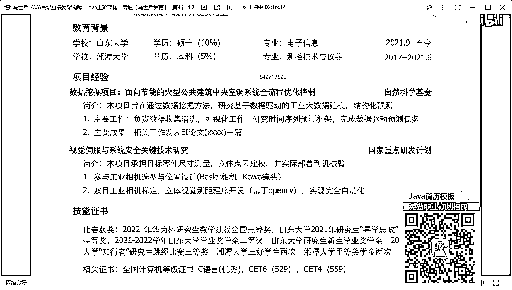
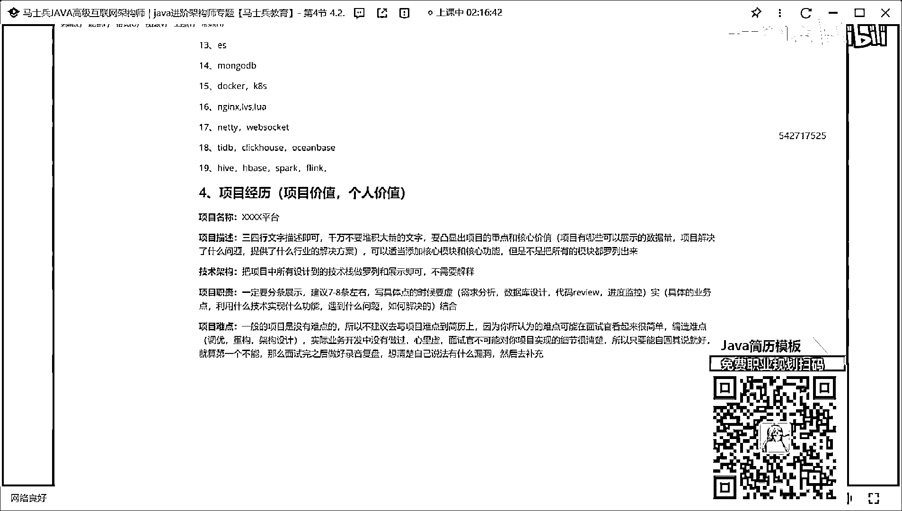
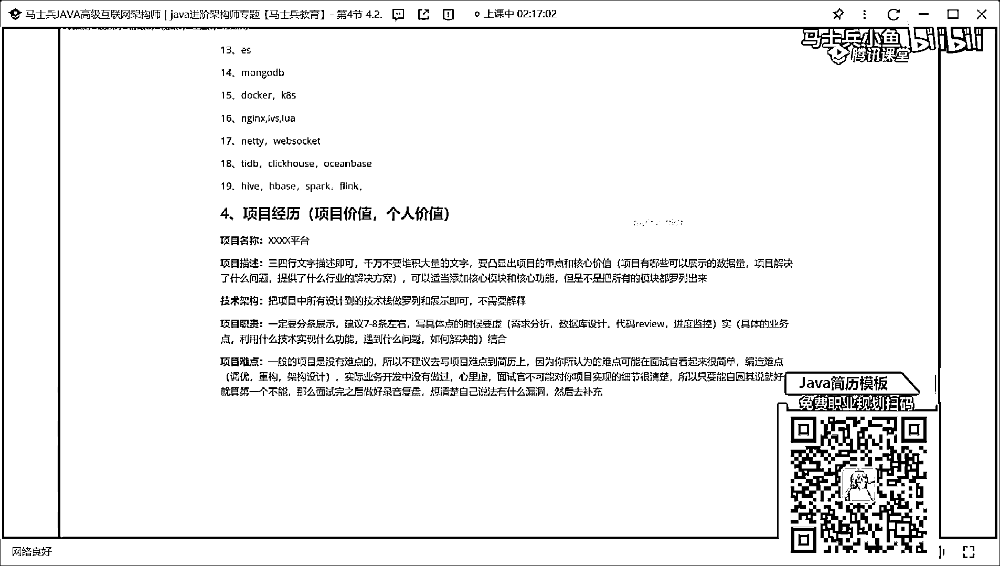
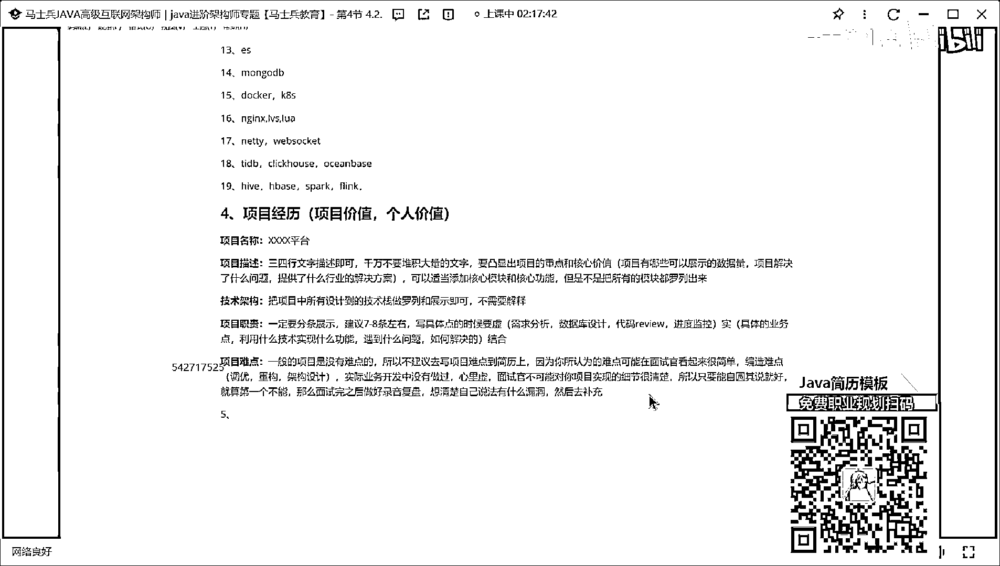

# 什么样的程序员简历一看就没戏？当代互联网HR最喜欢的简历套路有哪些？马士兵告诉你普通程序员写简历千万别太老实！ - P5：程序员简历指导：项目经历怎么写？ - 马士兵小鱼 - BV1oP411Q73J

除了技术描述之外，第四块要写什么东西，写项目，项目这块，你看其实也也也不太会写，也不太会写，项目这块怎么写，其实项目的时候写的也非常简单，其实可以分几个模块来进行描述，第一个就一定记住啊。

你写项目是为了凸显什么东西，第一个是为了突出你的项目的价值，第二个是为了推荐什么，你个人价值，这两个东西都要凸显出来，那么第一个在项目描述的时候，他也要包含具体的模块，第一个项目名称。

很多同学可能不太在意项目名称，这东西可能不太不太在意项目名称，那项目名称很重要，很重要就能够写一个什么什么管理系统，系统就我在没看到你的简历之前，就我看了一下名称之后。

我第一印象就觉得你的项目没啥可写的，比如说你有个项目叫OA，怎么写，放描述吗，无纸化，办公平台，会这样写，你懂意思吗，就是你在写的时候不要再加什么系统性东西了，就要叉叉叉叉叉，我加一个平台。

让这样的描述好吧，你老师我项目确实是个技术，确实是个系统系统和感动平台，懂吗，这东西很重要，好了，这第一个项目名称，要做一个描述，项目名称完了之后，第二个什么就项目描述，项目描述这块记住啊。

同学们一定要记住一些点什么东西，就三四行，文字描述即可千万不要堆积大量的，文字，因为人啊，人的眼睛啊，对于文字和大量的文字，特别挤在一起的文字是有视觉疲劳的。

他没办法从这么多文字里面一眼看到我的重心所在，明白吗，所以这块要写什么东西，就刚说的不要写文字，三四行简单描述一下，要凸显出，项目的重点和核心价值，这东西问老师什么叫项目的重点。

什么叫核心价值能说的通俗一点，就举例子，很简单，例子非常简单，这话这话可以怎么写啊，写什么项目，有哪些可以展示的数据量，这些数据量的量词，你是一定要想办法把它展示出来的。

因为这东西能拉高你整个项目的逼格，但有时候是我项目很low，一共上千条数据，我怎么办，你可以上千条啊，如果你的业务正好是2C的，可能比较low，虽然虽然比较low，但也是2C的。

你能不能把对应的数据量乘以个倍数，乘以十倍行不行，乘以百倍行不行，谁知道你项目到底多少啊，你谁知道，谁也不知道，我问一个问题，你们做一个项目做了三个月，六个月，半年一年。

你能保证你对项目里的每一个细节都很清楚吗，对吧，你能保证吗，能保证，不能吧，那你告诉我作为一个面试官，他都没做过你的项目，他怎么可能知道你项目中的实际数据量是多少，他能知道是什么，根据你的表述。

在他自己的技术认知和行业经验上面去做一个判断，这个东西到底是否合理，听到了吗，到底是否合理，你只要说的很合理，基本上没有问题，不意思吧，还没写什么东西，项目，解决了什么问题，提供了什么行业的解决方案。

对不对，如果实在还没啥写，可以适当添加核心模块和核心功能，但是不是把所有的模块，都罗列出来，把所有模块都罗列出来，这是有问题的，听到了吗，所以两行多三行简单写一写就OK了，数据量能写的一定要写。

这块还好，那下一个叫什么，叫技术架构，什么叫技术架构，什么叫技术架构，把项目中所有涉及，BOD技术站做罗列和展示即可，不需要解释，听明白了吗，你不要去解释，哇，你不要说redis做缓存，是吧。

这RockMQ做中间件，不要解释这东西，就把单词一个一个用动号也好，用动号也好，把它分割开，用加号也行，把它分割开，把它展示进去就完事了，这么简单，哇，重心要在于项目，职责，项目职责怎么写。

项目职责要求一定要分条展示，建议七到八条，左右，听明白了吗，建议七到八条左右，不要写少了，那么这块写了写具体点的时候要虚实，结合什么叫虚实结合所谓的虚，大家都会写的，什么需求分析，对吧，什么数据库。

设计什么代码，reveal对吧，什么项目进度监控，这些东西，哇，你可以写些虚的，那实际的是什么，具体的业务点，明白吗，具体业务点，这话怎么写，利用什么技术，实现什么功能，遇到什么，问题如何，解决的。

都可以写，能懂意思吗，必须要用这个方式去写，把它整丰满了，你要展示出来，这个项目离得跟别人就不行了，你在做项目的时候，一定有这样一些比较难的点，如果业务比较腐烂的话，可以把业务一些比较腐烂的点。

也可以把它展示出来，基本上项目写的四个文化基本上就够了，当然还有一些同学喜欢干一件事，在项目上面加一个东西，项目难点，有多少人喜欢写项目难点，有吧，有很多人愿意写这东西吧，这样啊，给大家一个建议。

来个建议，好吧，什么建议呢，一般的项目是没有，难点的，听完了，所以不建议去写项目难点到简历上，明白吗，因为你所认为的难点可能，在面试官看起来很简单，听明白了吗，当然这个问题啊，面试的时候就前人说的。

每次面试官问项目难点的时候，不知道怎么回答了，你说和你写出来效果是不一样的，你写出来之后面试官一看就知道啊，但你说的时候你表示出来面试官觉得，哦，原来是这样，这个你也难点啊。

但你写出来之后给他的印象和感官是不一样的，你通过嘴表述和通过他文字展示出来的东西完全不是一个东西，听明白了吗，所以这块我建议大家你去准备难点啊，但是不要写到简历上面去，不要写到你的项目里面去啊。

如果说记住了，如果说你要去准备难点，如果没有怎么办，编造，难点，让大家从哪些维度去编造呢，非常简单，第一个，调优的东西，把你业务里面的GM调优，那次调优说一下，第二个重构，有之前单体项目。

现在我要重构成微服务，怎么做加工升级，对吧，第三个在重构中我做哪些加工设计，我在做进入选前的时候是如何去评定的，听明白了吗，就是你要瞄准的方向，你得照着这几个方向就行了，但有人就会有一个疑问。

老师你说这方面我理解，实际业务开发中，没有做过，心里虚怎么办，记住我刚刚说那句话，面试官不可能，对你项目实现的细节很清楚，所以只要能自圆其说就好，就算第一次不能，那么要准备，那么，面试完之后做好复盘。

想办法想清楚，自己的说法有什么漏洞，然后去补充，我没办法了，你不会撒谎，我咋办，我也替不了你，你就大胆告诉他，面试官我们这项目的很low，然后呢，我们那个没办法，我确实没啥难点，我也会诚实说。

我确实没啥难点，那你怎么办，那你怎么办，你自己心里面过不了这道坎，你就觉得不行，我就要说实说实，我怎么样，那我拦不住你啊，就算了，那拦住你。

回答看。

因为不来看这个面试，你接接几个。

你看这个吧。

这个，这个框架第一个项目描述干什么事，第三个工作职责123456789，看了吗，就你一定要想办法把你的简历写的丰满一些，好吧，不看了啊，因为我这有的简历啊，都是其他yp同学的，有些东西不就不给他了。

好吧，好，下面这块就聊这么多吧，OK，然后之后第五个写什么，办了转账，之前相关不相干的东西写出来不要不要。

如果要写之前的项目经验也编造成渣滓。