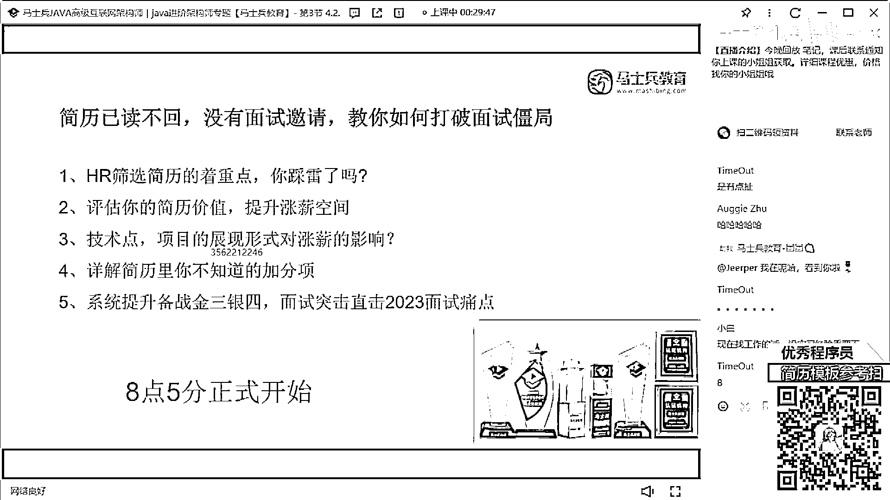
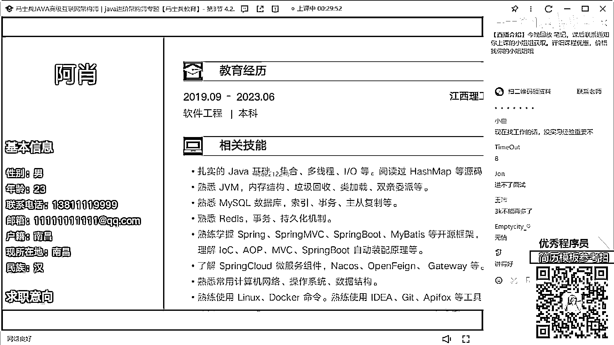

# 什么样的程序员简历一看就没戏？当代互联网HR最喜欢的简历套路有哪些？马士兵告诉你普通程序员写简历千万别太老实！ - P8：【反面教材】4年Java经验简历指导 - 马士兵小鱼 - BV1oP411Q73J

行了8。5分了，我們正式的開始上課啊，來能聽到我聲音同學，我們隨便摳個數字，我們開始進入到簡歷的講解環節，大概先整體的溜一下吧，然後先展示的是你的教育培訓，然後是你的工作經歷，過境力的話這是三年。

然後這是不到一年，這個又不到一年，將近一年的時間，然後技能，SRM，SSM，SRM Cloud，WebMagic，Flowable，前端的技術，爬蟲的技術，Redis，看到了嗎，看見東西了嗎。

這就是我說的，就這種東西，一旦出現這個問題了，你下面寫的再好，我都不會看了，一定要避免出現這種問題，好吧，RubyMQ，MongoDB，Spring Security ES，然後設計模式。

然後正在學習NIO和Netty相關的內容，然後個人介紹是，性格溫和，為人誠實，然後開了，然後項目經驗，後排運維管理系統，然後下面有一個紅駁招聘系統，下面還有一個口袋購物商城，有個CRM系統。

有個當當論壇網，大家，這是誰的簡歷啊，這個同學，小伙伴，勇於站出來這是誰的，那個同學在嗎，在的話來扣個一來，之前能找到工作嗎，你們說，就這種簡歷，我告訴你啊，我看完之後，你百分之百沒有面試機會了。

不管你是不是剛培訓出來的，你都沒有面試機會，為什麼，我剛剛說的問題，它裡面基本上都出現了，第一個說明字，第二個，看一下這個字體的整體的大小，樣式字體的格式，你再看下個項目，項目更精彩。

咱先不看你項目的內容寫的是啥，就這個字體，這個字體，這個字體，這個字體，下面這塊，就這種東西，你說你把這樣的簡歷投給我之後，你覺得我的第一反饋是什麼，不說內容，第一反饋就是你一定沒有認真琢磨你的簡歷。

你看你的字體大小，前面的字體，後面的字體，我都不用考察你的技術，就知道你這個小夥伴在寫這份簡歷的時候，最起碼你不認真，最起碼你的態度有問題，你給我看這樣的東西，在我看來浪費我時間，明白我的意思嗎。

所以就這種問題，一定要記住，一定要避免，就這種問題一定不能出現，一旦出現這樣的問題，真的很嚴重，就我如果看到這樣的簡歷，我告訴你，哪怕我們的HR告訴我，要去面試，你看一下簡歷，我如果收到這樣的簡歷。

他哪怕來到公司了，我也不讓他去面試，懂我意思嗎，所以他現在出現問題，我希望大家所有人顧免，不要再出現這樣的問題了，OK是第一點，緊跟著我再來說，他裡面內容描述，第一個關於技術戰的描述，他現在工作三年了。

正常情況下三年經驗的一個小夥伴，他應該處於一個中級左右的水平，但是大家看一下，他現在所描述的這些技術戰，可以支撐他三年的經驗嗎，不過吧，首先我們作為一個後代開發工程師，其他東西沒必要。

這東西寫的跟沒寫一樣，第二個像這個東西，寫的跟沒寫一樣，比如說你有用的就中間這幾條，然後你把很多不應該歸到一起，不應該歸到類的地方歸類了，33M、SpringBot、SpringCloud。

你給放在一塊，這樣東西有必要跟框架放在一起嗎，像寫的JAVA，寫的爬蟲，寫的數據可視化，又寫了東建城，寫的Redis，寫的OSS，你這個東西我不知道你是怎麼往一塊合併的，我們在技能合併的時候可以合併。

但是有相同類型的，同類的技術可以合併，非同類技術有必要合併嗎，沒必要吧，所以怎麼辦，把這裡面你所掌握的每一個技術戰，能不能都單獨拿出來，做一個最基礎的羅列，展示一下你個人的技術深度。

就很多人其實不太注重技能那塊描述，老實表現，所有人都這麼寫，我也這麼寫就行了，如果你這麼寫的話，我問一個問題，你這裡面技術你感激得起我的問嗎，因為你沒有突出任何東西，比如Redis，我隨便問你。

我問你底層的IO模型，我問你它裡面的系統調用，我問你它哨兵機制，持久化方式，數據類型，底層數據結構，我是不是隨便問，我想問啥問啥，如果讓面試官想問啥問啥的話，你告訴我，你目前的技術戰。

能cover這些東西嗎，很明顯不能，隨著技術戰描述肯定有問題的，怎麼寫，把你所掌握的每一個技術戰單獨拿出來，把每一個細節去羅列清楚，展示清楚一排，這是你整個的技術體系，先給別人展示出來，我具備這樣的。

這是寬度深度你來問，但最起碼寬度，我先給你展示出來，你寫成這樣，我覺得不合適，好吧，這是第一個，第二個自我介紹，我不知道這個地方，加一個自我介紹，用意在什麼地方，你如果想加一個自我評價。

想誇自己叫自我評價，但是你誇這個東西，性格溫和，為人誠實，活潑開朗，對編碼有興趣，在編寫在哪方面很仔細，你這句話純粹就扯淡，你簡歷寫成這個樣子，你說你很仔細，別扯了，懂我意思嗎，這樣東西是沒有意義的。

寫了跟沒寫是一模一樣的，很佔空間，那應該寫什麼東西，突出你的行業背景，和你自己的技術經驗，誇一下自己，誇什麼不是誇你的性格，可能對上一句是，我是活潑開朗，團隊什麼責任感強，短視的一溝通。

這種東西在面試過程中，是很難評判出來的，那你要說什麼東西，我做過什麼什麼什麼樣項目，的一些架構設計，我之前做過什麼什麼行業的項目，我提供出過哪些技術解決方案，我接受項目的數據量是多大的。

我對什麼技術有深入研究，我自己總結過哪些博客和論壇，做過哪項的技術沉澱，這樣東西寫出來吧，你要寫點你具備，而別人不太具備的東西，這才是你的加分項和優勢，都這麼寫著，這考不上沒啥可考的，好吧。

項目這塊第一個環境，開發環境一般不寫沒意義好吧，你寫個什麼IDRGBK這東西，大家都這麼用無所謂，基礎描設計技術可以寫，把你項目中用到的所有技術，一個一個羅列清楚，這沒問題，項目描述。

該項目是給運維人員管理項目，以及運維人員考勤，你看啊，該項目是一個給運維人員管理項目，以及運維人員考勤，有問題操作工單給領導審批的系統，通順嗎，然後告訴我裡邊是個模塊，有這麼個模塊，你要突出的是什麼。

是沒有這個項目之前，遇到了什麼問題，你通過這個項目解決了什麼問題，裡面包含了什麼樣的核心功能，每天提供的工單的數據量是多少，展示一些可量化的東西給別人看，讓別人能夠對你的項目，稍微感那麼一丟丟的興趣。

這才是重點和核心，這個模塊沒必要羅列，想羅列拿幾個重心的地方，重要的地方羅列，不是把所有東西羅列出來，自然描述，就更不用說了，什麼人員管理，什麼什麼什麼信息管理，什麼這個模塊那個模塊。

在我看來也沒多大意義，突出不了你的價值，應該怎麼寫，用什麼技術實現什麼功能，下面下面也是一模一樣的，基本上都是一句話，平安外包項目的一個標評項目，對吧，這是一個什麼垂直的一個商城網站，滿足客戶的需要。

對不對，下面又是一個統一的管理平台，就你這樣寫這個項目，百分之百的概率是不會有面試機會，一定不會有，所以一定要好好調整這個東西，你明白嗎，這個同學我不知道你在不在直播間，同學我希望所有同學能夠共勉。

像這個簡歷有值多少錢，我們就不說值多少錢了好不好，我們就不說值多少錢了，因為我覺得這個東西可能連這個簡歷，可能連面試機會都沒有，好吧，我說的狠嗎，不狠吧。

大家可以接受吧。

拜拜！，多謝您收睇時局新聞，再會！。

