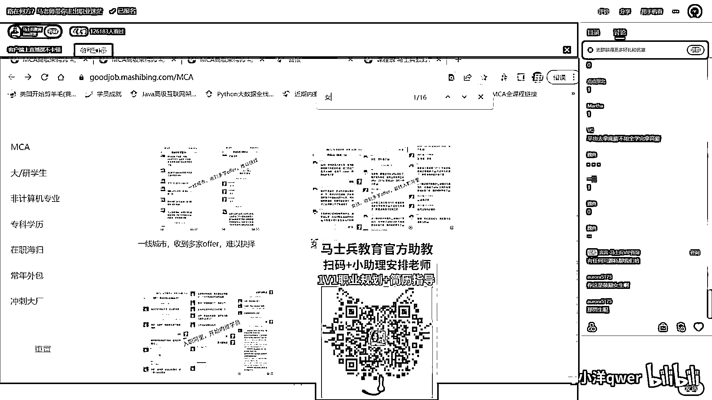
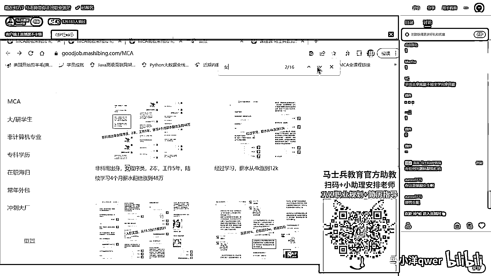
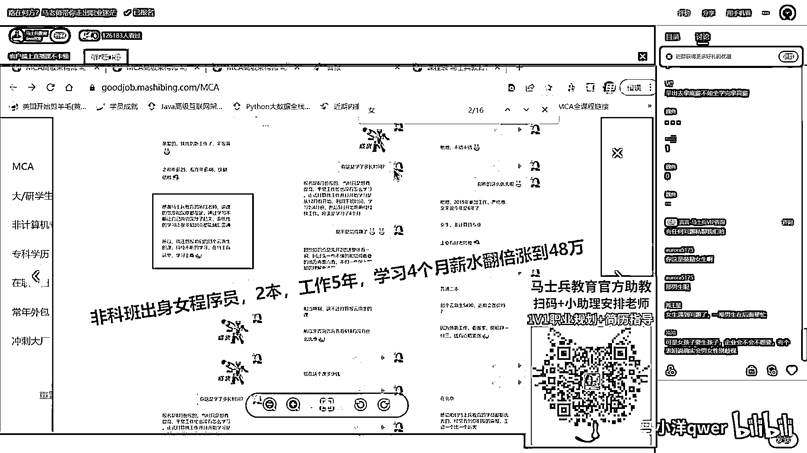
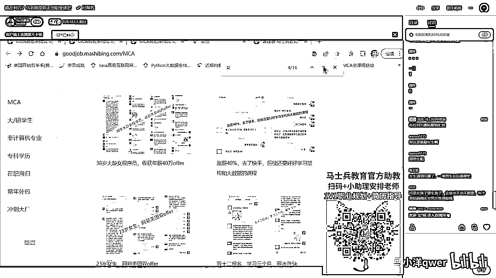
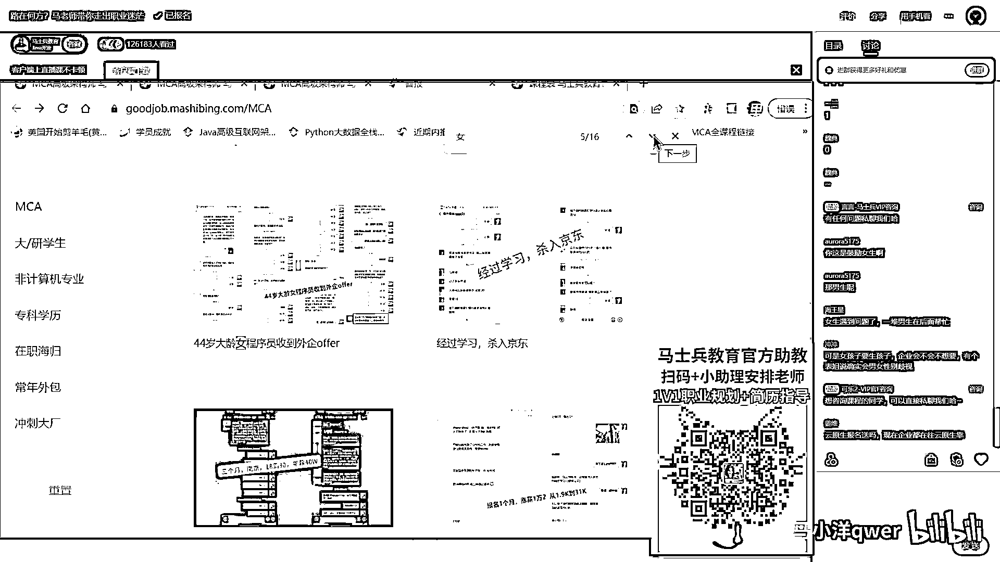
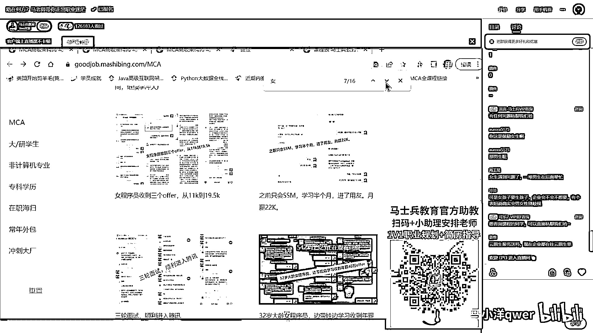
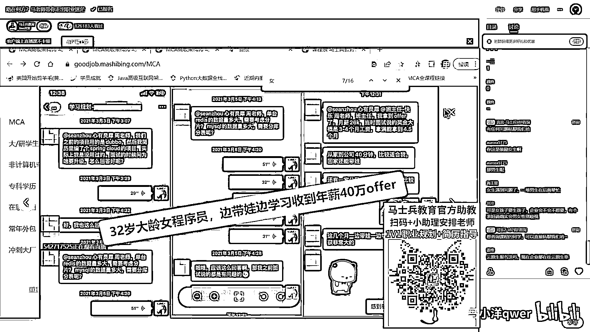
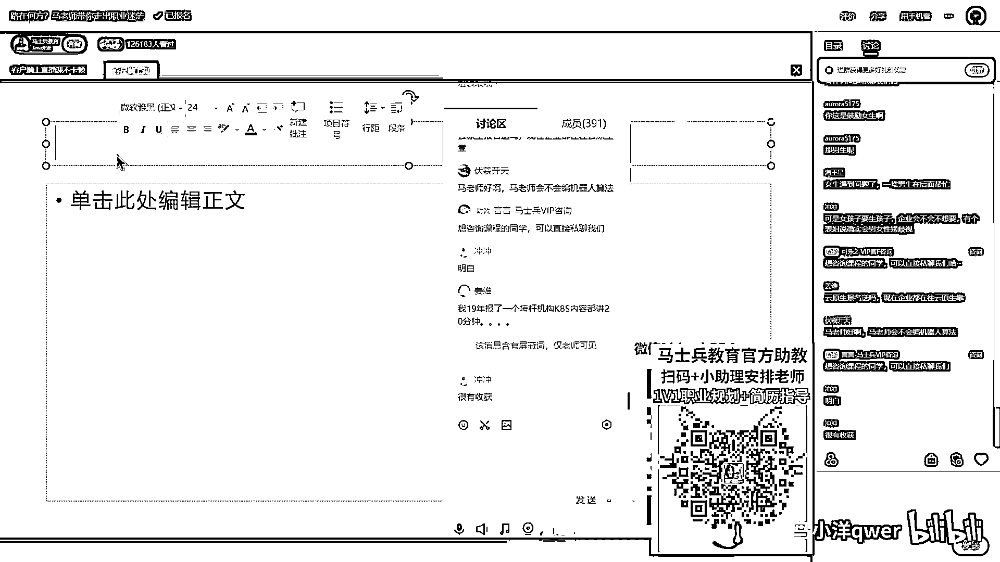

# 程序员秋招 顶级避坑指南！-马士兵 - P10：女生在IT行业的选择与发展 - 马小洋qwer - BV1Uz4y1x7hC

谈到女生我给大家女生还有，还有在听课的女生吗，有的话老师扣个1有吗，观众女同学我给大家几个建议，首先第一点要敢于争取，这是很重要很重要一点，这个非常非常重要，我说女生的脸皮特别薄。

很多有机会的时候他不敢去争取，这种的我们遇见太多了，就是好多女生，她遇见一个机会我要做领导的机会，做教务师的机会，或者带人的机会，很多女生不敢去争取的你知道吗，其实女生一争取好多就真的没男生什么事了。

在一个项目组里面，这个项目组长往往就是个男生，女生很少他也不敢去争取，好多女生的想法是，我一定要有百分之百的把握，我才去要不然多丢人啊，其实完全错了，一个机会好多男生是百分之五六十的把握有。

他就敢去争敢去拼，我希望你们也就要具备这方面的精神，只要你拼，这个机会就有可能是你的，你连是都不是，这个机会就肯定百分之一万不是你的，很朴素的道理，一定要去干这件事，第二件事呢，不要温水煮青蛙。

不要温水煮青蛙，咱们女同学呢，就是不思进取，烫评温水煮青蛙靠别人等等，这些都不行，其他的其实跟男生就没有什么太大区别了，看几个女同学的案例，看几个女同学的案例，大家可能就知道老师说的什么意思了。

大家可能就知道老师说的什么意思了。

我们说女同学的机会并不比男生少，你一定要知道这一点，好多甚至，女同学的就业的可能性，要比男同学要容易得多，要比男同学要容易得多，他那个，有一些项目组，女生很少，他就愿意去专门招收一些女生。

而且有些工作女生做起来反而比男生要更加的细致，而且有些工作女生做起来反而比男生要更加的细致，到位一些，你像还有很多带队伍的，我知道有好几个女生带队伍的，我知道有好几个女生带队伍的，你知道吧，就是女生。

一直也待得很好，所以不要把自己的性别在职场里头刻画的太过于分辨性太高，所以不要把自己的性别在职场里头刻画的太过于分辨性太高，所以不要把自己的性别在职场里头刻画的太过于分辨性太高。

这个是入职阿里的一位女同学，这个是入职阿里的一位女同学，然后非课班出身的。

工作了五年，四个月的学习，薪水涨到了48万，二班的学生，二班的学生，这是，这是，他自己的一个，他自己的一个说辞，感谢咱们老师，后面还要报咱们原生的课等等。

原来年纪25岁。

现在年纪48，就是你学就一定会有长进，就是你学就一定会有长进，这是38岁的那个女生，我已经讲过了，后来通过一段时间的学习之后，拿了一个40万，挺好啊感谢了我们好长时间，这是23岁的女生。

网易和美团的实习生进去的。

网易和美团的实习生进去的，这是44岁的那位大连的女成员，就是她原来选择躺平，后来被裁，才选择来提升。

然后才提升起来，实际上完全没有这个必要，你应该早点去提升就行了提升自己。

这个也是印象非常非常深刻，32岁的她原来是在带娃，她每天的学习你知道到什么程度，只能娃睡着了之后，再学学到后半夜，然后她出来之后拿了年薪40万。

怎么说呢。

怎么说呢，就是你不要不思进去，就是你不要不思进去，也不要认为自己比男生差，也不要认为自己比男生差，要好好的去争取做领导的机会，去争取更大责任的机会，把脸皮看得在，把脸皮看得在，没那么重要一点。

我不知道大家了不了解腾讯，很多很多的领导岗都是女生，我们公司也有好多领导岗，领导是女生，能力并不比男生差，能力并不比男生差，其他的也就没有什么特殊的了，语言生报名送吗，不送，但是我们课程架构师里面的。

讲语言生的课已经足够你架构师的准备了，我们语言生啊，我们语言生的课呢，是给原来做语言生运维的人准备的，你能听懂吗，你做开发的听我们架构里面的语言生课，已经足够了，你没有必要去把所有的设置搞清楚。

你没有必要去把所有的设置搞清楚，你又不是运维的人，你又不是运维的人，你又不是运维的人，女孩子不要生孩子，女孩子不要生孩子，企业会不会不想要，男女会有性别歧视，企业会不会有性别歧视，我说难听一点的。

现在就是一个男权社会，全球都是，那你在已经继承事实的情况下，就不要考虑说，就不要考虑说，我怎么去改变整个社会这件事，而要去考虑怎么去适应它，能听懂吧，能听懂吧，能听懂吧，马老师会不会，马老师会不会。

机器人算法，AIOT去了解一下，AI结合IOT，AI结合IOT，现场的，找他们小姐去了解就行了，至于其他方面，至于其他方面，你将来愿意的话，考虑产品，走产品方向其实也可以，愿意愿意。

但是我建议其实也没必要转行，对女生来说，在她变成了一个性别之后，她的发展跟其他人没什么区别，她的发展跟其他人没什么区别，我认识好几个女生，这个薪资还很高的呢，这个薪资还很高的呢，最后一个问题是。

最后一个问题是，跳槽转行这块。

跳槽转行这块。