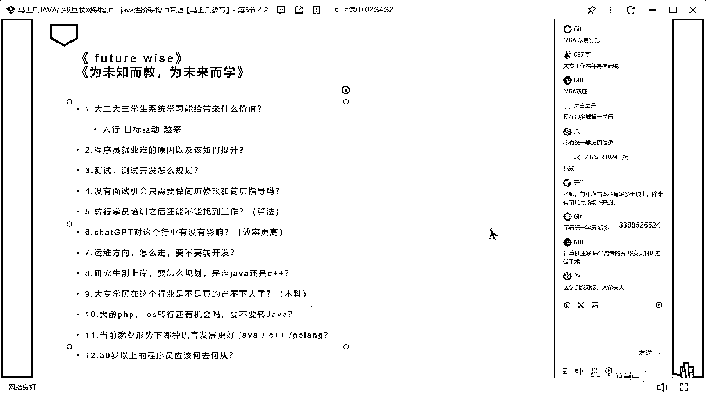

# 程序员秋招 顶级避坑指南！-马士兵 - P14：大专学历在这个行业是不是真的走不下去了？ - 马小洋qwer - BV1Uz4y1x7hC

第九個問題，第九個問題，大專學歷的這個行業是不是真的走不下去了，我覺得這個純屬是扯淡，但是我真心建議大家呢，所有大專學歷的同學，一定要考慮哪一個本科，就是這個本科不管你是買來的，混來的。

還是說你那個網教的，還是說什麼，各個渠道的，隨便你什麼樣的渠道，正規也好不正規也好，民辦的等等，我希望你們一定要拿一個本科，從所有的學歷的目前的情形來講，你看今年北京的這個畢業。

研究生就已經超過本科生了，也就意味著說今年我們，拿研究生學歷找工作的人，就已經超過了本科生找工作的人，這個學歷呢會變得越來越不值錢，就是高端學歷的，會慢慢的變得越來越不值錢，有些博士生去找工作的時候。

甚至找的都是那些，比較低端的工作，OK，當你面臨著博士研究生，都越來越多的時候，你的這個大專學歷的競爭力，到底有多強，大哥你自己想過沒有，所以考慮去拿一個本科，當你的簡歷上寫的是本科。

哪怕它比較差的本科的時候，別人能夠接受的程度，也比你一個專科生要高得多，一百個人能夠接受你的，你寫專科二十個，你哪怕寫了個本科，不是很好的，好了可能就是變成四十個，明白我說的意思吧，OK。

就是你的選擇面會寬很多，如果你有這個時間經歷，經濟實力也允許，我希望你在三十多歲的時候，三十二三歲三十五六，三十四五歲這個時間，考慮去讀一個MBA，MBA理解吧，就是結合管理了。

它會打開你整個職業生涯的空間，最起碼能打開你整個的眼界，是沒有問題的，學歷這件事，總之高的就一定比低的好，但是也談不上說大專學歷，在這個行業走不下去這件事，我剛才給大家念的幾個，大專的應屆生。

在我們的訓練之下，都能達到年薪二十萬左右，就應屆生，所以談不上說走不下去這件事，好吧，但是長遠發展你要拿一個更好的東西去，沈秉之說現在很多看第一學歷，這事是對的，這個沒辦法，這就是現狀，你改變不了。

有很多不看的，我希望大家考慮事情的時候，所有的咱們人類的考慮事情，往往都是犯賤式的，同學們犯賤，為什麼不看學歷很少，大哥你最好是去了解了解，不看第一學歷的，至少佔到百分之六十以上。

至少佔到百分之六十以上，至少佔到百分之六十以上，至少佔到百分之六十以上，至少佔到百分之六十以上，至少佔到百分之六十以上，當然你的學歷如果比較好的情況下，當然你的學歷如果比較好的情況下。

其實你可能感受不到而已，其實你可能感受不到而已，其實不看第一學歷的，大概至少佔到百分之六十以上，以前這個數字會百分之八十，以前這個數字會百分之八十，當然這件事還是那句話，你改變不了這件事了。

你就別去憂慮它，就一百個小姐姐，大概呢，人就是比較犯賤，人就是比較犯賤，前面我舉一百個，前面有六個人，六個小姐姐，這六個小姐姐呢你進去之後呢，有四個小姐姐呢對你來說，就正常的去看你去了解你。

甚至去拋個媚眼，甚至去拋個媚眼，挺喜歡你，但是就有那麼倆，特別對你態度特別不好，所有的人基本上印象最深的就是這倆，所有的人基本上印象最深的就是這倆，然後回來之後跟別人講的時候，好多小姐姐都不鳥我。

好多小姐姐都不鳥我，注意他用的是好多，但實際上是好多小姐姐都鳥他，但實際上是好多小姐姐都鳥他，但他印象最深的是這些，面試十次，只要有兩次，因為學歷的問題被拒掉之後，他就會認為，這個，大多數的。

對於我的學歷問題有意見，但是本身來說，這件事你還改變不了，對於改變不了的事情我教了大家了，怎麼辦，改變你能改變的部分就行了。

人家就是不鳥你。

你也就別鳥他就行了。