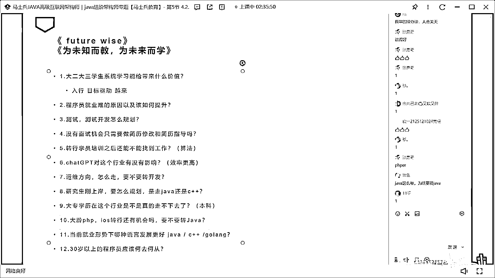
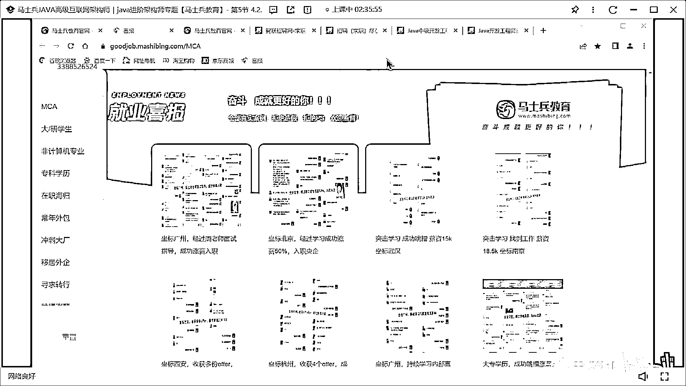
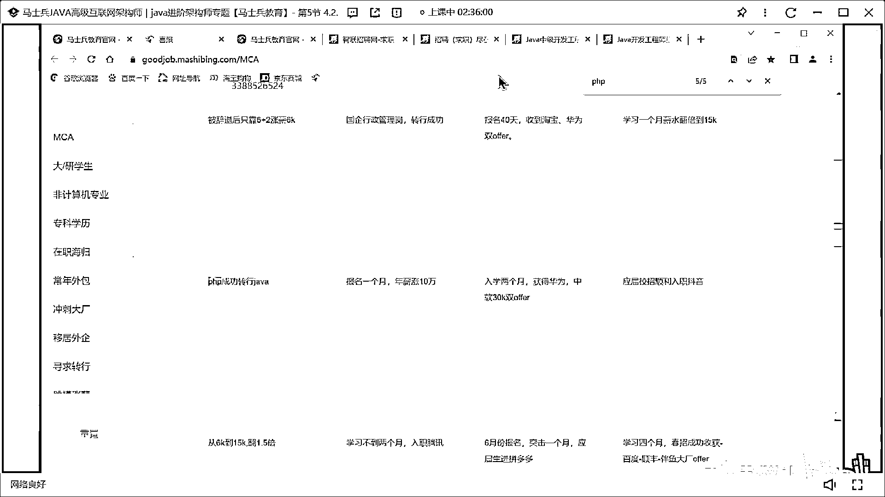
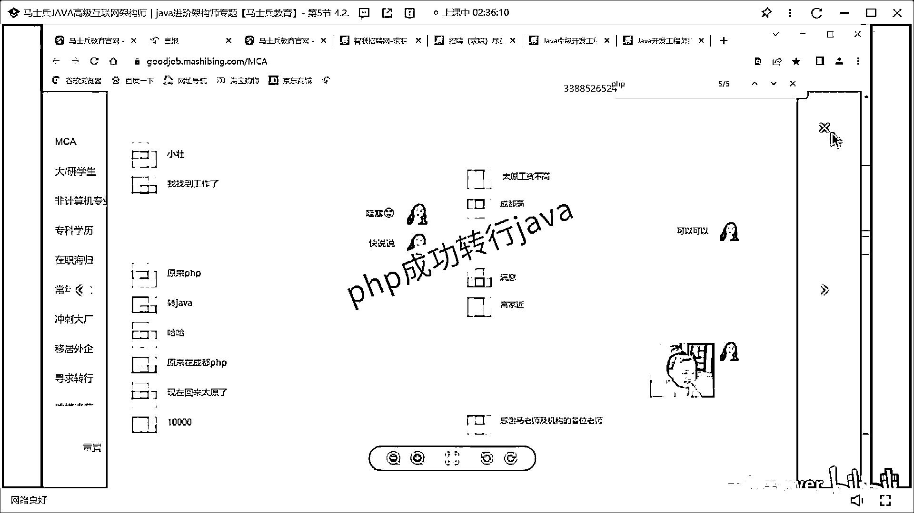
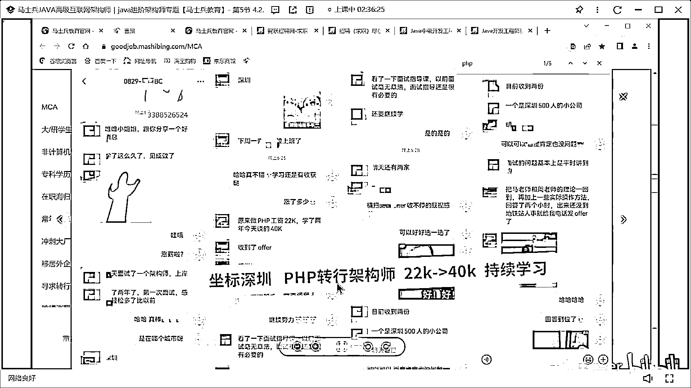
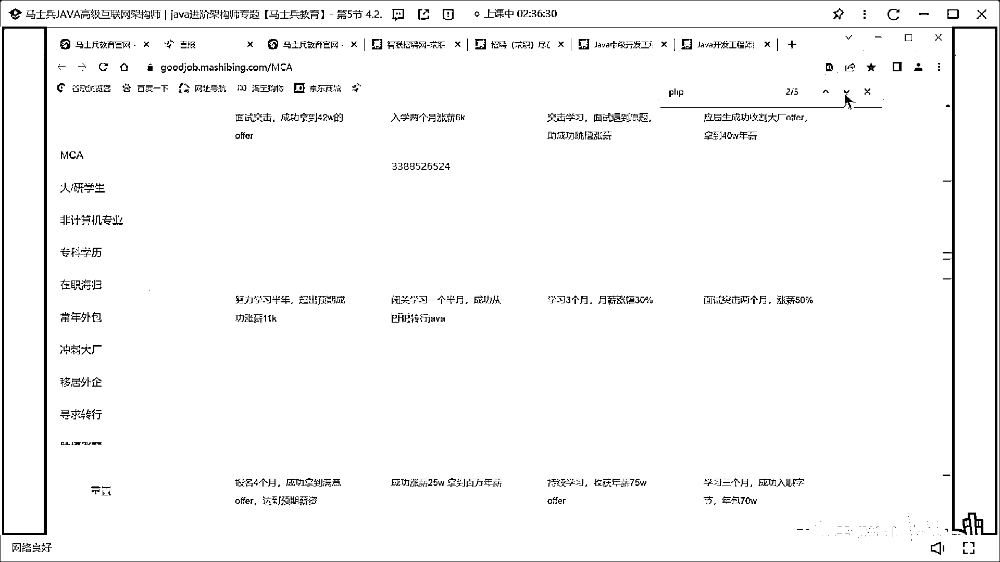
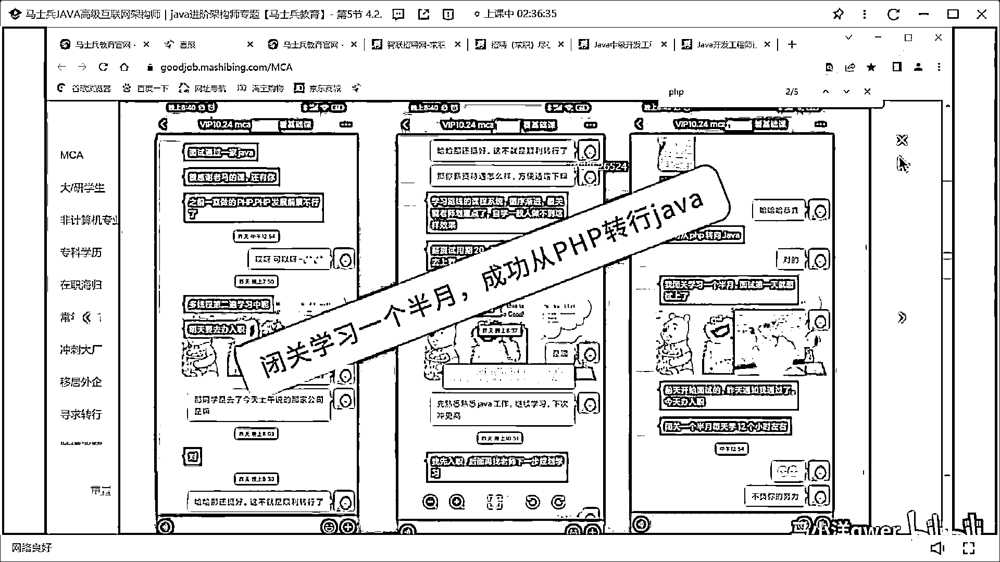
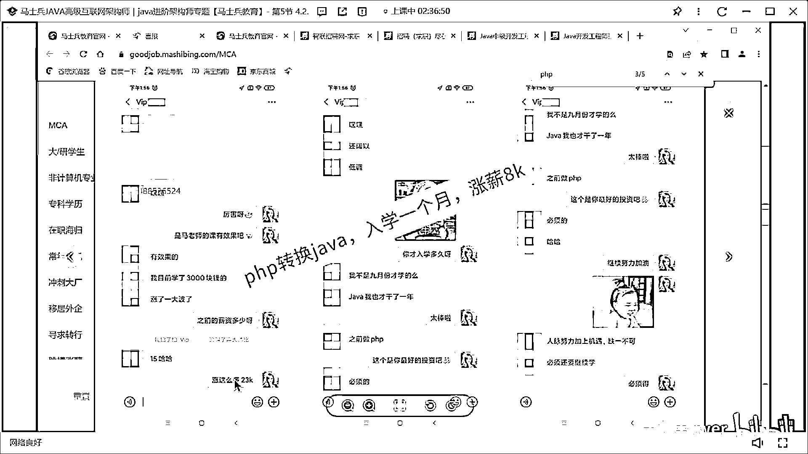
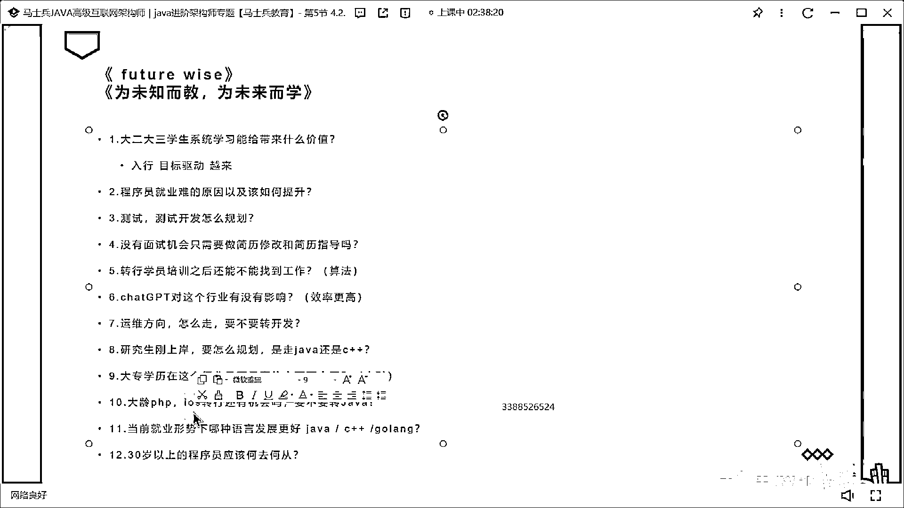

# 程序员秋招 顶级避坑指南！-马士兵 - P15：大龄PHP，IOS转行还有机会吗，要不要转Java？ - 马小洋qwer - BV1Uz4y1x7hC

大量PHP、Linux转上还有没有机会要不要转Java，有这个问题的同学给老师扣个1，我看有多少个PHP的、Linux的、C#的、Android的都算，同学们这里面是两个问题其实。

你要理解PHP和Linux完全是两个不同的内容和方向，PHP转Java easy，为什么easy，因为它们两个的相似度大概达到70%，你要转的转过来之后只需要搞定那30%就可以了。

甚至它们两个过去的所有的经历都可以共享，你要拿PHP做项目，你说我过去拿Java写的，其实要别人问你的时候你只要能看得住的话别人是感受不到的，这个是很简单的而且转起来也比较方便，速度也比较快。

薪水拿得也比较高，我们这方面的学员比比皆是。

给你搜几个你就知道了。

你看他们的案例就知道了。

这是PHP转成功了是吧，原来PHP转Java，现在回太原1万，还行吧只能说。

这是PHP直接转了架构式叫大龄的嘛，大龄我就刚才讲过你直接转架构式，你要略过那些个初级的构，直接给我转过来。

方向路线都有都有。

而且直接转了之后还直接比原来薪水还高。

这是闭关一个月PHP转Java。

就是它的成功它的相似度是很高很高的啊，这是PHP转Java就一个月时间涨了8000，直接做PHPOK，我们小姐姐问的这个是不是你最好的投资。

那必须的原来拿15现在拿23。

请大家记住啊就是这个转起来最简单的，但是iOS不容易，iOS不容易iOS本质是前端兄弟们，你能理解吗，就是iOS的本质是前端，PHP本质是后端，那转Java很很容易了，iOS本质是前端。

那是大换行大换血，这个是不容易的，尤其是在你大龄之后，你年轻的时候转过来没关系从那学就可以，你大龄之后转过来，我一般都不建议转，并不是说我交Java或者怎么样，我就建议大家都去搞Java不是，能理解吗。

这个时候那么iOS的我该怎么办呢，办法是去做大前端，去拓展你前端方向的内容，不是说只攻在iOS上，大前端内容也很多，进大厂的机会也很多，如果你血力够的话明白吗，好的机会也很多。

但是你非要跟后端天花板比那没办法，那你确实比不过，那没办法，因为你原来选行业就选错了，OK，我们前端的课程你好好仔细从头到尾阅读一遍，你会发现它的本质还是在架构和源码上。

你就有进大厂的机会升值。

