# 程序员秋招 顶级避坑指南！-马士兵 - P1：面临秋招，如何在短时间内快速入行？ - 马小洋qwer - BV1Uz4y1x7hC

首先我们说短时间快速入行，这其实是个伪命题，我跟你这么讲，作为一个企业，招聘的需求每年都有，今年会少，但是它会不会没有，不是的，大厂一边裁一边招，好多新成立的企业，咱们国家下半年刺激经济以来。

也正在玩命招聘，一边是大学生找不着工作，一边是好多企业找不着合适的人，原因是什么，技能不匹配，所以其实短时间快速入行，最简单的办法就是，你能够匹配得上企业的需求，可是你们是这样的吗，显然不是。

大多数人在大学里头，要么打了四年游戏，打了三年游戏，要么就是学了一些纸上谈兵的，但是从来没有没有过实战，然后企业很多人想要的是，上来就上手就能做的，所以你完成不了，这时候怎么办，你的差距跟企业之间。

需求之间是有差距的，你的最快的办法是找到这个差距，然后快速把它补上，这是一个最朴素的道理，话糙理不糙，我希望大家伙能够理解，补的方式有很多，自学、培训都可以，我再说一遍，这是企业要求的高度。

这是你所掌握的内容，有的人掌握到这儿了，有的人掌握到这儿了，有的人可能掌握到这里，这里面的差距一大堆，就是我们要找到这些差距具体是什么，然后快速的补上，这样就能快速入行，最简单最朴素的道理。

所以我先教大家，我们就程序而来讲，你到企业最快速的，最简单的一个最小值，最小集合是什么，以JAVA后端举例子，其他的方向上，其实老师也知道，但我跟你敲敲不完，我给你举一个最小集合的例子，JAVA入门。

MySQL，JDBC，前端入门，注意我这里说的都是入门，SSM，这是以前，到这儿基本上就能搞定一份，入行级的工作了，但是现在不行，Scloud，顺便一下，好写完了，听我说这就是最简单的最小集合。

就算是你是零基础，只要掌握到这个程度，基本上就可以搞定一份最初级的工作了，讲到这里，那个有同学说了，说老师我要是零基础，学这个我可能得学N长时间，确实是这样，但是也有其他的办法，能让你短时间内搞定。

下面我给大家分析，就找工作这件事情的本质是什么，本质很简单，你只要两步就能搞定一份工作，投简历，面试通过，非常简单，你只要投简历出去，然后面试通过，好了工作就能搞定，好问大家一句，有多少人是投简历出去。

没人理你的，这是你要解决的第一个问题，大家伙找不到工作，要么卡在第一步，要么卡在第二步，投简历出去没人理的，给老师扣个一，有没有，投了400封简历，一两个人理我，我跟大家说，很多应届生都是这个问题。

投简历出去没人理你，原因是什么，你的简历不值钱，本质就是简历不值钱，假如你简历写四个项目，写很多关于京通的相关的基础的内容，京通Spring Cloud，有四个分布式的项目，再加上京通一些中间界。

什么Redis，NGX，然后卡夫卡，Rocket等等，我不相信你的简历没人理，最差最差也会有外包找你，你信不信，不信你可以去试试，当然有的同学的第一步就是，他的问题就是这样的，他说老师你说这些我不敢写。

因为我不会，不会导致不敢，所以没人理，所以就导致简历差，所以就导致没人理，好我希望大家会把这个不会，把这个理由从你脑袋里给我去掉，不会也可以写，我再强调一遍，不会也可以写，因为简历的目的很简单。

我就是要找到一份面试的机会，我跟大家讲一个最粗浅的道理，比如说你我现在只学到了SSM，我什么Spring Cloud都不会，但是呢我能写了一份简历，我把Spring Cloud写上去。

把分布的项目写上去，当然还有一种比较好的方式，是由比方说咱们马士宾教育的机构的老师，来帮你润色好这份简历，帮你写好这份简历，这个是我们的服务之一，写好这份简历之后你投出去。

你可能就会发现有大量的机会来找你了，大量的面试机会就来了，当然你的下一个想法一定会是，担心面不过，这是你很正常的一个想法好吧，那么我假设你Spring Cloud不会，分布项目不会。

那么如果这个时候你今天写完了，人家要求你明天就去面试，我给你讲一个最极端的情况，你今天找咱们老师改完简历，今天晚上投出去，然后人家要求你明天上午9点过来面试，再说一遍，脑子里你闭上眼睛想一下这个情况。

你今天写了一份简历，简历里有很多你不会的东西，但是你把它写上去了，因为你要的是拿到一个面试机会，然后人家要求你明天9点就去面试，你这个时候会不会担心面不过，是个人都会担心面不过，但是你今天晚上干什么呢。

今天晚上做突击，突击也是我们非常优质的课程之一，今天晚上做突击，你就记住了，哪怕你今天晚上背一个问题，比如说Spring Cloud常见的一些组件的名字，八个组件，你给它背下来，背什么呢。

你就知道这些组件每一个都在干什么，就行了，用两个小时快速过一遍，我们关于Spring Cloud突击的东西，背过，听懂了吗，好你明天有没有一种概率，虽然这个概率很低，有没有一种比如说5%的概率。

也就是类似于这种面20+，才能成1+的这种概率，能够面得上，你放心，各种各样的问题，都在老师们的总结之中，有没有一种可能性，他问的问题就正好你昨天背过了，能听懂吗，兄弟们，有没有你今天背过的。

就是背了一道题，有没有一种可能性，他明天问的就是这道题，他是有的各位同学，那么我就想问你，你是不是说我不敢写的，我敢写了，然后你简历差了变成简历好了，然后别人你做了个突击。

是不是就有那么1/20的可能性，你就拿了一份工作了，你觉得拿一份工作真的很难吗，是不是很容易，当然我说的容易，也许你明天是过不了的，但是没有关系，后天又有人找你，你明天又补了一天。

这个概率是不是往上升一点，升到5。1%了，5。2%了，6%了，7%，10%了，那么你面20+，是不是就有一家能面上了，这里面最差最差的想法是，因为我不会，所以我今天晚上也不背，反正我也过不了。

我今天晚上打一晚上游戏，我明天就不去了，这是大多数人常见的想法，但是这种想法就注定了，你百分之一万搞不定工作，我教你的是短时间快速，如果你有时间，我当然建议你进行系统化的补充，比方说你今年大三。

你为什么不进行一个系统化的学习，避免在大四的时候用这种，歪门邪道，好，我再给你梳理一遍，各位同学，如果你是投简历没人理兄弟们，他一定是你的简历不值钱，因为作为用人单位，他没见过你，你简历写什么样。

对他来说就是他的第一印象，所以我要求你，你写出来的简历，不要想自己会什么，而要想企业要什么，比如说还有一些进阶的人，讲我的，我想拿一个三万的工作，好了很简单，你要写一份三万的简历。

至于说这三万的简历里面有多少是你不会的，这个不重要，因为你写出来这份简历，好好想一下，当你把这份简历写出来的那一刻，你就知道了自己跟那三万，或者自己跟企业的要求的入门之间的差距。

注意这个差距很精确知道吗，因为你写上了，你就这么想，别人要求的是一个三万的工作，然后人家说了，说我给这个工作约薪三万，然后人家要求12345给你列好了，你把这些列好的写上去，人家就给你面试机会了。

那么你告诉我，你的差距是不是非常精确的，你就知道了你差在哪些个技术点上，各位同学们能听懂吗，来这块能听明白的老是抠音，我其实，其实这个很简单道理，但是有的同学呢，他这个思维啊，他总是转不过。

纳不过这个弯了，他总是陷在自己的一个主观想，主观臆想里面，就是说我会什么，他老想这件事，其实你会什么是一个动态的东西，你今天会你今天不会的东西，听过一天的学习，也许你就入门了，快速入门的方式啊。

其实很多很多的，各位能听懂吗，我的记录十天什么都不会的同学，让他们入职后端，就这十天，现在面试的标配Spring Cloud，可以这么说是的，听我说，这是你的第一步，我再说一遍。

你的第一步可以考虑先写简历，写一份好的简历，我的目标是三万就写一份三万的简历，我的目标是年薪一百万，我就要写一份年薪一百万的简历出来写，当然我会知道，我目前跟年薪一百万或者三万，或者刚入行的简历。

我还差距还有很多，因为我写上去，别人给了我面试机会，说明我只要照着这份简历学下来，我的面试机会就会有，这是最简单最粗浅的逻辑，各位应该能听得懂，那么你的精确的差距其实也就出来了，剩下的呢。

就是要补这个差距，好这个差距的补法呢，有两种，注意我们现在找到了差距，补差距的补法有两种，最推荐的当然是按部就班系统化补充，这是第一种，当然它的劣势就是时间长，需要消耗的时间比较长，各位如果是，现在呢。

还不太着急找工作的，我推荐大家永远推荐大家是这种，听明白了吧，如果说我就想两周之内特别着急，我再不找不着工作，我没得吃了，这时候还有第二种，第二种就是，用突击拼概率，好什么叫用突击拼概率呢。

就像我刚才讲过的，我知道我的差距是Spring Cloud，是分布项目，那我就这两周时间啊，我就玩命突击，注意我的突击，这时候的突击的目标是什么，目标是通过面试，注意你的目标是通过面试。

有很多时候有的人的突击效率就不高，原因是什么，因为他搞不清楚突击的目标到底是什么，突击的目标如果是为了你能掌握，事无巨细的掌握开发细节，如果你突击的目标是这个，如果你突击的目标是这个，各位兄弟们。

你别说两周，你两个月都不够，但是如果你的目标就是为了通过面试，而且拼一定的概率，我拼的概率可能是10%，5%，我并不是说我面试，我要乘9+那种概率，那我告诉你，一两周的时间，其实就有这种可能性。

来这块能听明白的也老是扣1，对，OK，好，当你听明白这件事之后，其实，你大概就理解这个突击应该干什么了。

突击呢。

就类似于我们为大家准备好的，简单抽烟。

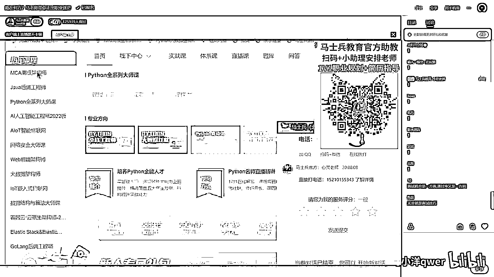

好。

先把小姐姐拖出去，我得登录一下。

我输一下我的手机。

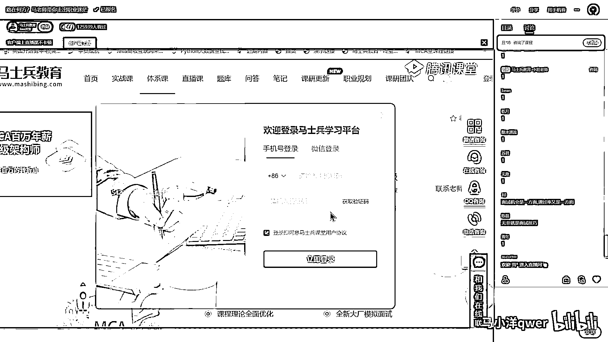

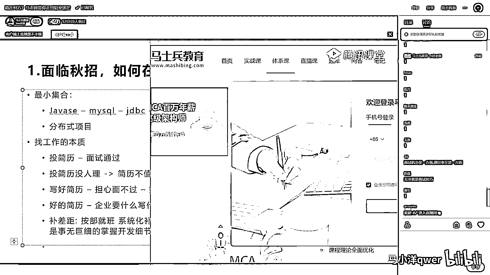

好，咱们的教学平台呢，最近用户啊，涨的也蛮多的，大家可以注册一下呢，要一些免费的课程听一听，我们虽然是一个教育机构。

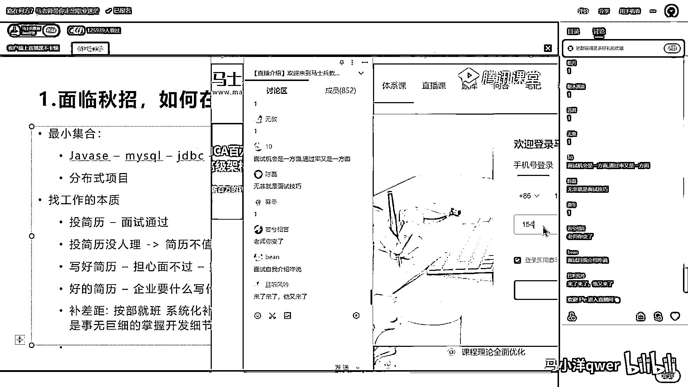

但是我可以负责任的跟你讲，我们是一个比较靠谱的教育机构，也不会呢，坑大家蒙大家，都是一些非常有用的知识，欢迎大家伙呢，你过来好好养毛，听听看，我们面试突击课，已经讲了好几期了。

目前正在进行的是今年金九银十的面试突击，像去年，这是去年金三银四的面试突击，我们的突击呢，是从HR的软技能开始，因为你面试的时候，非常有可能遇到各种各样的软问题，什么叫软问题呢，就类似于像这种的。

朋友对你评论还是什么问题要问嘛，问完了之后，谈谈你对跳槽有什么看法，你跟上司怎么相处，对我们公司了解多少，你的动机是什么，业余爱好什么，然后为什么要离职，类似于这样的问题，还有呢，当然就是这是软技能。

这是面试的指导，这是项目的指导，就是你到底该写什么样的项目，没项目经验的怎么写，转行的怎么写，被调的怎么办，没有高并发的怎么办，中间间的使用怎么办等等，还有呢，就是看你基础在什么水平上的。

不同的系列的面试题的这些东西，这是我们的第一期，就大概类似于长这样，突击呢，注意是拼概率，都是刚好对是拼概率啊，你一定要理解这件事就行，那么这个概率呢，当你的面试机会足够多。

你一定能够找到一个机会能进得去，说句俗点的话，就是你长得再丑，够不住对方眼瞎，也没准就能进得去，他就看上你了，来这块大概能听明白的老实扣音，所以再说一遍，你呢，好好润色一份投出去。

有人反馈的简历是你的第一步，当你有人去找你的时候，你知道了差距之后恶补是第二步，通过一定的概率，大家一定要心理素质要过关，然后我面不过的话就当练习了，采用这样的心态多去面的时候。

你一定会有一个机会蒙进去，你虽然很丑，对方是个盲人，你也就进去了，这个时候是第三步，当然我到了这一步呢，一定会有同学就继续会担心，我使用期过不了怎么办，如果前面还有问题的，你给老师扣一，如果不用扣一了。

你直接敲啊，如果前半点讲的你觉得还没听懂，你呢给老师呢，你就把这个问题敲出来好不好，然后呢，如果说没有问题的，如果说你这个试用期过不了这件事怎么办，你担心的你给老师扣个一就行好吧，抱着教授的心态去。

他知道我知道我长得丑，对你知道你长得丑呢，其实关系不大，就是有的人会跟你看对眼的，你长得再丑，有的人他会跟你看对眼的，能听懂吗，三轮面试都眼神不好吗，你其实就是有好多的面试呢。

就是中小企业的面试我讲的是，有的时候就是一轮，如果你遇上三轮，说明人家比较重视，你使劲努力就完了，只能是这样，我跟你讲你靠这种的，你想出进大厂的概率是极低的，你要搞清楚这一点。

因为我首先解决的是快速这件事，我们讲这个方法呢，它的核心在于快速，如果你要讲说我能够通过三轮五轮七轮面试的那种，我希望你能够系统化的补充好吧，所以这是两个问题，摄影机扛不住怎么办，首先你要理解这一点。

一般的摄影机啊，过不了的时候，你自己的心理素质要过关，过不了的时候呢，扛到背开，大家一定要记住这四个字啊，叫扛到背开，你不要那种，搞那种特别敏感的自尊心，别人给你个眼神扛不住了，算了直接离职。

那你就傻帽了，年轻人最不值钱的东西是什么东西啊，自己看特别重，但其实上非常不值钱，今天听课的也应该有一些年龄比较大的，过来人你们说一说，就是你们年轻的时候，自己看的脸皮特别重。

但实际上你的脸皮是最不值钱的，能不能听懂，所以呢，你的自尊心啊，其实这个时候是最不值钱的东西，不要把它看太重，如果你这点能想开的话，你给我扛到背开就可以了，我跟你讲啊，正常的企业你进去之后。

他不会让你第一天上来二话不说开始敲代码，不会这样干的，所以呢，一般来讲，他会要求你去熟悉他们的环境，有好的公司呢，还会对你进行入行入职的培训，还有一些呢，会告诉你我们用的是什么，环境是什么等等。

还会还有一些呢，会有一些人来带你，这时候呢，你就使劲扛，甭管你使用什么样的方式，软的硬的，然后呢，有人带你的时候，你多请人吃吃早餐喝喝奶茶，脸皮一定要厚，给我扛到背开，这个扛到背开啊，基本上两周。

应该是正常的一个时间点，同学们你们好好想想看，在你已经入职到公司，你已经看到人家公司长什么样，开发团队里有哪些，给你的职位是哪个，你不是像原来那样，说连没吃过猪肉，连猪跑都没看过了，你已经看过猪跑了。

而且最关键的是这两周，你知道你能补多少东西吗，其实你能补的东西要N多，你会熟悉了你整个的公司的环境，长什么样，同事们一般怎么相处，然后呢，入职之后一般是什么样的一个流程，最关键你这两周用来干什么，第一。

搞清楚公司用的技术，用的技术站，搞清楚业务，好，这技术站里面一定有你不会或者不熟的，因为你原来是背着通过，你是背过的，你是纸上谈兵过的，你是王宇烟，你没有实战过对不对，找老师确认恶补的技术站。

应该是什么，晚上通宵恶补，我就这么跟你说，这个时候的你，是长技术长技能长得最快的，没有之一，人的潜力就是在这种压力下给压出来的，我以前一个小姑娘，到我们项目组入职的时候，啥都不会。

一个月之内干会VC++上手，一个月就这么牛逼，就是在这种环境之下给压出来的，当然我相信呢，有的同学两周还是会被开，这个时候其实有同学，他就已经能撑过去了，因为他每天晚上都在恶补，有同学呢。

他还是撑到两周他就被开了，但是你相信我没关系，从头再来一遍，这时候你的简历还可以更丰富一些了，就因为你毕竟有了一些亲自实战的机会，再拿第二次机会，你能不能撑到一个月，最差最差，当你第三次机会的时候。

你能不能撑到三个月，在老师的陪跑之下，可以吧，有这个信心吗，你说你三家机会都已经撑到三个月了，如果还撑不下去，这就真的不是技术问题了，这一定是其他问题，好，第一个问题呢，就是给大家讲的快速的方式吧。

这种问题只适合于什么样的人，重复一遍，各位同学，这个解决方案只适合于，必须短期入行，或者说必须短期涨薪，要不涨不了薪，我就没法混了，必须短期解决方案，注意这里强调的是短期，强调的是这个好吧，短期和快速。

这个东西呢，强调的是短期快速，强调的是这个，并不是说我们要求多多系统化，系统化这件事呢，肯定是需要花时间的，好了，对先进到新手处再到萌新，没错是这样的，那个前阅说就跟打游戏通关，死好几次才通关对了。

好了，来关于第一个问题，大概听明白了，雷老师可以，当然细节还会比较多，有这种需求的去找一下咱们小姐姐，去了解一下我们的突击效果，好吧，在这呢，我也简单稍作介绍，对我们的突击效果稍作介绍，就马老师这呢。

有一个特点，就是大家需要什么，我们呢，就要做成什么样子，根据大家会的需要来做，嗯，调教关于突击的效果。

突击跳出外包的。

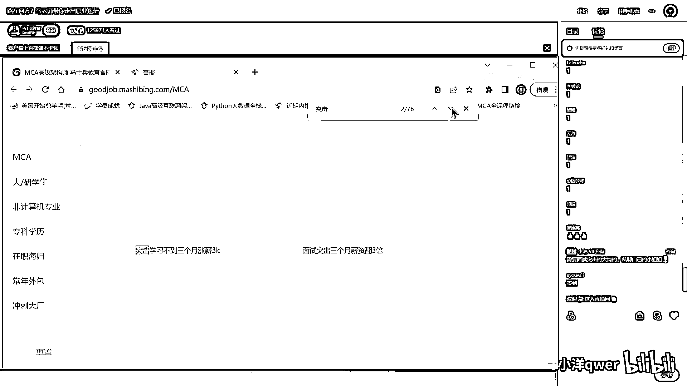

这是突击三个月涨薪涨了三千的。

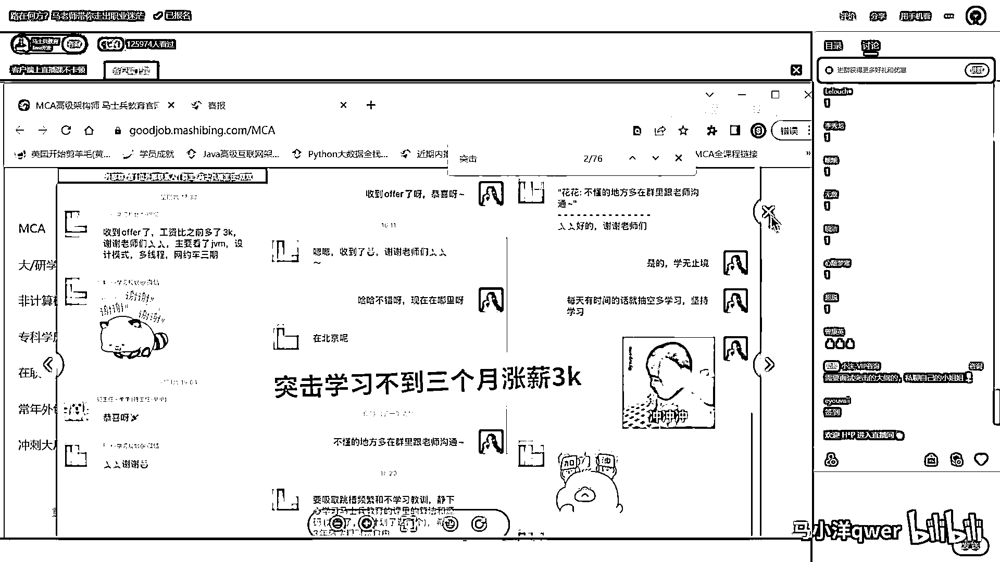

面试突击三个月薪赚了三倍的。

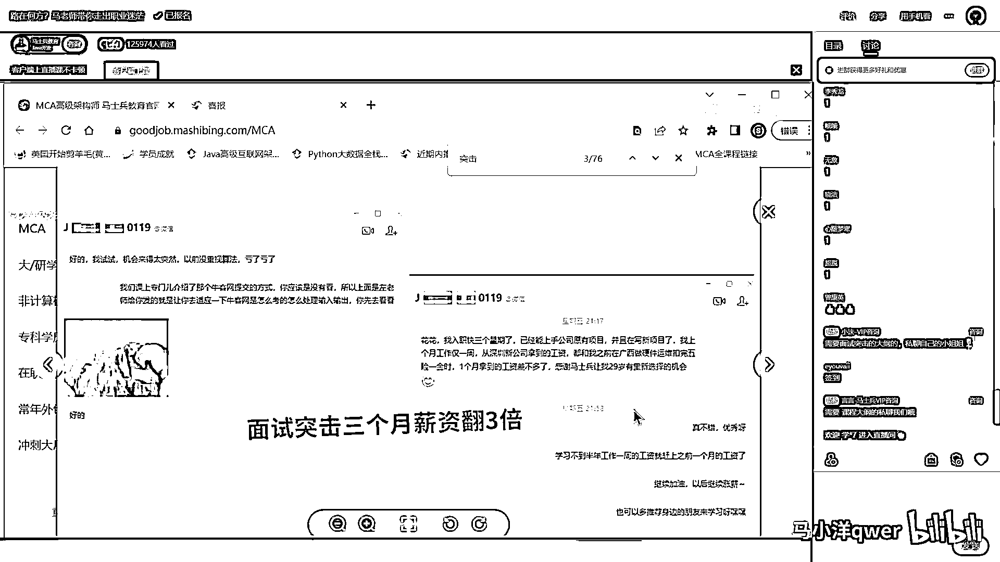

这也是相当牛逼的了，这个是大专的学历突击了半个月涨了五千。

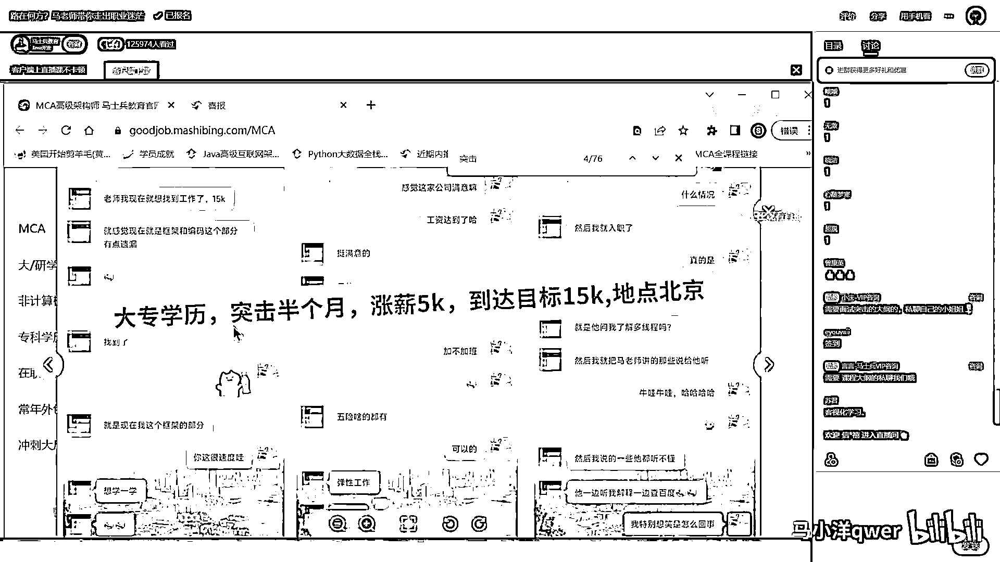

原来是一万现在是15k。

这个是裸词突击的，突击时间我忘了，13*24。

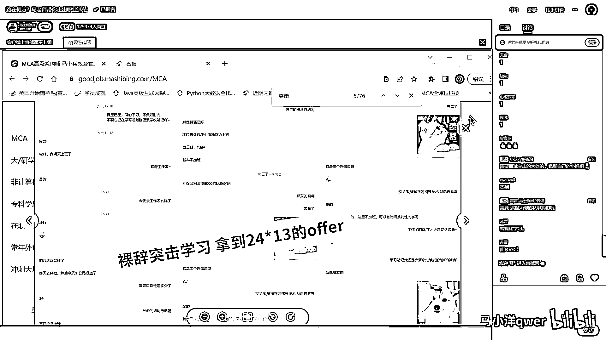

大家对于突击这件事情。

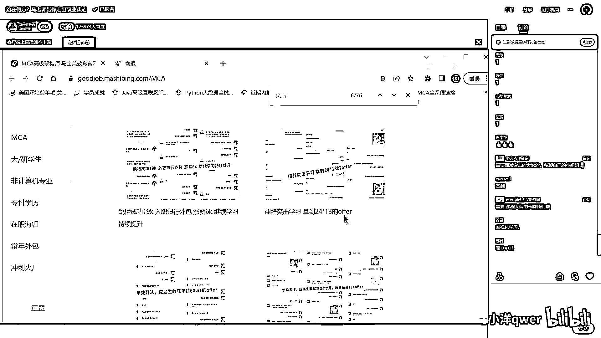

如果比较感兴趣，这是咱们那个天津的应届生突击了两个月。

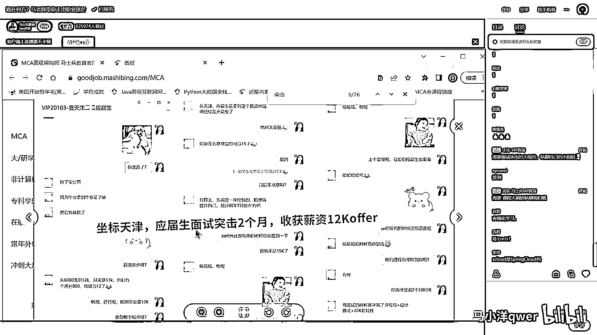

12k的offer，这么来说，如果大家对突击有兴趣，找到咱们这个网址，咱们网址对外是公开的，这里面都是咱们一千一千一千，大概是一千四五百位学员，以前的一些个经验。

这里面没有任何一个呢。

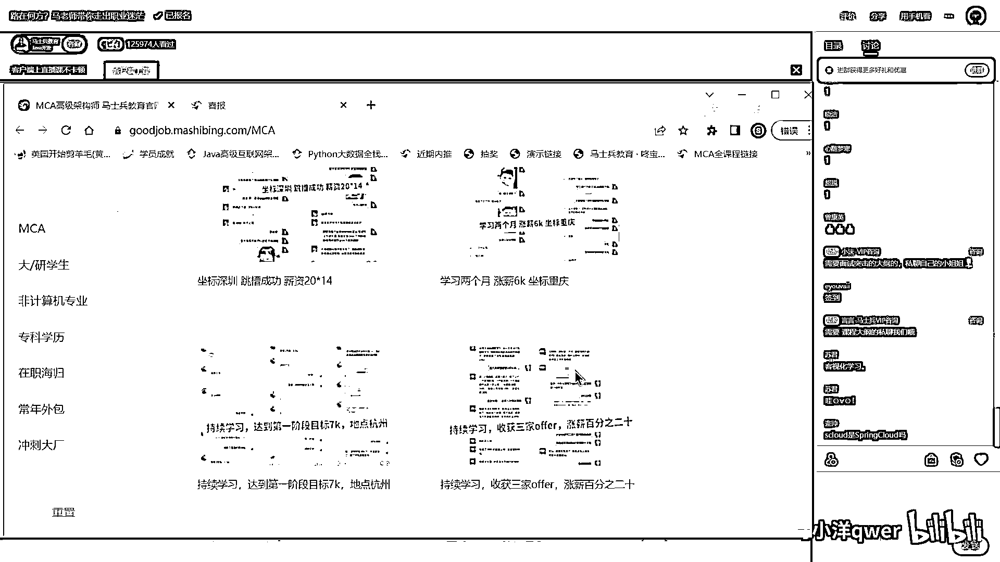

是那种虚假的信息，你打开来看看，跟你的条件的符不符合。

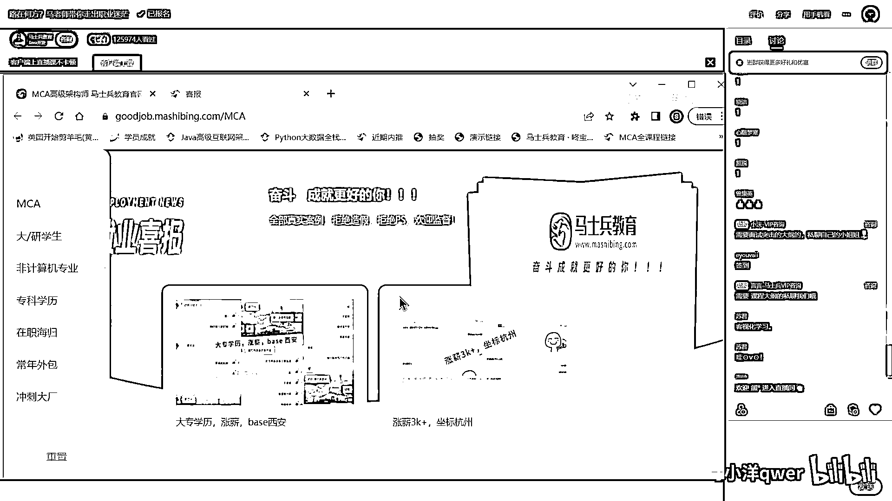

如果说还有一些其他特殊情况的，找咱们小姐姐，去了解一下突击的情况，如果还有一些特殊的需求。

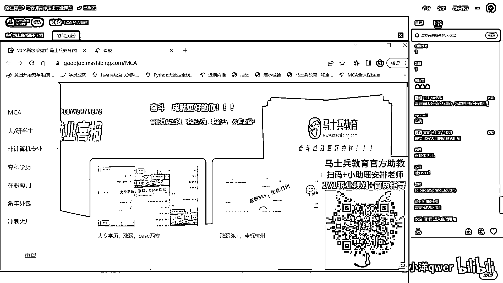

没关系，你可以把小姐姐跟你我拉一个小群，我也在群里，有什么特殊情况也可以跟老师说，也可以跟其他老师说都可以，好吧，Scloud是Spring Cloud吗，是的是的，好关于突击这件事情。

我就跟大家聊到这，再说一遍，这是短期的，我最推崇的当然是长期系统化的学习，这样的话，你肯定是成功的概率是最高的，对不对，这大家都能理解，好关于这第一个问题，看看，为啥没有Spring Boot。

想写上吧，Spring Boot只是个工具，整合SSM的工具，它的学习时间会非常的短，我跟大家这样，我问大家一个问题，你们觉得从零到入行，拿到第一份工作，像从这里开始学，一直学到分波测试项目。

我们就想用快速的方式拿到第一份工作，而不是用安不就班，一个一个呢，就是搞特别透彻的方式，然后呢，跟线下培训似的好多好几个月，你觉得这个大概需要多少个小时，各位同学，从这一直到这，大概需要多少个小时。

你就可以出去，我说的是你需要多少个小时，就可以出去面试，用5%的概率去拼工作，你觉得需要多少，小时，对，你们感觉呢，400个，6个月，好我跟大家那个，大概跟你聊一下啊，如果你只需要说用一定的概率去拼。

然后用这样的方式去找工作的话，这个绝对不超过50个小时，从这里，一直到这里，一直到这里，不超过50个小时，听懂了吗，就说这50个小时呢，你就可以达到投简历去面试了。

当然由于你投简历面试的过程是需要好多加的，所以这时候怎么办呢，其实本质上的学习，是你在投简历的过程中，也需要在不断的学，就是它是一边打仗，一边学习，一边学习一边打仗，对一个月一个月更靠谱一点吧。

纯学习啊，我说的是纯学习，我的记录呢是十天啊，我的记录是十天，纯学习的他纯学习的时间啊，其实就是纯纯纯纯看课程的时间，其实不超过50个小时，好多时候是要做一些练习，做些准备去背一些重复一些东西啊，好。

当然这个玩法最关键的呢，是心态，就是说你的心态，你的那个那个心理素质啊，务必过关，过关就搞得定，你心理素质不过关就搞不定，好，我们就一个问题讲到这儿，好吧，我们一个问题一个问题看啊，如果这个没有问题了。

我们就继续好不好，嗯，我们讲一个入行的讲一个年龄年龄大一些的。

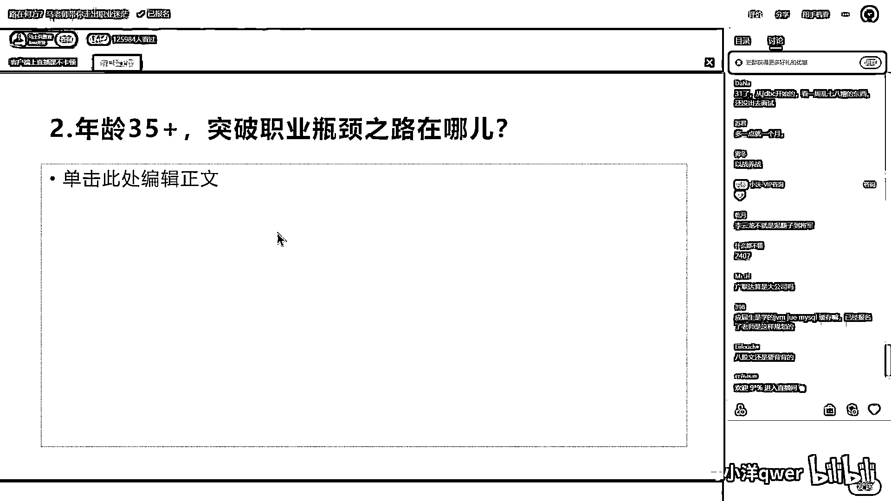

我们讲一个入行的讲一个年龄大一些的。