# 程序员秋招 顶级避坑指南！-马士兵 - P3：JAVA后端大数据Go、C、C++如何选？如何学？ - 马小洋qwer - BV1Uz4y1x7hC

我們現在講這個問題就是，Java後端大數據、勾浪、CC+，到底如何選，選哪個，這問題是一個挺大的一個問題，首先跟大家說我原來曾經講過一個課，分析各IT行業的細分行業。

就是這個大概我講了四個小時我才分析完，因為我當時分析的比較細，各位同學聽我說其實入行都行，就說你不挑，我現在根據我過去的一個情況，我現在學物聯網的，我學C、學C++可能是最快的對不對。

我轉行的我學勾浪可能是最容易，就是比較容易的，比較容易的沒那麼卷的，我在上海我華東，我學大數據可能薪水是最高的OK，我是科班出身，然後我或者說我剛轉行，有過一個培訓的經歷，我去做Java後端。

這個就業面是最寬的等等，各有各的特點，再說一遍同學們，再說一遍，就說我們不可能讓所有的人，都去選同一個方向，如果是這樣的話，就有的人他是屁股就有腦袋，比如說他就是培訓勾浪的，他就玩命學勾浪好說勾浪好。

他就是培訓簽過社的，玩命說簽過社好你懂嗎，但是我講的是呢，如果說我們所有的人都去選同一個語言，都去走同一個方向，那IT行業就不可能有這麼五花八門，多姿多彩的方向性選擇了，所以任何一行你都可以入行。

都沒有問題，各位能理解吧，那麼它的特點是什麼，注意，請你用發展性的眼光看問題，就是各行各業的特點，我們今年講的和明年講的，就可能會有區別，好聽我說，這裡面我簡單跟大家聊一聊，尤其是呢。

尤其是這種對於勾浪我們要不要選，對吧，C和C++我們要做什麼，我跟大家簡單講一講，再說一遍，我原來講的是超過四個小時的，我在這只能給大家簡單說，那麼大家聽一大概就行了，我原來還講過PHP。

講過C#各種語言我都講過，但今天跟大家說，首先C和C++呢，這個層面他們做什麼，其實對於很多人來講，做C++的可能在大家做成員的眼睛裡，看起來叫做技術最高的那批人，我不知道大家有沒有這種印象。

有這種印象給老抠個1好不好，就是在很多成員的眼裡，做C++的這批人，可能在你的眼裡，是那種技術最高那批人，事實當中是這樣的嗎，其實有一定的道理的這種事，為什麼呢，因為C++是最難學的，C並不難學。

我再說一遍，C並不難學，C++是最難學的，但是C++目前的崗位呢，其實很多很多，它是和業務性的關聯，由於它技術特別深，所以它的技術性是最強的，但是它和業務的關聯度，往往不是那種最高的。

而且它有一些特殊的行業，比如說搞那種中間鍵的開發的，高效率中間鍵的開發，搞遊戲引擎的，搞這種高效率桌面程序的，搞那個遊戲的後端，就是要求性能特別好的，這種的都是C++，做系統化開發比較多。

啥叫系統化開發，開發操作系統本身，開發什麼數據庫，這種的系統軟件，我這麼說能理解吧，C呢，嵌入式開發，這種是最多的，要求高性能的等等，但是它和我們日常的說，我們買東西的這個邏輯，對吧，我們企業。

假如說你是做電商的，和電商這種邏輯，它的要求，它的掛鉤度其實並不高，麥炸了，喂，Hello，聲音還好嗎，聲音還好，老師扣個1，那其他人好，你那有問題，可能是你那的問題，兄弟，好，好。

所以你說它的薪資怎麼樣，其實它的薪資也蠻高的，如果從單純語言的角度，好多崗位應該也能夠超過其他語言，OK，但是我們講成為架構師的角度，其實C和C++都不太容易成為，當然C++是有可能的，你得是特殊行業。

這個你願意選的話也沒有問題，你像做C的去選那個嵌入式，做C++的去找這種系統化開發的機會，好吧，我唯一需要提醒你的是，你雖然做嵌入式，雖然做系統化，但是我希望你後面一定要慢慢的關注。

你們公司發展的本質業務邏輯，要關注業務，不然當一到年齡之後，就會回過頭來又找我，老師我到這裡了，我現在拿五六十萬了，老師我還想往上走的時候，我該怎麼走，因為好多做C++的人，他的頂薪可能就在五六十萬。

再往上走的機會可能就並不多了，因為他走純技術，能聽懂嗎，所以還要讓自己面更寬，做業務做管理做溝通，然後才能往上升，OK，我們說勾浪，勾浪原來它的設計出來是替代C的，它設計出來是要幹掉C的。

這是Google設計的本質，你知道嗎設計勾浪，它說那個C裡面的指針用起來太麻煩，然後我們能不能做一個語言，跑起來跟那個C的效率差不多，但是比C簡單，好設計了勾浪，結果出來的時候沒有幹掉C。

突然之間把PHP給幹掉了，PHP就是這麼倒霉，PHP的別玩了，沒有希望了，還在混PHP的同學，我記得今天開課之前，還有同學問我29歲，還在混PHP的同學各位，趕緊轉出來，要麼轉勾浪要麼轉這樣吧。

轉主流語言來好不好，要不然還真的沒戲啊真的沒戲，那麼勾浪主要做什麼呢，各位同學勾浪呢，其實原來它主要做這種，替代了一部分PHP，替代了一部分Python，做那種中間件的開發，舉個例子比如說。

Promise不拼了，Promise還有呢，K8s這些全是勾浪開發的，還有大量的勾浪開發的各種中間件，尤其是做這種大廠的自動化韻尾，它頂薪大概在多少，我目前了解到的，字節像在這個咱們架構課裡。

架構課裡面呢，給咱們講那個普洛米修斯的那個老師，在咱們架構的課程裡，給咱們講普洛米修斯那個老師，它是在字節它的年薪大概在76萬，這個呢可以認為，目前呢就是做勾浪的一個頂薪，頂級薪水，大概在這個程度。

勾浪以後的發展會怎麼樣呢，我現在還判斷不太好，但是目前勾浪進行了一系列的，類似於做業務中間件的，就是它勾浪目前有一系列的業務中間件，但目前為止還幹不過Java，Java的體系比它要全太多了。

那個以前有好多代碼，就中國大概50%以上的成員用的還是Java，它是最寬的一門語言好吧，那個做業務中間件的，但是目前它有開揚了很多很多的業務中間件，很多人也用勾浪開始慢慢的開始做業務了。

但是目前大概集中在大廠，大概集中在大廠，就是這種好的勾浪的就業機會，基本集中在大廠，或者比較有名的什麼獨角獸這些企業，目前面還不太寬，跟舉幾個例子比方說B站，比方說字節，TikTok是吧，字節等等。

這麼跟大家說就是，當勾浪它業務中間件如果真正能做好的話，我覺得還是能搶很大一部分Java的，它的那個市場的，但是這個目前還沒有搶到手，能不能搶到只能說再說，所以大家對於勾浪的態度應該是什麼呢。

你可以考慮用勾浪來入行，但是我還是，這個不是一個特別好的選擇，就是用勾浪來入行不是一個特別好的選擇，那麼你趕上了，其實用它來入行也沒有問題，做什麼區塊鏈什麼的其實都可以，如果說你已經是Java來入行了。

對它的一個態度應該是什麼呢，跟著，大家記住就是一個語言學會了，轉另外一個語言也好，運用另外一個語言也好，其實是非常非常快的，尤其是當它如果真的有哪一天是大面積爆發的時候，希望你做好這方面準備其實就行了。

這個是大概這樣一個情況，我們講大數據這件事，其實大數據這件事情呢，首先第一點呢，你呢要有一個語言結合，我是建議結合Java，當你結合Python行不行，其實也可以，但是很多的企業啊。

它在招大數據的時候往往要求的是你結合Java語言的，好吧，我建議是結合Java，你說結合Python行不行，其實也可以，結合勾浪行不行，其實也可以，大數據呢很多的工種啊。

第一你了解大數據的整個系列的產業鏈，從數據的存儲到數據的清洗，到數據的各種準備，到數據的挖掘，然後呢數據的展現等等，這一系列的產業鏈，然後呢，結合一門開發語言去展現，然後這個目前啊，我只能說目前。

就是在今年，大數據的入行目前薪資是最高的，這個可能出乎很多人的預料啊，就是目前在大數據來講，從我們，咱們馬丁教育出去的學生來講啊，現在入行的薪資是最高的，頂薪大概是在多少呢，頂薪我了解到的。

大概也是在70到80左右，但70到80這個頂薪呢，實際上是比較難達到的，因為這個70到80頂薪呢，它並不是說做的純大數據的工作了，它實際上是做大數據，各種中間鍵源代碼的二次開發，什麼意思啊。

就是大數據用到的Spark，大數據用到的Flink，它讀完源碼，可以在這個基礎之上，做他們公司特定的業務，就是這個大數據中間鍵的定制，做這個程度，那麼正常的情況下，做大數據的一個什麼水平呢。

比這個稍微低一些，四五十萬，四五十萬五六十萬，大概是這種水平，當然如果你在大數據的基礎上做擴展，比方說我要做一些商業智能，做一些AI，這方面就有可能突破，你四五十萬五六十萬的薪資，但是想突破這個數呢。

不是很容易，我這麼講大概能理解吧，但是對學歷有要求嘛，其實學歷這件事情是這樣，就是學歷肯定是越高越好，但是呢，你說它有沒有一個入行裡面，對學歷最低的一個要求，其實真的沒有。

你不要聽很多那個網上或者公眾號瞎說，說我必須得是什麼本科，我大專就不行，其實真的不是這樣，從我們就業的學生來講，大專生也有好多去做大數據的，而且大數據裡面好多是SQL Boy。

它其實就是寫那個Space SQL的，寫Flink的那個實時處理程序的，它不是想的那麼難，你是可以做的，大專生可以做的，我希望你是大數據結合家吧，當然我們目前，你像我們目前推出的這個線下。

基本上就是這個方向，從就業的薪資講的話呢，百分之五十以上，大概是在二十四萬到三十萬左右，這是剛入行的同學，他是以前沒有過工作經驗的，只有百分之三左右，最低的是十五萬到十八萬。

大概這個薪水是在上海這邊的薪水，華東那邊，並不是那種二三線城市，你要理解這一點，我們講那個後端，就是JAVA後端，這個JAVA後端呢，入行來說是就業面最寬的，這是它特點，就怎麼說呢。

你會發現從中國的東三省到海南，從中國的新疆烏魯木齊，一直到福建福州，你會發現處處都有JAVA後端的企業，從中國的一線城市到中國的四線城市，你會發現他們招聘的崗位比比皆是，當然這就目前就造就了很多人。

進入行業就會比較卷，卷一些是吧，這個也很正常，因為它最寬，而也是各個培訓機構主打的學科，那麼同學們你們想想看，為什麼大家會願意往上擠呢，首先很重要一點，因為它入行它就業面最寬嘛，就你在這裡能搞得定。

找得到工作，你在那裡也可以搞得到工作，它不像呢，你說搞大數據，你在一線可能搞得到，但是你跑去三線，你真的未必搞得到這樣的崗位，你搞AI，你在一線有可能搞得到，但是你可能到二線都沒有了就。

我這麼講大家應該能理解吧，當然它的入行薪資並不是最高的，各位一定要理解這一點，但是它的長遠發展的盡頭也是最足的，實際上是這麼一回事，如果說我們只考慮語言，就做後端，其他什麼都不涉及，其實它的頂薪並不高。

它頂薪大概也就是四五十萬左右，大概也就這樣了，但是有的同學可能就說了，說老師那你不對啊，你們培養的不還有什麼過百萬的嗎，七八十萬的六十八萬的我都看見了，為什麼會這樣，這就提出了另外一個。

其實專門的一個概念，就是好多人會把這個概念，和這個純粹的語言的後端，來給它混淆起來，這個概念叫架構師，我給大家講在所有的IT行業，軟件開發裡面，最細分的就是年薪最高的，它是架構師。

排第二的叫AI算法工程師，這是這兩個年薪是最高的，一定要理解，AI算法往往是，這個是確實是需要學歷的，想拿到那個比較好的薪資，九八五碩士起步，但是作為架構師來講，這個面就寬多了，就需要你的經驗。

注意架構師這個東西它是幹嘛的，就是把業務理解業務，然後轉化為架構還有呢，就是語言，然後各種選行方面的一個具體的實現，那麼同學你們想一下，你好好理解這件事就是說，架構師它到底跟語言有多大關係。

跟語言的關係到底大不大，我給你舉個最簡單的例子，你比方說我要選一個中間店，我們選一個MQ，好 我問大家一句，尤其是了解MQ的同學，他有常見的選行大概有這麼幾種，那個active，然後rabbit。

然後rocket，卡夫卡，然後像pulsar等等，當然還有一些其他的，還有一些單機的，比如說disruptor等等，寫上吧，各位同學我想問你啊，就是說當你選項MQ的時候，你要選行，我到底要用哪個。

根據業務的實際情況，根據它的並發量，我要做集群還是做單機，我要做一些具體什麼樣的設置，進行什麼樣的優化，我想問你一句，這東西跟語言到底有多大關係，你想過沒有，你好好想一想，跟語言有多大關係，有沒有關係。

你說我做它的這個語言，是用的Java還是用的Golang，關係大不大，真心不大，同學們你們一定要了解這一點，我們再舉個例子，比方說我要做一個存儲的選項，我要做一個存儲的選項，我拿我們這樣，我們拿我們。

講的這個課來舉例子吧，就是人電腦上的這個，資料不是特別全，我把能打開的，能給大家講出來的就給大家講出來。

實在沒有的我就不講了。

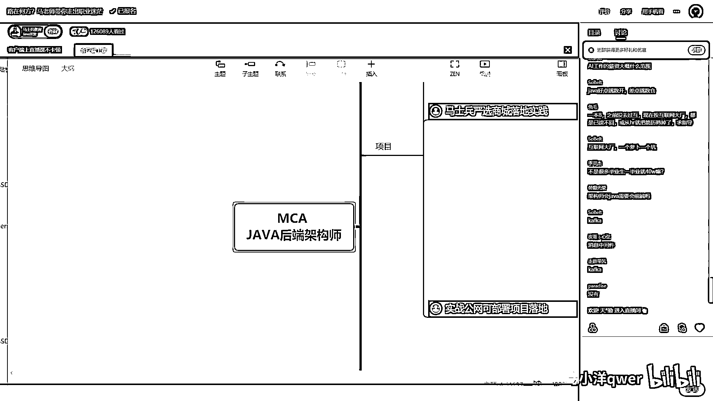

大家也可以去要一下，找咱們小姐要一下我們課程大綱，別這麼說，就是馬老師設計的課程大綱是最全的，也是非常權威的，當你的知識不成體系的時候，你讀一遍我們課程大綱，就能形成一個初步的。

就能形成一個初步的技術架構體系，你懂嗎。

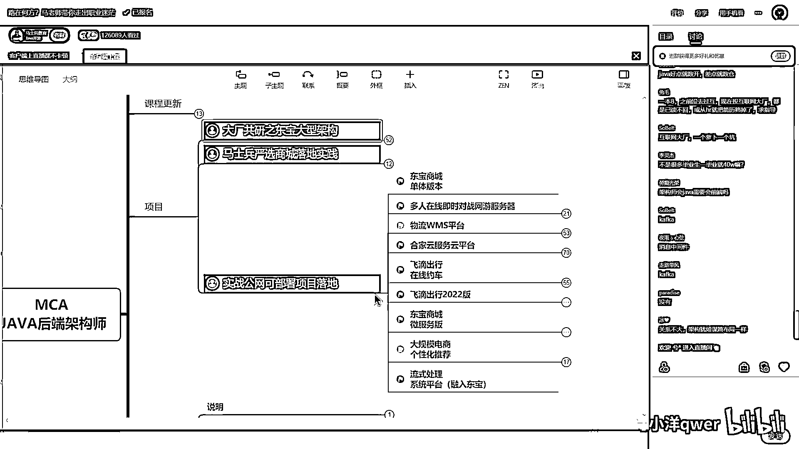

它很值得擁有，去好好讀一下，你像我們講。

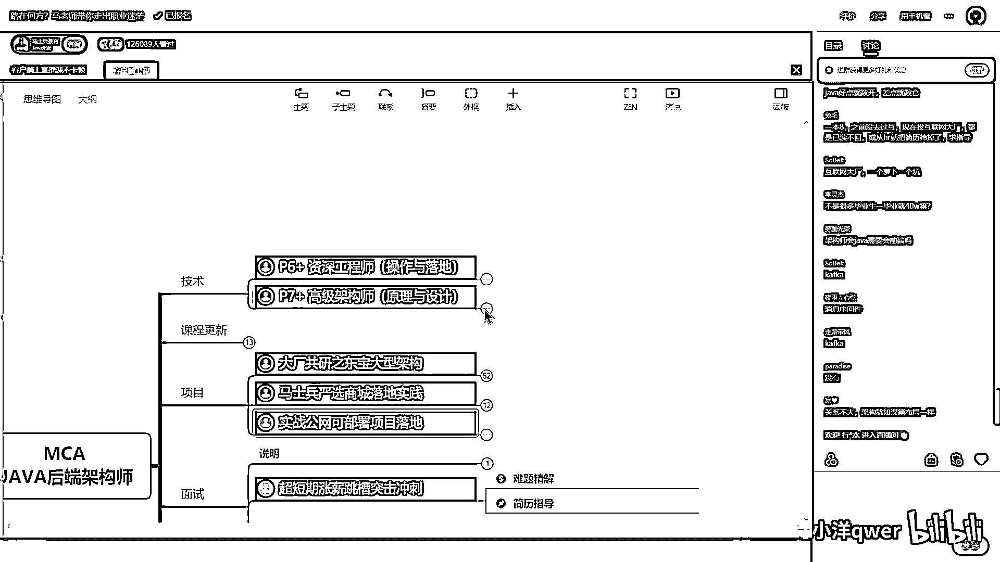

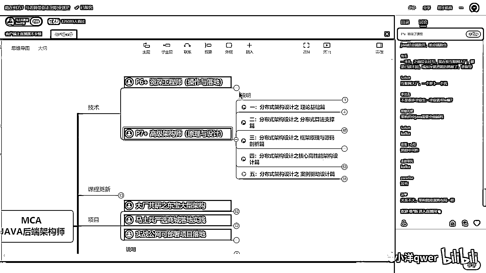

我們講那個那個什麼的選項吧，就是這種存儲的選項，這是海量數據存儲，我們先不講海量數據，講分佈式這塊，分佈式的架構，裡面的一個，我用什麼來舉例子，我們用存儲來舉例子，我想問你，就是說你存儲的時候。

我們存圖片小的，我們用FastDFS，還是用HDFS還是HBase，還是Mongo還是TidyB，還是Neo4j還是InfluenceDB，還是OB還是ClickHouse還是Pinout。

還是我們最常用的MySQL，還是Oracle還是SQL Server等等，我想問你一句，你說這個東西，它到底跟語言有多大關係，你一定要用Java去訪問嗎，或說你一定要用Golang去訪問嗎，一定嗎。

告訴我一句，跟這個東西，到底跟開發語言有多大關係，兄弟們，關係並不大，我不知道你們發現了沒有，所以成為一個架構式，它很多時候，它和你具體，你原來使用哪種開發語言，不是想像中的關係那麼的大。

一定要理解這一點，但是我們再話講回來，哪種語言和業務走得最近，你也一定要了解，Java後端，所以這是為什麼，就是很多做Java後端的人，更容易成為架構式，就它首先成為了一個後端架構式。

然後本身大數據的很多東西，哪家我開發的，很多那個產品，所以它很容易成為大數據架構式，然後由於它和業務走得比較近，所以它比較容易成為業務架構式，在這個基礎之上，慢慢的成為業務架構式之後。

才能慢慢的帶產品團隊，成為產品架構式，同學們聽我說，這是為什麼很多做Java後端的人，更容易成為架構式，更能突破年薪的原因，不是因為它的入行薪資有多高，也不是因為它的，只是做Java後端。

它的頂薪有多高，而是因為由於它的工作特點，更容易成為架構式，那麼架構式的薪水長什麼樣，我告訴你，大概平均薪水就在這個程度了，就是架構式的平均薪水是這個，好 我講清楚了嗎，教師需要考證嗎 不需要。

來 各位能聽明白的老師扣個音，就選哪個，但是你不要聽我講完，就一定要去選Java後端，或者我就一定不用大數據，其實並不是這樣，根據你的實際情況來 好不好，如果大家伙都走這個，它就會變得不值錢了。

各種的那種怎麼說就是，形式它都是在發生，各種各樣的不同的變化，今年我們講這個比較值錢，明年就可能換成那個比較值錢，張嘉明說能講一下B端和C端業務，B端的業務它的業務本身比較複雜。

但是它需要的技術架構比較簡單，C端的業務它的技術架構比較複雜，它的業務本身，業務邏輯本身比較簡單，這是兩個本質上的區別，從技術角度講，C端業務是更容易能夠拿到高薪的，好 我講的第三個問題。

那麼各位同學有問題的，你直接敲 OK，沒有問題的你給老師考個一，我們就準備繼續，兔毛說一本，之前沒有去過互聯網，現在投互聯網大廠已讀不回，HR就把簡歷篩掉求指導，你的簡歷長得不像互聯網的簡歷。

這不是很簡單嗎，你自己想一下，互聯網裡面比較值錢的，叫高並發 高擴展 高可用，就是你有這方面的架構的處理經驗，另外你投互聯網大廠，大廠要求的是什麼東西，我一會兒專門跟你講，所以你這些東西不寫。

你的HR就很容易把你簡歷幹掉，我再給大家強調一遍，就我第一個問題就講了，你們投簡歷，找不到自己所期望的那個，就一定是簡歷有問題，我看今天我的資料裡面，有沒有簡歷的模板，有簡歷模板我可以給大家展示一下。

如果沒有就算了，我這個電腦是沒有，下次用其他電腦講的時候，我跟大家說，就是你們一定要記住，你們現在做程序盤的，哪怕去做一個火箭設計師，老師也能讓你拿到面試機會，為什麼，你只要寫一份火箭設計師的簡歷。

就可以了，就是你不會什麼，不可以說，我不會什麼就不敢往上寫，沒有關係 我現在不會，將來也可以學，你可以往上寫，這樣就拿到面試機會了，大廠和中央廠怎麼選，能進大廠必進大廠，老師說一說RUST。

RUST還在發展過程中，我們課程裡有講，我專門講了一個RUST，和其他語言的區別，但是應用還不多，Java架構師一定是精通Java吧，Java架構師肯定是要精通Java的呀，精通，其實最牛逼的架構師。

他是不侷限在某種語言上的，講到這裡呢，我也稍做一個小小的廣告，今天如果大家伙對於咱們課程，對於咱們課程有需求，就是說吧，你想提升自己想多賺錢，你來馬老師這兒是一定能實現的，坑不了你 騙不了你。

我今天報名，我送你一門夠浪的課，完整的，就是將來你成為架構師之後，語言不再是你的局限，你拿Java去實現，或者拿夠浪去實現，你都有跡可循，但只有今晚，就在馬老師的直播課這裡，過了今天。

就誰也不許給我送這門課了，因為我們要單獨拿出去，去銷售了，完整的夠浪，就今晚好吧，等會兒說到這兒，我就再說一下，架構師一定要精通後端語言，架構師一定要精通一門後端語言，搞清楚這一點。

他不是說一定要精通好多門，他好多時候是做選行做評估，帶隊伍，有些他手下的人去幫他去做實現，寫關鍵性代碼就OK，他不是說要精通所有的語言，但是呢，有好多架構師為了自己的一個追求，他會去了解這些語言。

以免我手下帶隊伍的時候，如果是混合語言的時候，我帶不動，怎麼說呢，就是優秀的人呢，總有他自己的追求，好吧，別人說開發難，難在哪裡，這個話題太大了，說具體的問題，老師數據分析行業。

數據分析行業是很容易就業的，就業的薪水也是很不錯的，咱們像做大數據的很多同學，他其實就是就業到了數據分析行業，當然他就是由於呢，我們訓練的比較到位，他入行的時候呢，他的薪資就會拿的比較高。

數據分析完了之後有展現，所以他要結合一門語言，這個語言可以是Java，可以是Python，推薦是Java，因為為什麼，它是一門主流語言，在你掌握大數據的基礎之上，有掌握了一門主流語言。

你的薪資能低得了嗎，外企全戰，互聯網設法工程師怎麼比較好，全戰這個我是永遠不建議的，全戰這個東西，只有什麼時候有這種需求呢，一般來說呢，就是這個企業裡頭不願意多雇一個人，作為我們開發的系統。

我們給大家開發的學習系統，舉個最簡單的例子。

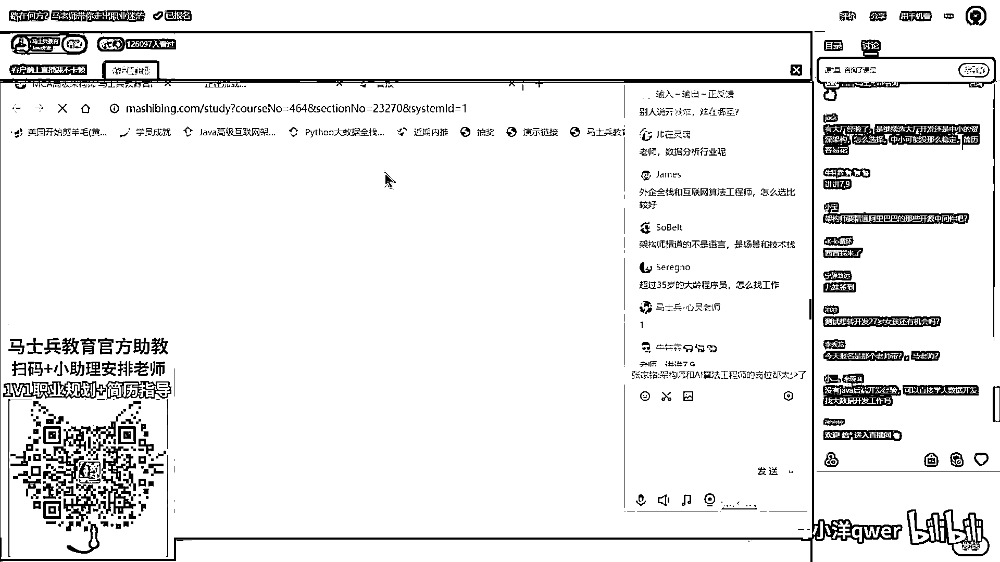

你點開來學，比如說這樣。

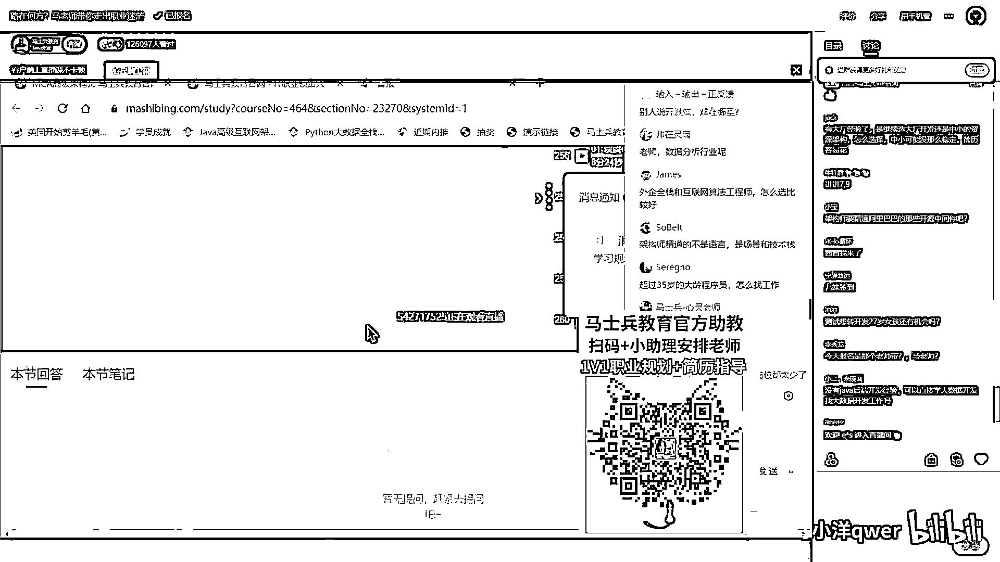

因為任何一門課呢，你點開來呢，直接就可以學了。

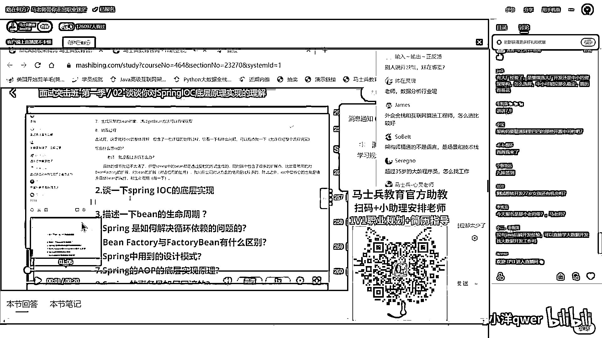

那個你像我們給大家開發的系統啊，就我們作為程序員，給大家開發的程序員學習系統。

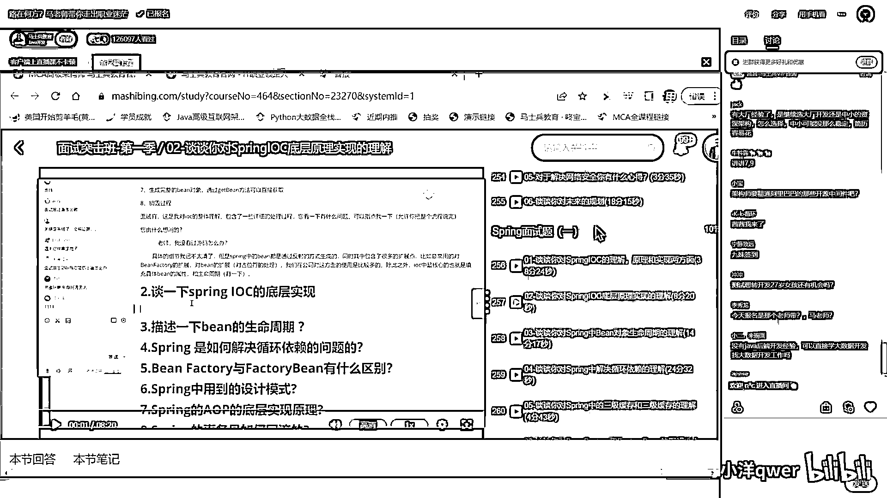

各種端也都有。

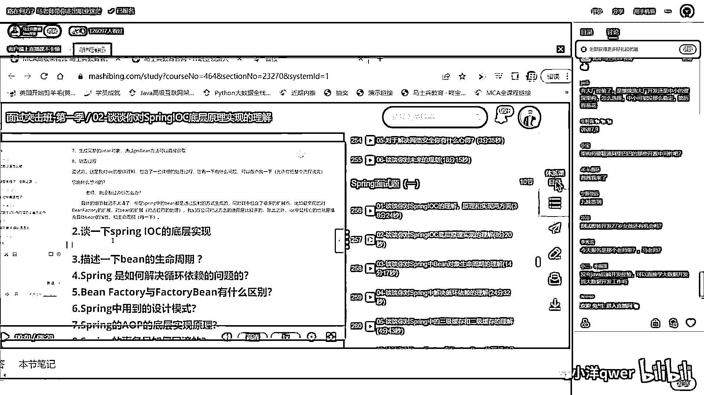

然後呢，有問題問答提問，你正常做筆記。

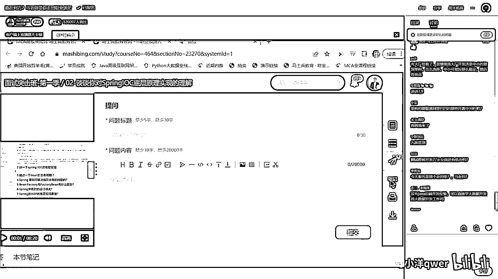

資料的下載，然後各方面的反饋等等，就是我們給大家講的，做的這個系統，這麼小的公司，我們公司並不大。

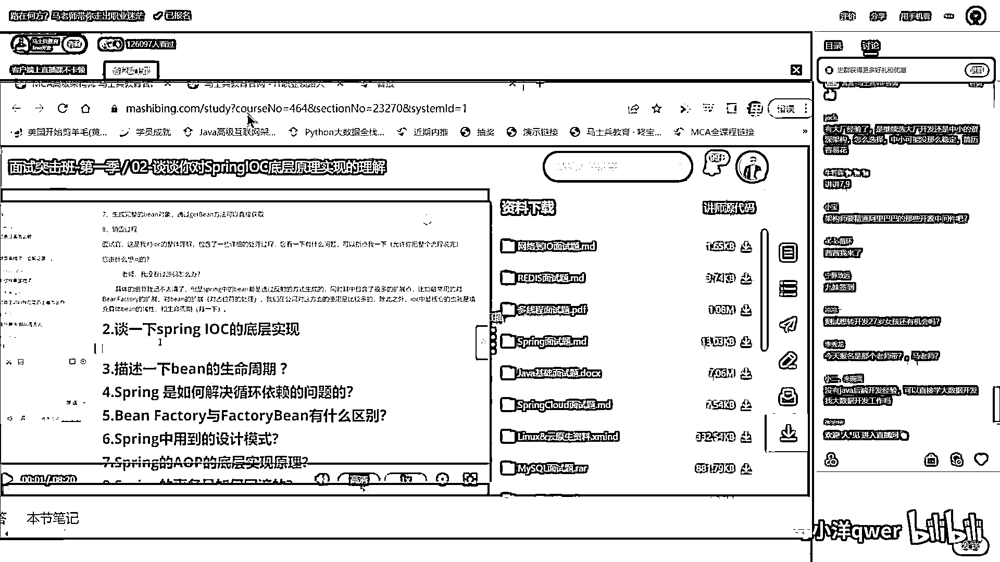

我們都做到前後端分離兄弟們，有一個企業，他為什麼要去招全戰，他不想多招一個前端，能聽懂嗎，你覺得你千萬不要認為，你會的越多，你那個拿的錢就越高，完全不是，精一而其他的呢，就是大概了解。

大概率的將來你做管理，帶隊伍的時候不要被人蒙，就可以了，全戰這個呢，所以全戰這個，好多時候都是那種中小公司，他為了省成本才這麼幹，正常的公司不會這麼幹，不應該這麼幹好吧，好，互聯網算法工程師。

如果其他的條件都一樣，我肯定是推薦互聯網算法工程師的，聽懂了吧，比方說薪水啊，什麼的大約什麼全一樣，效果師精通的不是語言，是場景和技術戰，可以這麼來理解，超過35歲大齡成員怎麼找工作。

找工作的過程都一樣，投簡歷面試，就是你應該具備，你這個年齡的人呢，應該具備的水平我剛才講過，有大廠經驗繼續選大廠，還是中小廠資深架構怎麼選，這麼穩定簡歷容易花，你如果在大廠的這個成長空間有。

當然繼續在大廠，如果大廠空間沒有了，這時候就可以考慮就是相當於，你刷了一部分經驗，然後再出來開拓你的另一份，就是另外的事業了，你到中小企業他就一定是帶頭人，然後領導性質的這樣的崗位了。

他就不是說一線的開發崗，如果你還在去中小企業，還去一線開發崗，那你選的就是有問題的，今天爆班的是馬老師帶嗎，我現在主帶的是年薪50萬以上的，你可以一步一步來，你現在拿20萬找咱們周老師。

連老師 李錦老師，然後那個鄧老師 鄭老師，咱們的那個曹老師等等，都能帶你到年薪50萬，到了年薪50萬之後再過來找我，一步一步來，就是年薪50萬以下，其實我們好多老師都能幫你搞得定。

他好多時候的細節比我掌握還透徹，教授精通阿里巴巴的哪些開源中間件吧，應用和原理當然要精通，但是你說原碼要細到哪個程度，其實沒有這種要求 聽懂了吧，像原碼這種東西，它並不是說你天天這麼多原碼。

你不可能全讀完，讀典型的，但是你原理要懂，當然有的時候你學原理的時候，其實有的時候就得閱讀一定的原碼，所以原碼這個東西是閱讀典型，學會讀原碼的方式，這個我推薦的就是我們的Spring的原碼。

這沒什麼可說的，就是Spring原碼這塊，我們連老師要說第二，估計沒有人敢說第一的這種。

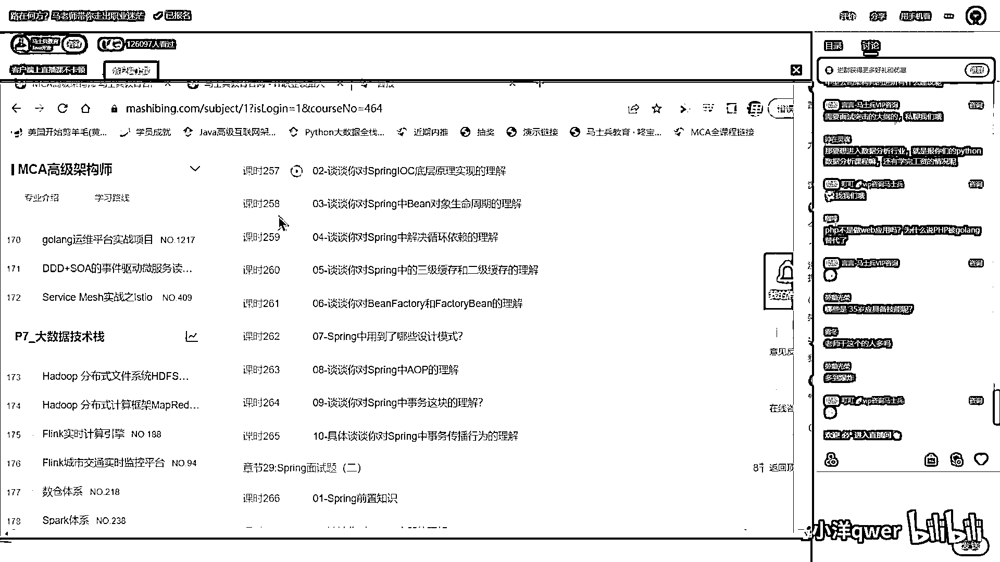

Spring原碼的學習，打開了。

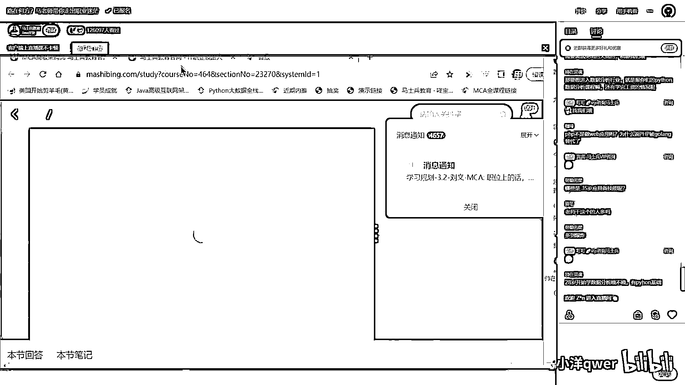

好，這是新的，我們看第一版第一季，大概整整一個Spring的原碼，大概講了90個小時左右，90個小時左右，你可以想像這個可能量，那個276個小時，但是就原碼這塊，你讀一個典型的就OK了。

你千萬不要想所有的原碼都讀，雖然我們講了很多種原碼，但是我推薦你讀典型的就OK，也不要太要求說所有的原碼全掌握，也沒有這個必要，Spring原碼掌握住了之後是一個什麼水平呢。

大概就這種水平。

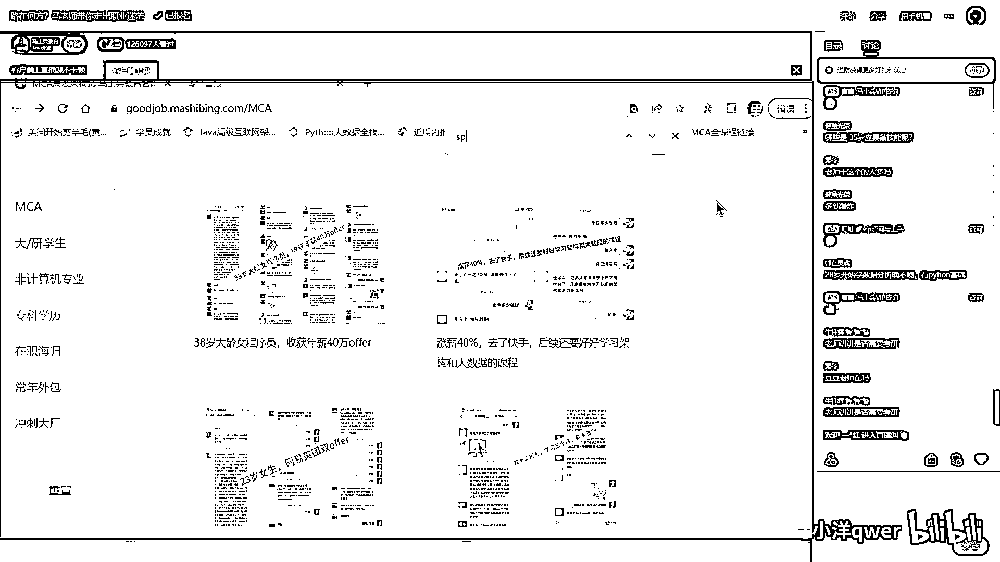

搜一下我記得了，就這個，這哥們是一個Spring原碼的面試，就直接面了螞蟻街服的P7，直接拿了P7，他是在第三面的時候，面試官扯了一個多小時的Spring原碼，面試官怎麼說，面試官說理解得很不錯。

很少見對Spring原碼理解這麼深的，然後就給過了，哥們拿了P7，知道吧，典型啊，這個你們也不用擔心，就是你們到什麼程度應該學什麼，有老師來幫你多指導就行了，我們公司也相互的分離，但是人不分離，這有點。

這個還是權戰是吧，架構師和AI算法工程師的崗位都太少了，AI算法工程師的崗位偏少，架構師的崗位並不少，很多時候呢，就架構師在很多企業裡頭就體現為那個高層，你可以這麼來理解就是年薪50萬以上。

到今年可能稍微薪資差一些，因為今年的就業薪資比去年低了10%，大家可能不了解，就今年整體性的那個大學生的就業薪資比去年低了12%，所以你可以理解為40萬以上或者42萬以上，這種的就可以稱之為叫架構師了。

叫做水平了，中興公司架構師的進階有什麼建議，這我要看你掌握了哪些還沒掌握哪些，可以通過讀一下咱們面試大綱，就是咱們那個課程大綱讀一下，比較一下，哪些是35歲應該具備的技能，你這個是剛進來嘛。

我專門講了好幾十分鐘啊，這個三言兩語就跟你說不清楚了，簡單說呢就是你技術的寬度，你對業務的理解，還有呢就是管理和溝通，PSP不是做Web嗎，PSP被Golang替代了，對啊Golang也可以做Web。

PSP現在別玩了啊，再跟你說一遍，老講講瘦瘦瘦好我慢慢跟你講啊，你說的年薪50以上是必須去一線城市嗎，二線城市年薪50的機會，肯定比一線城市少很多，但並不是沒有。

就是你得看你們城市有沒有。

你像有些城市你頂薪都到不了那就不行，具體城市跟具體城市還有區別。

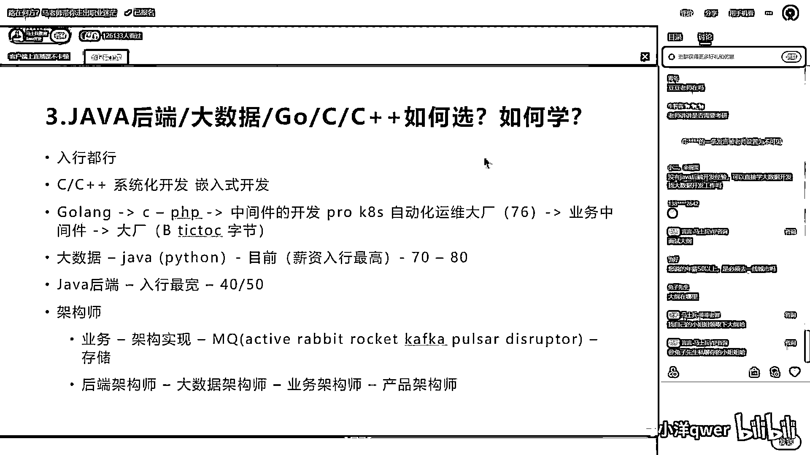

好我往下講啊。