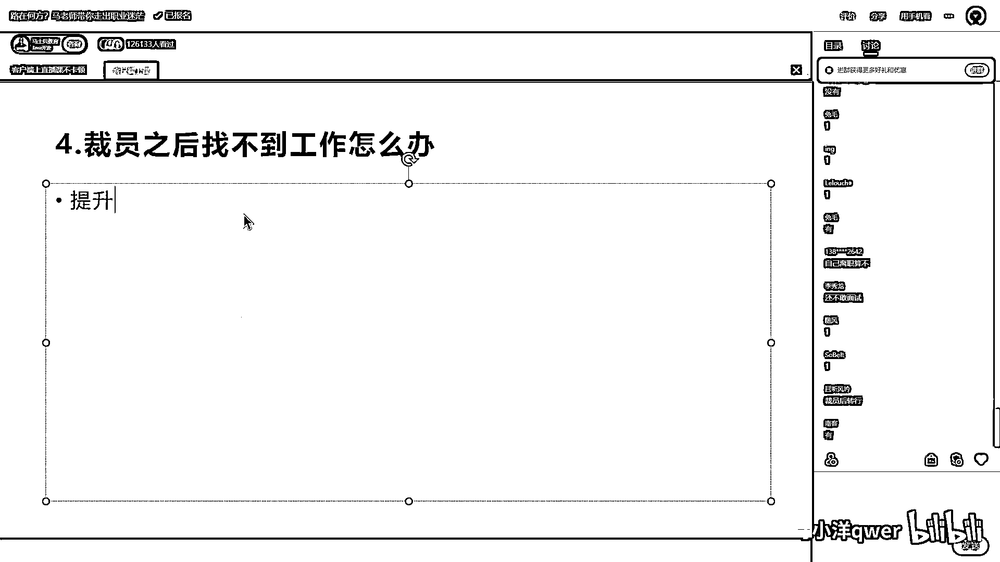
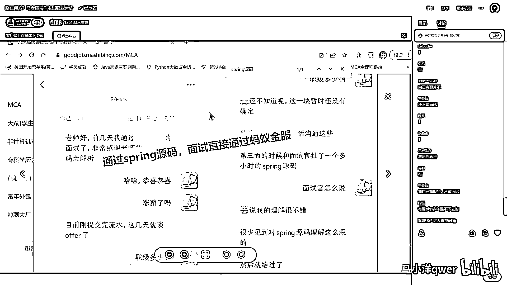
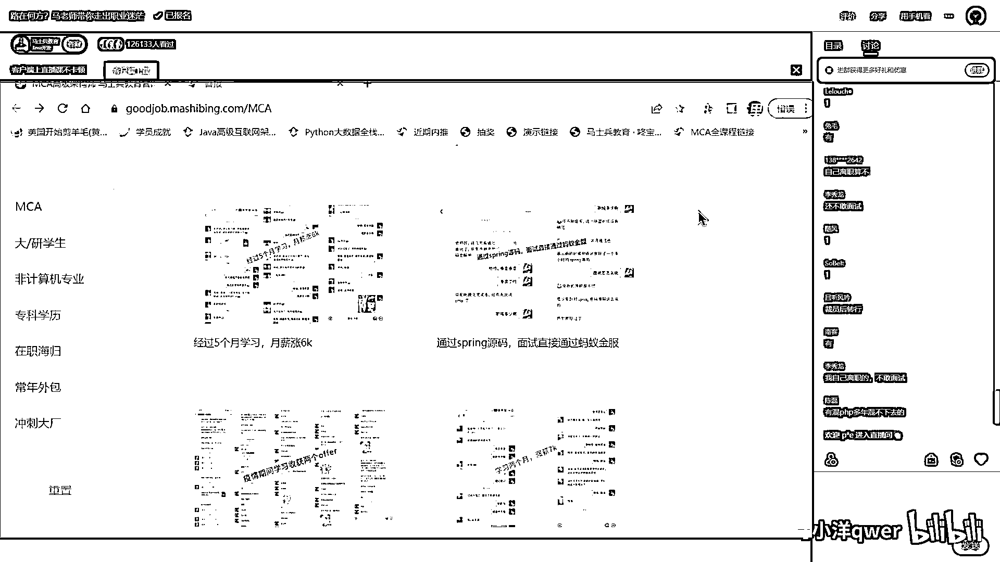
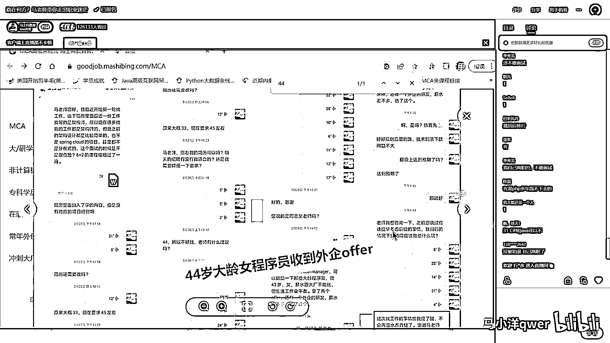
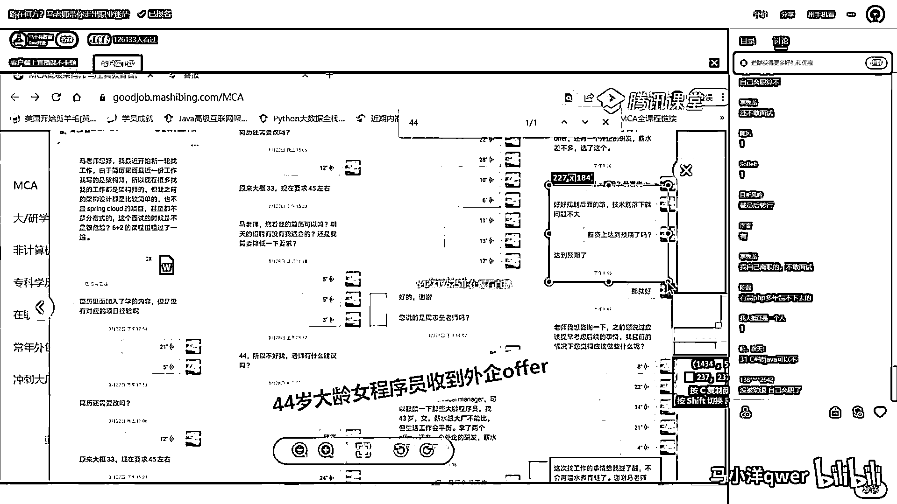
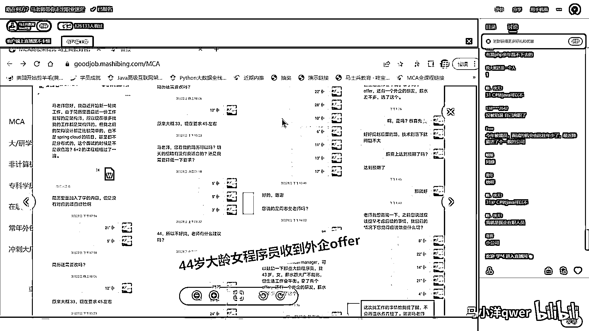
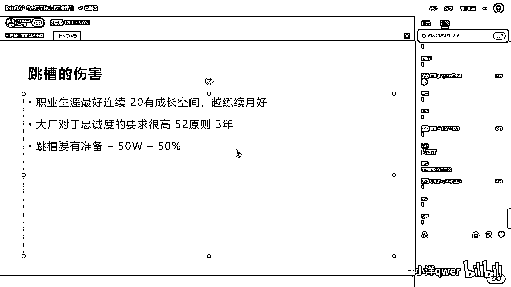

# 程序员秋招 顶级避坑指南！-马士兵 - P4：裁员之后找不到工作怎么办？ - 马小洋qwer - BV1Uz4y1x7hC

我們講裁員之後找不到工作怎麼辦，這個應該是一個小中的問題，我們講的快速一點，就是說第一我先問問在這邊的同學，有沒有裁員之後然後投簡歷找不到工作的，有嗎 有沒有，老創業好還是學歷好，這是兩個問題。

你跟吃飯好還是睡覺好，都好啊 自己選哪個，還不敢面試啊 自己離職算不，真的有啊 有這麼多啊，我理解是這樣的，假如你日程是一直不斷在提升，沒有溫水煮青蛙。

你一直在提升這件事情。

給你舉個例子啊，這個也順帶讓大家了解我們培訓的水平。

我印象中有一個44歲的姐姐。

找一下啊 這個 對，這個 這是印象很深的，這個姐姐呢是44歲，然後她原來是在一家外企，拿著什麼樣的薪資呢，原來是這個薪資，大概拿33，然後呢 外企啊 她就被裁了，然後她找到我們。

說現在想拿到45到底行不行，然後通過我們帶了一段，最後問她沒問到具體薪水。

就是問她達到預期了沒有，她說已經達到預期了，大概差不多呢 應該就45萬左右。

就達到了，但是她最後的一個，這種感受大概長這樣，我希望大家會引以為戒，她說這次找工作的事情給我提了醒，不會再溫水煮青蛙了，在溫水煮青蛙這批人裡頭，大概有這麼幾個特點是最多的，第一，國企裡面特別多。

反正很清閒，我幹什麼我就幹什麼能搞得定，OK 我就不長進了，第二 外企裡頭比較多，外企 她裁員的概率其實也並不高，但是呢 當你年齡大的時候，被裁的概率就比較高了，她比國企還要操蛋一點，Sorry。

第三 女生比較多，各位女同學呢，好像搞定了一份工作之後呢，我也不知道她們怎麼想的，正常性的呢，就不再想著提升自己了，然後呢 就躺平了，睡覺還是回到那個什麼幹嘛。

說到這兒還有一個女同學啊。

32歲，然後帶兩個娃，然後兩三年沒工作，最後找到我們把她搞定的工作，就這種的比較多，就是我希望你們記住一點，就不要那個，溫水煮青蛙，如果你平時啊，自己注重有提升 有長進，沒有溫水煮青蛙這種想法。

其實你裁員之後，她就不可能找不到工作，你懂嗎，你本來水平就挺好的，當然這種水平挺好的，可能連裁都不會被裁 都有可能，你裁員之後找工作怎麼辦，就很簡單了，突擊，這種呢 我們帶的也多了，裁員之後找不到工作。

不建議行業外長時間學習，不建議這樣，什麼意思啊，就有好多人啊，反正投了簡歷突然間發現，給我反饋我也面不過，哎呀 終於知道那個什麼了，終於知道那個那個那個，現在的就業環境原來長這樣啊，原來我會的。

我還以為自己比較強，出去一面發現自己沒那麼強，受打擊了，算了 我先不去面，玩命的去學吧先，就天天在家裡悶頭學，一學 學了六個月在家待著，我跟你說這個絕對不建議，為什麼，避免。

主要的原因是避免簡歷空檔期啊，這簡歷空檔期呢，其實造成影響挺大的，第一你的社保什麼全斷了，對吧，第二呢你還沒法跟那個人家HR解釋，你說你下一個，本來你有挺好的機會，能進到跳跳下一屆。

甚至進到大廠中中型廠，大廠中大廠，但是呢你這個簡歷空檔期，一個人怎麼解釋，你說我被裁了找不著工作，空檔期在那學習了著，那我就會認為你的經驗，你原來的經驗，那就那就不是很高，你的水平就不是很高。

你想談好的薪水都談不著，能聽懂嗎，有的空檔期長了，跟社會突擊，然後自己的信心就更沒有了，所以不建議這樣，永遠建議走突擊，走突擊好吧，關於突擊怎麼突，我剛才大體講過，如果不了解的，找他們小姐去了解。

我可以這麼說啊，就是你原來只要有一定的工作經驗，一兩個月老師就能讓你突擊回去，並且一定比原來漲薪，能聽懂吧，你千萬千萬不要在外面學，以後學了好長時間之後呢，還找一個比原來薪水還低的，我也遇見過。

那就虧死了，當然最理想的是，麻煩你在你公司裡頭，一定要有一點危機意識，時時刻刻做好被裁的準備，就算被裁了我也有能力，能選擇到其他公司去，我可以不離職，但我有隨時離職的底氣，我希望你們具備這一點。

關於這個問題，一家公司乾了六年，簡歷怎麼寫，挺好啊，你就直接寫六年啊，還能怎麼寫，關於這個問題，還有問題的直接提了好不好，沒有問題我就繼續了，畢竟這個是一個很小眾的問題，好，可以了給老師扣個1了，OK。

秋招之後投簡歷推薦嗎，投簡歷隨時可以投啊，你什麼時候想找工作，什麼時候就可以投，老師今年行情是不是不好，我想跟你討論這個問題，其實每年都，每年年年啊，我從業20年，年年，每年都有人問這個問題。

你們能聽懂嗎，我再給你重複一遍，我從業20年，每年，年年學生都問老師，今年行情是不是不好，行情再不好，多你一個不多，少你一個不少，行情再不好，對於你來說，你啊，該怎麼努力還得怎麼努力。

你改變不了任何的行情，所以你問這個問題沒有用，關心這個問題沒有用，轉過其他人就拿了，人民教育這邊給內推嗎，當然給內推啊，這必須的，回家了，golang學多久可以找到golang工作，跟多久沒有關係。

大概你要學到，用golang去做，類似於像那個分布式項目，類似於Spring Cloud這塊，到這種程度你就可以去學了，具體可以去找他們小姐，要一下golang的大綱，你就了解了啊，主要今年大環境太差。

一律壓價，這是正常的，因為企業經營環境很差，如果再給你特別高的工資，企業就要倒閉了，那你自己想一下，人家要不要壓價，他一定會壓價，今年根據已經調查的數據，今年就業的就業生薪水，比去年大概低了12%。

但是聽我說，先入行，即便你拿了比去年低，但是也比行在行業外待著，混著等著要強的多的多，先入行啊，先跳槽是不是不太好，跳槽這件事情，就是任何時候都可以跳，但是跳槽這件事，一定要掌心跳。

你完全可以用投簡歷的方式，去試一試，你不要裸辭，就是特別討厭的一件事情，很多人愛幹的一件事情，就是裸辭，一任性，尤其是咱們成員覺得，我沒問題，我就裸辭，不要裸辭啊兄弟們，你裸辭完了之後呢。

你要是出來之後，對行情不了解，突然之間發現短期找不到工作，然後信心又受到打擊，對你來說，你平心跳一次，或者哪怕漲個百分之十，百分之二十，你跳一次，對你的整個職業生涯，都不是好事，不要裸辭裸了就沒辦法。

裸了就快點回，最好是掌心回啊，你不要平心或者降心回，這是最理想的，走咱們突擊啊，沒有問題，降不了心好吧，行，行吧，我這個給他插播一下啊，就是說，跳槽這件事情怎麼理解啊，怎麼理解跳槽。

跳槽的傷害到底在哪裡，跳槽的傷害到底在哪裡，最理想的一個人的職業生涯啊，最好是連續的，我這麼跟你說，比如說啊，你畢業之後在華為，然後你在華為工作了二十年，和另外一家你的同學，他在這二十年裡頭。

跳了十次槽相比，到那二十年頭上，你就比較吧，你肯定比他強的多的多，你信不信，我再說一遍，你畢業就在一家廠子待了二十年，你的人脈也有，你的技術也在漲，你的觀點什麼溝通啊，早就很熟悉，你的忠誠度也夠。

好多好的崗位那就是你的，就是你們單位有這種成長空間的，你越連續越好，各位同學能聽懂嗎，能聽明白的老師可不可以，從這種方式來講啊，就是可以這麼說，你每跳一次槽都是有一次傷害的，但是很多人不可能來了之後。

就進到一家企業，而且這家企業成長空間特別大，所有人都進華為，那不可能對不對，所以你的跳槽一定要慎重，你一次的跳槽，一定要對得起這次跳槽所受到的傷害，我在這呢，給一個我們考量的標準，首先第一點。

大廠對於忠誠度的要求很高，現在根據那個不太，這個大廠沒有公佈出來，53原則52原則，五年兩跳他們會接收，超過了可能就不收了，過去任何一段工作裡頭超過三年的三年原則，好多大廠都採用這方面的原則。

都有他自己的內部的一個標準，他不對外公佈，但是很多時候你這個簡歷花了，HR就直接給你斃了，還是那句話，任何事情都在發展，他著急的時候，一年兩年他也照樣要，所以大家也不要對這個東西太過看重。

尤其是過去的事情你已經改變不了了，改變將來好不好，就是你將來盡量連續盡量連續盡量連續，所以不要輕易的去裸辭，一定是騎驢找馬，找到那匹好馬之後，再下這頭驢，沒找到好馬之前，你不要虐待這頭驢，嗯，嗯，OK。

還有問這種行情不好，是不是先苟著，這兩回事啊，就是說你跳槽要有準備，簡單就這麼說啊，你不要裸辭去跳槽，你完全可以做，跟我們搞個突擊，或者跟我們系統化學習一段時間，然後你投簡歷的時候，你現在拿兩萬。

你投簡歷就直奔那個三萬四萬五萬的去，只要他給你面試的機會，你偷偷出去面試就行了，你能聽懂嗎，還聽不懂，跟你苟著不苟著有什麼關係，你可以不苟著，你水平到了你為什麼要苟著，還有的說什麼時候跳槽比較好。

大哥這跟什麼時候跳槽有關係嗎，你水平到了什麼時候都可以跳啊，你確定你能找到或者有大概率，大的把握找到好的下家的時候，再來考慮離職這件事情，另外，我們拿薪水講，說你漲個10%，20%，30%的不要考慮。

年薪50萬以下的跳一次槽，建議你至少漲50%以上是起步價，年薪20萬以下的最好是70%到100%以上，我今年拿8K，別人給了我10K我就跳了，你這個簡歷就是花的，各位能聽明白的給老師扣個1。

你簡歷拿8K最後老師來幫你判斷，你的下一跳應該多少錢，翻個倍至少的，我今年拿50萬，那我跳槽呢，我可能漲個百分之三四十五十，可能就行了，薪水比較高了嘛。

不同情況不同處理好不好。

我們就說題外話就說這麼多。