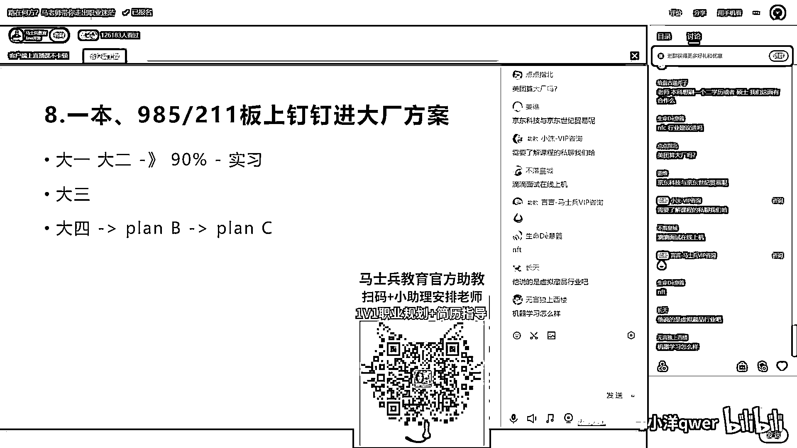

# 程序员秋招 顶级避坑指南！-马士兵 - P8：一本、985、211板上钉钉进大厂方案 - 马小洋qwer - BV1Uz4y1x7hC

好，我们讲一本985111版上订购的金达厂方案，这其实在前面的可能都包括了，那我就快速过一遍，最理想的是你在大一，就越早越好啊，大一大二找到我们，你像这种一本985111的，我们基本上接近百分之。

不能说百分百吧，就是百分之九十以上的概率，我肯定能送你金达厂，这种时候呢，因为你时间也够，我肯定让你进行系统化的方方面面的训练，然后通过实习进去，你懂吗，这种的啊，就是概率是最高最高的，然后呢。

你说大三你的概率要稍微低一点点，因为大三的你学习的时间就比较紧张，因为大多数的大厂的实习是在大三，而不是在大四，你要搞清楚好吧，大四就只能是拼了，然后拼不过怎么办，拼不过走plan b。

说plan b已经搞不定了，我已经找了一个小屁公司了，怎么办，做plan c，我刚才讲过，前面讲过了，我在这就不重复了，基本上板上钉钉，肯定能送你进去，这块没问题，我们就进行下一个，好吧。

等211今年跟b已经国企了，现在还有机会去大厂吗，你已经进到国企，现在你就肯定不能马上就从国企出来去，这种的概率也不高，在国企好好给我练啊，我前面讲了，你需要练那些东西了，花点钱让老师们来带你。

将来你进到大厂里去，你会发现这种投资啊，是影响你整个职业生涯，而且是大规模的回报，你这点投资的，所以我完全知道好不好，大一大二我看到这视频，我估计爆了，毕业快两年了，毕业快两年更应该提升了。

咱们家里面不是大量的，毕完业的几年的同学，然后做提升的这个过程，到现在延二一直没有offer，你焦虑，延二你现在开始找工作了吗，延二你不是秋招，你等于现在是在找实习的阶段吧，你正式的你应该大规模找工作。

是在明年春招啊，那没什么可说的，你扎扎实实来找老师带你一段啊，概率高多了，编版能力不行，编版能力这件事情是要练的，就是说你面试能力行，你其实就有机会进去练了，能不能理解，现在大厂排名是没有什么排名。

你如果非得按照薪水排的话，现在薪水比较高的，我给你举几个例子，字节，拼多多，腾讯，呃，这几个吧，就是新薪资比较高的啊，但还有还有还有好多啊，薪资也还不差的，嗯，字节加班很晚吧，不知道啊。

也没听说过自己好像不加班，字节那个前阵子还降薪了，为什么呀，因为不加班了，所以降薪了，请问一下专生本本老师，专生本本有什么要讲的吗，就是你专科一定要是要去拿一个本科，方式方法有很多。

你不知道的可以找咱们小姐姐问，你像我们跟那个有一些学校，也有学历的一个合作，嗯，去找咱们小姐问一下啊，就是你至少拿一个本科，你想那种比较轻松的拿下来，可以找咱们小姐问一下，比较便宜比较轻松啊。

我们也有也有也有合作，合作的学校我有点忘了，好像是香坛大学还是哪个大学，嗯，我给你讲一下校招的流程吧，什么面试比试的，嗯，校招流程这块每个学校，每个公司跟每个公司是不一样的，大多数的公司。

我们用大厂来举例的，就像华为啊，网易啊，然后腾讯啊这些，他们一般来讲啊，是三到一般是三三到七八个左右的，面试流程吧，我们讲三个流程比较典型的，就是第一面往往面的就是算法题，基础题，它是一个笔试。

它并不是一个面试，嗯，第二面更进阶的算法题基础题，这种也是有可能的，有的公司第二面面的是项目相关的内容，应用级别的，嗯，大厂一般不会面对很多应用级别的啊，它可能是更深入的算法题基础题，嗯。

你们要是有兴趣也可以加咱们小姐姐，去要一下咱们一个比较典型的同学，他是在研究生的时候面了七面，面进了阿里的一个部门，你可以看看他那个七面的过程，每一面都面了哪些东西啊，特别好玩，你可以打开来看一下啊。

他有的有的，然后第三面往往就是HR，然后去聊聊你的理想，聊聊你将来的规划等等这些，嗯，每个公司跟每个公司不一样好不好，嗯，他第一面就刷掉一批人，看有时候也看有多少人参加面试等等，嗯，我呃。

大专想进密罐有机会吗，密罐是哪个厂啊，密罐是哪个厂，密罐，嗯，金融科技比如量化投资公司跟大厂比哪个好，嗯，那个你这个，你看你自己个人的兴趣啊，就是量化投资这块呢，呃，面比较窄一些，但是你搞得好的话。

其实也有能挣能赚钱的机会还是挺多的，嗯，大厂呢就是你将来的那种，更加传统一些，你将来的这种职业发展的比较顺一些，嗯，一个是比较窄一些，一个比较顺一些，嗯，看你喜欢哪个了，好吧，各有各有各有各的建议啊。

就各有各的好处，嗯，美团算大厂吗，算啊，为什么不算，呃，跟你学外语一样了，那都科学用的，嗯，非全非全人士硕士有免联考的推荐吗，这个我不是很清楚，这个你自己去了解，老师本来想刷一个二学历或者硕士。

我们这边有合作吗，硕士目前还没有，我们是在寻求这方面合作，但我们目前确实没有啊，目前我们主要还是给大家提供那个，工作上的技能的提升，薪水上的涨薪，这个是我们比较擅长的，嗯，NFC行业建议。

NFC是哪个行业，你说NFC还是NFT啊，你别说缩写，好缩写，因为他各种歧义太多了，京东科技与京东实际贸易，不是很清楚，这两个都是京东的旗下，其实都不会太差，这时候你因为你需要比较两个工作岗位的话呢。

就要进行全方位的比较，第一个呢是公司规模多大，做哪个行业的用哪个技术，然后做哪些业务，你在里面做做做什么，这种要看具体的东西的，把薪水待遇什么样，这个都要比较才行，NFT有点新，web3。0。

然后NFT区块链，这些都有点新，将来发展什么样子我不太清楚，所以这个有一定的冒险性，OK，NFT前面已经遭到了血洗吧，将来什么样不好说不知道，不好说，但我觉得web3。0应该是个方向。

国内发生什么样不好说，国外也在如火如荼的进行，其实呢你们选的也只要是一个业务的不同而已，技术上应该还没什么区别，和其他的行业应该技术上区别不大，记忆学习怎么样，记忆学习很传统的行业了。

如果你只是记忆学习，不涉及什么更进一步的深度学习，神经网络，NLP的前沿技术，只是记忆学习的话呢，没有什么新鲜的。

这个薪水也高不到哪去，拜拜。