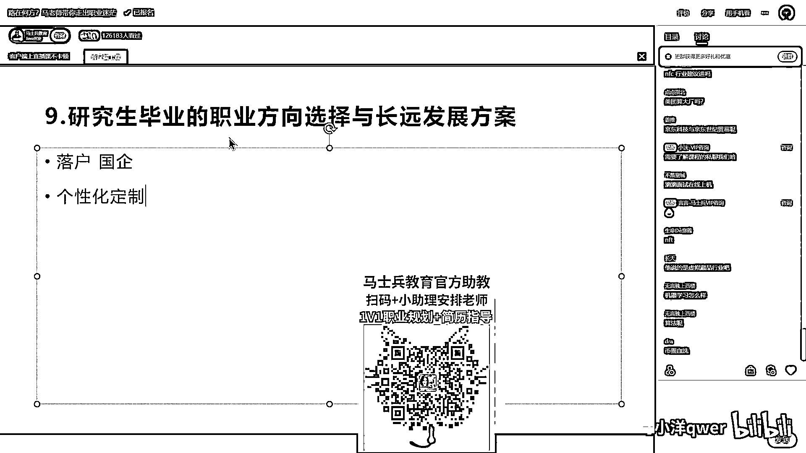

# 程序员秋招 顶级避坑指南！-马士兵 - P9：研究生毕业的职业方向选择与长远发展方案 - 马小洋qwer - BV1Uz4y1x7hC

考研究生的职业的方向选择与长远的发展方案，这个其实大概讲的也差不太多了，考研究生这个学业，它主要是有的时候要考虑落户以及国企，这个是考研究生的一个主要的考虑，否则的话，它跟本科的应届生唯一的一点区别。

就是你就业的薪资稍微高一些，别的应该就没有什么太大区别了，现在有一些落户是和研究生挂钩的，我不知道大家了不了解，上海那边的落户，还有一些城市的落户都是和研究生挂钩的，只要你研究生毕业就给你落户之类的。

这个你要考虑这些的话，你就可以考虑去做这件事，还有国企是研究生起步，大概跟这个有点区别，其他的像学习方向，将来的发展的方向，没有太大区别，这个方案得是个性化定制，这个也是咱们课程的很重要的一部分。

在咱们整个课程你入学之后，会有一个定制化的学习方案，定制化的路线，每个学生跟每个学生的路线，它是不太一样的，比如说这个是零基础，接触过什么没有系统，大概需要半年内做到工作，那么这个路线你该怎么学。

先学哪部分，然后第一阶段再学哪部分，第二阶段学哪部分，怎么说呢，就是不同的人，不同的人，不同的路线，这个大概，这个大概只能，具体问题具体分析了，行。

介绍到这里。

我们现在没什么特殊的。